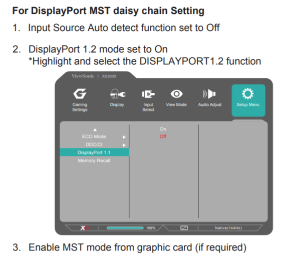
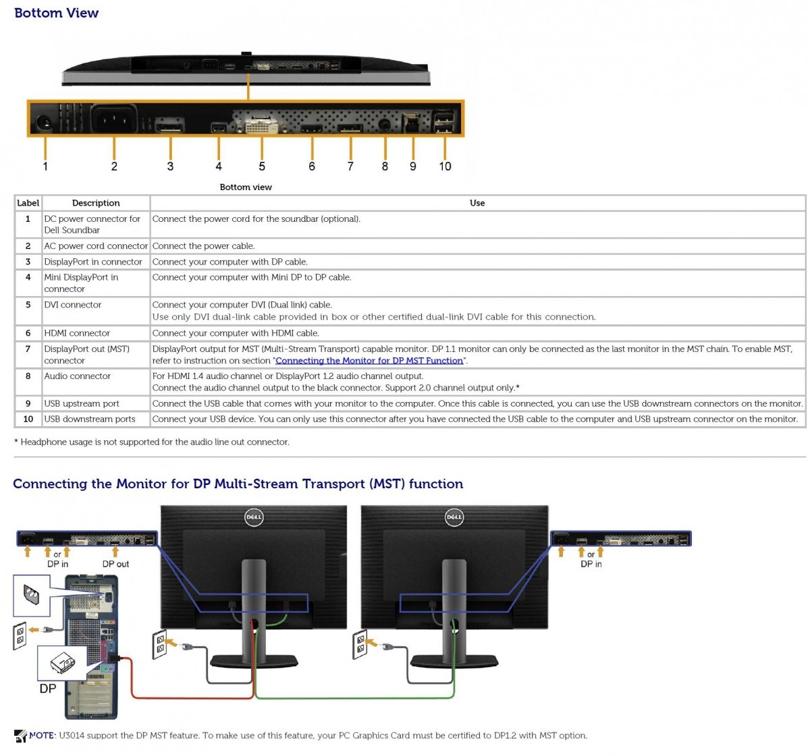

Here is a current (as of June 2021) list of **daisy-chainable DisplayPort LCD monitors:**

Model numberBrandSize, Aspect Ratio, ResolutionPriceAdditional Info[VG2249](https://amzn.to/2q4VEuS)
****Recommended 22″ LCD****ViewSonic**22″**, 16:9, 1920×1080[Check price](https://amzn.to/2q4VEuS)Easy setup. Excellent choice for small office environments.[VG2449](https://amzn.to/2Fvlgdu)
****Recommended 24″ 16:9 LCD****ViewSonic**24″**, 16:9, 1920×1080[Check price](https://amzn.to/2Fvlgdu)Easy setup. Excellent choice for medium sized office environments.[ColorPro 24″ VP2468](https://amzn.to/2Wn9kiu)
 Excellent choice for photo and video editing, color calibrationViewSonic**24″**, 16:9, 1920×1080[Check price](https://amzn.to/2Wn9kiu)**[XG2530](https://amzn.to/2IiFmdN)**
**Recommended 25″ Gaming LCD**ViewSonic**25″**, 16:9, 1920×1080[Check price](https://amzn.to/2IiFmdN)Gaming monitor 1ms response time, 240Hz refresh, FreeSync.[U2913WM](http://www.amazon.com/gp/product/B00BIBB1KI/ref=as_li_qf_sp_asin_il_tl?ie=UTF8&camp=1789&creative=9325&creativeASIN=B00BIBB1KI&linkCode=as2&tag=pixensity-20&linkId=E67QR2ERIKUWZROW)Dell**29″**, 21:9, 2560 x 1080[Check price](http://www.amazon.com/gp/product/B00BIBB1KI/ref=as_li_qf_sp_asin_il_tl?ie=UTF8&camp=1789&creative=9325&creativeASIN=B00BIBB1KI&linkCode=as2&tag=pixensity-20&linkId=E67QR2ERIKUWZROW)[U2417H](https://amzn.to/2VPooXn)
**Thin bezels make this an excellent 24″ 16:9 LCD choice!**Dell**24″**, 16:9, 1920 x 1080[Check price](https://amzn.to/2Day0on)Enable DisplayPort 1.2 ([1](https://www.dell.com/community/Monitors/U2417H-DP-1-2-daisy-chain-mirrors-but-does-not-extend/m-p/5117382/highlight/true#M110742)), Instructions in manual on pg 41 ([2](http://downloads.dell.com/manuals/all-products/esuprt_display_projector/esuprt_display/dell-u2414h_user's%20guide_en-us.pdf))[U2415](https://amzn.to/2SwlyVc)
**Recommended 24″ 16:10 LCD**Dell**24″**, **16:10**, 1920 x 1200[Check price](https://amzn.to/2SwlyVc)Intel HD compatible ([1](https://www.dell.com/support/article/us/en/04/sln295251/how-to-configure-u2415-monitor-daisy-chaining-on-intel-hd-graphics?lang=en)), Triple Monitor ([2)](https://www.dell.com/community/Monitors/U2415-three-Daisy-Chain-XPS-15-9550/td-p/6046299)[U2414H](http://www.amazon.com/gp/product/B00GTV05XG/ref=as_li_qf_sp_asin_il_tl?ie=UTF8&camp=1789&creative=9325&creativeASIN=B00GTV05XG&linkCode=as2&tag=pixensity-20&linkId=RIXBL7OHLYM5723N)Dell**24″**, 16:9, 1920 x 1080[Check price](http://www.amazon.com/gp/product/B00GTV05XG/ref=as_li_qf_sp_asin_il_tl?ie=UTF8&camp=1789&creative=9325&creativeASIN=B00GTV05XG&linkCode=as2&tag=pixensity-20&linkId=RIXBL7OHLYM5723N)[U2413](http://www.amazon.com/gp/product/B00BN2BIUK/ref=as_li_qf_sp_asin_il_tl?ie=UTF8&camp=1789&creative=9325&creativeASIN=B00BN2BIUK&linkCode=as2&tag=pixensity-20&linkId=2GJRLNJSUXETBRZP)Dell**24″**, **16:10**, 1920 x 1200[Check price](http://www.amazon.com/gp/product/B00BN2BIUK/ref=as_li_qf_sp_asin_il_tl?ie=UTF8&camp=1789&creative=9325&creativeASIN=B00BN2BIUK&linkCode=as2&tag=pixensity-20&linkId=2GJRLNJSUXETBRZP)[PA279Q](http://www.amazon.com/gp/product/B00DRPZ0O6/ref=as_li_qf_sp_asin_il_tl?ie=UTF8&camp=1789&creative=9325&creativeASIN=B00DRPZ0O6&linkCode=as2&tag=pixensity-20&linkId=GQZMHQYCDDGUNBRX)Asus**27″**, 16:9, 2560×1440[Check price](http://www.amazon.com/gp/product/B00DRPZ0O6/ref=as_li_qf_sp_asin_il_tl?ie=UTF8&camp=1789&creative=9325&creativeASIN=B00DRPZ0O6&linkCode=as2&tag=pixensity-20&linkId=GQZMHQYCDDGUNBRX)[LT2934z](http://www.amazon.com/gp/product/B00OCDEJ30/ref=as_li_tl?ie=UTF8&camp=1789&creative=390957&creativeASIN=B00OCDEJ30&linkCode=as2&tag=pixensity-20&linkId=7KPGGBCA22567APZ)Lenovo**29″**, 21:9, 2560 x 1080[Check price](http://www.benq.com/product/monitor/bl3201pt/)[UP3017](https://amzn.to/2sp3kJJ)Dell**30″**, **16:10**, 2560 x 1600[Check price](https://amzn.to/2sp3kJJ)Latest Dell 30″ model[U3014](http://amzn.to/1AlM0WO)Dell**30″**, **16:10**, 2560 x 1600[Check price](http://amzn.to/1AlM0WO)Older Dell 30″ model[BL3201PT](http://www.benq.com/product/monitor/bl3201pt/)BenQ**32″**, 16:9, 3840 x 2160[Check price](http://www.benq.com/product/monitor/bl3201pt/)

These monitors will let you chain multiple displays together from your MS Surface tablet, laptop, or PC\*. For me this is particularly nice as my Dell XPS 13 (w/Infinity Display) does not have dock capability but it *does* have mini-DisplayPort for a sweet daisy chain setup. These monitors will of course work with standard large DisplayPort cables or mini-DisplayPort connectors/ports and you just need to choose the appropriate cable.

*\*NOTE: as of Feb 2019, Macs and MacBooks do not support daisy chaining via DisplayPort 1.2 and MST. If your late model OSX device has Thunderbolt 3 then you may want to use a ThunderBolt dock. I recommend the [CalDigit TS3 Plus](https://amzn.to/2N9V89P).*

All of the monitors on this list have been verified to be daisy-chainable when configured properly. Generally, this is a fairly easy process requiring at most a few adjustments in their OSD (on-screen displays) to enable the daisy chaining. Here is a sample from a [ViewSonic](https://amzn.to/2IiFmdN) monitor manual:

ViewSonic XG2530 Instructions

DisplayPort Daisy-Chaining Setup Diagram