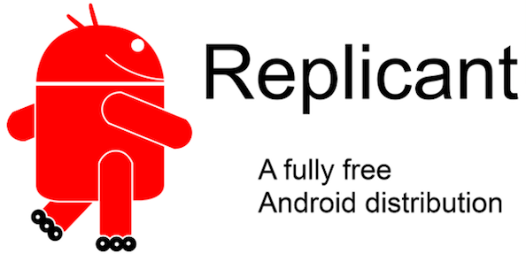
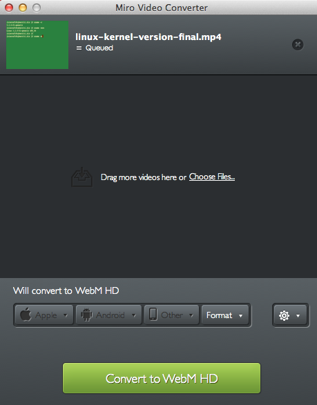

These are full-featured open source software products, free as in beer and speech that I started to use recently. Vivek Gite picks his best open source software of 2013.

\#1 Replicant – Fully free Android distribution
-----------------------------------------------

Replicant is **entirely free and open source distributions of Android** on several devices including both phones and tablets. I have installed it on an older Nexus S. You can install apps from F-Droid store a GPLv2 client app that comes configured with a repository hosting only free as in freedom applications.

Operating system : Linux/AndroidPurpose : Free os for phone/tabletsTargets : User who wish to have a full control over the mobile phone with strong privacy settingsLicense : Apache License 2.0/GPL 2.0Download url : [replicant.us](http://replicant.us/)

\#2: Miro video converter
-------------------------

This is an open source, cross-platform application to convert videos from and to various formats, including formats suitable for devices such as Android/iOS phones. It is simple and easy to use software to **convert almost any video to MP4, WebM (vp8), Ogg Theora **format. Miro Video Converter is based on FFMPEG and act as a front end to [FFMPEG command line tools](https://www.cyberciti.biz/faq/tag/ffmpeg-command/).

Operating system : Cross-platformPurpose : Video converterTargets : Multimedia usersLicense : GPLDownload url : [mirovideoconverter.com](http://www.mirovideoconverter.com/)

\#3 OwnCloud – Dropbox alternative for cloud storage service
------------------------------------------------------------

I was looking for an **alternative to Dropbox** to **run cloud on my own server** at home and office. This software is open source software, and it is self hosted. I don’t have to trust third party with my data. I found this software easy to install and quite useful. I started to use it for syncing files and other data. I have been using for couple of months and it has been proven reliable alternative to Dropbox. There are clients available for MS-Windows, OS X, Linux, and mobile apps for iOS and Android devices (or simply access data using the ownCloud web frontend). 

Operating system : Cross-platformPurpose : Cloud storage (Data synchronization)Targets : Home users/IT departments/SysadminsLicense : AGPLv3Download url : [owncloud.org](http://owncloud.org/)

\#4 Docker – FreeBSD like container+API for Linux
-------------------------------------------------

[The FreeBSD jail](https://www.cyberciti.biz/faq/howto-setup-freebsd-jail-with-ezjail/) provides an operating system-level virtualization partition a FreeBSD-based serve into several independent mini-systems. You can do the [same with Linux using OpenVZ](https://www.cyberciti.biz/faq/openvz-rhel-centos-linux-tutorial/). Linux Containers (LXC) is a virtualization method for running multiple isolated Linux systems. Docker extends LXC. It uses LXC, cgroups, Linux kernel and other parts to automate the deployment of applications inside software containers. It comes with API to runs processes in isolation. With docker I can pack WordPress (or any other app written in Python/Ruby/Php & friends) and its dependencies in a lightweight, portable, self-sufficient container. I can deploy and test such container on any Linux based server. 

Operating system : Linux amd64Purpose : OS level virtualizationTargets : DevOps/SysadminsLicense : Apache License 2.0Download url : [docker.io](https://www.docker.io/)

\#5 Adminer – A lightweight and full-featured database management tool
----------------------------------------------------------------------

Adminer is a full-featured database management tool written in PHP. Conversely to phpMyAdmin, it consists of a single file ready to deploy to the target server. Adminer is available for MySQL, PostgreSQL, SQLite, MS SQL and Oracle. I **usually install this for clients who are new** to PostgreSQL/MySQL. The software acts as a drop-in-replacement for phpMyAdmin with a better user interface, better support for MySQL features, higher performance and more security.

Operating system : Cross-platformPurpose : Database managementTargets : DBA/new usersLicense : Apache License or GPL 2Download url : [adminer.org](http://www.adminer.org/)

\#6 MariaDB – Drop-in replacement for Oracle MySQL server
---------------------------------------------------------

MariaDB is a community-developed fork of the MySQL server. MariaDB is going to be default in many popular Linux distro and open source project. Red Hat will switch the default database in its enterprise distribution, RHEL (including its clones such as CentOS), from MySQL to MariaDB, when version 7 is released in 2014\. I started testing MariaDB and found no problems at all. The speed is same or better in some cases. 

Operating system : Cross-platformPurpose : RDBMSTargets : DevOps/SysadminsLicense : GPL/LGPLDownload url : [mariadb.org](http://mariadb.org/)

\#7 RackTables – Manage your data center assets like a pro
----------------------------------------------------------

I wish I **discovered RackTables earlier**. It is is a datacenter asset management system. With this software one can document hardware assets (such as server, workstations, routers, switches and more), network addresses, space in racks, networks configuration and more:

1. List of all devices, racks, and enclosures you’ve got
2. Mount the devices into the racks
3. Maintain physical ports of the devices and links between them
4. Manage IP addresses, assign them to the devices and group them into networks
5. Document your NAT rules, describe your loadbalancing policy and store loadbalancing configuration
6. Attach files to various objects in the system
7. Create users, assign permissions and allow or deny any actions they can do

Operating system : Cross-platformPurpose : IDC asset management systemTargets : Sysadmin/DevOPS/IT ManagersLicense : GPLDownload url : [racktables.org](http://racktables.org/)

\#8 Apache Cordova – Create smartphone app just with HTML, CSS, and JavaScript
------------------------------------------------------------------------------

Apache Cordova is a free and open source framework that allows you to create mobile apps using standardized web APIs. You can create apps that work on iOS, Andriod, BlackBerry, Windows, Ubuntu and other phone based operating systems. You write code once and run on selected mobile platforms with [little or no change](http://docs.phonegap.com/en/2.5.0/guide_getting-started_index.md.html#Getting%20Started%20Guides) at all. PhoneGap uses Apache Cordova.

Operating system : iOS, Android, webOS, Symbian, BlackBerry, Ubuntu Touch, Windows Phone, Windows 8Purpose : Build native mobile appsTargets : DevelopersLicense : Apache License 2.0Download url : [cordova.apache.org](http://cordova.apache.org/) or [phonegap.com](http://www.phonegap.com/)

\#9 Angry IP scanner – ipscan tool
----------------------------------

[Nmap is an open source security tool for network exploration](https://www.cyberciti.biz/networking/nmap-command-examples-tutorials/), security scanning and auditing. ipscan (Angry IP Scanner) is an alternative to [nmap command](https://www.cyberciti.biz/networking/nmap-command-examples-tutorials/). It is also an open-source and cross-platform network scanner designed to be fast and simple to use. It scans IP addresses and ports as well as has many other features. 

Operating system : Cross-platformPurpose : Network scannerTargets : Sysadmin/Network administratorsLicense : GPL 2Download url : [angryip.org](http://angryip.org/)

\#10 Jekyll – Create simple static blog
---------------------------------------

Drupal, Typo3, WordPress and many other content management system (CMS)/blogging software dynamically create feature rich content. However, you may not need all the all features and complexity offered by modern CMS based systems. For example, a [WordPress based blog like nixCraft](https://www.cyberciti.biz/) requires [multiple VMs](https://www.cyberciti.biz/tips/run-different-network-services-on-separate-vm-systems.html), [CDN for static assets](https://www.cyberciti.biz/tips/wordpress-cdn-content-delivery-network-configuration.html), [caching engine such as memcached](https://www.cyberciti.biz/faq/howto-install-memcached-under-rhel-fedora-centos/), PHP, mysql database, comment moderation, and on going updates. A growing trend is to keep your blog simple by avoiding CMS and use static HTML generators that offers the following benefits:

* No more complex setups i.e. no databases/php/caching engines required.
* No more comment moderation.
* Pesky updates.
* Static files are more secure.
* Easy to scale or cache on edge/CDN nodes.
* Provides all the blog-aware visual bells and whistles such as categories, pages, posts, Permalinks, and custom layouts.

Operating system : Cross-platformPurpose : Blogging systemTargets : Bloggers who wish to follow [KISS principal](https://bash.cyberciti.biz/guide/Unix_philosophy).License : MIT LicenseDownload url : [jekyllrb.com](http://jekyllrb.com/)Similar apps: [Haskell based Hakyll](http://jaspervdj.be/hakyll/), [Ruby based nanoc](http://nanoc.ws/), [Python based Pelican](http://blog.getpelican.com/).

\#11 TurnKey Linux – Deploy open source apps on VM or the clouds
----------------------------------------------------------------

You can setup a open source software such as WordPress, Drupal, ZenCart, and over 100+ other software easily with TurnKey Linux. It is a virtual appliance library that integrates and polishes the very best open source software into ready to use solutions. Each virtual appliance is optimized for ease of use and can be deployed in **just a few minutes on bare metal, a virtual machine and in the cloud/in physical server**. TurnKey Linux is based on Debian 7.2 with automatic security updates for all packages. It also includes a web management interface, web shell, and simple configuration console. I often use this to **deploy development server** in the cloud. 

Operating system : LinuxPurpose : Virtual appliance libraryTargets : Sysadmin/Developers/DevOPSLicense : Free software licensesDownload url : [turnkeylinux.org](http://www.turnkeylinux.org/)

\#12 DokuWiki – Create a personal wiki
--------------------------------------

DokuWiki is a simple to use and highly versatile open source wiki software that doesn’t **require a database**. Easy to install on Linux or Unix-like operating systems with the following features:

1. Ease of use and low system requirements.
2. Built-in access control lists.
3. Customization using large variety of extensions, plugins, and templates.

I use this on my laptop to keep notes about various projects. 

Operating system : Cross-platformPurpose : Documentation Targets : Wiki users.License : GPL 2Download url : [dokuwiki.org](http://www.dokuwiki.org/)

\#13 MediaGoblin – An alterative to Youtube/Flickr/Soundcloud
-------------------------------------------------------------

GNU MediaGoblin is free software, decentralized media publishing platform. You can **host and share videos, music, and images** using MediaGoblin. It is an a**lternative to major media-publishing services** such as Flickr, deviantArt, YouTube, Soundcloud, etc. It is written in Python and SQL.

Operating system : Linux/OSX/MS-WindowsPurpose : Sharing many forms of digital mediaTargets : Freedom respectful media sharing self-hosted serviceLicense : AGPLv3/CC0Download url : [mediagoblin.org](http://www.mediagoblin.org/)

\#14: Scrollout F1 – Create email firewall gateway
--------------------------------------------------

Scrollout F1 is** easy to use and setup email firewall gateway** system. It includes anti-spam and anti-virus protection for Microsoft Exchange, Postfix, Exim, Sendmail, Qmail and others. It runs on Debian and Ubuntu Linux operating systems. This is **perfect software for filtering incoming messages** and other features are as follows:

1. TLS/SSL encryption with Perfect Forward Secrecy for SMTP & HTTPS
2. Virus scanning and different Quarantine per domain
3. Tagging and blocking SPAM at domain level
4. Geographic filtering for Sender IP, Server IP, URL IP and TLDs
5. Verifies incoming emails for DKIM and signs outgoing emails (2048 bits RSA)
6. Protection against fake messages that appear to come from your domain or from yourself
7. Protection against executable files, malicious content, scripts and more
8. Protection against forged domains like (fake) yahoo.com, gmail.com etc.
9. Whitelist and Blacklist
10. Simple web interface for management

Operating system : LinuxPurpose : Firewall and anti-spam gateway for MS-Windows/Linux/Unix-like email serversTargets : SysadminLicense : GPLDownload url : [scrolloutf1.com](http://www.scrolloutf1.com/)

\#15 Observium – Network observation and monitoring system
----------------------------------------------------------

Observium is free and open source software written in PHP/MySQL. It collects data from devices using SNMP and presents it via a web interface. It includes support for a wide range of network hardware and operating systems including Cisco, Windows, Linux, HP, Dell, FreeBSD, Juniper, Brocade, Netscaler, NetApp and many more. I use this **software along with Nagios** to get **better understanding of certain devices and technologies**. It provides historical and current performance statistics, configuration visualization and syslog capture.

Operating system : Linux/Unix-likePurpose : Network monitoringTargets : SysadminLicense : Observium LicenseDownload url : [observium.org](http://www.observium.org/)

\#16 SimpleInvoices
-------------------

It is a web based invoicing system. It helps me to create quick and nice looking invoices without having to set up too much services on server. All you have to do is install the SimpleInvoices software, enter a biller, a customer details and go creating invoices. You can easily track your finances; send invoices as PDF’s and more. It is **the best invoicing set up** for my independent IT consultancy business. 

Operating system : Linux/Unix-like/Windows/OSXPurpose : Invoicing systemTargets : Sole traders/Small business ownersLicense : Observium LicenseDownload url : [simpleinvoices.org](http://simpleinvoices.org/)Similar apps : [BambooInvoice](http://bambooinvoice.org/) – another invoicing software intended for small businesses and independent contractors

More cool apps
--------------

I sometime use and recommend the **following software for MS-Windows/Linux users** due to **simplicity** and **ease of use** features. Here is the list of the other best and FOSS apps of 2013: 

### \#17 FileZilla – sftp/ftp client for noobs

This is **a perfect open-source FTP, FTP over SSL/TLS (FTPS) and SSH File Transfer Protocol (SFTP) client** for Windows, Mac OS X and GNU/Linux. It has the following features that new users might find useful:

1. Drag & drop support
2. Tabbed user interface
3. File transfer queue and bookmarks
4. Remote file editing and remote file search
5. SOCKS5 and FTP-Proxy support

Operating system : Cross-platformPurpose : FTP clientDownload url : [filezilla-project.org](https://filezilla-project.org/)

### \#18 WinSCP – Easily transfer file using scp

It is an open source free SFTP client and FTP client for Windows. Its main function is the secure file transfer between local and server under your control. Most new MS-Windows user find **WinSCP an easier to use as compare to putty and friends**. 

Operating system : MS-WindowsPurpose : SFTP/FTP clientDownload url : [winscp.net](http://winscp.net/)

### \#19 XAMPP – Easily write and test Apache+MySQL+PHP/Perl apps on desktop

I give this software to many developers. They can easily setup Apache, MySQL, PHP/Perl to deploy and write an application on their own desktop. No need to install virtual machine and Linux server. Just focus on development and skip real server management job to pros. 

Operating system : Cross-platformPurpose : Apache distribution for desktop user/developers.Download url : [apachefriends.org](http://www.apachefriends.org/en/xampp.html)

### \#20 Abiword – A nice little word processor

Many users only use 2% of the features of a program like Microsoft Word. No need to spend money or time on Microsoft Word. I personally use Abiword due to:

1. Easy to use and not bloated as OO.org.
2. Small size word processor i.e. it loads very fast on my old computer.
3. I can read and write OpenOffice.org documents, Microsoft Word documents, WordPerfect documents, Rich Text Format documents, HTML web pages and more.
4. Abiword is tightly integrated with the [AbiCollab.net](https://abicollab.net/) web service, which lets you store documents online, allows easy document sharing with your friends, and performs format conversions on the fly.

Operating system : Cross-platformPurpose : Word processing programDownload url : [abisource.com](http://www.abisource.com/)

### \#21 {less}: The dynamic stylesheet language

LESS extends CSS with dynamic behavior such as variables, mixins, operations and functions. LESS can run on the client-side and server-side or can be compiled into plain CSS.

Operating system : Cross-platformPurpose : Web developersDownload url : [lesscss.org](http://lesscss.org/)

### \#22 Cinnamon

Cinnamon is a GTK+ based desktop environment and a fork of the GNOME Shell. It was initially developed by Linux Mint. It offers a user interface with the following features that I needed most:

1. **A movable pane**l equipped with a main menu, launchers, a window list and the system tray
2. Various **extensions and applets**
3. **Cinnamon makes GNOME3 a useful** desktop

Operating system : LinuxPurpose : Desktop userDownload url : [linuxmint.com](http://cinnamon.linuxmint.com/)

### \#23 Tmux

Tmux is terminal multiplexers for Unix-like platforms. tmux offers several advantages over GNU/screen:

1. Vi or emacs key layouts
2. Multiple paste options
3. Secure code base
4. An option to limit the window size [and more](http://tmux.cvs.sourceforge.net/viewvc/tmux/tmux/FAQ).

Operating system : Linux/Unix-likePurpose : Terminal multiplexerDownload url : [tmux.sourceforge.net](http://tmux.sourceforge.net/)

### \#24 Artica – Full SMTP/Mail/Proxy server Appliance in 10 minutes

It is a simple and straightforward software that offers the following features:

1. Proxy server Appliance
2. SMTP server Appliances
3. Mail server Appliances
4. NAS server Appliance
5. Web based management

Operating system : LinuxPurpose : Turn normal server into appliancesDownload url : [artica.fr](http://www.artica.fr/)

### \#25 Zentyal small business server

Zentyal is a **full-featured Linux server for small and medium businesses** that you can set up in less than 30 minutes. It is a **drop-in replacement for Microsoft Small Business Server and Microsoft Exchange Server**. It is easy to use software. Zentyal is based on Ubuntu and it can be installed either from Ubuntu repositories or from Zentyal’s own installer.

Operating system : LinuxPurpose : Office serverDownload url : [zentyal.org](http://www.zentyal.org/)

### \#26 Ack-grep – a source code search tool for programmers

ack-grep is a [grep like tool](https://www.cyberciti.biz/faq/howto-use-grep-command-in-linux-unix/), optimized for programmers. This tool isn’t aimed to “search all text files”. It is specifically created to search source code trees, not trees of text files. It searches entire trees by default while ignoring Subversion, Git and other VCS directories and other files that aren’t your source code.

Operating system : Cross-platformPurpose : Search source treesDownload url : [beyondgrep.com](http://beyondgrep.com/)

### \#27 ditaa – DIagrams Through Ascii Art

ditaa is a small command-line utility, that can **convert diagrams drawn using ascii art**, into proper bitmap graphics. I use this tool all the time **to draw diagrams and forwarding** them via email or chat session.

Operating system : Cross-platformPurpose : Convert diagrams drawn using ascii artDownload url : [ditaa.sourceforge.net](http://ditaa.sourceforge.net/)

### \#28 GNU parallel

GNU parallel is a shell tool for executing jobs in parallel using one or more computers. If you like [xargs command](https://www.cyberciti.biz/faq/linux-unix-bsd-xargs-construct-argument-lists-utility/), try GNU/parallel utility. It can run command/script/job on all available CPU’s or on multiple computers. 

Operating system : Cross-platform (Perl)Purpose : Execute shell scripts/jobs in parallelDownload url : [gnu.org](http://www.gnu.org/software/parallel/)

### \#29 luckyBackup data back-up and synchronization tool

luckyBackup is an application for data back-up and synchronization powered by the [rsync tool](https://www.cyberciti.biz/tips/linux-use-rsync-transfer-mirror-files-directories.html). It is simple to use, fast, safe, reliable and fully customizable backup software. I often set and recommend this too for **new Ubuntu/Fedora desktop users to backup their own files**.

Operating system : Linux/Unix-likePurpose : Desktop backupDownload url : [luckybackup.sourceforge.net](http://luckybackup.sourceforge.net/)

### \#30 OpenShot video editor

OpenShot Video Editor is a free and [open-source non-linear video editing software package for Linux](https://www.cyberciti.biz/faq/top5-linux-video-editing-system-software/). I use this tool [to create videos for my youtube channel](https://www.youtube.com/user/nixcraftcom). It is a stable, free, and friendly to use video editor on Linux.

Operating system : LinuxPurpose : Video editingDownload url : [openshot.org](http://openshot.org/)

Conclusion
----------

This is my personal FOSS software list and it is not absolutely definitive, so if you’ve got your own software, share in the comments below. Also don’t forget to check out our previous years [15 greatest open source terminal applications of 2012](https://www.cyberciti.biz/open-source/best-terminal-applications-for-linux-unix-macosx/).

 [ *Happy New Year to all nixCraft visitors. I hope that 2014 proves to be just as awesome for Linux & FOSS enthusiast everywhere.* ] 

 🐧 Get the latest tutorials on Linux, Open Source & DevOps via **[RSS feed](https://www.cyberciti.biz/atom/atom.xml)** or **[Weekly email newsletter.](https://newsletter.cyberciti.biz/subscription?f=1ojtmiv8892KQzyMsTF4YPr1pPSAhX2rq7Qfe5DiHMgXwKo892di4MTWyOdd976343rcNR6LhdG1f7k9H8929kMNMdWu3g)**

 🐧 40 comments so far... [add one](https://www.cyberciti.biz/open-source/30-cool-best-open-source-softwares-of-2013/#respond) **↓**

CategoryList of Unix and Linux commandsDisk space analyzers[df](https://www.cyberciti.biz/faq/df-command-examples-in-linux-unix/) • [ncdu](https://www.cyberciti.biz/open-source/install-ncdu-on-linux-unix-ncurses-disk-usage/) • [pydf](https://www.cyberciti.biz/tips/unix-linux-bsd-pydf-command-in-colours.html)File Management[cat](https://www.cyberciti.biz/faq/linux-unix-appleosx-bsd-cat-command-examples/) • [cp](https://www.cyberciti.biz/faq/cp-copy-command-in-unix-examples/) • [mkdir](https://www.cyberciti.biz/faq/linux-make-directory-command/) • [tree](https://www.cyberciti.biz/faq/linux-show-directory-structure-command-line/)Firewall[Alpine Awall](https://www.cyberciti.biz/faq/how-to-set-up-a-firewall-with-awall-on-alpine-linux/) • [CentOS 8](https://www.cyberciti.biz/faq/how-to-set-up-a-firewall-using-firewalld-on-centos-8/) • [OpenSUSE](https://www.cyberciti.biz/faq/set-up-a-firewall-using-firewalld-on-opensuse-linux/) • [RHEL 8 ](https://www.cyberciti.biz/faq/configure-set-up-a-firewall-using-firewalld-on-rhel-8/) • [Ubuntu 16.04](https://www.cyberciti.biz/faq/howto-configure-setup-firewall-with-ufw-on-ubuntu-linux/) • [Ubuntu 18.04](https://www.cyberciti.biz/faq/how-to-setup-a-ufw-firewall-on-ubuntu-18-04-lts-server/) • [Ubuntu 20.04](https://www.cyberciti.biz/faq/how-to-configure-firewall-with-ufw-on-ubuntu-20-04-lts/)Network Utilities[NetHogs](https://www.cyberciti.biz/faq/linux-find-out-what-process-is-using-bandwidth/) • [dig](https://www.cyberciti.biz/faq/linux-unix-dig-command-examples-usage-syntax/) • [host](https://www.cyberciti.biz/faq/linux-unix-host-command-examples-usage-syntax/) • [ip](https://www.cyberciti.biz/faq/linux-ip-command-examples-usage-syntax/) • [nmap](https://www.cyberciti.biz/security/nmap-command-examples-tutorials/)OpenVPN[CentOS 7](https://www.cyberciti.biz/faq/centos-7-0-set-up-openvpn-server-in-5-minutes/) • [CentOS 8](https://www.cyberciti.biz/faq/centos-8-set-up-openvpn-server-in-5-minutes/) • [Debian 10](https://www.cyberciti.biz/faq/debian-10-set-up-openvpn-server-in-5-minutes/) • [Debian 8/9](https://www.cyberciti.biz/faq/install-configure-openvpn-server-on-debian-9-linux/) • [Ubuntu 18.04](https://www.cyberciti.biz/faq/ubuntu-18-04-lts-set-up-openvpn-server-in-5-minutes/) • [Ubuntu 20.04](https://www.cyberciti.biz/faq/ubuntu-20-04-lts-set-up-openvpn-server-in-5-minutes/)Package Manager[apk](https://www.cyberciti.biz/faq/10-alpine-linux-apk-command-examples/) • [apt](https://www.cyberciti.biz/faq/ubuntu-lts-debian-linux-apt-command-examples/)Processes Management[bg](https://www.cyberciti.biz/faq/unix-linux-bg-command-examples-usage-syntax/) • [chroot](https://www.cyberciti.biz/faq/unix-linux-chroot-command-examples-usage-syntax/) • [cron](https://www.cyberciti.biz/faq/how-do-i-add-jobs-to-cron-under-linux-or-unix-oses/) • [disown](https://www.cyberciti.biz/faq/unix-linux-disown-command-examples-usage-syntax/) • [fg](https://www.cyberciti.biz/faq/unix-linux-fg-command-examples-usage-syntax/) • [jobs](https://www.cyberciti.biz/faq/unix-linux-jobs-command-examples-usage-syntax/) • [killall](https://www.cyberciti.biz/faq/unix-linux-killall-command-examples-usage-syntax/) • [kill](https://www.cyberciti.biz/faq/unix-kill-command-examples/) • [pidof](https://www.cyberciti.biz/faq/linux-pidof-command-examples-find-pid-of-program/) • [pstree](https://www.cyberciti.biz/faq/unix-linux-pstree-command-examples-shows-running-processestree/) • [pwdx](https://www.cyberciti.biz/faq/unix-linux-pwdx-command-examples-usage-syntax/) • [time](https://www.cyberciti.biz/faq/unix-linux-time-command-examples-usage-syntax/)Searching[grep](https://www.cyberciti.biz/faq/howto-use-grep-command-in-linux-unix/) • [whereis](https://www.cyberciti.biz/faq/unix-linux-whereis-command-examples-to-locate-binary/) • [which](https://www.cyberciti.biz/faq/unix-linux-which-command-examples-syntax-to-locate-programs/)User Information[groups](https://www.cyberciti.biz/faq/unix-linux-groups-command-examples-syntax-usage/) • [id](https://www.cyberciti.biz/faq/unix-linux-id-command-examples-usage-syntax/) • [lastcomm](https://www.cyberciti.biz/faq/linux-unix-lastcomm-command-examples-usage-syntax/) • [last](https://www.cyberciti.biz/faq/linux-unix-last-command-examples/) • [lid/libuser-lid](https://www.cyberciti.biz/faq/linux-lid-command-examples-syntax-usage/) • [logname](https://www.cyberciti.biz/faq/unix-linux-logname-command-examples-syntax-usage/) • [members](https://www.cyberciti.biz/faq/linux-members-command-examples-usage-syntax/) • [users](https://www.cyberciti.biz/faq/unix-linux-users-command-examples-syntax-usage/) • [whoami](https://www.cyberciti.biz/faq/unix-linux-whoami-command-examples-syntax-usage/) • [who](https://www.cyberciti.biz/faq/unix-linux-w-command-examples-syntax-usage-2/) • [w](https://www.cyberciti.biz/faq/unix-linux-w-command-examples-syntax-usage-2/)WireGuard VPN[Alpine](https://www.cyberciti.biz/faq/how-to-set-up-wireguard-vpn-server-on-alpine-linux/) • [CentOS 8](https://www.cyberciti.biz/faq/centos-8-set-up-wireguard-vpn-server/) • [Debian 10](https://www.cyberciti.biz/faq/debian-10-set-up-wireguard-vpn-server/) • [Firewall](https://www.cyberciti.biz/faq/how-to-set-up-wireguard-firewall-rules-in-linux/) • [Ubuntu 20.04](https://www.cyberciti.biz/faq/ubuntu-20-04-set-up-wireguard-vpn-server/)