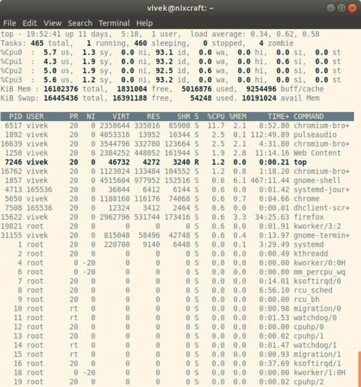

Need to monitor Linux server performance? Try these built-in commands and a few add-on tools. Most distributions come with tons of Linux monitoring tools. These tools provide metrics which can be used to get information about system activities. You can use these tools to find the possible causes of a performance problem. The commands discussed below are some of the most fundamental commands when it comes to system analysis and debugging Linux server issues such as:

1. Finding out system bottlenecks
2. Disk (storage) bottlenecks
3. CPU and memory bottlenecks
4. Network bottleneck.

1\. top – Process activity monitoring command
---------------------------------------------

top command display Linux processes. It provides a dynamic real-time view of a running system i.e. actual process activity. By default, it displays the most CPU-intensive tasks running on the server and updates the list every five seconds.

[](https://www.cyberciti.biz/tips/wp-content/uploads/2009/06/top-Linux-monitoring-command.jpg)

Fig.01: Linux top command

### Commonly Used Hot Keys With top Linux monitoring tools

Here is a list of useful hot keys:

Hot KeyUsagetDisplays summary information off and on.mDisplays memory information off and on.ASorts the display by top consumers of various system resources. Useful for quick identification of performance-hungry tasks on a system.fEnters an interactive configuration screen for top. Helpful for setting up top for a specific task.oEnables you to interactively select the ordering within top.rIssues renice command.kIssues kill command.zTurn on or off color/mono

[How do I Find Out Linux CPU Utilization?](https://www.cyberciti.biz/tips/how-do-i-find-out-linux-cpu-utilization.html)

2\. vmstat – Virtual memory statistics
--------------------------------------

The vmstat command reports information about processes, memory, paging, block IO, traps, and cpu activity.
`# vmstat 3`
 Sample Outputs:

    procs -----------memory---------- ---swap-- -----io---- --system-- -----cpu------
     r  b   swpd   free   buff  cache   si   so    bi    bo   in   cs us sy id wa st
     0  0      0 2540988 522188 5130400    0    0     2    32    4    2  4  1 96  0  0
     1  0      0 2540988 522188 5130400    0    0     0   720 1199  665  1  0 99  0  0
     0  0      0 2540956 522188 5130400    0    0     0     0 1151 1569  4  1 95  0  0
     0  0      0 2540956 522188 5130500    0    0     0     6 1117  439  1  0 99  0  0
     0  0      0 2540940 522188 5130512    0    0     0   536 1189  932  1  0 98  0  0
     0  0      0 2538444 522188 5130588    0    0     0     0 1187 1417  4  1 96  0  0
     0  0      0 2490060 522188 5130640    0    0     0    18 1253 1123  5  1 94  0  0

### Display Memory Utilization Slabinfo

`# vmstat -m`

### Get Information About Active / Inactive Memory Pages

`# vmstat -a`
[How do I find out Linux Resource utilization to detect system bottlenecks?](https://www.cyberciti.biz/tips/linux-resource-utilization-to-detect-system-bottlenecks.html)

3\. w – Find out who is logged on and what they are doing
---------------------------------------------------------

[w command](https://www.cyberciti.biz/faq/unix-linux-w-command-examples-syntax-usage-2/) displays information about the users currently on the machine, and their processes.

```
# w username
# w vivek
```

 Sample Outputs: 

     17:58:47 up 5 days, 20:28,  2 users,  load average: 0.36, 0.26, 0.24
    USER     TTY      FROM              LOGIN@   IDLE   JCPU   PCPU WHAT
    root     pts/0    10.1.3.145       14:55    5.00s  0.04s  0.02s vim /etc/resolv.conf
    root     pts/1    10.1.3.145       17:43    0.00s  0.03s  0.00s w

### 4\. uptime – Tell how long the Linux system has been running

 uptime command can be used to see how long the server has been running. The current time, how long the system has been running, how many users are currently logged on, and the system load averages for the past 1, 5, and 15 minutes.
`# uptime`
 Output: 

     18:02:41 up 41 days, 23:42,  1 user,  load average: 0.00, 0.00, 0.00

1 can be considered as optimal load value. The load can change from system to system. For a single CPU system 1 – 3 and SMP systems 6-10 load value might be acceptable.

5\. ps – Displays the Linux processes
-------------------------------------

 ps command will report a snapshot of the current processes. To select all processes use the -A or -e option:
`# ps -A`
 Sample Outputs: 

      PID TTY          TIME CMD
        1 ?        00:00:02 init
        2 ?        00:00:02 migration/0
        3 ?        00:00:01 ksoftirqd/0
        4 ?        00:00:00 watchdog/0
        5 ?        00:00:00 migration/1
        6 ?        00:00:15 ksoftirqd/1
    ....
    .....
     4881 ?        00:53:28 java
     4885 tty1     00:00:00 mingetty
     4886 tty2     00:00:00 mingetty
     4887 tty3     00:00:00 mingetty
     4888 tty4     00:00:00 mingetty
     4891 tty5     00:00:00 mingetty
     4892 tty6     00:00:00 mingetty
     4893 ttyS1    00:00:00 agetty
    12853 ?        00:00:00 cifsoplockd
    12854 ?        00:00:00 cifsdnotifyd
    14231 ?        00:10:34 lighttpd
    14232 ?        00:00:00 php-cgi
    54981 pts/0    00:00:00 vim
    55465 ?        00:00:00 php-cgi
    55546 ?        00:00:00 bind9-snmp-stat
    55704 pts/1    00:00:00 ps

ps is just like top but provides more information.

### Show Long Format Output

`# ps -Al`
 To turn on extra full mode (it will show command line arguments passed to process):
`# ps -AlF`

### Display Threads ( LWP and NLWP)

`# ps -AlFH`

### Watch Threads After Processes

`# ps -AlLm`

### Print All Process On The Server

```
# ps ax
# ps axu
```

### Want To Print A Process Tree?

```
# ps -ejH
# ps axjf
# pstree
```

### Get Security Information of Linux Process

```
# ps -eo euser,ruser,suser,fuser,f,comm,label
# ps axZ
# ps -eM
```

### Let Us Print Every Process Running As User Vivek

`# ps -U vivek -u vivek u`

### Configure ps Command Output In a User-Defined Format

```
# ps -eo pid,tid,class,rtprio,ni,pri,psr,pcpu,stat,wchan:14,comm
# ps axo stat,euid,ruid,tty,tpgid,sess,pgrp,ppid,pid,pcpu,comm
# ps -eopid,tt,user,fname,tmout,f,wchan
```

### Try To Display Only The Process IDs of Lighttpd

`# ps -C lighttpd -o pid=`
 OR
`# pgrep lighttpd`
 OR
`# pgrep -u vivek php-cgi`

### Print The Name of PID 55977

`# ps -p 55977 -o comm=`

### Top 10 Memory Consuming Process

`# ps -auxf | sort -nr -k 4 | head -10`

### Show Us Top 10 CPU Consuming Process

`# ps -auxf | sort -nr -k 3 | head -10`
[Show All Running Processes in Linux](https://www.cyberciti.biz/faq/show-all-running-processes-in-linux/)

6\. free – Show Linux server memory usage
-----------------------------------------

 free command shows the total amount of free and used physical and swap memory in the system, as well as the buffers used by the kernel.
`# free`
 Sample Output: 

                total       used       free     shared    buffers     cached
    Mem:      12302896    9739664    2563232          0     523124    5154740
    -/+ buffers/cache:    4061800    8241096
    Swap:      1052248          0    1052248

1. [Linux Find Out Virtual Memory PAGESIZE](https://www.cyberciti.biz/faq/linux-check-the-size-of-pagesize/)
2. [Linux Limit CPU Usage Per Process](https://www.cyberciti.biz/faq/cpu-usage-limiter-for-linux/)
3. [How much RAM does my Ubuntu / Fedora Linux desktop PC have?](https://www.cyberciti.biz/tips/how-much-ram-does-my-linux-system.html)

7\. iostat – Montor Linux average CPU load and disk activity
------------------------------------------------------------

 iostat command report Central Processing Unit (CPU) statistics and input/output statistics for devices, partitions and network filesystems (NFS).
`# iostat`
 Sample Outputs: 

    Linux 2.6.18-128.1.14.el5 (www03.nixcraft.in) 	06/26/2009

    avg-cpu:  %user   %nice %system %iowait  %steal   %idle
               3.50    0.09    0.51    0.03    0.00   95.86

    Device:            tps   Blk_read/s   Blk_wrtn/s   Blk_read   Blk_wrtn
    sda              22.04        31.88       512.03   16193351  260102868
    sda1              0.00         0.00         0.00       2166        180
    sda2             22.04        31.87       512.03   16189010  260102688
    sda3              0.00         0.00         0.00       1615          0

[Linux Track NFS Directory / Disk I/O Stats](https://www.cyberciti.biz/faq/howto-linux-track-nfs-client-disk-metrics/)

8\. sar – Monitor, collect and report Linux system activity
-----------------------------------------------------------

 sar command used to collect, report, and save system activity information. To see network counter, enter:
`# sar -n DEV | more`
 The network counters from the 24th:
`# sar -n DEV -f /var/log/sa/sa24 | more`
 You can also display real time usage using sar:
`# sar 4 5`
 Sample Outputs: 

    Linux 2.6.18-128.1.14.el5 (www03.nixcraft.in) 		06/26/2009

    06:45:12 PM       CPU     %user     %nice   %system   %iowait    %steal     %idle
    06:45:16 PM       all      2.00      0.00      0.22      0.00      0.00     97.78
    06:45:20 PM       all      2.07      0.00      0.38      0.03      0.00     97.52
    06:45:24 PM       all      0.94      0.00      0.28      0.00      0.00     98.78
    06:45:28 PM       all      1.56      0.00      0.22      0.00      0.00     98.22
    06:45:32 PM       all      3.53      0.00      0.25      0.03      0.00     96.19
    Average:          all      2.02      0.00      0.27      0.01      0.00     97.70

* [How to collect Linux system utilization data into a file](https://www.cyberciti.biz/tips/howto-write-system-utilization-data-to-file.html)
* [How To Create sar Graphs With kSar To Identifying Linux Bottlenecks](https://www.cyberciti.biz/tips/identifying-linux-bottlenecks-sar-graphs-with-ksar.html)

9\. mpstat – Monitor multiprocessor usage on Linux
--------------------------------------------------

 mpstat command displays activities for each available processor, processor 0 being the first one. mpstat -P ALL to display average CPU utilization per processor:
`# mpstat -P ALL`
 Sample Output: 

    Linux 2.6.18-128.1.14.el5 (www03.nixcraft.in)	 	06/26/2009

    06:48:11 PM  CPU   %user   %nice    %sys %iowait    %irq   %soft  %steal   %idle    intr/s
    06:48:11 PM  all    3.50    0.09    0.34    0.03    0.01    0.17    0.00   95.86   1218.04
    06:48:11 PM    0    3.44    0.08    0.31    0.02    0.00    0.12    0.00   96.04   1000.31
    06:48:11 PM    1    3.10    0.08    0.32    0.09    0.02    0.11    0.00   96.28     34.93
    06:48:11 PM    2    4.16    0.11    0.36    0.02    0.00    0.11    0.00   95.25      0.00
    06:48:11 PM    3    3.77    0.11    0.38    0.03    0.01    0.24    0.00   95.46     44.80
    06:48:11 PM    4    2.96    0.07    0.29    0.04    0.02    0.10    0.00   96.52     25.91
    06:48:11 PM    5    3.26    0.08    0.28    0.03    0.01    0.10    0.00   96.23     14.98
    06:48:11 PM    6    4.00    0.10    0.34    0.01    0.00    0.13    0.00   95.42      3.75
    06:48:11 PM    7    3.30    0.11    0.39    0.03    0.01    0.46    0.00   95.69     76.89

[Linux display each multiple SMP CPU processors utilization individually](https://www.cyberciti.biz/faq/linux-mpstat-command-report-processors-related-statistics/).

10\. pmap – Montor process memory usage on Linux
------------------------------------------------

 pmap command report memory map of a process. Use this command to find out causes of memory bottlenecks.
`# pmap -d PID`
 To display process memory information for pid \# 47394, enter:
`# pmap -d 47394`
 Sample Outputs: 

    47394:   /usr/bin/php-cgi
    Address           Kbytes Mode  Offset           Device    Mapping
    0000000000400000    2584 r-x-- 0000000000000000 008:00002 php-cgi
    0000000000886000     140 rw--- 0000000000286000 008:00002 php-cgi
    00000000008a9000      52 rw--- 00000000008a9000 000:00000   [ anon ]
    0000000000aa8000      76 rw--- 00000000002a8000 008:00002 php-cgi
    000000000f678000    1980 rw--- 000000000f678000 000:00000   [ anon ]
    000000314a600000     112 r-x-- 0000000000000000 008:00002 ld-2.5.so
    000000314a81b000       4 r---- 000000000001b000 008:00002 ld-2.5.so
    000000314a81c000       4 rw--- 000000000001c000 008:00002 ld-2.5.so
    000000314aa00000    1328 r-x-- 0000000000000000 008:00002 libc-2.5.so
    000000314ab4c000    2048 ----- 000000000014c000 008:00002 libc-2.5.so
    .....
    ......
    ..
    00002af8d48fd000       4 rw--- 0000000000006000 008:00002 xsl.so
    00002af8d490c000      40 r-x-- 0000000000000000 008:00002 libnss_files-2.5.so
    00002af8d4916000    2044 ----- 000000000000a000 008:00002 libnss_files-2.5.so
    00002af8d4b15000       4 r---- 0000000000009000 008:00002 libnss_files-2.5.so
    00002af8d4b16000       4 rw--- 000000000000a000 008:00002 libnss_files-2.5.so
    00002af8d4b17000  768000 rw-s- 0000000000000000 000:00009 zero (deleted)
    00007fffc95fe000      84 rw--- 00007ffffffea000 000:00000   [ stack ]
    ffffffffff600000    8192 ----- 0000000000000000 000:00000   [ anon ]
    mapped: 933712K    writeable/private: 4304K    shared: 768000K

The last line is very important:

* **mapped: 933712K** total amount of memory mapped to files
* **writeable/private: 4304K** the amount of private address space
* **shared: 768000K** the amount of address space this process is sharing with others

[Linux find the memory used by a program / process using pmap command](https://www.cyberciti.biz/tips/howto-find-memory-used-by-program.html)

11\. netstat – Linux network and statistics monitoring tool
-----------------------------------------------------------

 netstat command displays network connections, routing tables, interface statistics, masquerade connections, and multicast memberships.

```
# netstat -tulpn
# netstat -nat
```

12\. ss – Network Statistics
----------------------------

 ss command use to dump socket statistics. It allows showing information similar to netstat. Please note that the netstat is mostly obsolete. Hence you need to use ss command. To ss all TCP and UDP sockets on Linux:
`# ss -t -a`
 OR
`# ss -u -a`
 Show all TCP sockets with process SELinux security contexts:
`# ss -t -a -Z`
 See the following resources about ss and netstat commands: 

* [ss: Display Linux TCP / UDP Network and Socket Information](https://www.cyberciti.biz/tips/linux-investigate-sockets-network-connections.html)
* [Get Detailed Information About Particular IP address Connections Using netstat Command](https://www.cyberciti.biz/tips/netstat-command-tutorial-examples.html)

13\. iptraf – Get real-time network statistics on Linux
-------------------------------------------------------

 iptraf command is interactive colorful IP LAN monitor. It is an ncurses-based IP LAN monitor that generates various network statistics including TCP info, UDP counts, ICMP and OSPF information, Ethernet load info, node stats, IP checksum errors, and others. It can provide the following info in easy to read format: 

* Network traffic statistics by TCP connection
* IP traffic statistics by network interface
* Network traffic statistics by protocol
* Network traffic statistics by TCP/UDP port and by packet size
* Network traffic statistics by Layer2 address


Fig.02: General interface statistics: IP traffic statistics by network interface


Fig.03 Network traffic statistics by TCP connection

[Install IPTraf on a Centos / RHEL / Fedora Linux To Get Network Statistics](https://www.cyberciti.biz/faq/install-iptraf-centos-redhat-fedora-linux/)

14\. tcpdump – Detailed network traffic analysis
------------------------------------------------

 tcpdump command is simple command that dump traffic on a network. However, you need good understanding of TCP/IP protocol to utilize this tool. For.e.g to display traffic info about DNS, enter:
`# tcpdump -i eth1 'udp port 53'`
 View all IPv4 HTTP packets to and from port 80, i.e. print only packets that contain data, not, for example, SYN and FIN packets and ACK-only packets, enter:
`# tcpdump 'tcp port 80 and (((ip[2:2] - ((ip[0]&0xf)<<2)) - ((tcp[12]&0xf0)>>2)) != 0)'`
 Show all FTP session to 202.54.1.5, enter:
`# tcpdump -i eth1 'dst 202.54.1.5 and (port 21 or 20'`
 Print all HTTP session to 192.168.1.5:
`# tcpdump -ni eth0 'dst 192.168.1.5 and tcp and port http'`
 Use [wireshark to view detailed](https://www.cyberciti.biz/faq/linux-unix-bsd-apache-tcpdump-http-packets-sniffing/) information about files, enter:
`# tcpdump -n -i eth1 -s 0 -w output.txt src or dst port 80`

15\. iotop – Linux I/O monitor
------------------------------

iotop command monitor, I/O usage information, using the Linux kernel. It shows a table of current I/O usage sorted by processes or threads on the server.
`$ sudo iotop`
 Sample outputs:
[](https://www.cyberciti.biz/tips/wp-content/uploads/2009/06/iotop-monitoring-linux-disk-read-write-IO.jpg)
[Linux iotop: Check What’s Stressing And Increasing Load On Your Hard Disks](https://www.cyberciti.biz/hardware/linux-iotop-simple-top-like-io-monitor/)

16\. htop – interactive process viewer
--------------------------------------

htop is a free and open source ncurses-based process viewer for Linux. It is much better than top command. Very easy to use. You can select processes for killing or renicing without using their PIDs or leaving htop interface.
`$ htop`
 Sample outputs:
[](https://www.cyberciti.biz/tips/wp-content/uploads/2009/06/htop-process-viewer-for-Linux.jpg)

* [CentOS / RHEL: Install htop An Interactive Text-mode Process Viewer](https://www.cyberciti.biz/faq/centos-redhat-linux-install-htop-command-using-yum/)

17\. atop – Advanced Linux system & process monitor
---------------------------------------------------

atop is a very powerful and an interactive monitor to view the load on a Linux system. It displays the most critical hardware resources from a performance point of view. You can quickly see CPU, memory, disk and network performance. It shows which processes are responsible for the indicated load concerning CPU and memory load on a process level.
`$ atop`
[](https://www.cyberciti.biz/tips/wp-content/uploads/2009/06/atop-Command-Line-Tools-to-Monitor-Linux-Performance.jpg)

* [CentOS / RHEL: Install atop (Advanced System & Process Monitor) Utility](https://www.cyberciti.biz/faq/centos-redhat-linux-install-atop-command-using-yum/)

18\. ac and lastcomm –
----------------------

You must monitor process and login activity on your Linux server. The psacct or acct package contains several utilities for monitoring process activities, including:

1. ac command : Show statistics about users’ connect time
2. [lastcomm command](https://www.cyberciti.biz/faq/linux-unix-lastcomm-command-examples-usage-syntax/) : Show info about about previously executed commands
3. accton command : Turns process accounting on or off
4. sa command : Summarizes accounting information

[How to keep a detailed audit trail of what’s being done on your Linux systems](https://www.cyberciti.biz/tips/howto-log-user-activity-using-process-accounting.html)

19\. monit – Process supervision
--------------------------------

Monit is a free and open source software that acts as process supervision. It comes with the ability to restart services which have failed. You can use Systemd, daemontools or any other such tool for the same purpose. [This tutorial shows how to install and configure monit as Process supervision on Debian or Ubuntu Linux](https://www.cyberciti.biz/faq/how-to-install-and-use-monit-on-ubuntudebian-linux-server/).

20\. nethogs- Find out PIDs that using most bandwidth on Linux
--------------------------------------------------------------

NetHogs is a small but handy net top tool. It groups bandwidth by process name such as Firefox, wget and so on. If there is a sudden burst of network traffic, start NetHogs. You will see which PID is causing bandwidth surge.
`$ sudo nethogs`
[](https://www.cyberciti.biz/tips/wp-content/uploads/2009/06/nethogs-linux-monitoring-tools-open-source.jpg)
[Linux: See Bandwidth Usage Per Process With Nethogs Tool](https://www.cyberciti.biz/faq/linux-find-out-what-process-is-using-bandwidth/)

21\. iftop – Show bandwidth usage on an interface by host
---------------------------------------------------------

iftop command listens to network traffic on a given interface name such as eth0\. [It displays a table of current bandwidth usage by pairs of host](https://www.cyberciti.biz/tips/linux-display-bandwidth-usage-on-network-interface-by-host.html)s.
`$ sudo iftop`
[](https://www.cyberciti.biz/faq/centos-fedora-redhat-install-iftop-bandwidth-monitoring-tool/)

22\. vnstat – A console-based network traffic monitor
-----------------------------------------------------

vnstat is easy to use console-based network traffic monitor for Linux. It keeps a log of hourly, daily and monthly network traffic for the selected interface(s).
`$ vnstat`
[](https://www.cyberciti.biz/tips/wp-content/uploads/2009/06/vnstat-linux-network-traffic-monitor.jpg)

* [Keeping a Log Of Daily Network Traffic for ADSL or Dedicated Remote Linux Server](https://www.cyberciti.biz/tips/linux-display-bandwidth-usage-on-network-interface-by-host.html)
* [CentOS / RHEL: Install vnStat Network Traffic Monitor To Keep a Log Of Daily Traffic](https://www.cyberciti.biz/faq/centos-redhat-fedora-linux-install-vnstat-bandwidth-monitor/)
* [CentOS / RHEL: View Vnstat Graphs Using PHP Web Interface Frontend](https://www.cyberciti.biz/faq/centos-redhat-fedora-linux-vnstat-php-webinterface-frontend-config/)

23\. nmon – Linux systems administrator, tuner, benchmark tool
--------------------------------------------------------------

nmon is a Linux sysadmin’s ultimate tool for the tunning purpose. It can show CPU, memory, network, disks, file systems, NFS, top process resources and partition information from the cli.
`$ nmon`
[](https://www.cyberciti.biz/tips/wp-content/uploads/2009/06/nmon-command.jpg)
[Install and Use nmon Tool To Monitor Linux Systems Performance](https://www.cyberciti.biz/faq/nmon-performance-analyzer-linux-server-tool/)

24\. glances – Keep an eye on Linux system
------------------------------------------

glances is an open source cross-platform monitoring tool. It provides tons of information on the small screen. It can also work in client/server mode.
`$ glances`
[](https://www.cyberciti.biz/tips/wp-content/uploads/2009/06/glances-keep-an-eye-on-linux.jpg)
[Linux: Keep An Eye On Your System With Glances Monitor](https://www.cyberciti.biz/faq/linux-install-glances-monitoring-tool/)

25\. strace – Monitor system calls on Linux
-------------------------------------------

Want to trace Linux system calls and signals? Try strace command. This is useful for debugging webserver and other server problems. See how to use to [trace the process and](https://www.cyberciti.biz/tips/linux-strace-command-examples.html) see What it is doing.

26\. /proc/ file system – Various Linux kernel statistics
---------------------------------------------------------

/proc file system provides detailed information about various hardware devices and other Linux kernel information. See [Linux kernel /proc](https://www.cyberciti.biz/files/linux-kernel/Documentation/filesystems/proc.txt) documentations for further details. Common /proc examples:

```
# cat /proc/cpuinfo
# cat /proc/meminfo
# cat /proc/zoneinfo
# cat /proc/mounts
```

27\. Nagios – Linux server/network monitoring
---------------------------------------------

[Nagios](http://www.nagios.org/) is a popular open source computer system and network monitoring application software. You can easily monitor all your hosts, network equipment and services. It can send alert when things go wrong and again when they get better. [FAN is](http://fannagioscd.sourceforge.net/drupal/) “Fully Automated Nagios”. FAN goals are to provide a Nagios installation including most tools provided by the Nagios Community. FAN provides a CDRom image in the standard ISO format, making it easy to easilly install a Nagios server. Added to this, a wide bunch of tools are including to the distribution, in order to improve the user experience around Nagios.

28\. Cacti – Web-based Linux monitoring tool
--------------------------------------------

Cacti is a complete network graphing solution designed to harness the power of RRDTool’s data storage and graphing functionality. Cacti provides a fast poller, advanced graph templating, multiple data acquisition methods, and user management features out of the box. All of this is wrapped in an intuitive, easy to use interface that makes sense for LAN-sized installations up to complex networks with hundreds of devices. It can provide data about network, CPU, memory, logged in users, Apache, DNS servers and much more. See how [to install and configure Cacti network graphing](https://www.cyberciti.biz/faq/fedora-rhel-install-cacti-monitoring-rrd-software/) tool under CentOS / RHEL.

29\. KDE System Guard – Real-time Linux systems reporting and graphing
----------------------------------------------------------------------

KSysguard is a network enabled task and system monitor application for KDE desktop. This tool can be run over ssh session. It provides lots of features such as a client/server architecture that enables monitoring of local and remote hosts. The graphical front end uses so-called sensors to retrieve the information it displays. A sensor can return simple values or more complex information like tables. For each type of information, one or more displays are provided. Displays are organized in worksheets that can be saved and loaded independently from each other. So, KSysguard is not only a simple task manager but also a very powerful tool to control large server farms.


Fig.05 KDE System Guard {Image credit: Wikipedia}

See [the KSysguard handbook](https://docs.kde.org/stable5/en/kde-workspace/ksysguard/index.html) for detailed usage.

30\. Gnome Linux system monitor
-------------------------------

The System Monitor application enables you to display basic system information and monitor system processes, usage of system resources, and file systems. You can also use System Monitor to modify the behavior of your system. Although not as powerful as the KDE System Guard, it provides the basic information which may be useful for new users:

* Displays various basic information about the computer’s hardware and software.
* Linux Kernel version
* GNOME version
* Hardware
* Installed memory
* Processors and speeds
* System Status
* Currently available disk space
* Processes
* Memory and swap space
* Network usage
* File Systems
* Lists all mounted filesystems along with basic information about each.


Fig.06 The Gnome System Monitor application

Bonus: Additional Tools
-----------------------

A few more tools:

* [nmap](https://www.cyberciti.biz/tips/linux-scanning-network-for-open-ports.html) – scan your server for open ports.
* [lsof](https://www.cyberciti.biz/tips/tag/lsof-command) – list open files, network connections and much more.
* [ntop](https://www.cyberciti.biz/faq/debian-ubuntu-install-ntop-network-traffic-monitoring-software/) web based tool – ntop is the best tool to see network usage in a way similar to what top command does for processes i.e. it is network traffic monitoring software. You can see network status, protocol wise distribution of traffic for UDP, TCP, DNS, HTTP and other protocols.
* [Conky](https://github.com/brndnmtthws/conky) – Another good monitoring tool for the X Window System. It is highly configurable and is able to monitor many system variables including the status of the CPU, memory, swap space, disk storage, temperatures, processes, network interfaces, battery power, system messages, e-mail inboxes etc.
* [GKrellM](http://gkrellm.srcbox.net/) – It can be used to monitor the status of CPUs, main memory, hard disks, network interfaces, local and remote mailboxes, and many other things.
* [mtr](https://www.cyberciti.biz/tips/finding-out-a-bad-or-simply-overloaded-network-link-with-linuxunix-oses.html) – mtr combines the functionality of the traceroute and ping programs in a single network diagnostic tool.
* [vtop](https://www.cyberciti.biz/faq/how-to-install-and-use-vtop-graphical-terminal-activity-monitor-on-linux/) – graphical terminal activity monitor on Linux
* [gtop](https://www.cyberciti.biz/howto/gtop-awesome-system-monitoring-dashboard-for-terminal/) – Awesome system monitoring dashboard for Linux/macOS Unix terminal

Did I miss something? Please add your favorite system motoring tool in the comments.

 🐧 Get the latest tutorials on Linux, Open Source & DevOps via **[RSS feed](https://www.cyberciti.biz/atom/atom.xml)** or **[Weekly email newsletter.](https://newsletter.cyberciti.biz/subscription?f=1ojtmiv8892KQzyMsTF4YPr1pPSAhX2rq7Qfe5DiHMgXwKo892di4MTWyOdd976343rcNR6LhdG1f7k9H8929kMNMdWu3g)**

 🐧 355 comments so far... [add one](https://www.cyberciti.biz/tips/top-linux-monitoring-tools.html#respond) **↓**

CategoryList of Unix and Linux commandsDisk space analyzers[df](https://www.cyberciti.biz/faq/df-command-examples-in-linux-unix/) • [ncdu](https://www.cyberciti.biz/open-source/install-ncdu-on-linux-unix-ncurses-disk-usage/) • [pydf](https://www.cyberciti.biz/tips/unix-linux-bsd-pydf-command-in-colours.html)File Management[cat](https://www.cyberciti.biz/faq/linux-unix-appleosx-bsd-cat-command-examples/) • [cp](https://www.cyberciti.biz/faq/cp-copy-command-in-unix-examples/) • [mkdir](https://www.cyberciti.biz/faq/linux-make-directory-command/) • [tree](https://www.cyberciti.biz/faq/linux-show-directory-structure-command-line/)Firewall[Alpine Awall](https://www.cyberciti.biz/faq/how-to-set-up-a-firewall-with-awall-on-alpine-linux/) • [CentOS 8](https://www.cyberciti.biz/faq/how-to-set-up-a-firewall-using-firewalld-on-centos-8/) • [OpenSUSE](https://www.cyberciti.biz/faq/set-up-a-firewall-using-firewalld-on-opensuse-linux/) • [RHEL 8 ](https://www.cyberciti.biz/faq/configure-set-up-a-firewall-using-firewalld-on-rhel-8/) • [Ubuntu 16.04](https://www.cyberciti.biz/faq/howto-configure-setup-firewall-with-ufw-on-ubuntu-linux/) • [Ubuntu 18.04](https://www.cyberciti.biz/faq/how-to-setup-a-ufw-firewall-on-ubuntu-18-04-lts-server/) • [Ubuntu 20.04](https://www.cyberciti.biz/faq/how-to-configure-firewall-with-ufw-on-ubuntu-20-04-lts/)Network Utilities[NetHogs](https://www.cyberciti.biz/faq/linux-find-out-what-process-is-using-bandwidth/) • [dig](https://www.cyberciti.biz/faq/linux-unix-dig-command-examples-usage-syntax/) • [host](https://www.cyberciti.biz/faq/linux-unix-host-command-examples-usage-syntax/) • [ip](https://www.cyberciti.biz/faq/linux-ip-command-examples-usage-syntax/) • [nmap](https://www.cyberciti.biz/security/nmap-command-examples-tutorials/)OpenVPN[CentOS 7](https://www.cyberciti.biz/faq/centos-7-0-set-up-openvpn-server-in-5-minutes/) • [CentOS 8](https://www.cyberciti.biz/faq/centos-8-set-up-openvpn-server-in-5-minutes/) • [Debian 10](https://www.cyberciti.biz/faq/debian-10-set-up-openvpn-server-in-5-minutes/) • [Debian 8/9](https://www.cyberciti.biz/faq/install-configure-openvpn-server-on-debian-9-linux/) • [Ubuntu 18.04](https://www.cyberciti.biz/faq/ubuntu-18-04-lts-set-up-openvpn-server-in-5-minutes/) • [Ubuntu 20.04](https://www.cyberciti.biz/faq/ubuntu-20-04-lts-set-up-openvpn-server-in-5-minutes/)Package Manager[apk](https://www.cyberciti.biz/faq/10-alpine-linux-apk-command-examples/) • [apt](https://www.cyberciti.biz/faq/ubuntu-lts-debian-linux-apt-command-examples/)Processes Management[bg](https://www.cyberciti.biz/faq/unix-linux-bg-command-examples-usage-syntax/) • [chroot](https://www.cyberciti.biz/faq/unix-linux-chroot-command-examples-usage-syntax/) • [cron](https://www.cyberciti.biz/faq/how-do-i-add-jobs-to-cron-under-linux-or-unix-oses/) • [disown](https://www.cyberciti.biz/faq/unix-linux-disown-command-examples-usage-syntax/) • [fg](https://www.cyberciti.biz/faq/unix-linux-fg-command-examples-usage-syntax/) • [jobs](https://www.cyberciti.biz/faq/unix-linux-jobs-command-examples-usage-syntax/) • [killall](https://www.cyberciti.biz/faq/unix-linux-killall-command-examples-usage-syntax/) • [kill](https://www.cyberciti.biz/faq/unix-kill-command-examples/) • [pidof](https://www.cyberciti.biz/faq/linux-pidof-command-examples-find-pid-of-program/) • [pstree](https://www.cyberciti.biz/faq/unix-linux-pstree-command-examples-shows-running-processestree/) • [pwdx](https://www.cyberciti.biz/faq/unix-linux-pwdx-command-examples-usage-syntax/) • [time](https://www.cyberciti.biz/faq/unix-linux-time-command-examples-usage-syntax/)Searching[grep](https://www.cyberciti.biz/faq/howto-use-grep-command-in-linux-unix/) • [whereis](https://www.cyberciti.biz/faq/unix-linux-whereis-command-examples-to-locate-binary/) • [which](https://www.cyberciti.biz/faq/unix-linux-which-command-examples-syntax-to-locate-programs/)User Information[groups](https://www.cyberciti.biz/faq/unix-linux-groups-command-examples-syntax-usage/) • [id](https://www.cyberciti.biz/faq/unix-linux-id-command-examples-usage-syntax/) • [lastcomm](https://www.cyberciti.biz/faq/linux-unix-lastcomm-command-examples-usage-syntax/) • [last](https://www.cyberciti.biz/faq/linux-unix-last-command-examples/) • [lid/libuser-lid](https://www.cyberciti.biz/faq/linux-lid-command-examples-syntax-usage/) • [logname](https://www.cyberciti.biz/faq/unix-linux-logname-command-examples-syntax-usage/) • [members](https://www.cyberciti.biz/faq/linux-members-command-examples-usage-syntax/) • [users](https://www.cyberciti.biz/faq/unix-linux-users-command-examples-syntax-usage/) • [whoami](https://www.cyberciti.biz/faq/unix-linux-whoami-command-examples-syntax-usage/) • [who](https://www.cyberciti.biz/faq/unix-linux-w-command-examples-syntax-usage-2/) • [w](https://www.cyberciti.biz/faq/unix-linux-w-command-examples-syntax-usage-2/)WireGuard VPN[Alpine](https://www.cyberciti.biz/faq/how-to-set-up-wireguard-vpn-server-on-alpine-linux/) • [CentOS 8](https://www.cyberciti.biz/faq/centos-8-set-up-wireguard-vpn-server/) • [Debian 10](https://www.cyberciti.biz/faq/debian-10-set-up-wireguard-vpn-server/) • [Firewall](https://www.cyberciti.biz/faq/how-to-set-up-wireguard-firewall-rules-in-linux/) • [Ubuntu 20.04](https://www.cyberciti.biz/faq/ubuntu-20-04-set-up-wireguard-vpn-server/)