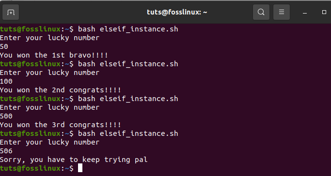
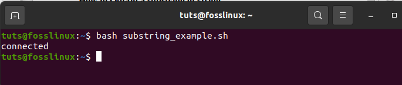
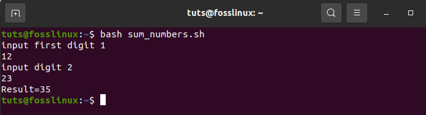
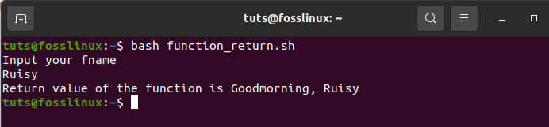

35 Bash Script Examples
=======================

[Abraham](https://www.fosslinux.com/author/abraham)April 16, 2021

Bash script programming is a sequence of executable commands, carrying out numerous commands at once, task performance automation, and administrative tasks customization. Generally, all Linux users must acquaint themselves with the basic knowledge of bash script programming because of the importance it offers.

Effective interaction with the command line is among the essential aspects that bash scripting provides. This means that the user can efficiently run executable commands. This eases the stress of having to carry out tasks manually.

35 Bash Script Examples
-----------------------

This article will run you through the core basics that you need to know to get started with bash scripting. Let’s have a look at the 35 Bash script examples:

### 1\. First Bash Program

To get a bash file up and running, you need to execute it by running a terminal command. For instance, if we run “Hello World” in our terminal, the output we get will be “Hello World.”

First Bash Program

To create a bash file, you can use any text editor installed in your operating system. In this case, we will use the nano editor for creating the file. Let us name our file ‘First.sh’. Execute the command using the following command:

    nano First.sh

Add the following bash script to the file before saving the file.

       #!/bin/bash
       echo “Hello World”

How to create a bash file

### 

There are different ways of running bash commands. For instance, below are two distinct examples of executing bash.

    ./First.sh

Alternatively, you can use execute the command below:

    chmod a+x First.sh
    ./First.sh

How to execute Bash

### 2\. Echo commands

echo commands have numerous options for selection. For instance, there is an addition of a new line by default if you use the ‘echo’ command without any other option. Alternatively, you can use ‘-n’ to print any text without a new line. Make use of the ‘-e’ command to remove backslash characters from the given output. To demonstrate this, create a bash file named ‘echo\_example.sh’. After that, add the script below

    #!/bin/bash
    Echo “printing text with newline”
    Echo -n “printing text without newline”
    Echo -e “\nRemoving \t backslash \t characters\

After adding the script, execute the file with the command below:

    bash echo_example.sh

Echo commands Illustration

### 3\. Use of comment

While using comments, we use the “\#” symbol to add a single line comment in bash scripting. Here, you will create a new file with a simple name such as ‘comment\_example’. Include a script with a single comment like the example displayed below.

    #!/bin /bash
    # Add two values
    ((sum 30+20))

    #thereafter print the result
    echo $sum

execute the file with bash command-line

Use of comment

### 4\. Multiline comment

In bash, the multiline comment is applicable in different ways. To prove this, create a new bash named, ‘multiline-comment example.sh’, after that, add ‘:’ and “ ’ ” scripts symbols to add a multi-line comment in the script. The following example will execute the square of 2.

    #!bin/bash
    : ‘
    The script written below is used to calculate the square of 2
    ‘
    ((area=2*2))
    echo$area
    execute the file with bash command-line

bash multiline-comment-example.sh

Multiline comment illustration

### 5\. While Loop

For easy comprehension of this bash script, create a file named ‘while\_sample.sh’. The while loop will repeat five times before terminating the process. While looping, the count variable increases the count by 1 in every step till the fifth time when the loop stops.

    #!/bin/bash
    valid=True
    count=1
    while [$valid ]
    do
    echo $count
    if [$count -eq 5 ];
    then break
    fi
    ((count++))
    done

execute the file with bash command-line

    bash while_example.sh

While Loop illustration

### 6\. For Loop

Take a look at the following for loop example. After creating a file named ‘for\_sample.sh’, add the script using ‘for loop’. This process will re-occur 12 times. After that, it will display the fields in a single line, as shown below;

    #!/bin/bash
    for (( counter=10; counter>0; counter-- ))
    do
    echo -n "$counter "
    done
    printf "\n"

Execute the command by running the code below

    bash for_sample.sh

For Loop Illustration

### 7\. Get User Input

To get user input from bash, we will use the ‘read’ command. Follow the simple steps below to achieve the expected results. First, create a file named ‘user\_feedin.sh’ and include the script below to get the user input. One value will be taken and displayed by combining other string values. As indicated below,

    #!/bin/bash
    echo "Enter Your Name"
    read name
    echo "Welcome $name to FossLinux"

execute the file with bash command-line

    bash user_feedin.sh

Get User Input Illustration

### 8\. If statement

The if statement is used by both multiple and single conditions. A definition of ‘if’ and ‘fi’ are used Before and after an if statement. To easily understand the if statement in bash, we shall use an example. Create a file named ‘example\_if.sh’.

For instance, the number 4 is assigned a variable ‘s.’ If the number is divisible by 2, then the output will be “it is divisible by 2”; otherwise, if the number is not divisible by 2, then the outcome will be “it is not divisible by 2”. The ‘-lt’, in this case, is used for comparison purposes. Another comparison feature is ‘-eq.’ ‘-ne’, on the other hand, is used to show inequality while ‘-gt’ shows if a value is more significant in bash script.

    #!/bin/bash
    s=4
    if [ $s / 2 ];
    then
    echo "It is not divisible by 2"
    else
    echo "It is divisible by 2"
    fi

execute the file with bash command-line

    bash example_if.sh

If statement Illustration

### 9\. Use of if statement together with AND logic

Various logical conditions can be used with the if statement whenever there are two or more conditions. The example below shows how the logic “AND” is used in defining multiple conditions in an if statement. The “&&” symbols represent the “AND” logic in a bash script. Create a file named ‘if\_plus\_AND.sh’.

In this example, the username and password variables entered by the user will be compared with the “main” and “users” directory to see if they match. If they do, the process will be successful, thus displaying “valid-user” as the output. Otherwise, if they do not match, the outcome will be “invalid user.”

    !/bin/bash

    echo "input username"
    read username
    echo "input password"
    read password

    if [[ ( $username == "main" && $password == "users" ) ]]; then
    echo "valid user"
    else
    echo "invalid user"
    fi

Execute the file using the bash command-line

    bash if_plus_AND.sh

Use of if statement with AND logic illustration.Use if statement with AND logic Illustration

The first example shows authentication failure since the user-provided does not match with the main fields.

The second examples show successful authentication since the provided fields matched with the main fields.

### 10\. Use if statement with OR logic

When using OR with the if function, the ‘||’ symbol is used. To demonstrate this, we will create a file named ‘if\_with\_OR.sh’ to check the use of OR logic in an IF statement. Take an instance of value ‘s’ being assigned to two numbers (10 or 40). If a user inputs either of the given numbers, then the system’s output will be “Well Played”; otherwise, the result shown will be “Sorry, You Failed.” If you examine this example, you will notice that the value of s is generated from the user.

    #!/bin/bash

    echo "Enter any number"
    read s

    if [[ ( $s -eq 10 || $n -eq 40 ) ]]
    then
    echo "Well Played"
    else
    echo "Sorry, You Failed"
    fi

execute the file with bash command-line

    bash if_with_OR.sh

Use if statement with OR logic Illustration

    As indicated in the example above, 5 is not equal to 10 or 40. Therefore, the output displays “Sorry, You Failed,”

In the figure above, the user was prompted to enter any number, and he/she chose 10, and the output given is “Well Played” since 10==10

### 11\. Use of else if statement

Many conditional statements are nearly the same despite the programming languages you choose. However, in bash programming, the use of the ‘else if’ condition is kind of different. In bash, Elif is used in place of the else if condition. We will create a file named ‘elseif\_instance.sh’ then add the bash script for demonstration purposes.

    echo "Enter your lucky number"
    read n

    if [ $n -eq 50 ];
    then
    echo "You won the 1st bravo!!!!"
    elif [ $n -eq 100 ];
    then
    echo "You won the 2nd congrats!!!!"
    elif [ $n -eq 500 ];
    then
    echo "You won the 3rd congrats!!!!"

    else
    echo "Sorry, you have to keep trying pal"
    fi

Execute the file with bash command-line

    Bash elseif_instance.sh

use of else if statement Illustration

The execution above displays the three instances done by bash.

### 12\. case statement

Have you ever heard of the “if-elseif-else” statement? If not, don’t worry, as it will be covered here. The Case statement is used as a substitute for the if-elseif-else statement. ‘Case’ and ‘esac’ delineate the starting and ending block respectively while using this statement. For more elaboration, an example will be of great help. Create a file named ‘case\_example.sh’. After that, include the script provided below. Then, take a look at the output and compare it to the previous one. You will notice that the outcomes of both the case statement and if-elseif-else statements are the same.

    #!/bin/bash

    echo "Input your Lucky Number"
    read s
    case $s in
    50)
    echo echo "You won the 1st bravo!!!!" ;;
    100)
    echo "You won the 2nd congrats!!!!" ;;
    500)
    echo "You won the 3rd congrats" ;;
    *)
    echo "Sorry, you have to keep trying pal" ;;
    esac

execute the file with bash command-line

    bash case_example.sh

case statement Illustration

### 13\. Obtaining arguments from Command Line

Bash script can emulate how other programming languages obtain inputs from the command line. Look at an instance where variables $1 and $3 are used to cypher through the first and third command-line arguments, respectively. For more elaboration, let’s create a file named ‘command-line.sh’ and include the script below. In the end, the output given is the print of the total count of arguments read by the script.

    #!/bin/bash
    echo "Total arguments : $#"
    echo "1st Argument = $1"
    echo "3rd argument = $3"

Execute the file with bash command-line

    bash command_line.sh Foss Linux Website

Obtaining arguments from Command Line Illustration

### 14\. Obtain arguments from command-line with names

This section demonstrates how to read command-line arguments that contain names. To do this, create a file named ‘command\_line\_names.sh’. After that, add a code with two arguments: A, B, to be read by the script and compute the sum of A and B.

    #!/bin/bash
    for arg in "$@"
    do
    index=$(echo $arg | cut -f1 -d=)
    val=$(echo $arg | cut -f2 -d=)
    case $index in
    A) a=$val;;

    B) b=$val;;

    *)
    esac
    done
    ((result=a+b))
    echo "A+B=$result"

Execution with bash command. The code below is a combination of the two command-line arguments.

    bash command_line_names.sh A=10 B=16

Obtain arguments from command-line with names Illustration

### 15\. Integrated string variables

Bash has some significant advantages that aid a programmer to accomplish tasks quickly. String variable integration is a combination of two or more variables. To demonstrate this, create a file named ‘string\_combination.sh’. After that, add the script provided below and look at how you can integrate string variables by placing variables together using the ‘+’ operator.

    #!/bin/bash

    stringA="Foss"
    stringB="Linux"
    echo "$stringA$stringB"
    stringC=$stringA+$stringB
    stringC+=" has the best online tutorials"
    echo $stringC

execute the file with bash command-line

    bash string_combination.sh

Integrated string variables Illustration

### 16\. How to Obtain a substring of string

Bash lacks an inbuilt function to truncate values from a data string, just like other programming languages. However, bash allows you to carry out substring truncation differently, as shown in the script below. Create a file named ‘substring\_example.sh’. In this case, the value 7 shows the substring’s protrusive point, whereas 6 shows the substring’s total length.

    #!/bin/bash
    Str="Get connected to FossLinux blogsite"
    subStr=${Str:4:9}
    echo $subStr

Execution with bash command

    bash substring_example.sh

How to Obtain a substring of string Illustration

### 17\. Addition of two numbers

Bash supports arithmetic operations in various and complex ways. To display the complex advantages of bash, you will do the sum of two integers using double brackets, as shown below. First, you will create a file named ‘sum\_numbers.sh’ using the code below. The function will prompt the user to enter the first digit, then the second digit, and finally, print the result, which computes the user’s two integers.

    #!/bin/bash
    echo "input first digit 1"
    read a
    echo "input digit 2"
    read b
    (( sum=a+b ))
    echo "Result=$sum"

Execute the file with bash command-line

    bash sum_numbers.sh

Addition of two numbers Illustration

### 18\. function creation

Bash scripting allows the user to create a function and call the same function. This has been demonstrated in the example below. Create a file named ‘function\_example.sh’ and input the code outline in the sample. Here, you will select any function randomly by name without specifying any kind of bash script brackets.

    #!/bin/bash
    function x()
    {
    echo 'I love fosslinux'
    }

x

Execute the file using the command-line below;

    bash function_example.sh

function creation Illustration

### 19\. Functionality creation with parameters

In bash programming, you can use parameters in a function by using other variables. Call the 1st value $1 and the second value $2 in an instance where the two values are called simultaneously with the function to read the values. To ascertain this, you will create a file named ‘function\_parameter.sh’. Let us find the area of a rectangle ‘Rectangle\_Area’ using the given parameters.

    #!/bin/bash

    Rectangle_Area() {
    area=$(($1 * $2))
    echo "Area is : $area"
    }

    Rectangle_Area 15 25

Execute the file with the bash command.

    bash function_parameter.sh

Functionality creation with parameters Illustration

### 20\. Passing a return a value from a function

When dealing with returning values in bash programming, bash has a built-in function that allows the passing of numeric and string values. The following example shows the passing of string values in a function. You will create a file named ‘function\_return.sh’ and include the code below for easy comprehension. The function grow() returns a string value into the variable, which later outputs the integrated string results.

    #!/bin/bash
    function greeting() {

    str="Goodmorning, $fname"
    echo $str

    }

    echo "Input your fname"
    read fname

    val=$(greeting)
    echo "Return value of the function is $val"

Execute the file with bash command-line

    bash function_return.sh

Passing a return a value from a function Illustration

### 21\. Make Directory

‘Mkdir’ is a command used to create a new directory. This command means ‘make directory’. Create a file named ‘make\_directory.sh’. After that, input a code that will create a new directory. Bash will create a new directory for you.

    #!/bin/bash
    echo "Input a new directory name"
    read newdir
    `mkdir $newdir`

Execute the file with bash command-line

    bash make_directory.sh

Make Directory Illustration

### 22\. Creation of a directory by checking its existence

‘-d’ is a command that aids the user to check for an existing directory in the current computer location or not. This prevents one from executing the ‘mkdir’ command when not sure whether a directory is there or not. For demonstration, create a file named ‘directory\_exists.sh’ and add the code written below to check any directory exists.

    #!/bin/bash
    echo "New directory name input"
    read ndir
    if [ -d "$ndir" ]
    then
    echo "The Directory given exists"
    else
    `mkdir $ndir`echo "Directory created"
    fi

Execution with bash command.

    Bash directory_exists.sh

Creation of a directory by checking its existence Illustration

### 23\. Reading a file

Bash has a looping functionality that helps the user to read any file. Here we will showcase the easiest way to make you understand. We will do so by creating an example file named ‘read\_file.sh’ and add the code below to determine the existing file called ‘langeages.txt.’

    #!/bin/bash
    file='languages.txt'
    while read line; do
    echo $line
    done < $file

Execute the file with bash command-line

    bash read_file.sh

Reading a file Illustration

To check the original content of languages.txt, run the command below.

    cat languages.txt

### 24\. File Deleting

In bash programming, an ‘rm’ command is used to remove or delete files. We will delete a file using the ‘rm’ command. First, create a file named ‘delete\_file.sh’. After that, use the code highlighted below to make the initial user’s file name and remove it. The ‘-i’ command is helpful as it allows the users to delete the file.

    #!/bin/bash
    echo "Insert a filename to delete"
    read filename
    rm -i $filename

Execute the file with bash command-line.

    bash delete_file.sh

File Deleting Illustration

### 25\. Append or adding to file

With an existing file, bash has a ‘\>\>’ operator that allows appending of new data into the file. To test this, create a file named ‘add\_file.sh’. Then add a code that will add data to the end of the current file. Add the following string, ‘studying angular,’ to the ‘languages.txt’ file after running the bash script.

    #!/bin/bash

    echo "Before adding the file"
    cat languages.txt

    echo "Studying angular">> languages.txt
    echo "After adding the file"
    cat languages.txt

Execution with bash command.

    bash add_file.sh

Append or adding to file Illustration

### 26\. Test File existence

Bash has great user functionalities that make it user-friendly. In this section, we will see the functionality that gives you an option of checking whether a particular file exists or not. The ‘-e’ or ‘-f’ commands will aid us in checking if a file exists or not. To test this, create a file named ‘file\_exist.sh’, then add the code below. In this test, the filename will pass from the command line.

    #!/bin/bash
    filename=$1
    if [ -f "$filename" ]; then
    echo "File exists"
    else
    echo "File does not exist"
    fi

Run the commands displayed below to confirm the existence of the files. In this example, the languages.txt file is available, whereas the languages1.txt file does not exist.

    ls
    bash file_exist.sh languages.txt
    bash file_exist.sh languages1.txt

Test File existence Illustration

These commands are used to check whether a file being looked for exists or not. For instance, in this example, the languages.txt file exists, while the languages1.txt does not exist.

### 27\. Send Email

The ‘mail’ or ‘sendmail’ commands in a bash script are used to send emails. These commands will work efficiently after installing all the necessary packages. For demonstration purposes, create a file named ‘mail\_example.sh’. Use the codes highlighted below to send the intended email.

    #!/bin/bash
    Recipient=”fosslinux@example.com”
    Subject=”inquiries”
    Message=”Need anything from fosslinux blogsite?”
    `mail -s $Subject $Recipient <<< $Message`

Execute the file with the bash command.

    bash mail_example.sh

### 28\. Parse Current Date

Bash has a feature that enables parsing of the date and time values that we will focus on in this section. Bash allows you to get the current date and time using the ‘date’ command. ‘S,’ ‘d’, ‘M,’ ‘m’, ‘Y,’ and ‘H’ are values used to analyze date and time. Create a file named ‘date\_parse.sh’ and add a code that will detach month, year, day, hour, minutes, and the seconds’ values.

    #!/bin/bash
    Year=`date +%Y`
    Month=`date +%m`
    Day=`date +%d`
    Hour=`date +%H`
    Minute=`date +%M`
    Second=`date +%S`
    echo `date`
    echo "Current Date is: $Day-$Month-$Year"
    echo "Current Time is: $Hour:$Minute:$Second"

Execute the file with the bash command.

    bash date_parse.sh

Parse Current Date Illustration

### 29\. The Wait command

Linux OS has a built-in command feature that awaits to complete any running process by using a peculiar id to finish that particular assigned task. Therefore, when there is no job id, the wait command will wait for all secondary cycles to complete before returning exiting. Create a file named ‘wait\_example.sh’ and add the script below for execution.

    #!/bin/bash
    echo "Waiting command" &
    process_id=$!
    wait $process_id
    echo "Exited with status $?"

Execute the file using the bash command.

    bash wait_example.sh

The Wait command Illustration

### 30\. The Sleep Command

The sleep command helps the user to pause an ongoing task for a specified period. It gives you the allowance of delaying or halting/pausing for hours, minutes, seconds, or days. For illustration purposes, create a file and name it ‘sleep\_examples.sh’, thereafter run the script shown below.

The example aims to delay the task for approximately 8 seconds after execution.

    #!/bin/bash

    echo “Please be patient for 8 seconds”
    sleep 8
    echo “Completed”

Execute the file using the bash command

    bash sleep_examples.sh

The Sleep Command Illustration

### 31\. The AND Operator

This operator allows the system to check if multiple conditions have been satisfied. This means that all conditions separated by the AND operator must be true for correct execution. Additionally, the ‘&&’ operator is used to denote ‘AND’. To ascertain this, check the example below. First, create a file called ‘And\_operator.sh’ then execute it using bash command-line.

    #!/bin/bash
    echo -n "Input a Number:"
    read num

    if [[ ( $num -lt 20 ) && ( $num%2 -eq 0 ) ]]; then
    echo "It is an Even Number"
    else
    echo "It is an Odd Number"
    fi

Execute the file using the bash command-line

    bash And_operator.sh

The AND Operator Illustration

### 32\. The OR Operator

This is a great bash scripting construct that aids in creating complex logic in scripts. This construct works slightly differently than the ‘AND’ operator because it either returns true whenever the operands outcome is true. On the other hand, the ‘or’ operator only returns false whenever both the operands are false. Check the sample below for more elaboration. To find out about this construct, create a file named ‘OR\_operator.sh’ and complete its execution using the command line.

    #!/bin/bash

    echo -n "Enter any number:"
    read n

    if [[ ( $n -eq 5 || $n -eq 30 ) ]]
    then
    echo "You won"
    else
    echo "You lost!"
    fi

Command-line execution using bash

    bash OR_operator.sh

The OR Operator Illustration

### 33\. The switch construct

The Switch construct is applicable in situations where nested conditions are needed. The example below gives a detailed outline. Create a file named ‘switch\_construct.sh’. Then execute the file using the bash command-line

    #!/bin/bash

    echo -n "Input a number: "
    read number

    case $number in
    50)
    echo "Fifty!!" ;;
    100)
    echo "Double fifty!!" ;;
    *)
    echo "Neither 100 nor 200" ;;
    esac

Execute the file with the bash command-line

    bash switch_construct.sh

The switch construct Illustration

### 34\. Concatenating strings

With its advanced comfort-ability, bash allows easy implementation of concatenating string. This has been simplified by the example below. For demonstration purposes, create a file named ‘concatenating\_strings.sh’ and run the file in the bash command line. You will get an output similar to the one below.

    #!/bin/bash

    string1="FossLinux"
    string2="Blogsite"
    string=$string1$string2
    echo "$string is a great resource for Linux users to find relevant tutorials."

Execute the file with the bash command

    bash concatenating_strings

Concatenating strings Illustration

### 35\. Slicing strings

The slicing string refers to the reduction of parts of a string. Unlike many programming languages that offer truncation of strings, bash doesn’t provide this feature. Below is an example to make you get a glimpse of what we are talking about. First, create a file named ‘slicing\_strings.sh’. Thereafter, execute the created slicing file using the bash command line.

    #!/bin/bash
    Str="Study smart commands with fosslinux"
    subStr=${Str:0:20}
    echo $subStr

The output in the script above should be ‘Study Smart commands.’ The expansion in parameter takes the formula **{VAR\_NAME: S: L)**. in this formula, S shows the starting position, whereas L denotes the length.

    bash slicing_strings.sh

slicing strings Illustration

Conclusion
----------

The article has covered 35 bash script examples giving the user a diverse learning range. If you have been looking for an all-around article with bash script examples, this should be your ultimate choice.