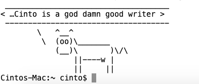

Have fun while coding!
----------------------

[Cinto](https://cinto-sunny.medium.com/?source=post_page-----6f3b811642d5--------------------------------)

[May 20](https://betterprogramming.pub/5-linux-commands-that-can-make-you-go-wow-6f3b811642d5?source=post_page-----6f3b811642d5--------------------------------) · 4 min read

Photo by [Patrick Fore](https://unsplash.com/@patrickian4?utm_source=medium&utm_medium=referral) on [Unsplash](https://unsplash.com/?utm_source=medium&utm_medium=referral)

Being a programmer is tough. The hours spent behind the monitor debugging a missing semicolon, the strain on the eyes writing a 1,000-line readme for ten lines of code, the mental trauma when we accidentally delete the entire git repo, the endless arguments with our managers and peers. And the list continues.

So, once in a while, it is OK to take a break and indulge in something fun. For regular people, it would involve watching a funny YouTube video or laughing at a Facebook post of a dog chasing a kid, or arguing on Twitter about your favorite football club.

But for Linux lovers, it could be turning your monitor into a chatterbox or a fortune cookie generator. Or maybe watching your monitor fly around the room. OK, that's too much!

Here are some Linux commands that will lighten your mood.

Who Let the Cows Out
====================

Ever wondered what would happen if cows started talking. Don't worry, Linux will make it happen.

    brew install cowsay

Now, let's make the cow say.

    cowsay …Cinto is a god damn good writer

Image by the author. Cow spitting out bare facts

Or, if you want the Linux mascot to say it:

    cowsay -f tux …Everyone loves Medium

Image by the author.

To find the other options, type the following:

    cowsay -l
    beavis.zen blowfish bong bud-frogs bunny cheese cower daemon default dragon dragon-and-cow elephant elephant-in-snake eyes flaming-sheep ghostbusters head-in hellokitty kiss kitty koala kosh luke-koala meow milk moofasa moose mutilated ren satanic sheep skeleton small stegosaurus stimpy supermilker surgery three-eyes turkey turtle tux udder vader vader-koala www

Fortune Cookie
==============

We do not need a fortune cookie when we go to a Chinese restaurant. We are full, happy, and content after a sumptuous lunch.

We need it when our code stops working, even after rerunning the process 11 times and restarting our machines 173 times. Even if we do not find out if our fortunes gonna change, it will take our minds off the issue.

So, here’s how Linux is going to help.

    brew install fortune
    ...
    ==> Pouring fortune--9708.catalina.bottle.4.tar.gz
    🍺  /usr/local/Cellar/fortune/9708: 82 files, 2.5MB

Now, for our random messages:

    They can’t stop us… we’re on a mission from God!
    — The Blues Brothers

To make it even more fun, you can combine fortune with Cowsay, like this:

    fortune | cowsay -f ghostbusters

Image by author

Let the Terminal Talk to You
============================

Wouldn't it be wonderful if your terminal could speak your mind? Well, with Linux it can.

    brew install espeak
    ...
    ==> Pouring espeak--1.48.04_1.catalina.bottle.1.tar.gz
    🍺  /usr/local/Cellar/espeak/1.48.04_1: 296 files, 3MB

Let it speak

    espeak "What a wonderful article"

You can even control the gap between words

    espeak -g 20ms "What a wonderful article"

Have fun talking to your machine. Let your family think you are mad. Who cares!

The Steam Engine
================

Bored of your plain old black and white terminal. Want to let a steam locomotive engine hurry across your terminal.

Linux — “Your wish is my command.”

    brew install sl

Fun time

    sl

[gif](https://media.giphy.com/media/F9QecAyxu4W4oBtkWb/giphy.gif) by author

Add the command to your *~/.bashrc*, or *~/.profile*, and watch it run every time you open a new terminal.

Banners
=======

Want a banner on your plain vanilla terminal. Say no more!

    brew install figlet

What do you want the banner to say. Use the code below:

    figlet Linux Rocks!

Image by author

As mentioned previously, add it to the *~/.bashrc*, or ~*/.profile* and let it be a default every time you open a new terminal.

Linux is cool. See how you forgot about the bug that was messing with your brains. But the fun is over. Happy coding!!