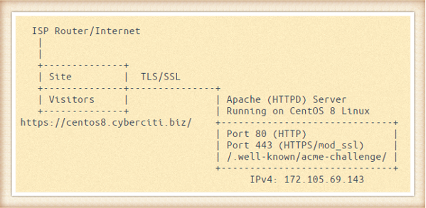
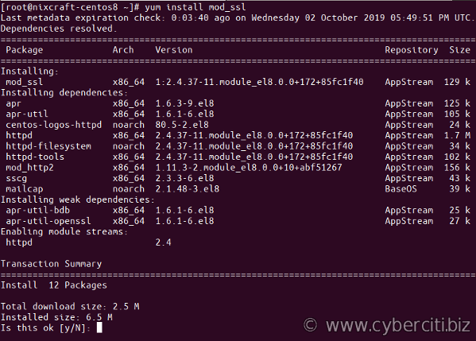

I read that Let’s Encrypt is a free, automated, and open certificate for web server and other usages. How do I secure Apache with Let’s Encrypt Certificates on CentOS 8?

 Let’s Encrypt is a free, automated, and open certificate authority for your website powered by the Apache webserver. This page shows how to use Let’s Encrypt to install a free SSL certificate for Apache webserver. You will learn how to properly deploy Diffie-Hellman on your server to get SSL labs A+ score on a CentOS Linux 8.

How to secure Apache with Let’s Encrypt Certificates on CentOS 8
----------------------------------------------------------------

The procedure is as follows to obtaining an SSL certificate:

1. Install SSL/TLS module for the Apache HTTP server in CentOS 8: sudo yum install mod\_ssl
2. Get acme.sh software, run git clone https://github.com/Neilpang/acme.sh.git
3. Create a new /.well-known/acme-challenge/ directory using: mkdir -p /var/www/html/.well-known/acme-challenge/
4. Obtain an SSL certificate your domain: acme.sh --issue -w /DocumentRootPath/ -d your-domain
5. Configure TLS/SSL for Apache on CentOS Linux 8: vi /etc/httpd/conf.d/ssl.conf
6. Setup a cron job for auto renewal of SSL/TLS certificate
7. Open port 443 (HTTPS) using firewall :sudo firewall-cmd --add-service=https

### Our sample setup is as follows

My sample Let’s Encrypt SSL certificate to secure Apache on CentOS 8

 Let us see how to install [acme.sh client](https://github.com/Neilpang/acme.sh) and use it on a CentOS 8 to get an SSL certificate from Let’s Encrypt. Before you start apply all patches on CentOS 8:
`sudo yum update`

Step 1 – Install mod\_ssl for the Apache
----------------------------------------

Type the following [yum command](https://www.cyberciti.biz/faq/rhel-centos-fedora-linux-yum-command-howto/):
`$ sudo yum install mod_ssl`


Step 2 – Install acme.sh Let’s Encrypt client
---------------------------------------------

You need to [install wget on CentOS 8](https://www.cyberciti.biz/faq/how-to-install-wget-on-rhel-8-redhat-enterprise-linux/), curl, bc, socat and git client on CentOS 8 in order use acme.sh, run:
`$ sudo yum install wget curl bc git socat`

    Last metadata expiration check: 0:06:51 ago on Wednesday 02 October 2019 05:49:51 PM UTC.
    Package wget-1.19.5-7.el8_0.1.x86_64 is already installed.
    Package curl-7.61.1-8.el8.x86_64 is already installed.
    Dependencies resolved.
    =========================================================================================
     Package                  Arch           Version                 Repository         Size
    =========================================================================================
    Installing:
     git                      x86_64         2.18.1-3.el8            AppStream         186 k
     socat                    x86_64         1.7.3.2-6.el8           AppStream         298 k
     bc                       x86_64         1.07.1-5.el8            BaseOS            129 k
    Installing dependencies:
     git-core                 x86_64         2.18.1-3.el8            AppStream         4.1 M
     git-core-doc             noarch         2.18.1-3.el8            AppStream         2.3 M
     perl-Error               noarch         1:0.17025-2.el8         AppStream          46 k
     perl-Git                 noarch         2.18.1-3.el8            AppStream          77 k
     perl-TermReadKey         x86_64         2.37-7.el8              AppStream          40 k
     emacs-filesystem         noarch         1:26.1-5.el8            BaseOS             69 k

    Transaction Summary
    =========================================================================================
    Install  9 Packages

    Total download size: 7.1 M
    Installed size: 38 M
    Is this ok [y/N]: y

### Clone the repo

Execute the following commands:

```
$ cd /tmp/
$ git clone https://github.com/Neilpang/acme.sh.git
```

 Next, install acme.sh client on to your system, run:

```
$ cd acme.sh/
$ sudo -i
# cd acme.sh/
# ./acme.sh --install
```


 Now we have needed software on the CentOS 8 server. You must close the current terminal or ssh session and reopen again to make the alias take effect. Or type the following [source command](https://bash.cyberciti.biz/guide/Source_command):
`$ sudo source ~/.bashrc`
 Verify that acme.sh working, run:
`# acme.sh --version`
 Sample outputs:

    https://github.com/Neilpang/acme.sh
    v2.8.3

Step 3 – Create acme-challenge directory
----------------------------------------

Type the following [mkdir command](https://www.cyberciti.biz/faq/linux-make-directory-command/). Make sure you set $D to actual DocumentRoot path as per your needs:

```
# D=/var/www/html/
# mkdir -vp ${D}/.well-known/acme-challenge/
###---[ NOTE: Adjust permission as per your setup ]---###
# chown -R apache:apache ${D}/.well-known/acme-challenge/
# chmod -R 0555 ${D}/.well-known/acme-challenge/
```

 Also, create a directory to store SSL certificate:
`# mkdir -p /etc/httpd/ssl/cyberciti.biz/`

Step 4 – Create dhparams.pem file
---------------------------------

Run the openssl command:

```
# cd /etc/httpd/ssl/cyberciti.biz/
# openssl dhparam -out dhparams.pem -dsaparam 4096
```


[How to speed up OpenSSL/GnuPG Entropy For Random Number Generation On Linux](https://www.cyberciti.biz/open-source/debian-ubuntu-centos-linux-setup-additional-entropy-for-server-using-aveged-rng-tools-utils/)

### Turn on Apache service if not eanbled

Is Apache running? If not [start the Apache service](https://www.cyberciti.biz/faq/linux-install-and-start-apache-httpd/) it as follows using the systemctl command:

```
$ sudo systemctl status httpd.service
$ sudo systemctl enable httpd.service
$ sudo systemctl start httpd.service
$ sudo systemctl status httpd.service
```


### Make sure TCP port 80 opend too

Run the following firewall-cmd command to turn on TCP port 80 on CentOS 8:

```
$ sudo firewall-cmd --permanent --add-service=http --zone=public
$ sudo firewall-cmd --reload
$ sudo firewall-cmd --list-services --zone=public
```

Step 5 – Obtain a SSL/TLS certificate for domain
------------------------------------------------

Issue a certificate for your domain. The syntax is:

```
# acme.sh --issue -w /path/to/www/htmlRoot/ -d your-domain-example-com -k 2048
# acme.sh --issue -w /path/to/www/htmlRoot/ -d www.cyberciti.biz -k 4096
# acme.sh --issue -w /var/www/html/ -d centos8.cyberciti.biz -k 4096
```


Step 6 – Configure Apache to use SSL/TLS
----------------------------------------

Edit the file named /etc/httpd/conf.d/ssl.conf using a text editor such as vi command:
`$ sudo vi /etc/httpd/conf.d/ssl.conf`
 Append/update as follows:

    ### Start config for port 443 #
    Listen 443 https
    SSLPassPhraseDialog exec:/usr/libexec/httpd-ssl-pass-dialog
    SSLSessionCache         shmcb:/run/httpd/sslcache(512000)
    SSLSessionCacheTimeout  300
    SSLCryptoDevice builtin

    ### Turn on HTTP2 support #
    Protocols h2 http/1.1

    ### Redirect all http urls to https #
    RewriteEngine On
    RewriteCond %{HTTPS} off
    RewriteRule (.*) https://%{HTTP_HOST}%{REQUEST_URI} [R=302,L,QSA]
    #################################################
    # SSL/TLS config for domain centos8.cyberciti.biz #
    #################################################
    <VirtualHost centos8.cyberciti.biz:443>

            ### Log files  #
            ErrorLog logs/ssl_error_log
            TransferLog logs/ssl_access_log
            LogLevel warn
            SSLEngine on

            ### No more SSL3/2 #
            SSLProtocol             all -SSLv3
            SSLHonorCipherOrder on
            SSLCompression          off
            SSLSessionTickets       off
            SSLCipherSuite          ECDHE-ECDSA-CHACHA20-POLY1305:ECDHE-RSA-CHACHA20-POLY1305:ECDHE-ECDSA-AES128-GCM-SHA256:ECDHE-RSA-AES128-GCM-SHA256:ECDHE-ECDSA-AES256-GCM-SHA384:ECDHE-RSA-AES256-GCM-SHA384:DHE-RSA-AES128-GCM-SHA256:DHE-RSA-AES256-GCM-SHA384:ECDHE-ECDSA-AES128-SHA256:ECDHE-RSA-AES128-SHA256:ECDHE-ECDSA-AES128-SHA:ECDHE-RSA-AES256-SHA384:ECDHE-RSA-AES128-SHA:ECDHE-ECDSA-AES256-SHA384:ECDHE-ECDSA-AES256-SHA:ECDHE-RSA-AES256-SHA:DHE-RSA-AES128-SHA256:DHE-RSA-AES128-SHA:DHE-RSA-AES256-SHA256:DHE-RSA-AES256-SHA:ECDHE-ECDSA-DES-CBC3-SHA:ECDHE-RSA-DES-CBC3-SHA:EDH-RSA-DES-CBC3-SHA:AES128-GCM-SHA256:AES256-GCM-SHA384:AES128-SHA256:AES256-SHA256:AES128-SHA:AES256-SHA:DES-CBC3-SHA:!DSS

            ### Path to certs #
            SSLCertificateFile      /etc/httpd/ssl/cyberciti.biz/centos8.cyberciti.biz.cer
            SSLCertificateKeyFile   /etc/httpd/ssl/cyberciti.biz/centos8.cyberciti.biz.key

            #Forward Secrecy & Diffie Hellman ephemeral parameters
            SSLOpenSSLConfCmd DHParameters "/etc/httpd/ssl/cyberciti.biz/dhparams.pem"

            # HSTS (mod_headers is required) (15768000 seconds = 6 months)
            Header always set Strict-Transport-Security "max-age=15768000"
            <FilesMatch "\.(cgi|shtml|phtml|php)$">
                SSLOptions +StdEnvVars
            </FilesMatch>
            <Directory "/var/www/cgi-bin">
                    SSLOptions +StdEnvVars
            </Directory>
            BrowserMatch "MSIE [2-5]" \
             nokeepalive ssl-unclean-shutdown \
             downgrade-1.0 force-response-1.0
             CustomLog logs/ssl_request_log \
              "%t %h %{SSL_PROTOCOL}x %{SSL_CIPHER}x \"%r\" %b"
    </VirtualHost>

    ### OCSP stapling config
    SSLUseStapling          on
    SSLStaplingResponderTimeout 5
    SSLStaplingReturnResponderErrors off
    SSLStaplingCache        shmcb:/var/run/ocsp(128000)

[Save and close the file and exit from vim](https://www.cyberciti.biz/faq/save-file-in-vi-vim-linux-apple-macos-unix-bsd/) text editor. 

### A note about more secure SSL options

Update above config as follows to disable SSL and TLS version 1/1.1\. The following is general-purpose Apache servers with a variety of clients, recommended for almost all systems:

    SSLProtocol             all -SSLv2 -SSLv3 -TLSv1 -TLSv1.1
    SSLHonorCipherOrder     off
    SSLCipherSuite          ECDHE-ECDSA-AES128-GCM-SHA256:ECDHE-RSA-AES128-GCM-SHA256:ECDHE-ECDSA-AES256-GCM-SHA384:ECDHE-RSA-AES256-GCM-SHA384:ECDHE-ECDSA-CHACHA20-POLY1305:ECDHE-RSA-CHACHA20-POLY1305:DHE-RSA-AES128-GCM-SHA256:DHE-RSA-AES256-GCM-SHA384

Please see this [page](https://mozilla.github.io/server-side-tls/ssl-config-generator/) for more info.

Step 7 – Install certificate
----------------------------

Type the following command:

```
# acme.sh --installcert -d centos8.cyberciti.biz \
--keypath /etc/httpd/ssl/cyberciti.biz/centos8.cyberciti.biz.key \
--fullchainpath /etc/httpd/ssl/cyberciti.biz/centos8.cyberciti.biz.cer \
--reloadcmd 'systemctl reload httpd'
```


Step 8 – [Firewalld configuration on CentOS Linux 8](https://www.cyberciti.biz/faq/how-to-set-up-a-firewall-using-firewalld-on-centos-8/) to open HTTPS tcp port 443
--------------------------------------------------------------------------------------------------------------------------------------------------------------------

Now our Apache up and running with mod\_ssl. It is time to open TCP port \# 443 (HTTPS) on CentOS 8 server so that clients can connect to it. Update the rules as follows:

```
$ sudo firewall-cmd --permanent --add-service=https --zone=public
$ sudo firewall-cmd --reload
$ sudo firewall-cmd --list-services --zone=public
```

 Verify that port 443 and 80 open and listing state with the help of ss command along with the [grep command](https://www.cyberciti.biz/faq/howto-use-grep-command-in-linux-unix/)/[egrep command](https://www.cyberciti.biz/faq/grep-regular-expressions/):

```
$ sudo ss -tulpn
$ sudo ss -tulpn | egrep ':(80|443)'
```

 Sample outputs:

    tcp    LISTEN   0        128                     *:443                 *:*       users:(("httpd",pid=12079,fd=9),("httpd",pid=12078,fd=9),("httpd",pid=12077,fd=9),("httpd",pid=10782,fd=9))
    tcp    LISTEN   0        128                     *:80                  *:*       users:(("httpd",pid=12079,fd=4),("httpd",pid=12078,fd=4),("httpd",pid=12077,fd=4),("httpd",pid=10782,fd=4))

Step 9 – Test it
----------------

Make a test page called index.html:
`sudo vi /var/www/html/index.html`
 Append the following html:

    <html>
         <head>
        	<title>CentOS8 Apache test server - nixCraft</title>
         </head>
         <body>
    	<h2>Hello, world!</h2>
    	<p>
    		I run on CentOS Linux 8. I act as a testbed for nixCraft test lab.
    		I exist to help sysadmins and developers to help learn CentOS 8.
    	</p>
    	<hr>
    	<small>Apache 2 server running on CentOS 8 with Let's Encrypt</small>
         </body>	
    </html>

Save and close the file. Fire a web browser and type your domain such as:
`https://centos8.cyberciti.biz`

 Test it with SSLlabs test site:
`https://www.ssllabs.com/ssltest/analyze.html?d=centos8.cyberciti.biz`


Step 10 – acme.sh commands
--------------------------

List all SSL/TLS certificates, run:
`# acme.sh --list`
 Renew a cert for domain named server2.cyberciti.biz
`# acme.sh --renew -d centos8.cyberciti.biz`
 Please note that [a cron job](https://www.cyberciti.biz/faq/how-do-i-add-jobs-to-cron-under-linux-or-unix-oses/) will try to do renewal a certificate for you too. This is installed by default as follows (no action required on your part). To see job run:
`# crontab -l`
 Sample outputs:

    38 0 * * * "/root/.acme.sh"/acme.sh --cron --home "/root/.acme.sh" > /dev/null

Upgrade acme.sh client:
`# acme.sh --upgrade`
 Getting help:
`# acme.sh --help | more`

Conclusion
----------

You just learned how to install a free SSL/TSL certificate from Let’s Encrypt to secure communication between Apache and browsers/clients, on a CentOS Linux 8 server. For more info see Apache mod\_ssl documents [here](https://httpd.apache.org/docs/2.4/ssl/).

This entry is **6** of **13** in the **Secure Web Server with Let's Encrypt Tutorial** series. Keep reading the rest of the series:

1. [Set up Lets Encrypt on Debian/Ubuntu Linux](https://www.cyberciti.biz/faq/how-to-configure-nginx-with-free-lets-encrypt-ssl-certificate-on-debian-or-ubuntu-linux/)
2. [Secure **Lighttpd** with Lets Encrypt certificate on Debian/Ubuntu](https://www.cyberciti.biz/faq/how-to-configure-lighttpd-web-server-with-free-lets-encrypt-ssl-certificate-on-debian-or-ubuntu-linux/)
3. [Configure **Nginx** with Lets Encrypt certificate on **Alpine** Linux](https://www.cyberciti.biz/faq/how-to-install-letsencrypt-free-ssltls-for-nginx-certificate-on-alpine-linux/)
4. [**Nginx** with Lets Encrypt on **CentOS 7**](https://www.cyberciti.biz/faq/how-to-secure-nginx-lets-encrypt-on-centos-7/)
5. [**Apache** with Lets Encrypt Certificates on **RHEL 8**](https://www.cyberciti.biz/faq/how-to-secure-apache-with-lets-encrypt-certificates-on-rhel-8/)
6. **CentOS 8** and **Apache** with Lets Encrypt Certificates
7. [Install Lets Encrypt certificates on **CentOS 8** for **Nginx**](https://www.cyberciti.biz/faq/configure-nginx-with-lets-encrypt-on-centos-8/)
8. [Forcefully renew Let's Encrypt certificate](https://www.cyberciti.biz/faq/how-to-forcefully-renew-lets-encrypt-certificate/)
9. [**OpenSUSE Linux** and Nginx with Let's Encrypt Certificates](https://www.cyberciti.biz/faq/how-to-secure-nginx-with-lets-encrypt-on-opensuse-15-1-15-2/)
10. [Configure Nginx to use TLS 1.2 / 1.3 only](https://www.cyberciti.biz/faq/configure-nginx-to-use-only-tls-1-2-and-1-3/)
11. [Let's Encrypt **wildcard certificate** with acme.sh and **Cloudflare DNS**](https://www.cyberciti.biz/faq/issue-lets-encrypt-wildcard-certificate-with-acme-sh-and-cloudflare-dns/)
12. [Nginx with Let's Encrypt on Ubuntu 18.04 with DNS Validation](https://www.cyberciti.biz/faq/secure-nginx-with-lets-encrypt-on-ubuntu-18-04-with-dns-validation/)
13. [AWS **Route 53** Let's Encrypt wildcard certificate with acme.sh](https://www.cyberciti.biz/faq/route-53-lets-encrypt-wildcard-certificate-with-acme-sh/)

 🐧 Get the latest tutorials on Linux, Open Source & DevOps via **[RSS feed](https://www.cyberciti.biz/atom/atom.xml)** or **[Weekly email newsletter.](https://newsletter.cyberciti.biz/subscription?f=1ojtmiv8892KQzyMsTF4YPr1pPSAhX2rq7Qfe5DiHMgXwKo892di4MTWyOdd976343rcNR6LhdG1f7k9H8929kMNMdWu3g)**

 🐧 1 comment so far... [add one](https://www.cyberciti.biz/faq/apache-with-lets-encrypt-certificates-on-centos-8/#respond) **↓**

CategoryList of Unix and Linux commandsDisk space analyzers[df](https://www.cyberciti.biz/faq/df-command-examples-in-linux-unix/) • [ncdu](https://www.cyberciti.biz/open-source/install-ncdu-on-linux-unix-ncurses-disk-usage/) • [pydf](https://www.cyberciti.biz/tips/unix-linux-bsd-pydf-command-in-colours.html)File Management[cat](https://www.cyberciti.biz/faq/linux-unix-appleosx-bsd-cat-command-examples/) • [cp](https://www.cyberciti.biz/faq/cp-copy-command-in-unix-examples/) • [mkdir](https://www.cyberciti.biz/faq/linux-make-directory-command/) • [tree](https://www.cyberciti.biz/faq/linux-show-directory-structure-command-line/)Firewall[Alpine Awall](https://www.cyberciti.biz/faq/how-to-set-up-a-firewall-with-awall-on-alpine-linux/) • [CentOS 8](https://www.cyberciti.biz/faq/how-to-set-up-a-firewall-using-firewalld-on-centos-8/) • [OpenSUSE](https://www.cyberciti.biz/faq/set-up-a-firewall-using-firewalld-on-opensuse-linux/) • [RHEL 8 ](https://www.cyberciti.biz/faq/configure-set-up-a-firewall-using-firewalld-on-rhel-8/) • [Ubuntu 16.04](https://www.cyberciti.biz/faq/howto-configure-setup-firewall-with-ufw-on-ubuntu-linux/) • [Ubuntu 18.04](https://www.cyberciti.biz/faq/how-to-setup-a-ufw-firewall-on-ubuntu-18-04-lts-server/) • [Ubuntu 20.04](https://www.cyberciti.biz/faq/how-to-configure-firewall-with-ufw-on-ubuntu-20-04-lts/)Network Utilities[NetHogs](https://www.cyberciti.biz/faq/linux-find-out-what-process-is-using-bandwidth/) • [dig](https://www.cyberciti.biz/faq/linux-unix-dig-command-examples-usage-syntax/) • [host](https://www.cyberciti.biz/faq/linux-unix-host-command-examples-usage-syntax/) • [ip](https://www.cyberciti.biz/faq/linux-ip-command-examples-usage-syntax/) • [nmap](https://www.cyberciti.biz/security/nmap-command-examples-tutorials/)OpenVPN[CentOS 7](https://www.cyberciti.biz/faq/centos-7-0-set-up-openvpn-server-in-5-minutes/) • [CentOS 8](https://www.cyberciti.biz/faq/centos-8-set-up-openvpn-server-in-5-minutes/) • [Debian 10](https://www.cyberciti.biz/faq/debian-10-set-up-openvpn-server-in-5-minutes/) • [Debian 8/9](https://www.cyberciti.biz/faq/install-configure-openvpn-server-on-debian-9-linux/) • [Ubuntu 18.04](https://www.cyberciti.biz/faq/ubuntu-18-04-lts-set-up-openvpn-server-in-5-minutes/) • [Ubuntu 20.04](https://www.cyberciti.biz/faq/ubuntu-20-04-lts-set-up-openvpn-server-in-5-minutes/)Package Manager[apk](https://www.cyberciti.biz/faq/10-alpine-linux-apk-command-examples/) • [apt](https://www.cyberciti.biz/faq/ubuntu-lts-debian-linux-apt-command-examples/)Processes Management[bg](https://www.cyberciti.biz/faq/unix-linux-bg-command-examples-usage-syntax/) • [chroot](https://www.cyberciti.biz/faq/unix-linux-chroot-command-examples-usage-syntax/) • [cron](https://www.cyberciti.biz/faq/how-do-i-add-jobs-to-cron-under-linux-or-unix-oses/) • [disown](https://www.cyberciti.biz/faq/unix-linux-disown-command-examples-usage-syntax/) • [fg](https://www.cyberciti.biz/faq/unix-linux-fg-command-examples-usage-syntax/) • [jobs](https://www.cyberciti.biz/faq/unix-linux-jobs-command-examples-usage-syntax/) • [killall](https://www.cyberciti.biz/faq/unix-linux-killall-command-examples-usage-syntax/) • [kill](https://www.cyberciti.biz/faq/unix-kill-command-examples/) • [pidof](https://www.cyberciti.biz/faq/linux-pidof-command-examples-find-pid-of-program/) • [pstree](https://www.cyberciti.biz/faq/unix-linux-pstree-command-examples-shows-running-processestree/) • [pwdx](https://www.cyberciti.biz/faq/unix-linux-pwdx-command-examples-usage-syntax/) • [time](https://www.cyberciti.biz/faq/unix-linux-time-command-examples-usage-syntax/)Searching[grep](https://www.cyberciti.biz/faq/howto-use-grep-command-in-linux-unix/) • [whereis](https://www.cyberciti.biz/faq/unix-linux-whereis-command-examples-to-locate-binary/) • [which](https://www.cyberciti.biz/faq/unix-linux-which-command-examples-syntax-to-locate-programs/)User Information[groups](https://www.cyberciti.biz/faq/unix-linux-groups-command-examples-syntax-usage/) • [id](https://www.cyberciti.biz/faq/unix-linux-id-command-examples-usage-syntax/) • [lastcomm](https://www.cyberciti.biz/faq/linux-unix-lastcomm-command-examples-usage-syntax/) • [last](https://www.cyberciti.biz/faq/linux-unix-last-command-examples/) • [lid/libuser-lid](https://www.cyberciti.biz/faq/linux-lid-command-examples-syntax-usage/) • [logname](https://www.cyberciti.biz/faq/unix-linux-logname-command-examples-syntax-usage/) • [members](https://www.cyberciti.biz/faq/linux-members-command-examples-usage-syntax/) • [users](https://www.cyberciti.biz/faq/unix-linux-users-command-examples-syntax-usage/) • [whoami](https://www.cyberciti.biz/faq/unix-linux-whoami-command-examples-syntax-usage/) • [who](https://www.cyberciti.biz/faq/unix-linux-w-command-examples-syntax-usage-2/) • [w](https://www.cyberciti.biz/faq/unix-linux-w-command-examples-syntax-usage-2/)WireGuard VPN[Alpine](https://www.cyberciti.biz/faq/how-to-set-up-wireguard-vpn-server-on-alpine-linux/) • [CentOS 8](https://www.cyberciti.biz/faq/centos-8-set-up-wireguard-vpn-server/) • [Debian 10](https://www.cyberciti.biz/faq/debian-10-set-up-wireguard-vpn-server/) • [Firewall](https://www.cyberciti.biz/faq/how-to-set-up-wireguard-firewall-rules-in-linux/) • [Ubuntu 20.04](https://www.cyberciti.biz/faq/ubuntu-20-04-set-up-wireguard-vpn-server/)