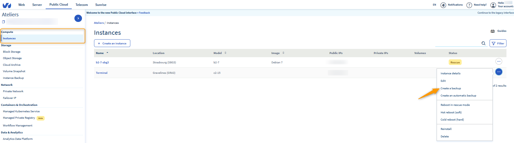
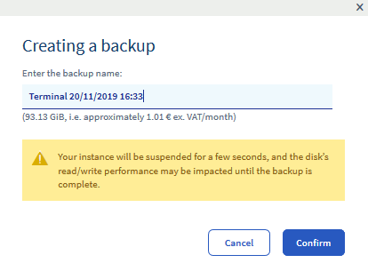
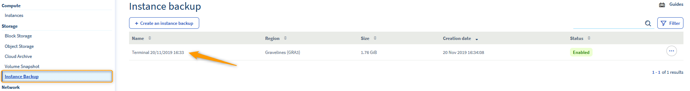
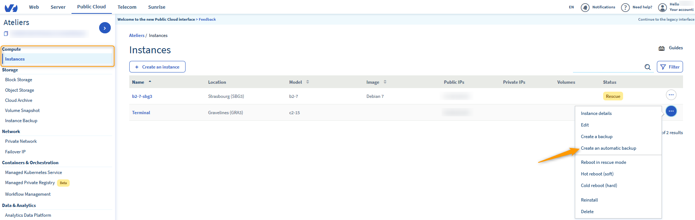
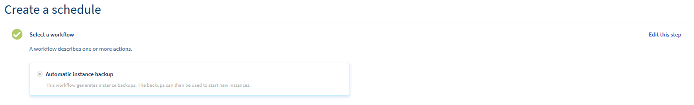
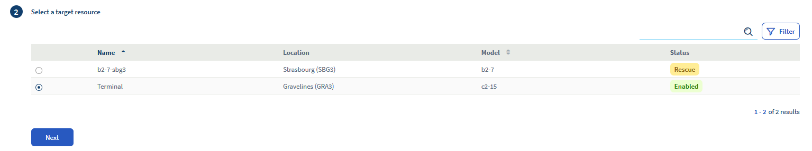
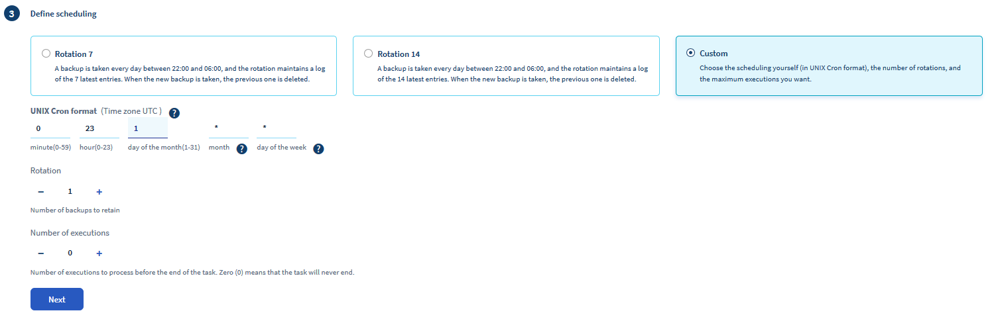
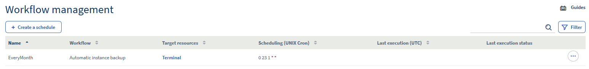

**Last updated 2nd December 2019**

Objective
---------

You can create a backup of your instance at any time via the [OVHcloud Control Panel](https://www.ovh.com/auth/?action=gotomanager&from=https://www.ovh.co.uk/&ovhSubsidiary=GB). You can then use this backup to restore your instance to an old configuration, or recreate it.

**Create a backup of a Public Cloud in just a few clicks.**

Requirements
------------

* an [OVHcloud Public Cloud instance](https://docs.ovh.com/gb/en/public-cloud/create_an_instance_in_your_ovh_customer_account/)
* access to the [OVHcloud Control Panel](https://www.ovh.com/auth/?action=gotomanager&from=https://www.ovh.co.uk/&ovhSubsidiary=GB)

Instructions
------------

### Create a backup of an instance.

Log in to the [OVHcloud Control Panel](https://www.ovh.com/auth/?action=gotomanager&from=https://www.ovh.co.uk/&ovhSubsidiary=GB), and select the Public Cloud tab from the `Instances` section.

Next, click on the `...` button to the right of the instance, then `Create a backup`.

Enter a name for the backup on the next page.

Once the backup has been created, it will be available in the `Instance Backup` section.

### Create an automated backup of an instance.

In the `Instances` section, select `Create an automatic backup` in the list of available actions you can perform on the instance.

You will need to enter the following information on the next page:

#### **The workflow.**

Currently, only one workflow exists. It will make a backup for the instance and its primary volume.

#### **The resource.**

Simply select the instance you want to back up.

#### **The schedule.**

Here, you need to define the frequency with which backups are made. There are two default options:

* daily backup with a log of 7 days maximum
* daily backup with a log of 14 days maximum

#### **The name.**

This is where you set a name for the backup task. 

Once you have created it, go to the `Workflow Management` section:

Your backups will be available in the `Instance Backup` section, and are billed in accordance with the solution you are using.

Go further
----------

Join our community of users on <https://community.ovh.com/en/>.

### Did you find this guide useful?

### These guides might also interest you…