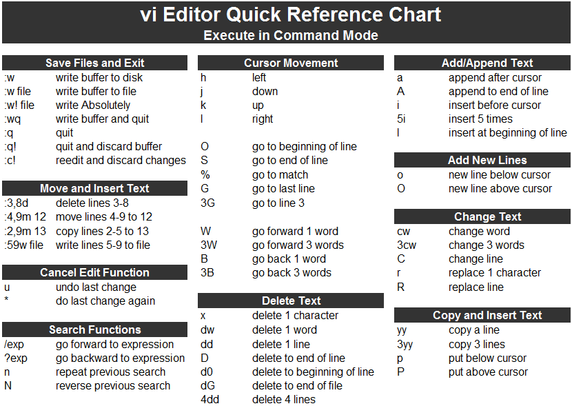

In this article the working modes of vi , the standard text editor in Unix and Linux systems, is explained.

A file can be edited using vi by typing vi at command line and passing the file name as an argument to it.

> vi filename

Working modes of vi
-------------------

### Command mode

When you open a file in vi, you are in command mode. You can change to insert mode and ex mode from command mode only.
 The keys you type in command mode will be interpreted as commands and not as part of the text.

### Insert mode

You can enter the insert mode from the command mode by pressing the **insert key**.
 To **move back **from insert mode to command mode, press the **esc key**

### ex mode

In ex mode tasks like saving the file and exiting from the vi editor (of course among others) are performed.
 To enter the ex mode from command mode, **:** (colon) is used.

To save all the changes:wQuit from the current document:qSave and quit vi‘:xTo save changes and quit from document:wqTo exit without saving changes:q!To save the changes in a file named myfile.txt:w myfile.txt

or

:wq myfile.txt

reedit and discard changes:c!

