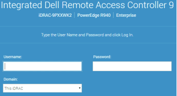
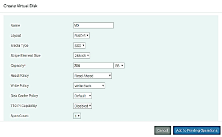
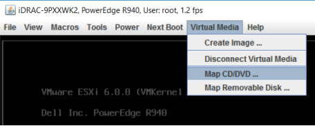
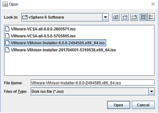
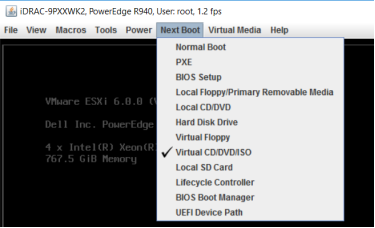

The integrated Dell Remote Access Controller (iDRAC) settings utility is a management platform for Dell EMC servers. The iDRAC utility enables you to configure your R940 and R740/R740xd servers.

### Set up the iDRAC IP address using the iDRAC settings utility

To set up your iDRAC IP address: 

1. Power on the PowerEdge Server.
2. Press F2 during Power-on Self-test (POST).
3. On the System Setup Main Menu page, select iDRAC Settings \> Network.
4. On the Network page, specify the following:

* Network Settings
* Common Settings
* IPv4 Settings or IPv6 Settings
* IPMI Settings
* VLAN Settings

1. Select Back \> Finish, and then click Yes.
2. After the system reboots, access the iDRAC login screen through any web browser using the configured iDRAC IP, as shown in [Figure 2](https://infohub.delltechnologies.com/document_parser/crosslinks/chapter/64d30b5297).

Figure 2. [iDRAC login screen]()

1. Enter your user credentials to log in. The default login is root/calvin.

### Configure memory in the BIOS

Use the BIOS Settings screen to view the system memory settings and enable or disable memory functions such as system memory testing and node interleaving. To complete the required memory configuration:

1. Select Configuration \> BIOS Settings \> Memory Settings.

1. Specify the Memory Operating Mode. The available options are:

* Optimizer Mode (the default)
* Mirror Mode
* Single-Rank Spare Mode
* Multi-Rank Spare Mode
* Fault Resilient Mode

### Create virtual disks using the web interface 

To create a virtual disk: 

1. In the iDRAC Web interface, select Configuration \> Storage Configuration.

1. In the Controller list box, select the controller for which you want to create a virtual disk.
2. In the Virtual Disk Configuration area: 
  1. Click Create Virtual Disk.
  2. Enter a name for the virtual disk.
  3. In the Layout list box, select the RAID level you want for the virtual disk.

Only the RAID levels that  the controller supports appear in the list. These RAID levels are based on the total number of physical disks available.

1. Specify the following:

* Media Type
* Stripe Size
* Read Policy
* Write Policy
* Disk Cache Policy

Only the values that the controller supports appear in the list boxes for these properties. 

1. In the Capacity field, enter the size of the virtual disk.

The maximum size is displayed and then updated as disks are selected. 

The Span Count field is displayed based on your selection. For example, if you selected RAID 10 and the controller supports uneven RAID 10, the span count value is not displayed. The controller sets the value automatically, as shown in [Figure 3](https://infohub.delltechnologies.com/document_parser/crosslinks/chapter/64d30b5297).

Figure 3. [Create Virtual Disk screen]()

1. In the Select Physical Disks area, specify the number of physical disks you require.
2. Click Add to Pending Operations.
3. Select Maintenance \> Job Queue to apply the change.

The settings are applied based on the Apply Operation Mode you selected.

For more information, see the iDrac Online Help, which you can access from the dashboard. 

Note: In our test environment, we choose to boot from internal storage. The option to boot ESXi servers from SAN is also available. For more information, see the VMware document [Booting ESXi from Fibre Channel SAN](https://docs.vmware.com/en/VMware-vSphere/6.5/com.vmware.vsphere.storage.doc/GUID-9004389B-E2C0-4BE5-811C-E4886E3B7450.html). 

### Enable hyperthreading

Hyperthreading technology enables SAP applications to make best use of compute resources and deliver better performance by allowing a single CPU to behave like two logical processors.

To enable hyperthreading: 

1. In the iDRAC web interface, select Configuration \> BIOS Settings \> Processor Settings \> Logical Processor, and then click Enabled.

1. Configure the power plan as follows: 
  1. In the BIOS:

i Select Configuration \> BIOS Settings \> System Profile Setting \> System Profile, and then select Performance Per Watt (DAPC) in the list box.

ii Select Configuration \> BIOS Settings \> Processor Settings \> Dell Controlled Turbo, and then click Enabled. 

1. In the OS:

Select Control Panel \> Power Plans Scheme, and then click High Performance Plan. 

### Install an operating system on a PowerEdge server 

Certain PowerEdge server models require the use of the Dell EMC-customized ESXi image for the easiest and most reliable deployment of a fully managed server. For more information, see [VMware vSphere ESXi 6.x on Dell EMC Power Edge Systems: Image Customization Information](http://www.dell.com/support/manuals/uk/en/ukbsdt1/vmware-esxi-6.x/esx6.xiimgcustom/introduction?guid=guid-3c867498-b577-4929-b7ee-fb4528e80fb2&lang=en-us).

To download the Dell EMC-customized ESXi ISO image:

1. Go to [Dell EMC Support](http://www.dell.com/support/) and click the Drivers icon.
2. On the Drivers & Downloads page, select your product from the list and then select the version of ESXi you have installed as your operating system.
3. Locate the Dell EMC customized ISO images under Enterprise Solutions, and then download the latest image.
4. From the iDRAC web interface, open the Virtual Console.
5. Click Virtual Media and select Connect Virtual Media.
6. When the function is enabled, click Virtual Media, and then select the pass-through device you want. We chose Map CD/DVD to use an ISO image file, as shown in [Figure 4](https://infohub.delltechnologies.com/document_parser/crosslinks/chapter/64d30b5297).

Figure 4. [Selecting the pass-through device]()

1. Browse to the image file you want to pass through, as shown in [Figure 5](https://infohub.delltechnologies.com/document_parser/crosslinks/chapter/64d30b5297).

Figure 5. [Selecting the installation media]()

1. Click Open, and then click Map Device to complete the source selection.

The selected device is now visible in the operating system (OS) and can be used as a boot source (if it is supported), as shown in [Figure 6](https://infohub.delltechnologies.com/document_parser/crosslinks/chapter/64d30b5297).

Figure 6. [Next Boot options]()

1. To boot from the selected device, click Next Boot and select Virtual CD/DVD/ISO.

After a restart, the server starts from this source automatically.

1. Follow the OS installation wizard to complete the installation.