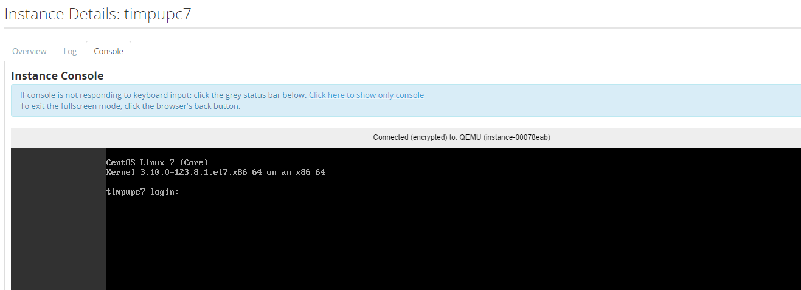

Virtual machine consoles can be accessed through both the command line tools and the dashboard. In addition, OpenStack maintains a list of actions performed on a host which can be used to diagnose problems.

By default, the administrators of a project can access the console of a virtual machine. If there is need to expand these rights further, the permissions can be adjusted for shared projects using the account portal as described in [Project Roles](https://clouddocs.web.cern.ch/projects/project_roles.html).

Using Horizon with a browser
----------------------------

Access to the graphical console can be made via Horizon. Select the node on the initial page you wish to connect to and then the console tab. A screen as follows should appear

The text console can be accessed using the Log tab. This shows the text output including history.

Using VNC or RDP via a URL
--------------------------

The URL for the console can be retrieved via the unified CLI.

    $ openstack console url show my-vm-name
    +-------+-----------------------------------------------------------------------------------------+
    | Field | Value                                                                                   |
    +-------+-----------------------------------------------------------------------------------------+
    | type  | novnc                                                                                   |
    | url   | https://openstack.cern.ch:6080/vnc_auto.html?token=ea8f9a2c-8396-442b-86f7-675e2cab026b |
    +-------+-----------------------------------------------------------------------------------------+

A browser can then be pointed directly at the URL to retrieve the console. This can be used if you need to embed the console access into a web interface.

Booting into single user mode / Boot with bash as PID=1 (replacing init)
------------------------------------------------------------------------

In certain situations it can be necessary to intercept the boot process and get a shell prompt on the VM to execute administrative tasks. An example would be to correct a problem in fstab which prevents the normal boot process to succeed.

To interrupt the normal boot process on a CC7 instance:

1. Get console access as described above
2. Reset the virtual machine (e.g. by clicking on the 'Send CtrlAltDel' button in the top right corner of the console)
3. When the kernel list appears, use the up/down arrows to select the kernel you'd like to boot into and press 'e' (to edit the kernel command line)
4. Scroll down to find the kernel command line (it contains the kernel name and 'ro') and append 'rd.break enforcing=0'
5. Press Ctrl-x to boot the system with these parameters
6. Once you have a root shell, remount the file system with 'mount -oremount,rw /sysroot'
7. Make the file system your root file system with 'chroot /sysroot'

You can now do the tasks for which you booted into single user mode. For instance, run 'passwd' to change the password and 'touch /.autorelabel' to relabel files after the password change.

Once done:

1. Exit the chroot environment with 'exit'
2. Remount the filesystem as readonly with 'mount -oremount,ro /sysroot'
3. Reboot the system with 'exit'

Note that:

* 'init=/bin/bash' will replace init with bash and give you a shell with a command prompt
* '1' will boot into single user mode (and eventually ask you for the root password)

Getting out of kernel panic after reboot
----------------------------------------

There have been cases where VMs get rebooted and end up in kernel panic. In such cases logs like the following appear in the console:

The most common reason for this is an incomplete kernel update (e.g. the yum process to install a new kernel failed to create a proper initrd initial ram-disk) A solution would be to rollback to a previous kernel following these steps:

1. Get console access as described above.
2. Hard reboot the VM. At this point the console should show that the VM disconnected.
3. Reload the page in your browser to reconnect, and enter the GRUB menu
4. be quick or you might miss it! You may need multiple retries...
5. Using the arrows, select the previous kernel, and boot into it.
6. After this, the VM should boot successfully into the kernel selected in the previous step.
7. Once you login, it is strongly advised to remove and reinstall the kernel that caused problems.

Note that:

* There is a timer in the kernel selection menu, so your actions have to be quick enough.
* Once you hit either the up or down arrow the timer will stop.
* The VM might not respond to the 'Send CtrlAltDel' button, this is why it is suggested to hard reboot instead.

Console log using command line tools
------------------------------------

Unlike the dashboard access, the command line tools can access the console history in text. This is particularly useful for Linux virtual machines where crash dump output can be checked.

    $ openstack console log show my-vm-name

**Note:** The console log is reset when a VM is hard rebooted.

Event log using command line tools
----------------------------------

Each VM has an event log associated with it. This gives the times and actions performed on the VM. A message may also be provided to give further information.

The event log for the VM can be obtained as follows

    $ openstack server event list my-vm-name
    +------------------------------------------+--------------------------------------+--------+----------------------------+
    | Request ID                               | Server ID                            | Action | Start Time                 |
    +------------------------------------------+--------------------------------------+--------+----------------------------+
    | req-7bf4a18c-8cc3-4741-9924-e7cbh230c5e2 | 5f8937b9-adb2-4992-bfd8-1456908d6816 | start  | 2018-06-11T12:29:11.000000 |
    | req-13f03ed4-f9cd-4e00-a2b4-602l20fba358 | 5f8937b9-adb2-4992-bfd8-1456908d6816 | stop   | 2018-06-11T11:29:43.000000 |
    | req-870aba30-696a-4a1f-b73b-9m7e684b2e57 | 5f8937b9-adb2-4992-bfd8-1456908d6816 | create | 2016-09-30T12:57:30.000000 |
    +------------------------------------------+--------------------------------------+--------+----------------------------+

This can be useful to identify when actions were performed on the VM.

Further details can be obtained using `openstack server event show` for the specific event.

    $ openstack server event show my-vm-name req-7bf4a18c-8cc3-4741-9924-e7cbh230c5e2
    +---------------+---------------------------------------------------------------------------------------------------------------------------------------------------------------------------------+
    | Field         | Value                                                                                                                                                                           |
    +---------------+---------------------------------------------------------------------------------------------------------------------------------------------------------------------------------+
    | action        | start                                                                                                                                                                           |
    | events        | [{u'finish_time': u'2018-06-11T12:29:18.000000', u'start_time': u'2018-06-11T12:29:12.000000', u'traceback': None, u'event': u'compute_start_instance', u'result': u'Success'}] |
    | instance_uuid | 5f8837b9-abb2-4992-bfd8-140220nd6816                                                                                                                                            |
    | message       | None                                                                                                                                                                            |
    | project_id    | 29d90dc7-2558-41h9-a947-836c0d1df2fb                                                                                                                                            |
    | request_id    | req-7bf4a18c-8cc3-4731-9924-e7cb2230c5e2                                                                                                                                        |
    | start_time    | 2020-06-11T12:29:11.000000                                                                                                                                                      |
    | user_id       | my-user-name                                                                                                                                                                    |
    +---------------+---------------------------------------------------------------------------------------------------------------------------------------------------------------------------------+