**Last updated 14th November 2019**

Objective
---------

It is possible to create additional disks for your Public Cloud instances. This can be useful in cases where:

* You want to increase your storage capacity without changing the instance model.
* You want to have a highly available, high-performance storage.
* You want to move your storage as well as your data to another instance.

**This guide explains how to create an additional disk and then configure it on one of your instances.**

Requirements
------------

* access to the [OVHcloud Control Panel](https://www.ovh.com/auth/?action=gotomanager&from=https://www.ovh.co.uk/&ovhSubsidiary=GB).
* a [Public Cloud Instance](https://www.ovh.co.uk/public-cloud/instances/) in your OVH account.
* administrative (root) access to your instance via SSH.

Instructions
------------

Firstly, log in to the [OVHcloud Control Panel](https://www.ovh.com/auth/?action=gotomanager&from=https://www.ovh.co.uk/&ovhSubsidiary=GB) and click the `Public Cloud` menu. Then click on the `Project` you want to create the instance.

Now click the `Actions` button and then select `Create a volume`.

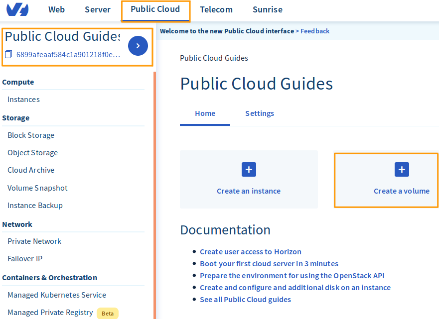

Now configure you options for disk type, disk size, and location. When you’ve finished, click the `Add` button.

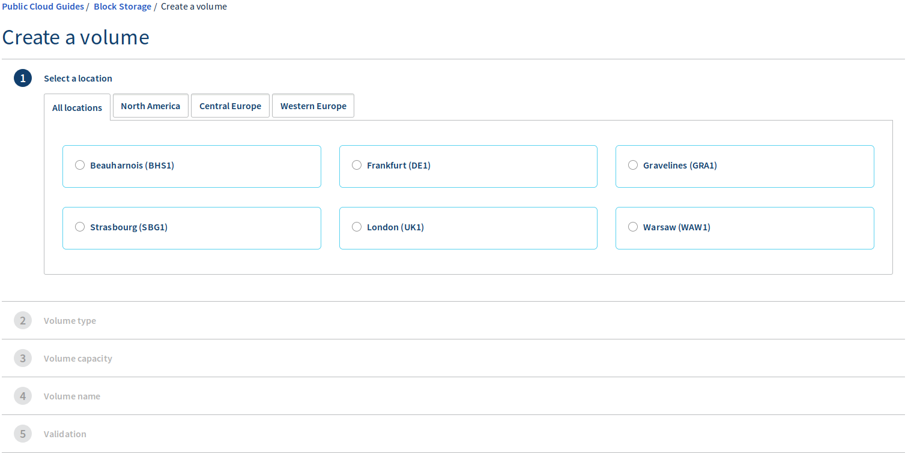

The new disk will now be displayed in your control panel.

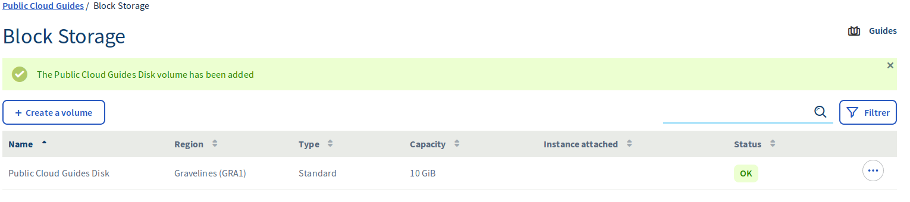

To attach the disk to an instance, click on the 3 dots on the right and then select `Attach to instance`

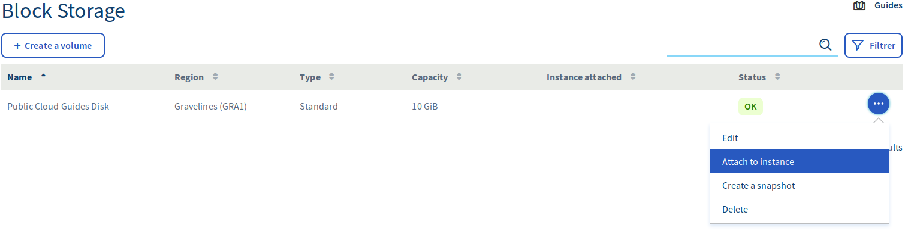

Now choose the instance and click in `Confirm` button to attach the disk.

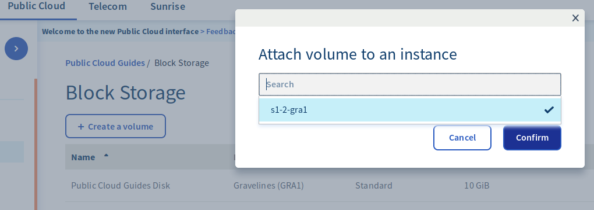

The process of attaching the disk to your instance will now start and it may take several minutes to complete.

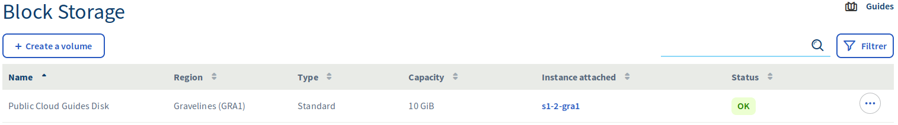

You must ensure that you don’t navigate away from the Infrastructure tab while the disk is being attached. This could disrupt the process. 

### Using Linux

First, establish an SSH connection to your instance and then use the command below to list the instance’s disks.

    # admin@serveur-1:~$ lsblk

    NAME MAJ:MIN RM SIZE RO TYPE MOUNTPOINT
    vda 254:0 0 10G 0 disk
    └─vda1 254:1 0 10G 0 part /
    vdb 254:16 0 10G 0 disk

VDA usually refers to your instance’s default hard disk. VDB refers to the additional disk. 

Next, create a partition on the additional disk using the command below.

    # admin@serveur-1:~$ sudo fdisk /dev/vdb

    Welcome to fdisk (util-linux 2.25.2).
    Changes will remain in memory only, until you decide to write them.
    Be careful before using the write command.

    Device does not contain a recognized partition table.
    Created a new DOS disklabel with disk identifier 0x95c4adcc.

    Command (m for help): n

    Partition type
    p primary (0 primary, 0 extended, 4 free)
    e extended (container for logical partitions)
    Select (default p):
    Using default response p.
    Partition number (1-4, default 1):
    First sector (2048-20971519, default 2048):
    Last sector, +sectors or +size{K,M,G,T,P} (2048-20971519, default 20971519):

    Created a new partition 1 of type 'Linux' and of size 10 GiB.

    Command (m for help): w

    The partition table has been altered.
    Calling ioctl() to re-read partition table.
    Syncing disks.

Next, format the partition using the command below.

    # admin@serveur-1:~$ sudo mkfs.ext4 /dev/vdb1
    mke2fs 1.42.12 (29-Aug-2014)
    Creating filesystem with 2621184 4k blocks and 655360 inodes
    Filesystem UUID: 781be788-c4be-462b-b946-88429a43c0cf
    Superblock backups stored on blocks:
    32768, 98304, 163840, 229376, 294912, 819200, 884736, 1605632

    Allocating group tables: done
    Writing inode tables: done
    Creating journal (32768 blocks): done
    Writing superblocks and filesystem accounting information: done

Next, mount the partition with this command:

    admin@serveur-1:~$ sudo mkdir /mnt/disk
    admin@serveur-1:~$ sudo mount /dev/vdb1 /mnt/disk/

And finally, check the mount point using this command:

    admin@serveur-1:~$ df -h

    Filesystem Size Used Avail Use% Mounted on
    /dev/vda1 9.8G 840M 8.6G 9% /
    udev 10M 0 10M 0% /dev
    tmpfs 393M 5.2M 388M 2% /run
    tmpfs 982M 0 982M 0% /dev/shm
    tmpfs 5.0M 0 5.0M 0% /run/lock
    tmpfs 982M 0 982M 0% /sys/fs/cgroup
    /dev/vdb1 9.8G 23M 9.2G 1% /mnt/disk

If you want to create a persistent mount point, you will need to change the /etc/fstab. First, use the command below to retrieve the block ID.

    admin@serveur-1:~$ sudo blkid

    /dev/vda1: UUID="51ba13e7-398b-45f3-b5f3-fdfbe556f62c" TYPE="ext4" PARTUUID="000132ff-01"
    /dev/vdb1: UUID="2e4a9012-bf0e-41ef-bf9a-fbf350803ac5" TYPE="ext4" PARTUUID="95c4adcc-01"

And now you can use the block ID to change the /etc/fstab file.

    admin@serveur-1:~$ vim /etc/fstab

    /etc/fstab: static file system information.

    # Use 'blkid' to print the universally unique identifier for a
    # device; this may be used with UUID= as a more robust way to name devices
    # that works even if disks are added and removed. See fstab(5).
    #
    # <file system> <mount point> <type> <options> <dump> <pass>
    UUID=51ba13e7-398b-45f3-b5f3-fdfbe556f62c / ext4 defaults 0 0
    UUID=2e4a9012-bf0e-41ef-bf9a-fbf350803ac5 /mnt/disk ext4 nofail 0 0

### Using Windows

First, right-click on the `Start Menu` button and then click `Disk Management`.

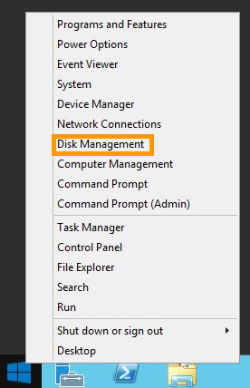

When the disk management tool opens you’ll see your new disk as an unknown volume with unallocated space as shown below.

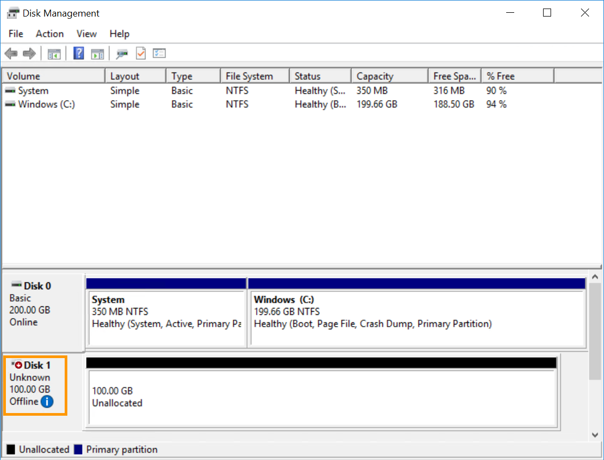

#### Initialising the disk using Disk Management

If the disk is offline this is likely due to a policy in place on the instance. To fix this, right-click on the disk and select `Online`.

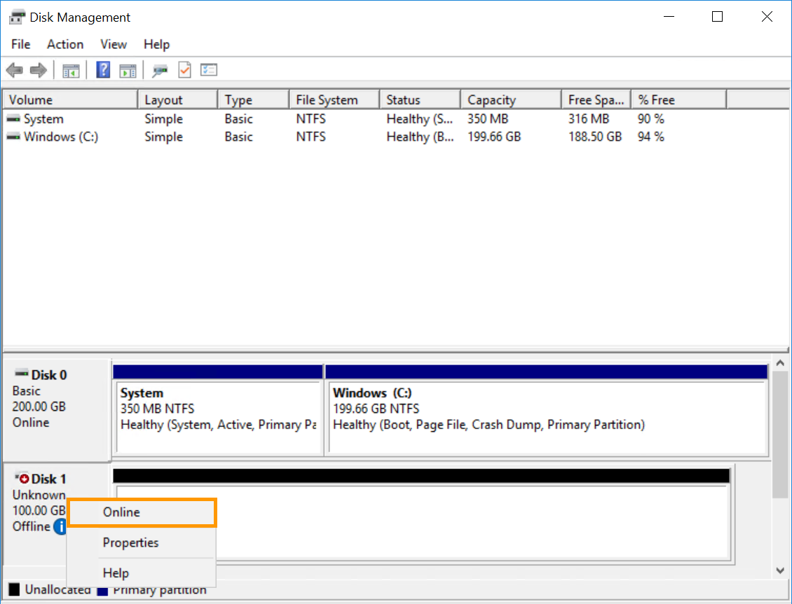

Then right-click it again and this time select `Initialise Disk`.

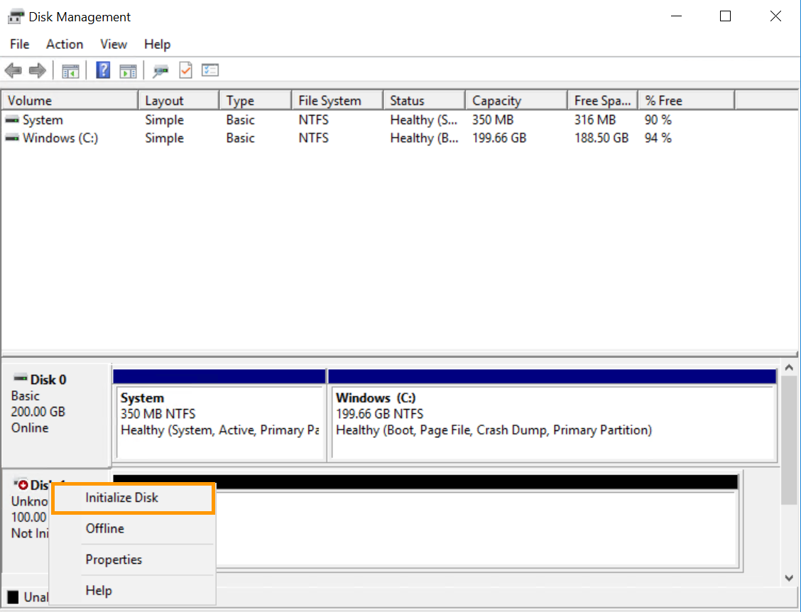

Next, select `MBR` and click `OK`.

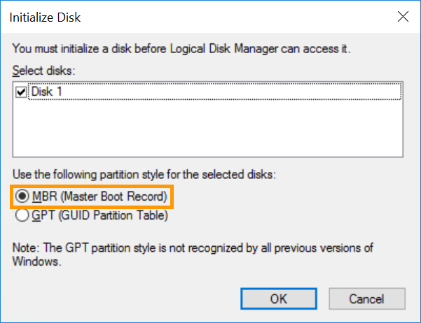

#### Initialising the disk using DISKPART

First, right-click on the `Start Menu` button and then click `Run`

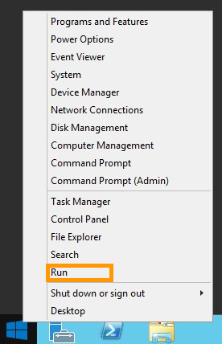

Next, type `cmd` in the Run prompt and then click `OK`

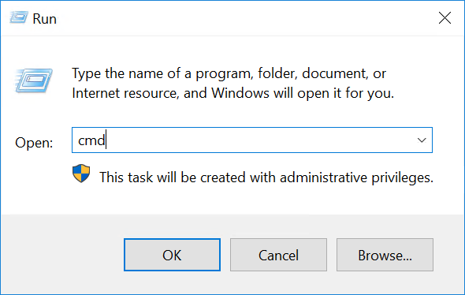

At the command prompt, type the following command to open the DISKPART utility.

    C:\> diskpart

Next, change the disk policy with the following series of commands.

    DISKPART> san

    SAN Policy : Offline Shared

    DISKPART> san policy = OnlineAll

    DiskPart successfully changed the SAN policy for the current operating system .

    - Implementation of the strategy on the extra disk:
    [Code] DISKPART> list disk

    Disk ### Status Size Free Dyn Gpt
    -------- ------------- ------- ------- --- ---
    Disk 0 Online 200 GB 0 B
    * Disk 1 Offline 10 GB 1024 KB

    DISKPART> select disk 1

    Disk 1 is now the selected disk.

    DISKPART> attributes disk clear readonly

    Disk attributes cleared successfully.

    DISKPART> attributes disk

    Current Read-only State : No
    Read-only : No
    Boot Disk : No
    Pagefile Disk : No
    Hibernation File Disk : No
    Crashdump Disk : No
    Clustered Disk : No

    DISKPART> online disk

    DiskPart successfully onlined the selected disk.

#### Format the disk

Open up the Disk Management utility again, right-click the volume, then click `New Simple Volume...`

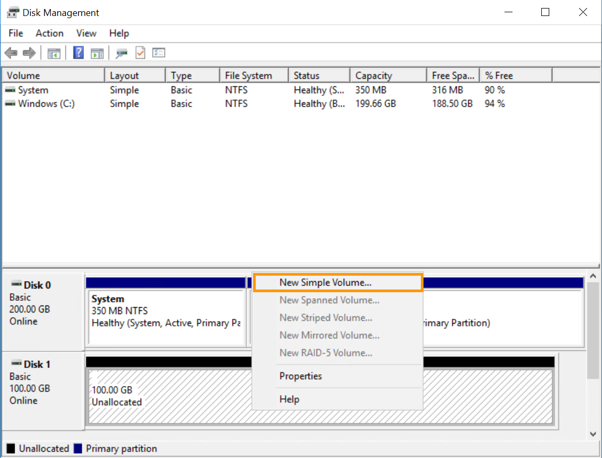

Now click `Next`.

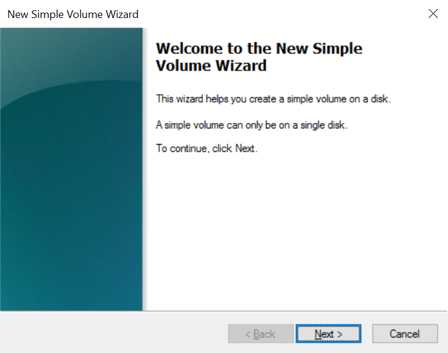

Now set the desired disk size. You would usually want this to be 100% of the space. When you’ve done this, click `Next`.

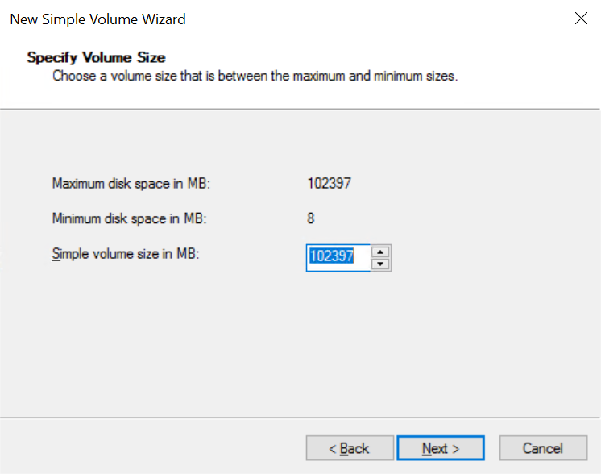

Select a letter from the dropdown list to identify the drive, then click `Next`.

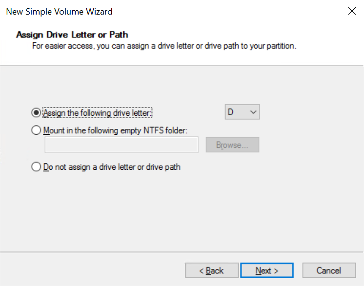

Select the options you want for the disk then click `Next` to perform the format operation.

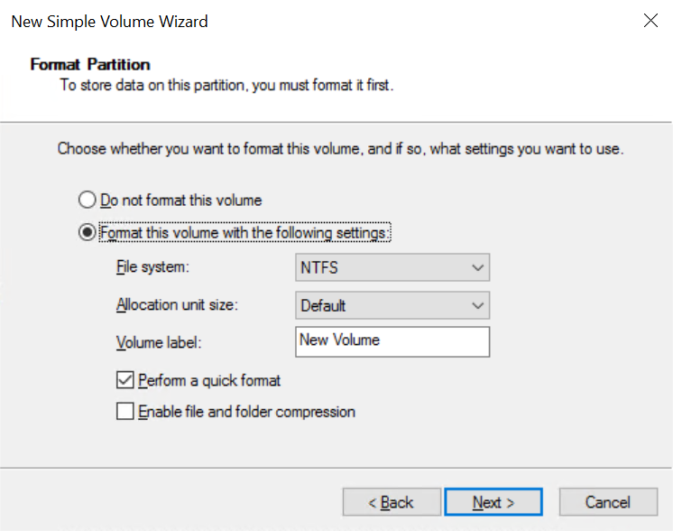

Finally, click `Finish` to finalise the operation.

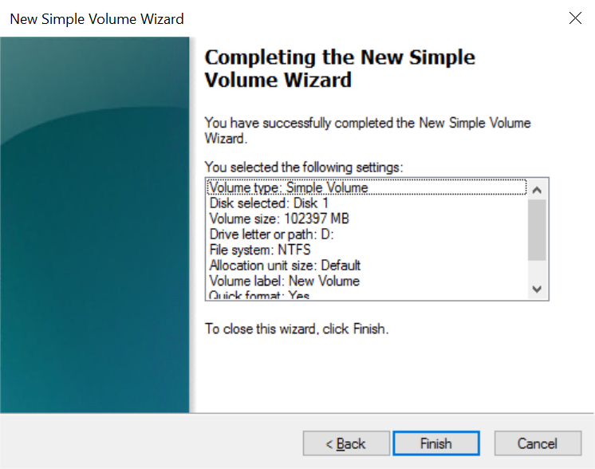

Once the disk is formatted, you can simply access it from File Explorer.

Go further
----------

Join our community of users on <https://community.ovh.com/en/>.

### Did you find this guide useful?

### These guides might also interest you…