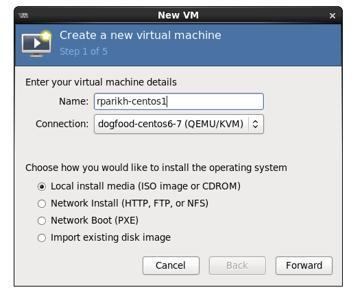
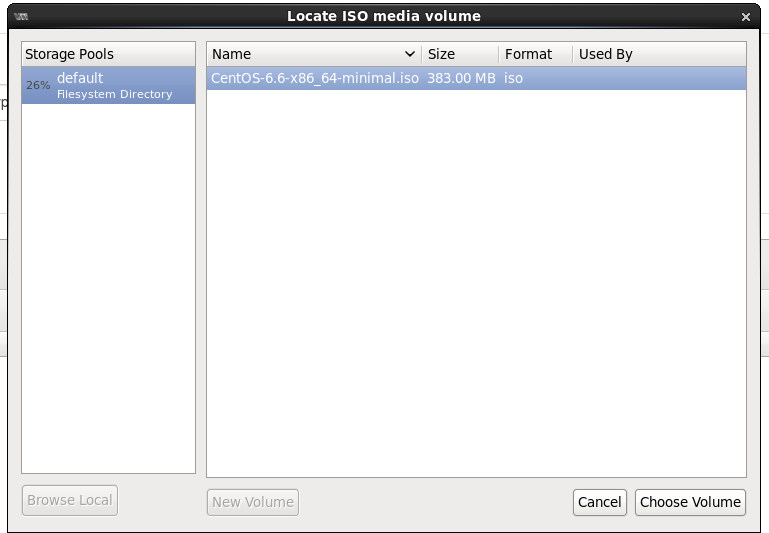
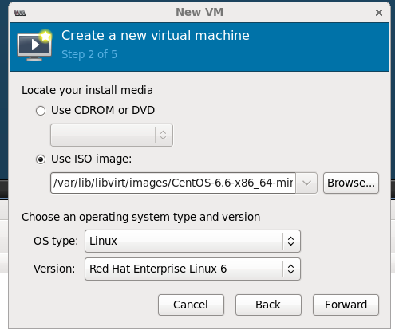
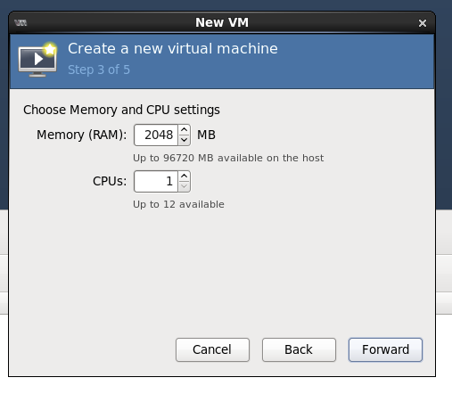
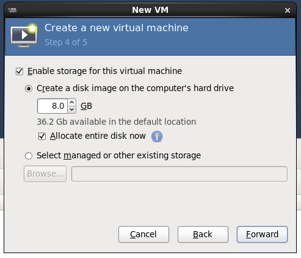
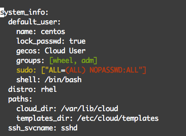

Creating CentOS VM Image from Scratch
=====================================

There are multiple ways to create a CentOS image compatible with OpenStack Glance image repository. You can:
------------------------------------------------------------------------------------------------------------

* Download a pre-built image from RedHat RDO: [https://openstack.redhat.com/Image\_resources](https://openstack.redhat.com/Image_resources) (default user is 'centos' on these images)
* Create the image from Scratch with or without cloud-init

**

The benefit of cloud-init is that it allows customization of virtual machines

**

Platform9 recommends that you create your virtual machine images from scratch, as this gives you full flexibility to customize the image per your specific requirements, and ensure that it's configured appropriately, to reduce future errors.

This tutorial describes how you can create a CentOS guest image from scratch and also optionally install cloud-init.

### [Step 1 - Download ISO](https://docs.platform9.com/v4.5/openstack/tutorials-centos-vm-image#step-1---download-iso)

ISO images are available form CentOS and its mirrors <http://wiki.centos.org/Download>

Assuming you have a CentOS/Ubuntu system with libvirt and all the dependencies installed (see here for details: <http://virt-manager.org/>), go to /var/lib/libvirt/images and copy the downloaded iso.

### [Step 2 - Create a Virtual Machine](https://docs.platform9.com/v4.5/openstack/tutorials-centos-vm-image#step-2---create-a-virtual-machine)

Fire up your virt-manager and create a new virtual machine.

Pick the ISO you just downloaded.

Use OS type = Linux, Version= Red Hat Enterprise Linux 6

Pick the amount of CPU, Memory and Storage.

### [Step 3 - Install & Configure OS](https://docs.platform9.com/v4.5/openstack/tutorials-centos-vm-image#step-3---install--configure-os)

Pick the options you like, I generally install minimal with just SSH. Depending upon how you want your consumers to logon to the virtual machine, you can configure the users, password and SSH configuration (no-password vs password logon). I suggest putting a specific admin user with a password/ssh key that can be used by your system administrators to logon. Platform9 (and OpenStack), will allow the owner of the virtual machine to pass a SSH key at boot time, but this specific admin user can be used exclusively by a system administrator as a powerful debugging tool.

### [Step 4 - (Optional) Install cloud-init](https://docs.platform9.com/v4.5/openstack/tutorials-centos-vm-image#step-4---optional-install-cloud-init)

Once the OS is installed, reboot and log in; by default OS comes up with DHCP configured. Install epel repository to fetch cloud-init and then install cloud-init.

### [Step 6 - Power Off the Virtual Machine](https://docs.platform9.com/v4.5/openstack/tutorials-centos-vm-image#step-6---power-off-the-virtual-machine)

Now go ahead and power-off the virtual machine. You are one step away from the setup.

### [Step 7 - Call virt-sysprep](https://docs.platform9.com/v4.5/openstack/tutorials-centos-vm-image#step-7---call-virt-sysprep)

Congratulations! Your image is ready, copy it to the "ImageLibrary" in Platform9 or any other glance installation and it is ready to go.