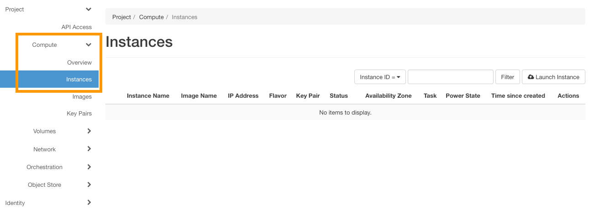
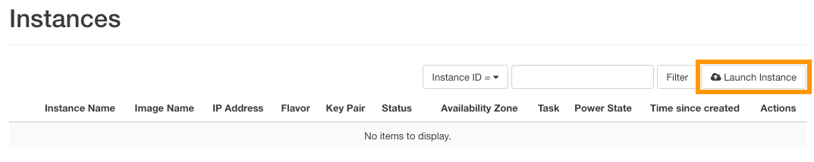
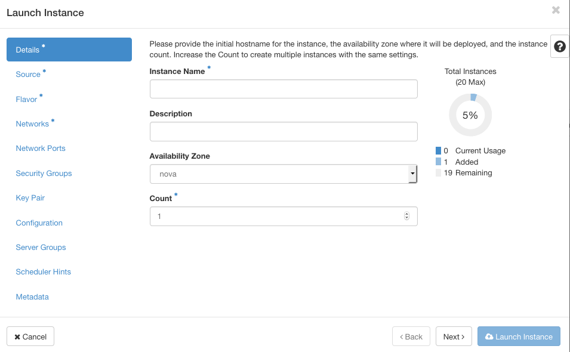

**Last updated 27th March 2018**

Objective
---------

You can create multiple Instances directly in the Horizon interface, and also configure a security group to apply to your Instances.

**Find out how to create an Instance via the Horizon interface.**

Requirements
------------

* a [Public Cloud](https://www.ovh.co.uk/public-cloud/instances/) project, created via your OVH account
* [access to the Horizon interface](https://docs.ovh.com/gb/en/public-cloud/configure_user_access_to_horizon/)

Instructions
------------

To start creating an Instance, log in to the Horizon interface. If you are unsure about how to do this, please refer to our guide to [Accessing the Horizon interface](https://docs.ovh.com/gb/en/public-cloud/configure_user_access_to_horizon/).

Next, click `Compute` in the left-hand menu, then `Instances`.

The page that opens can be used to view the Instances that are currently launched. To launch a new one, click the `Launch Instance` button.

You will then need to fill in the information requested. If you need to do so, you can use the table below to fill in the fields. Please note that this grid is not exhaustive. 

InformationDetailsAvailability zoneLeave "nova" (default choice).Instance nameSpecify the name you want for the Instance that will be launched.TemplateSelect the type of Instance to launch.CountSpecify the number of Instances to launch.Instance launch sourceSelect the source for launching an instance (e.g. "Launch from an image" or "Launch from a snapshot").Image nameSelect the Instance image (only when launching from an image).Instance snapshotChoose an Instance snapshot (only for launching from a snapshot).Key pairSelect an SSH key to use for connecting to the Instance later (you can create a key by clicking the "+" sign).Security groupsSpecify the security group for the Instance (authorisation for opening ports).Selected networksSelect the network(s) for the Instance you want to create, from the list of available networks.Custom script sourceSpecify the source between a "direct entry" or a "file".Script dataEnter the script code in the input field (16KB maximum).Script fileClick ‘browse’ to select the post-installation script.Disk partitioningChoose between "automatic" or "manual".Configuration diskConfigure OpenStack to write metadata on to a specific configuration disk that will be attached to the Instance when it is launched.

Once you are ready to launch the Instances, click the `Launch Instance` button.

Go further
----------

Join our community of users on <https://community.ovh.com/en/>.

### Did you find this guide useful?

### These guides might also interest you…