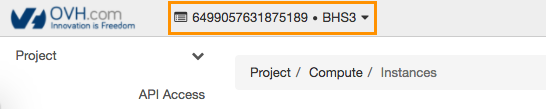
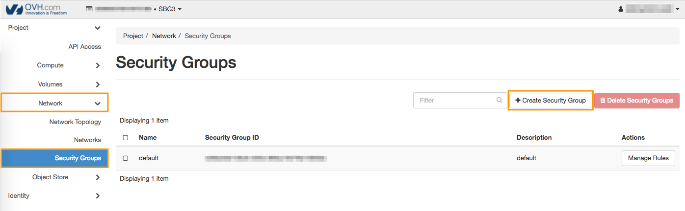
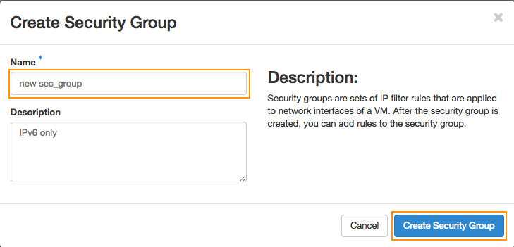

**Last updated 07th March 2018**

Objective
---------

Security groups are groups of IP address and port filtering rules. They apply to all instances associated with a project, and define the network access to the instance. All group rules are specific to a project. Its members can edit the default rules for their group, and add new rule groups.

All projects have a default security group for each region. When an instance is created, the default security group for its region is applied automatically. At OVH, the default security group settings authorise incoming and outgoing traffic for instances.

**This guide explains how to create and delete security groups via the Horizon interface.**

Requirements
------------

* You must have access to [your Horizon interface](https://docs.ovh.com/gb/en/public-cloud/configure_user_access_to_horizon/).

Instructions
------------

First, log in to the [Horizon](https://horizon.cloud.ovh.net/) interface. In the menu at the top of the screen, choose the region in which you would like to create a security group:

The new security group will be created in the region you have selected. If you would like to use the same security group in several regions, you will need to recreate it for each individual region.

Click on the `Network` button, then `Security Groups`:

To create a security group, click `+ Create Security Group`, then name the group and add a description (optional):

To confirm, click `Create Security Group`.

To delete a security group, tick the box next to it, and click `Delete Security Groups`.

Go further
----------

Join our community of users on <https://community.ovh.com/en/>.

### Did you find this guide useful?

### These guides might also interest you…