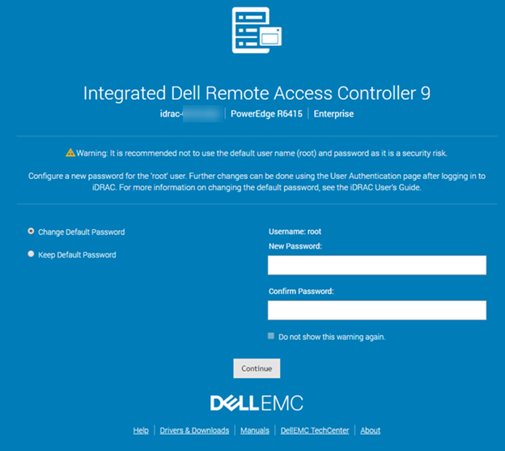
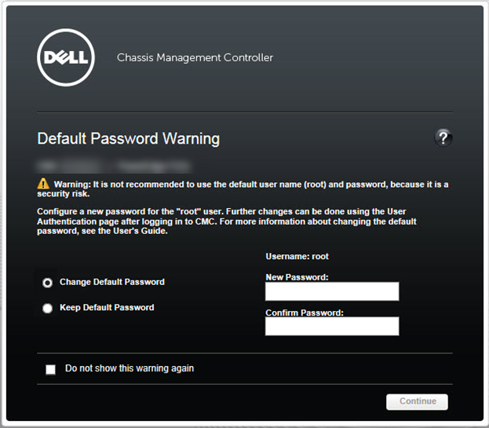

### Article Content

#### Symptoms

Systems with an integrated Dell Remote Access Control (iDRAC) have a default user name and password, but you can also configure them with a **secure password.**

#### **Default iDRAC login**

 In the iDRAC's default configuration, the login credentials are as follows: 

> * Username: root
> * Password: calvin

#### 

**Secure Password**

 For **iDRAC9**, a new feature called **secure password** is available during the purchase configuration. 

* If you have opted for secure default access to iDRAC, **the iDRAC secure password is available on the back of the system information tag (Service Tag) under "iDRAC Default Password**."
* If you have not opted for secure default access to iDRAC, then the default password should be blank. In this case, the default username and password (root/calvin) apply.

**Fig. 1**: Sticker with secure default password

1. Information tag (Top view)
2. Information tag (Bottom view)
3. OpenManage Mobile (OMM) label
4. iDRAC MAC address and iDRAC secure password label

You can reset the password through the iDRAC settings by pressing **F2** at startup.
Also, you can reset the password to its factory default with the following racadm command: 

> racadm racresetcfg -all

To reset the password to the legacy password, use the following racadm command: 

> racadm racresetcfg -rc

**NOTE:** More tutorials about the iDRAC are available in the Dell Knowledge Base article [How-To Dell Server : Support Articles for the iDRAC and the CMC](https://www.dell.com/support/kbdoc/000126757/how-to-dell-server-support-articles-for-the-idrac-and-the-cmc). 

### What is the "Default Password Warning" on iDRAC? (SEC0701)

 The default iDRAC username and password are widely known, and any user can access the server and make changes using the default credentials. The Default Password Warning feature in iDRAC warns you if the default login credentials are still in place. 

Whenever a user with Configure User privileges logs in to iDRAC or SSH/Telnet or executes racadm commands remotely using the default login credentials, the system displays a warning message **(SEC0701)**. Because GUI and SSH/Telnet users log in once per session, they see a single warning message for each session. Because remote racadm users log in for every command, they see a warning message for every command. 

An iDRAC with default login credentials is **even less secure if the system is Internet-accessible **or part of a large network with different trust boundaries. If any of the following items is configured, the possibility exists that iDRAC could become accessible on the Internet. 

Whenever a user with **Configure User **privileges logs in to **iDRAC via Web GUI **using the default login credentials, the **Default Password Warning Message **displays. From this page, the user can either change the password for a root user, or they can change nothing and continue logging in to iDRAC. The option to disable the **Default Password Warning** **Message** appears on this page if the user does not change the password. 

**iDRAC9:**

**iDRAC8:**

**Figure 2: **Default Password Warning 

The Default Password Warning can be enabled or disabled from** **the **iDRAC Overview** -\>** iDRAC Settings** -\> **User Authentication** -\> **Local Users** page, under the section titled "**Default Password Warning**." 

### I cannot remember the iDRAC Password

 If you have lost the iDRAC password, you must reset the iDRAC to its default setting. This process is explained in the Dell Knowledge Base article [How to reset the internal Dell Remote Access Controller (iDRAC) on a PowerEdge server?](https://www.dell.com/support/kbdoc/000126703/how-to-reset-the-internal-dell-remote-access-controller-idrac-on-a-poweredge-server) . 

#### Cause

#### Resolution

**Need more help?** Find additional **[PowerEdge and PowerVault](http://www.dell.com/EnterpriseKB) **articles
 Watch [**Part Replacement Videos**](http://qrl.dell.com/Product/Categories) for Enterprise products   

Create an online support **[Request](http://www.dell.com/support/incidents-online/case)**

### Article Properties

#### Affected Product

Servers, PowerEdge, Remote Enterprise Systems Management

##### Last Published Date

 31 Mar 2021 

###### Version

6

###### Article Type

Solution

#### Rate This Article