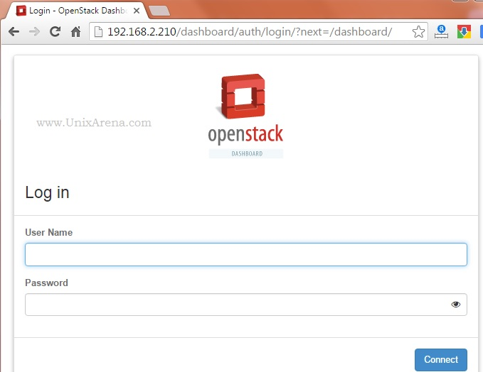

This article will help you to setup Openstack private cloud on Redhat Enterprise Linux. In this method , I will demonstrate that how to setup openstack environment using packstack. There are many companies are evaluating openstack on their test environments and some people are trying make a proof of concept. Openstack is not just a small piece of software to evaluate in one day. It’s a solid solution which integrates multiple components to offer the private cloud. Like [devstack ](https://www.unixarena.com/2015/08/how-to-deploy-openstack-on-ubuntu.html), Redhat has sponsored project called RDO who develops and support series of openstack deployment scripts which named as “Packstack”. Packstack uses Puppet client to install and configure the openstack packages to simply the deployment. ***Packstack method should not be used for production environment. ***

Since Redhat bought Ansible tower, I am doubting about the packstack’s future. Redhat has already started the project called TripleO Quickstack for openstack deployment using Ansible in the back-end.

#### System Requirements :

* Redhat Enterprise Linux 7.x
* CPU – VT Enabled Processor
* Memory – 6 GB
* Disk Space – 30GB Free
* Internet Connectivity to install packages from Repositories.

1.Login to REHL 7.x server (RHEL 7.2) and disable SELINUX.

    [root@rhelopenpack mariadb]# getenforce
    Enforcing
    [root@rhelopenpack mariadb]#
    [root@rhelopenpack mariadb]# setenforce 0
    [root@rhelopenpack mariadb]#
    [root@rhelopenpack mariadb]# grep  SELINUX /etc/selinux/config
    SELINUX=disabled

If you didn’t disable SELINUX, you might error like below while running “packstack –allinone” (During MariaDB/MYSQL setup).
“InnoDB: Error: unable to create temporary file; errno: 13” .
 At the same double check the “/tmp” permission as well.

    [root@rhelopenpack mariadb]# ls -ld /tmp
    drwxrwxrwt. 2 root root 40 May 30 07:02 /tmp
    [root@rhelopenpack mariadb]#

2\. Here is my system configuration.

    ##############################REDHAT VERSION###################################
    [root@rhelopenpack ~]# cat /etc/redhat-release
    Red Hat Enterprise Linux Server release 7.2 (Maipo)
    [root@rhelopenpack ~]# uname -a
    Linux rhelopenpack 3.10.0-327.el7.x86_64 #1 SMP Thu Oct 29 17:29:29 EDT 2015 x86_64 x86_64 x86_64 GNU/Linux
    [root@rhelopenpack ~]#

    #########################MEMORY & CPU################
    [root@rhelopenpack ~]# free -g
                  total        used        free      shared  buff/cache   available
    Mem:              7           0           6           0           1           7
    Swap:             3           0           3
    [root@rhelopenpack ~]# lscpu
    Architecture:          x86_64
    CPU op-mode(s):        32-bit, 64-bit
    Byte Order:            Little Endian
    CPU(s):                1
    On-line CPU(s) list:   0
    Thread(s) per core:    1
    Core(s) per socket:    1
    Socket(s):             1
    NUMA node(s):          1
    Vendor ID:             GenuineIntel
    CPU family:            6
    Model:                 58
    Model name:            Intel(R) Pentium(R) CPU G2020 @ 2.90GHz
    Stepping:              9
    CPU MHz:               2893.449
    BogoMIPS:              5786.89
    Hypervisor vendor:     VMware
    Virtualization type:   full
    L1d cache:             32K
    L1i cache:             32K
    L2 cache:              256K
    L3 cache:              3072K
    NUMA node0 CPU(s):     0
    [root@rhelopenpack ~]#

    ##################STATIC IP CONFIG##################
    [root@rhelopenpack ~]# ifconfig eno16777736
    eno16777736: flags=4163<UP,BROADCAST,RUNNING,MULTICAST>  mtu 1500
            inet 192.168.2.210  netmask 255.255.255.0  broadcast 192.168.2.255
            inet6 fe80::20c:29ff:fe72:9d84  prefixlen 64  scopeid 0x20
            ether 00:0c:29:72:9d:84  txqueuelen 1000  (Ethernet)
            RX packets 63464  bytes 87395759 (83.3 MiB)
            RX errors 0  dropped 0  overruns 0  frame 0
            TX packets 37114  bytes 2713180 (2.5 MiB)
            TX errors 0  dropped 0 overruns 0  carrier 0  collisions 0

    [root@rhelopenpack ~]#

    #############MY LOCAL REPO###################
    [root@rhelopenpack ~]# cat /etc/yum.repos.d/redhat7.repo
    [redhat7]
    name=DVD ISO
    baseurl=file:///rhel-repo
    enabled=1
    gpgcheck=0
    #gpgkey=file:///mnt/RPM-GPG-KEY-CentOS-6
    [root@rhelopenpack ~]# df -h /rhel-repo
    Filesystem      Size  Used Avail Use% Mounted on
    /dev/sr0        3.8G  3.8G     0 100% /rhel-repo
    [root@rhelopenpack ~]#

3.Choose the Openstack release.

Openstack ReleaseRDO rpm PathKilohttps://repos.fedorapeople.org/repos/openstack/openstack-kilo/rdo-release-kilo-2.noarch.rpmLibertyhttps://repos.fedorapeople.org/repos/openstack/openstack-liberty/rdo-release-liberty-3.noarch.rpmmitaka<https://repos.fedorapeople.org/repos/openstack/openstack-mitaka/rdo-release-mitaka-3.noarch.rpm>

4\. Install the mitaka RDO rpm .

    [root@rhelopenpack ~]# yum install -y https://repos.fedorapeople.org/repos/openstack/openstack-mitaka/rdo-release-mitaka-3.noarch.rpm
    Loaded plugins: langpacks, product-id, search-disabled-repos, subscription-manager
    This system is not registered to Red Hat Subscription Management. You can use subscription-manager to register.
    Examining rdo-release.rpm: rdo-release-mitaka-2.noarch
    Marking rdo-release.rpm to be installed
    Resolving Dependencies
    --> Running transaction check
    ---> Package rdo-release.noarch 0:mitaka-2 will be installed
    --> Finished Dependency Resolution
    redhat7                                                                                                                                       | 4.1 kB  00:00:00
    redhat7/group_gz                                                                                                                              | 136 kB  00:00:00
    redhat7/primary_db                                                                                                                            | 3.6 MB  00:00:00

    Dependencies Resolved
    ==========================================================================================================
     Package             Arch                   Version                Repository               Size
    ==========================================================================================================
    Installing:
     rdo-release                              noarch                              mitaka-2                               /rdo-release                              1.4 k
    Transaction Summary
    ===========================================================================================================
    Install  1 Package
    Total size: 1.4 k
    Installed size: 1.4 k
    Downloading packages:
    Running transaction check
    Running transaction test
    Transaction test succeeded
    Running transaction
      Installing : rdo-release-mitaka-2.noarch                                                                                                                       1/1
    redhat7/productid                                                                                                                             | 1.6 kB  00:00:00
      Verifying  : rdo-release-mitaka-2.noarch                                                                                                                       1/1

    Installed:
      rdo-release.noarch 0:mitaka-2

    Complete!
    [root@rhelopenpack ~]#

5\. Install python dependencies .

    [root@rhelopenpack ~]# yum install -y ftp://195.220.108.108/linux/centos/7.2.1511/os/x86_64/Packages/python-docutils-0.11-0.2.20130715svn7687.el7.noarch.rpm
    [root@rhelopenpack ~]# yum install -y ftp://195.220.108.108/linux/centos/7.2.1511/extras/x86_64/Packages/python-markdown-2.4.1-1.el7.centos.noarch.rpm
    [root@rhelopenpack ~]# yum install -y ftp://195.220.108.108/linux/centos/7.2.1511/extras/x86_64/Packages/python-cheetah-2.4.4-5.el7.centos.x86_64.rpm
    [root@rhelopenpack ~]# yum install -y http://mirror.centos.org/centos/7/extras/x86_64/Packages/python-werkzeug-0.9.1-2.el7.noarch.rpm
    [root@rhelopenpack ~]# yum install -y ftp://195.220.108.108/linux/centos/7.2.1511/os/x86_64/Packages/dnsmasq-utils-2.66-14.el7_1.x86_64.rpm
    [root@rhelopenpack ~]# yum install -y ftp://ftp.muug.mb.ca/mirror/centos/7.2.1511/os/x86_64/Packages/python-webtest-1.3.4-6.el7.noarch.rpm
    [root@rhelopenpack ~]# yum install -y ftp://195.220.108.108/linux/centos/7.2.1511/os/x86_64/Packages/libxslt-python-1.1.28-5.el7.x86_64.rpm
    [root@rhelopenpack ~]# yum install -y ftp://195.220.108.108/linux/centos/7.2.1511/extras/x86_64/Packages/python-flask-0.10.1-4.el7.noarch.rpm^C
    [root@rhelopenpack ~]# yum install -y ftp://195.220.108.108/linux/centos/7.2.1511/extras/x86_64/Packages/python-itsdangerous-0.23-2.el7.noarch.rpm
    [root@rhelopenpack ~]#
    [root@rhelopenpack ~]# yum install -y ftp://195.220.108.108/linux/centos/7.2.1511/os/x86_64/Packages/python-zope-interface-4.0.5-4.el7.x86_64.rpm

6\. Install the packstack installer packages.

    [root@rhelopenpack ~]# yum install -y openstack-packstack
    Loaded plugins: langpacks, product-id, search-disabled-repos, subscription-manager
    This system is not registered to Red Hat Subscription Management. You can use subscription-manager to register.
    Resolving Dependencies
    --> Running transaction check
    ---> Package openstack-packstack.noarch 0:8.0.0-1.el7 will be installed
    --> Processing Dependency: openstack-packstack-puppet = 8.0.0-1.el7 for package: openstack-packstack-8.0.0-1.el7.noarch
    --> Processing Dependency: openstack-puppet-modules >= 2014.2.10 for package: openstack-packstack-8.0.0-1.el7.noarch
    --> Processing Dependency: python-netaddr for package: openstack-packstack-8.0.0-1.el7.noarch
    --> Processing Dependency: PyYAML for package: openstack-packstack-8.0.0-1.el7.noarch
    --> Running transaction check
    ---> Package PyYAML.x86_64 0:3.10-11.el7 will be installed
    --> Processing Dependency: libyaml-0.so.2()(64bit) for package: PyYAML-3.10-11.el7.x86_64
    ---> Package openstack-packstack-puppet.noarch 0:8.0.0-1.el7 will be installed
    ---> Package openstack-puppet-modules.noarch 1:8.0.4-1.el7 will be installed
    --> Processing Dependency: rubygem-json for package: 1:openstack-puppet-modules-8.0.4-1.el7.noarch
    ---> Package python-netaddr.noarch 0:0.7.18-1.el7 will be installed
    --> Running transaction check
    ---> Package libyaml.x86_64 0:0.1.4-11.el7_0 will be installed
    ---> Package rubygem-json.x86_64 0:1.7.7-25.el7_1 will be installed
    --> Processing Dependency: ruby(rubygems) >= 2.0.14 for package: rubygem-json-1.7.7-25.el7_1.x86_64
    --> Processing Dependency: ruby(release) for package: rubygem-json-1.7.7-25.el7_1.x86_64
    --> Processing Dependency: libruby.so.2.0()(64bit) for package: rubygem-json-1.7.7-25.el7_1.x86_64
    --> Running transaction check
    ---> Package ruby-libs.x86_64 0:2.0.0.598-25.el7_1 will be installed
    ---> Package rubygems.noarch 0:2.0.14-25.el7_1 will be installed
    --> Processing Dependency: rubygem(io-console) >= 0.4.2 for package: rubygems-2.0.14-25.el7_1.noarch
    --> Processing Dependency: rubygem(psych) >= 2.0.0 for package: rubygems-2.0.14-25.el7_1.noarch
    --> Processing Dependency: rubygem(rdoc) >= 4.0.0 for package: rubygems-2.0.14-25.el7_1.noarch
    --> Processing Dependency: /usr/bin/ruby for package: rubygems-2.0.14-25.el7_1.noarch
    --> Running transaction check
    ---> Package ruby.x86_64 0:2.0.0.598-25.el7_1 will be installed
    --> Processing Dependency: rubygem(bigdecimal) >= 1.2.0 for package: ruby-2.0.0.598-25.el7_1.x86_64
    ---> Package rubygem-io-console.x86_64 0:0.4.2-25.el7_1 will be installed
    ---> Package rubygem-psych.x86_64 0:2.0.0-25.el7_1 will be installed
    ---> Package rubygem-rdoc.noarch 0:4.0.0-25.el7_1 will be installed
    --> Processing Dependency: ruby(irb) = 2.0.0.598 for package: rubygem-rdoc-4.0.0-25.el7_1.noarch
    --> Running transaction check
    ---> Package ruby-irb.noarch 0:2.0.0.598-25.el7_1 will be installed
    ---> Package rubygem-bigdecimal.x86_64 0:1.2.0-25.el7_1 will be installed
    --> Finished Dependency Resolution

    Dependencies Resolved

    ====================================================================================================================
     Package                              Arch             Version                      Repository                  Size
    ====================================================================================================================
    Installing:
     openstack-packstack                  noarch           8.0.0-1.el7                  openstack-mitaka           242 k
    Installing for dependencies:
     PyYAML                               x86_64           3.10-11.el7                  redhat7                    153 k
     libyaml                              x86_64           0.1.4-11.el7_0               redhat7                     55 k
     openstack-packstack-puppet           noarch           8.0.0-1.el7                  openstack-mitaka            17 k
     openstack-puppet-modules             noarch           1:8.0.4-1.el7                openstack-mitaka           3.1 M
     python-netaddr                       noarch           0.7.18-1.el7                 openstack-mitaka           1.3 M
     ruby                                 x86_64           2.0.0.598-25.el7_1           redhat7                     67 k
     ruby-irb                             noarch           2.0.0.598-25.el7_1           redhat7                     88 k
     ruby-libs                            x86_64           2.0.0.598-25.el7_1           redhat7                    2.8 M
     rubygem-bigdecimal                   x86_64           1.2.0-25.el7_1               redhat7                     79 k
     rubygem-io-console                   x86_64           0.4.2-25.el7_1               redhat7                     50 k
     rubygem-json                         x86_64           1.7.7-25.el7_1               redhat7                     75 k
     rubygem-psych                        x86_64           2.0.0-25.el7_1               redhat7                     77 k
     rubygem-rdoc                         noarch           4.0.0-25.el7_1               redhat7                    318 k
     rubygems                             noarch           2.0.14-25.el7_1              redhat7                    212 k

    Transaction Summary
    ======================================================================================================================
    Install  1 Package (+14 Dependent packages)

    Total download size: 8.6 M
    Installed size: 33 M
    Downloading packages:
    warning: /var/cache/yum/x86_64/7Server/openstack-mitaka/packages/openstack-packstack-puppet-8.0.0-1.el7.noarch.rpm: Header V4 RSA/SHA1 Signature, key ID 764429e6: NOKEY
    Public key for openstack-packstack-puppet-8.0.0-1.el7.noarch.rpm is not installed
    (1/4): openstack-packstack-puppet-8.0.0-1.el7.noarch.rpm                                                  |  17 kB  00:00:01
    (2/4): openstack-packstack-8.0.0-1.el7.noarch.rpm                                             | 242 kB  00:00:01
    (3/4): python-netaddr-0.7.18-1.el7.noarch.rpm                                                 | 1.3 MB  00:00:01
    (4/4): openstack-puppet-modules-8.0.4-1.el7.noarch.rpm                                                    | 3.1 MB  00:00:07
    ---------------------------------------------------------------------------------------------------------------------------------------------------------------------
    Total                                                                    994 kB/s | 8.6 MB  00:00:08
    Retrieving key from file:///etc/pki/rpm-gpg/RPM-GPG-KEY-CentOS-SIG-Cloud
    Importing GPG key 0x764429E6:
     Userid     : "CentOS Cloud SIG (http://wiki.centos.org/SpecialInterestGroup/Cloud) <security@centos.org>"
     Fingerprint: 736a f511 6d9c 40e2 af6b 074b f9b9 fee7 7644 29e6
     Package    : rdo-release-mitaka-2.noarch (@/rdo-release)
     From       : /etc/pki/rpm-gpg/RPM-GPG-KEY-CentOS-SIG-Cloud
    Running transaction check
    Running transaction test
    Transaction test succeeded
    Running transaction
      Installing : ruby-libs-2.0.0.598-25.el7_1.x86_64                                                  1/15
      Installing : libyaml-0.1.4-11.el7_0.x86_64                                                        2/15
      Installing : ruby-irb-2.0.0.598-25.el7_1.noarch                                                   3/15
      Installing : ruby-2.0.0.598-25.el7_1.x86_64                                                       4/15
      Installing : rubygem-bigdecimal-1.2.0-25.el7_1.x86_64                                             5/15
      Installing : rubygem-io-console-0.4.2-25.el7_1.x86_64                                             6/15
      Installing : rubygem-rdoc-4.0.0-25.el7_1.noarch                                                   7/15
      Installing : rubygem-json-1.7.7-25.el7_1.x86_64                                                   8/15
      Installing : rubygems-2.0.14-25.el7_1.noarch                                                      9/15
      Installing : rubygem-psych-2.0.0-25.el7_1.x86_64                                                  10/15
      Installing : 1:openstack-puppet-modules-8.0.4-1.el7.noarch                                        11/15
      Installing : PyYAML-3.10-11.el7.x86_64                                                            12/15
      Installing : openstack-packstack-puppet-8.0.0-1.el7.noarch                                        13/15
      Installing : python-netaddr-0.7.18-1.el7.noarch                                                   14/15
      Installing : openstack-packstack-8.0.0-1.el7.noarch                                               15/15
      Verifying  : libyaml-0.1.4-11.el7_0.x86_64                                                        1/15
      Verifying  : openstack-packstack-8.0.0-1.el7.noarch                                               2/15
      Verifying  : rubygem-rdoc-4.0.0-25.el7_1.noarch                                                   3/15
      Verifying  : rubygems-2.0.14-25.el7_1.noarch                                                      4/15
      Verifying  : rubygem-psych-2.0.0-25.el7_1.x86_64                                                  5/15
      Verifying  : python-netaddr-0.7.18-1.el7.noarch                                                   6/15
      Verifying  : ruby-2.0.0.598-25.el7_1.x86_64                                                       7/15
      Verifying  : rubygem-bigdecimal-1.2.0-25.el7_1.x86_64                                             8/15
      Verifying  : 1:openstack-puppet-modules-8.0.4-1.el7.noarch                                        9/15
      Verifying  : rubygem-io-console-0.4.2-25.el7_1.x86_64                                             10/15
      Verifying  : rubygem-json-1.7.7-25.el7_1.x86_64                                                   11/15
      Verifying  : PyYAML-3.10-11.el7.x86_64                                                            12/15
      Verifying  : ruby-libs-2.0.0.598-25.el7_1.x86_64                                                  13/15
      Verifying  : openstack-packstack-puppet-8.0.0-1.el7.noarch                                        14/15
      Verifying  : ruby-irb-2.0.0.598-25.el7_1.noarch                                                   15/15

    Installed:
      openstack-packstack.noarch 0:8.0.0-1.el7

    Dependency Installed:
      PyYAML.x86_64 0:3.10-11.el7                 libyaml.x86_64 0:0.1.4-11.el7_0                 openstack-packstack-puppet.noarch 0:8.0.0-1.el7
      openstack-puppet-modules.noarch 1:8.0.4-1.el7           python-netaddr.noarch 0:0.7.18-1.el7            ruby.x86_64 0:2.0.0.598-25.el7_1
      ruby-irb.noarch 0:2.0.0.598-25.el7_1                    ruby-libs.x86_64 0:2.0.0.598-25.el7_1           rubygem-bigdecimal.x86_64 0:1.2.0-25.el7_1
      rubygem-io-console.x86_64 0:0.4.2-25.el7_1              rubygem-json.x86_64 0:1.7.7-25.el7_1            rubygem-psych.x86_64 0:2.0.0-25.el7_1
      rubygem-rdoc.noarch 0:4.0.0-25.el7_1                    rubygems.noarch 0:2.0.14-25.el7_1

    Complete!
    [root@rhelopenpack ~]#

7\. Let’s start packstack to install and configure openstack on Redhat Enterprise Linux 7.2 .

    [root@rhelopenpack ~]#  packstack --allinone
    Welcome to the Packstack setup utility

    The installation log file is available at: /var/tmp/packstack/20160530-061203-4Z6ly5/openstack-setup.log
    Packstack changed given value  to required value /root/.ssh/id_rsa.pub

    Installing:
    Clean Up                                             [ DONE ]
    Discovering ip protocol version                      [ DONE ]
    Setting up ssh keys                                  [ DONE ]
    Preparing servers                                    [ DONE ]
    Pre installing Puppet and discovering hosts' details [ DONE ]
    Adding pre install manifest entries                  [ DONE ]
    Setting up CACERT                                    [ DONE ]
    Adding AMQP manifest entries                         [ DONE ]
    Adding MariaDB manifest entries                      [ DONE ]
    Adding Apache manifest entries                       [ DONE ]
    Fixing Keystone LDAP config parameters to be undef if empty[ DONE ]
    Adding Keystone manifest entries                     [ DONE ]
    Adding Glance Keystone manifest entries              [ DONE ]
    Adding Glance manifest entries                       [ DONE ]
    Adding Cinder Keystone manifest entries              [ DONE ]
    Checking if the Cinder server has a cinder-volumes vg[ DONE ]
    Adding Cinder manifest entries                       [ DONE ]
    Adding Nova API manifest entries                     [ DONE ]
    Adding Nova Keystone manifest entries                [ DONE ]
    Adding Nova Cert manifest entries                    [ DONE ]
    Adding Nova Conductor manifest entries               [ DONE ]
    Creating ssh keys for Nova migration                 [ DONE ]
    Gathering ssh host keys for Nova migration           [ DONE ]
    Adding Nova Compute manifest entries                 [ DONE ]
    Adding Nova Scheduler manifest entries               [ DONE ]
    Adding Nova VNC Proxy manifest entries               [ DONE ]
    Adding OpenStack Network-related Nova manifest entries[ DONE ]
    Adding Nova Common manifest entries                  [ DONE ]
    Adding Neutron VPNaaS Agent manifest entries         [ DONE ]
    Adding Neutron FWaaS Agent manifest entries          [ DONE ]
    Adding Neutron LBaaS Agent manifest entries          [ DONE ]
    Adding Neutron API manifest entries                  [ DONE ]
    Adding Neutron Keystone manifest entries             [ DONE ]
    Adding Neutron L3 manifest entries                   [ DONE ]
    Adding Neutron L2 Agent manifest entries             [ DONE ]
    Adding Neutron DHCP Agent manifest entries           [ DONE ]
    Adding Neutron Metering Agent manifest entries       [ DONE ]
    Adding Neutron Metadata Agent manifest entries       [ DONE ]
    Adding Neutron SR-IOV Switch Agent manifest entries  [ DONE ]
    Checking if NetworkManager is enabled and running    [ DONE ]
    Adding OpenStack Client manifest entries             [ DONE ]
    Adding Horizon manifest entries                      [ DONE ]
    Adding Swift Keystone manifest entries               [ DONE ]
    Adding Swift builder manifest entries                [ DONE ]
    Adding Swift proxy manifest entries                  [ DONE ]
    Adding Swift storage manifest entries                [ DONE ]
    Adding Swift common manifest entries                 [ DONE ]
    Adding Provisioning manifest entries                 [ DONE ]
    Adding Provisioning Glance manifest entries          [ DONE ]
    Adding Provisioning Demo bridge manifest entries     [ DONE ]
    Adding Gnocchi manifest entries                      [ DONE ]
    Adding Gnocchi Keystone manifest entries             [ DONE ]
    Adding MongoDB manifest entries                      [ DONE ]
    Adding Redis manifest entries                        [ DONE ]
    Adding Ceilometer manifest entries                   [ DONE ]
    Adding Ceilometer Keystone manifest entries          [ DONE ]
    Adding Aodh manifest entries                         [ DONE ]
    Adding Aodh Keystone manifest entries                [ DONE ]
    Adding Nagios server manifest entries                [ DONE ]
    Adding Nagios host manifest entries                  [ DONE ]
    Copying Puppet modules and manifests                 [ DONE ]
    Applying 192.168.2.210_prescript.pp
    192.168.2.210_prescript.pp:                          [ DONE ]
    Applying 192.168.2.210_amqp.pp
    Applying 192.168.2.210_mariadb.pp
    192.168.2.210_amqp.pp:                               [ DONE ]
    192.168.2.210_mariadb.pp:                         [ ERROR ]
    Applying Puppet manifests                         [ ERROR ]

    ERROR : Error appeared during Puppet run: 192.168.2.210_mariadb.pp
    Error: Could not set 'running' on ensure: undefined method `strip' for nil:NilClass at 35:/var/tmp/packstack/7d26de69d45040919acba1d44b7d4946/modules/mysql/manifests/server/service.pp
    You will find full trace in log /var/tmp/packstack/20160530-061203-4Z6ly5/manifests/192.168.2.210_mariadb.pp.log
    Please check log file /var/tmp/packstack/20160530-061203-4Z6ly5/openstack-setup.log for more information
    Additional information:
     * A new answerfile was created in: /root/packstack-answers-20160530-061204.txt
     * Time synchronization installation was skipped. Please note that unsynchronized time on server instances might be problem for some OpenStack components.
     * Warning: NetworkManager is active on 192.168.2.210. OpenStack networking currently does not work on systems that have the Network Manager service enabled.
     * File /root/keystonerc_admin has been created on OpenStack client host 192.168.2.210. To use the command line tools you need to source the file.
     * To access the OpenStack Dashboard browse to http://192.168.2.210/dashboard .
    Please, find your login credentials stored in the keystonerc_admin in your home directory.
     * To use Nagios, browse to http://192.168.2.210/nagios username: nagiosadmin, password: 4f9fd2d32b244f8e
    [root@rhelopenpack ~]#

Oops!!! We got an error during the setup. I have gone through the trace log file and found that there was write error for mariadb. I have fixed the issue by disabling SELINUX. There is no clean up required since it’s uses the puppet client. You can just re-execute the setup command.

The clean deployment will looks something like below.

    [root@rhelopenpack ~]#  packstack --allinone
    Welcome to the Packstack setup utility

    The installation log file is available at: /var/tmp/packstack/20160530-090407-689htX/openstack-setup.log

    Installing:
    Clean Up                                             [ DONE ]
    Discovering ip protocol version                      [ DONE ]
    Setting up ssh keys                                  [ DONE ]
    Preparing servers                                    [ DONE ]
    Pre installing Puppet and discovering hosts' details [ DONE ]
    Adding pre install manifest entries                  [ DONE ]
    Setting up CACERT                                    [ DONE ]
    Adding AMQP manifest entries                         [ DONE ]
    Adding MariaDB manifest entries                      [ DONE ]
    Adding Apache manifest entries                       [ DONE ]
    Fixing Keystone LDAP config parameters to be undef if empty[ DONE ]
    Adding Keystone manifest entries                     [ DONE ]
    Adding Glance Keystone manifest entries              [ DONE ]
    Adding Glance manifest entries                       [ DONE ]
    Adding Cinder Keystone manifest entries              [ DONE ]
    Checking if the Cinder server has a cinder-volumes vg[ DONE ]
    Adding Cinder manifest entries                       [ DONE ]
    Adding Nova API manifest entries                     [ DONE ]
    Adding Nova Keystone manifest entries                [ DONE ]
    Adding Nova Cert manifest entries                    [ DONE ]
    Adding Nova Conductor manifest entries               [ DONE ]
    Creating ssh keys for Nova migration                 [ DONE ]
    Gathering ssh host keys for Nova migration           [ DONE ]
    Adding Nova Compute manifest entries                 [ DONE ]
    Adding Nova Scheduler manifest entries               [ DONE ]
    Adding Nova VNC Proxy manifest entries               [ DONE ]
    Adding OpenStack Network-related Nova manifest entries[ DONE ]
    Adding Nova Common manifest entries                  [ DONE ]
    Adding Neutron VPNaaS Agent manifest entries         [ DONE ]
    Adding Neutron FWaaS Agent manifest entries          [ DONE ]
    Adding Neutron LBaaS Agent manifest entries          [ DONE ]
    Adding Neutron API manifest entries                  [ DONE ]
    Adding Neutron Keystone manifest entries             [ DONE ]
    Adding Neutron L3 manifest entries                   [ DONE ]
    Adding Neutron L2 Agent manifest entries             [ DONE ]
    Adding Neutron DHCP Agent manifest entries           [ DONE ]
    Adding Neutron Metering Agent manifest entries       [ DONE ]
    Adding Neutron Metadata Agent manifest entries       [ DONE ]
    Adding Neutron SR-IOV Switch Agent manifest entries  [ DONE ]
    Checking if NetworkManager is enabled and running    [ DONE ]
    Adding OpenStack Client manifest entries             [ DONE ]
    Adding Horizon manifest entries                      [ DONE ]
    Adding Swift Keystone manifest entries               [ DONE ]
    Adding Swift builder manifest entries                [ DONE ]
    Adding Swift proxy manifest entries                  [ DONE ]
    Adding Swift storage manifest entries                [ DONE ]
    Adding Swift common manifest entries                 [ DONE ]
    Adding Provisioning manifest entries                 [ DONE ]
    Adding Provisioning Glance manifest entries          [ DONE ]
    Adding Provisioning Demo bridge manifest entries     [ DONE ]
    Adding Gnocchi manifest entries                      [ DONE ]
    Adding Gnocchi Keystone manifest entries             [ DONE ]
    Adding MongoDB manifest entries                      [ DONE ]
    Adding Redis manifest entries                        [ DONE ]
    Adding Ceilometer manifest entries                   [ DONE ]
    Adding Ceilometer Keystone manifest entries          [ DONE ]
    Adding Aodh manifest entries                         [ DONE ]
    Adding Aodh Keystone manifest entries                [ DONE ]
    Adding Nagios server manifest entries                [ DONE ]
    Adding Nagios host manifest entries                  [ DONE ]
    Copying Puppet modules and manifests                 [ DONE ]
    Applying 192.168.2.210_prescript.pp
    192.168.2.210_prescript.pp:                          [ DONE ]
    Applying 192.168.2.210_amqp.pp
    Applying 192.168.2.210_mariadb.pp
    192.168.2.210_amqp.pp:                               [ DONE ]
    192.168.2.210_mariadb.pp:                            [ DONE ]
    Applying 192.168.2.210_apache.pp
    192.168.2.210_apache.pp:                             [ DONE ]
    Applying 192.168.2.210_keystone.pp
    Applying 192.168.2.210_glance.pp
    Applying 192.168.2.210_cinder.pp
    192.168.2.210_keystone.pp:                           [ DONE ]
    192.168.2.210_glance.pp:                             [ DONE ]
    192.168.2.210_cinder.pp:                             [ DONE ]
    Applying 192.168.2.210_api_nova.pp
    192.168.2.210_api_nova.pp:                           [ DONE ]
    Applying 192.168.2.210_nova.pp
    192.168.2.210_nova.pp:                               [ DONE ]
    Applying 192.168.2.210_neutron.pp
    192.168.2.210_neutron.pp:                            [ DONE ]
    Applying 192.168.2.210_osclient.pp
    Applying 192.168.2.210_horizon.pp
    192.168.2.210_osclient.pp:                           [ DONE ]
    192.168.2.210_horizon.pp:                            [ DONE ]
    Applying 192.168.2.210_ring_swift.pp
    192.168.2.210_ring_swift.pp:                         [ DONE ]
    Applying 192.168.2.210_swift.pp
    192.168.2.210_swift.pp:                              [ DONE ]
    Applying 192.168.2.210_provision.pp
    Applying 192.168.2.210_provision_glance
    192.168.2.210_provision.pp:                          [ DONE ]
    192.168.2.210_provision_glance:                      [ DONE ]
    Applying 192.168.2.210_provision_bridge.pp
    192.168.2.210_provision_bridge.pp:                   [ DONE ]
    Applying 192.168.2.210_gnocchi.pp
    192.168.2.210_gnocchi.pp:                            [ DONE ]
    Applying 192.168.2.210_mongodb.pp
    Applying 192.168.2.210_redis.pp
    192.168.2.210_mongodb.pp:                            [ DONE ]
    192.168.2.210_redis.pp:                              [ DONE ]
    Applying 192.168.2.210_ceilometer.pp
    192.168.2.210_ceilometer.pp:                         [ DONE ]
    Applying 192.168.2.210_aodh.pp
    192.168.2.210_aodh.pp:                               [ DONE ]
    Applying 192.168.2.210_nagios.pp
    Applying 192.168.2.210_nagios_nrpe.pp
    192.168.2.210_nagios.pp:                             [ DONE ]
    192.168.2.210_nagios_nrpe.pp:                        [ DONE ]
    Applying Puppet manifests                            [ DONE ]
    Finalizing                                           [ DONE ]

     **** Installation completed successfully ******

    Additional information:
     * A new answerfile was created in: /root/packstack-answers-20160530-090408.txt
     * Time synchronization installation was skipped. Please note that unsynchronized time on server instances might be problem for some OpenStack components.
     * File /root/keystonerc_admin has been created on OpenStack client host 192.168.2.210. To use the command line tools you need to source the file.
     * To access the OpenStack Dashboard browse to http://192.168.2.210/dashboard .
    Please, find your login credentials stored in the keystonerc_admin in your home directory.
     * To use Nagios, browse to http://192.168.2.210/nagios username: nagiosadmin, password: 932aea84b2a34c66
     * The installation log file is available at: /var/tmp/packstack/20160530-090407-689htX/openstack-setup.log
     * The generated manifests are available at: /var/tmp/packstack/20160530-090407-689htX/manifests
    [root@rhelopenpack ~]#

During the deployment , if you get an error related to neutron DB, just drop “neutron” database and rerun the deployment.

    [root@rhelopenpack ~]# mysql
    Welcome to the MariaDB monitor.  Commands end with ; or \g.
    Your MariaDB connection id is 2302
    Server version: 10.1.12-MariaDB MariaDB Server

    Copyright (c) 2000, 2016, Oracle, MariaDB Corporation Ab and others.

    Type 'help;' or '\h' for help. Type '\c' to clear the current input statement.

    MariaDB [(none)]> show databases;
    +--------------------+
    | Database           |
    +--------------------+
    | cinder             |
    | glance             |
    | gnocchi            |
    | information_schema |
    | keystone           |
    | mysql              |
    | neutron            |
    | nova               |
    | nova_api           |
    | performance_schema |
    | test               |
    +--------------------+
    11 rows in set (0.00 sec)

    MariaDB [(none)]> DROP DATABASE neutron;

    Query OK, 35 rows affected (0.28 sec)

    MariaDB [(none)]> show databases;
    +--------------------+
    | Database           |
    +--------------------+
    | cinder             |
    | glance             |
    | gnocchi            |
    | information_schema |
    | keystone           |
    | mysql              |
    | nova               |
    | nova_api           |
    | performance_schema |
    | test               |
    +--------------------+
    10 rows in set (0.00 sec)

    MariaDB [(none)]> exit
    Bye
    [root@rhelopenpack ~]#

7\. Openstack credentials are stored in “/root/keystonerc\_admin” .

    [root@rhelopenpack ~]# more /root/keystonerc_admin
    unset OS_SERVICE_TOKEN
    export OS_USERNAME=admin
    export OS_PASSWORD=0a7df9aab54b4644
    export OS_AUTH_URL=http://192.168.2.210:5000/v2.0
    export PS1='[\u@\h \W(keystone_admin)]\$ '

    export OS_TENANT_NAME=admin
    export OS_REGION_NAME=RegionOne
    [root@rhelopenpack ~]#

8\. Access the dashboard using given URL “http://192.168.2.210/dashboard”.

openstack on Redhat Linux

We have successfully deployed Openstack on Redhat Enterprise Linux 7.2\. [Just go through this article to know that how to launch the cloud OS instances.](https://www.unixarena.com/2015/08/how-to-launch-the-first-openstack-instance.html)

Hope this article is informative to you . Share it ! Comment it !! Be Sociable !!!

Advertisements