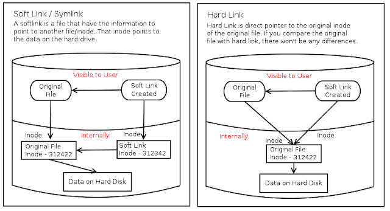

***File Types***

 -b  - block device file Example: HDD and pen drive

 -d - directory file

 - - common file

 c - Character device file Example: terminal

 l - Linked file

Linking means reflecting to the original file, In case of copy command updating is not possible after copying the file from the source to destination. In link updating is possible for both the files. 

**HARD Link**

**SOFT Link**

1.The destination file is exact image of the source file.

1.The destination file size is length of the source file name

2. If source got deleted also even we can access the destination file

2. if source got deleted we can’t access destination file

3. inode numbers of source and destination are same

3\. inode numbers of source and destination are different

4. We can’t put the hard link to different file system (partitions) because it will different.

4\. we can put a link between different file systems

5. Ex: cp –l \<source\> \<destination\>

Ex: cp –s \<source\> \<destination\>

