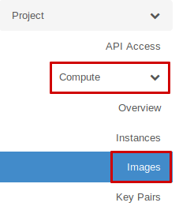
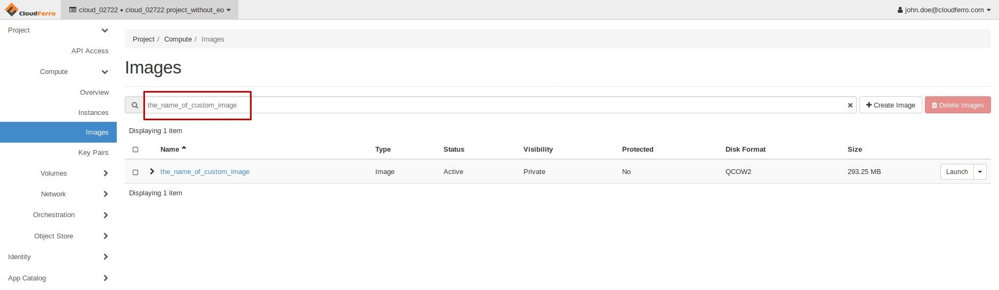
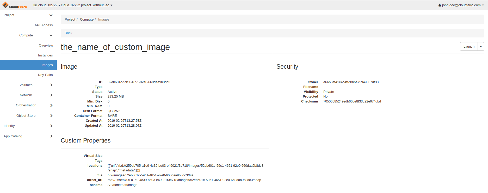

### HOW TO UPLOAD YOUR CUSTOM IMAGE USING OPENSTACK CLI?

<https://creodias.eu/-/how-to-upload-your-custom-image-using-openstack-cli->

In order to add custom OS image to your cloud resources you may use **python-openstackclient CLI.**

There is a FAQ in attachment:

[How to install OpenStackClient (Linux)?](https://creodias.eu/-/how-to-install-openstackclient-linux-)

It is strongly recommended to use virtual environments to avoid installing wide-spread Python packages.

There is FAQ on our site with Virtualenv configuration:

[How to install Python virtualenv/virtualenvwrapper?](https://creodias.eu/-/how-to-install-python-virtualenv-virtualenvwrapper-)

There are also available tools for the same purpose such as: pipenv or miniconda.

1.If you have already prepared your working environment, you might open your terminal window.

2\. Source the RC file that can be downloaded in Horizon dashboard.

    CREODIAS_User@PC~$ cd dir/

    CREODIAS_User@PC~/dir$ source cloud_02722\ project_without_eo-openrc.sh

    Please enter your OpenStack Password for project cloud_02722 project_without_eo

    as user john.doe@cloudferro.com:

    CREODIAS_User@PC~/dir$

3\. Use openstack image create command to upload an image to Glance repository.

**Attention!**
custom\_image.qcow2 is your custom image that you have obtained on your own.

    CREODIAS_User@PC~/dir$ openstack image create --disk-format qcow2 --container-format bare \

    --private --file ./custom_image.qcow2 the_name_of_custom_image

####  

#### Additional parameters for often usage:

--disk-format \<disk-format\>

--min-disk \<disk-gb\>

--min-ram \<ram-mb\>

For more explanations, you may easily use:

    openstack image create --help

After completion, you should gather necessary information from the console output. (table with data)

4\. In order to check our new image in Horizon dashboard, please log in to [cf2.cloudferro.com](http://cf2.cloudferro.com/)

5\. Go to Compute → Images

6\. Type in filter: custom\_image

7\. You may click on the image to inspect advanced data.

