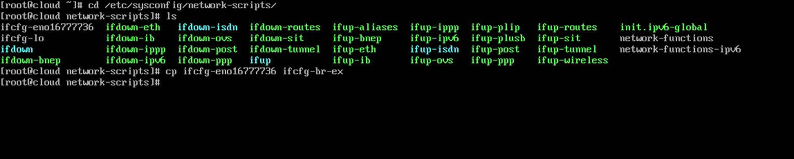

This tutorial will guide you on how you can configure OpenStack networking service in order to allow access from external networks to OpenStack instances.

#### Requirements

1. [Install OpenStack in RHEL and CentOS 7](https://www.tecmint.com/openstack-installation-guide-rhel-centos/)

### Step 1: Modify Network Interface Configuration Files

**1.** Before starting to create **OpenStack** networks from dashboard, first we need to create an **OVS** bridge and modify our physical network interface to bind as a port to OVS bridge.

Thus, login to your server terminal, navigate to network interfaces directory scripts and use the physical interface as an excerpt to setup OVS bridge interface by issuing the following commands:

    # cd /etc/sysconfig/network-scripts/
    # ls  
    # cp ifcfg-eno16777736 ifcfg-br-ex

Setup OVS Bridge Interface in OpenStack

**2.** Next, edit and modify the bridge interface **(br-ex)** using a text editor as illustrated below:

    # vi ifcfg-br-ex

Interface **br-ex** excerpt:

    TYPE="Ethernet"
    BOOTPROTO="none"
    DEFROUTE="yes"
    IPV4_FAILURE_FATAL="no"
    IPV6INIT="no"
    IPV6_AUTOCONF="no"
    IPV6_DEFROUTE="no"
    IPV6_FAILURE_FATAL="no"
    NAME="br-ex"
    UUID="1d239840-7e15-43d5-a7d8-d1af2740f6ef"
    DEVICE="br-ex"
    ONBOOT="yes"
    IPADDR="192.168.1.41"
    PREFIX="24"
    GATEWAY="192.168.1.1"
    DNS1="127.0.0.1"
    DNS2="192.168.1.1"
    DNS3="8.8.8.8"
    IPV6_PEERDNS="no"
    IPV6_PEERROUTES="no"
    IPV6_PRIVACY="no"

Configure Bridge Network Interface for OpenStack

**3.** Do the same with the physical interface (**eno16777736**), but make sure it looks like this:

    # vi ifcfg-eno16777736

Interface **eno16777736** excerpt:

    TYPE="Ethernet"
    BOOTPROTO="none"
    DEFROUTE="yes"
    IPV4_FAILURE_FATAL="no"
    IPV6INIT="no"
    IPV6_AUTOCONF="no"
    IPV6_DEFROUTE="no"
    IPV6_FAILURE_FATAL="no"
    NAME="eno16777736"
    DEVICE="eno16777736"
    ONBOOT="yes"
    TYPE=”OVSPort”
    DEVICETYPE=”ovs”
    OVS_BRIDGE=”br-ex”

Configure Physical Network Interface for OpenStack

**Important**: While editing interfaces cards make sure you replace the physical interface name, IPs and DNS servers accordingly.

**4.** Finally, after you’ve modified edited both network interfaces, restart network daemon to reflect changes and verify the new configurations using [ip command](https://www.tecmint.com/ip-command-examples/).

    # systemctl restart network.service
    # ip a

Verify Network Configuration

### Step 2: Create a New OpenStack Project (Tenant)

**5.** On this step we need to use **Openstack** dashboard in order to further configure our cloud environment.

Login to **Openstack** web panel (dashboard) with **admin** credentials and go to **Identity** -\> **Projects** -\> **Create Project** and create a new project as illustrated below.

Create New OpenStack ProjectAdd OpenStack New Project Details

**6.** Next, navigate to **Identity** -\> **Users** -\> **Create User** and create a new user by filling all the fields with the required information.

Assure that this new user has the Role assigned as a `_member_` of the newly created tenant (project).

Create New User in OpenStack Project

### Step 3: Configure OpenStack Network

**7.** After the user has been created, log out **admin** from dashboard and log in with the **new user** in order to create two networks (internal network and external).

Navigate to **Project** -\> **Networks** -\> **Create Network** and setup the internal network as follows:

    Network Name: internal
    Admin State: UP
    Create Subnet: checked

    Subnet Name: internal-tecmint
    Network Address: 192.168.254.0/24
    IP Version: IPv4
    Gateway IP: 192.168.254.1

    DHCP: Enable

Use the below screenshots as a guide. Also, replace the **Network Name**, **Subnet Name** and **IP addresses** with your own custom settings.

Login as User to OpenStack DashboardCreate Network for OpenStackCreate Network Subnet for OpenStackEnable DHCP for OpenStack

**8.** Next, use the same steps as above to create the external network. Make sure the IP address space for external network is in the same network range as your uplink bridge interface IP address range in order to work properly without extra routes.

Therefore, if the **br-ex** interface has **192.168.1.1** as a default gateway for **192.168.1.0/24** network, the same network and gateway IPs should be configured for external network too.

    Network Name: external
    Admin State: UP
    Create Subnet: checked

    Subnet Name: external-tecmint
    Network Address: 192.168.1.0/24
    IP Version: IPv4
    Gateway IP: 192.168.1.1

    DHCP: Enable

Create External Network for OpenStackCreate Subnet for External NetworkEnable DHCP for External Network

Again, replace the **Network Name**, **Subnet Name** and **IP addresses** according to your own custom configurations.

**9.** On the next step we need to log in **OpenStack** dashboard as **admin** and mark the external network as **External** in order to be able to communicate with the bridge interface.

Thus, login with **admin** credentials and move to **Admin** -\> **System**-\> **Networks**, click on the external network, check the **External Network** box and hit on **Save Changes** to apply the configuration.

Login as Admin in OpenStack DashboardSelect External NetworkMake Network as External NetworkExternal Network Settings Updated

When done, logout from **admin** user and log in with the custom **user** again to proceed to the next step.

**10.** Finally, we need to create a **router** for our two networks in order to move packets back and forth. Go to **Project** -\> **Network** -\> **Routers** and hit on **Create Router** button. Add the following settings for the router.

    Router Name: a descriptive router name
    Admin State: UP
    External Network: external 

Create Network Router in OpenStack

**11.** Once the **Router** has been created you should be able to see it in the dashboard. Click on the **router name**, go to **Interfaces tab** and hit on **Add Interface** button and a new prompt should appear.

Select the **internal subnet**, leave the **IP Address** field blank and hit on **Submit** button to apply changes and after a few seconds your interface should become **Active**.

Add New Network Interface in OpenStackConfigure Network Interface

**12.** In order to verify OpenStack network settings, go to **Project** -\> **Network** -\> Network Topology and a network map will be presented as illustrated on the below screenshot.

Verify OpenStack Network Topology

That’s all! Your **OpenStack network** is now functional and ready for virtual machines traffic. On the next topic we’ll discuss how to create and launch an OpenStack image instance.