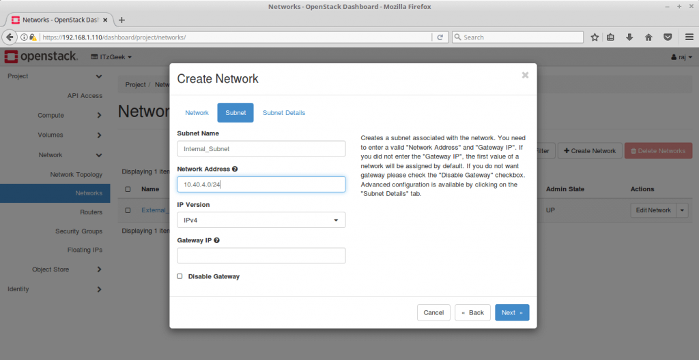

This tutorial is the second part of our **[OpenStack series](https://www.itzgeek.com/tag/openstack)**. In this tutorial, we will go through steps to configure OpenStack Networking to allow access to VM instances from external networks.

Prerequisites
-------------

Follow the below link to install OpenStack so that we can begin the network configuration.

**READ**: **[Install Single Node OpenStack on CentOS 7 / RHEL 7](https://www.itzgeek.com/how-tos/linux/centos-how-tos/openstack-pike-single-node-openstack-installation-on-centos-7-rhel-7.html)**

Environment
-----------

**Internal (VM) Network** = 10.40.4.0/24
**External Network** = 192.168.1.0/24
**Instances Floating IP Range** = 192.168.1.200 – 192.168.1.240
**Gateway of External Network** = 192.168.1.1

Setup Network Bridge
--------------------

Before we create OpenStack networks through the dashboard, we need to setup OVS network bridge (br-ex) using the physical interface available on our system.

### Automatic

If you have come through the **[previous article](https://www.itzgeek.com/how-tos/linux/centos-how-tos/openstack-pike-single-node-openstack-installation-on-centos-7-rhel-7.html)**, then you need not create OVS bridge as the OpenStack setup must have done it for you.

### Manual

If you do not see br-ex (OVS Bridge) adapter on the system, then follow these steps.

First, create a configuration file for bridge interface “**br-ex**“.

    vi /etc/sysconfig/network-scripts/ifcfg-br-ex

**Add the** **below values:**

    DEVICE=br-ex
    NAME=br-ex
    DEVICETYPE=ovs
    TYPE=OVSBridge
    OVSBOOTPROTO="none"
    OVSDHCPINTERFACES=ens33 # Physical Interface Name
    BOOTPROTO=static
    IPADDR=192.168.1.110 # Your Control Node IP (SingleNode)
    NETMASK=255.255.255.0 # Your Netmask
    GATEWAY=192.168.122.1 # Your Gateway
    DNS1=192.168.122.1 # Your Name Server
    ONBOOT=yes

The same way, edit the configuration file of physical interface (**in my case: ens33**). You can use ifconfig -a command to find the available physical interface.

    vi /etc/sysconfig/network-scripts/ifcfg-ens33

**Add the below values:**

    DEVICE=ens33
    NAME=ens33
    DEVICETYPE=ovs
    TYPE=OVSPort
    OVS_BRIDGE=br-ex
    ONBOOT=yes
    BOOTPROTO=none

Once you have modified both network interfaces, restart the network services to reflect changes.

    service network restart

### Verify Network Bridge

Use ifconfig command to check whether the OVS bridge is available on your system.

    ifconfig -a

**Output:**

Configure OpenStack Networking – OpenStack OVS Bridge

The above output confirms that OVS bridge has been set up and available.

ADVERTISEMENT

Create a New OpenStack Project and User
---------------------------------------

Login to OpenStack dashboard with admin credentials and create a project called “**ITzGeek**“. The end user uses this project for their cloud requirements.

Go to **Identity** \>\> **Projects** \>\> **+ Create Project**.

Create a project as shown below.

Configure OpenStack Networking – Create OpenStack Project

Next, create a user and assign it to the previously created project. Go to **Identity** \>\> **Projects** \>\> **+ Create User**.

**User Name**: Raj
**email**: raj@itzgeek.com
**password**: xxx xxx
**Primary Project**: ITzGeek
**Role**: \_member\_

Configure OpenStack Networking – Create Project User

Configure OpenStack Networking
------------------------------

### External Network

First, we will create the external network. Go to **Admin** \>\> **Network** \>\> **Networks** \>\> **+ ****Create Network**. Make sure you logged in as Admin user

**Set up the external network as follows:**

**Make sure the Physical Network (extnet) name matches the name you had in the answer.txt file which we used as an input for OpenStack installation.**

**Name**: External\_Network
**Project**: ITzGeek
**Provider Network Type**: Flat
**Physical Network**: extnet

Tick mark the External Network and Create Subnet, and then click Next.

Configure OpenStack Networking – Create OpenStack External Network

When you choose network address (IP) for external network and instances, make sure it is in the same range of your home/personal network for easy communications. Otherwise, you would need to set up routes.

Gateway also should be your router IP in which your machine is connected.

On Subnet tab,

**Subnet Name**: External\_Subnet
**Network Address**: 192.168.1.0/24
**Gateway IP**: 192.168.1.1

Configure OpenStack Networking – Create OpenStack External Subnet

On Subnet Details Tab,

ADVERTISEMENT

**Enable** **DHCP:** checked
**Allocation Pools**: 192.168.1.200,192.168.1.240 (**Using these IP addresses, you will access VM instances from external machines**)

Configure OpenStack Networking – OpenStack External Subnet Details

Finally, click Create to create the external network.

You have successfully created the External\_Network.

Configure OpenStack Networking – OpenStack Networks

### Internal Network

This internal network is used by OpenStack to assign an IP address to VM instances. You can use any range of IP address for this network.

To create an internal network, you would need log out as admin and log in as a newly created user “**raj**“.

Configure OpenStack Networking – OpenStack User Login

Go to **Project** \>\> **Network** \>\> **Networks** \>\> **+ ****Create Network**.

Specify the Network Name as **Internal\_Network**.

Configure OpenStack Networking – Create OpenStack Internal Network

On Subnet Tab,

**Subnet Name**: Internal\_Subnet
**Network Address**: 10.10.4.0/24

Configure OpenStack Networking – Create OpenStack Internal Subnet

Leave the Subnet Details as it is and click on Create.

**Here, I’m adding DNS servers IP address so that VM instances can access the internet.**

Configure OpenStack Networking – OpenStack Internal Subnet Details

You should now have both networks.

Configure OpenStack Networking – OpenStack Networks

### Create Router

The router acts as the bridge between internal network and external network.

Go to **Project** \>\>** Network** \>\>** Routers** \>\> **+ Create Router**.

Name the router and choose our External\_Network as our external network and then click on Create Router.

ADVERTISEMENT

 Configure OpenStack Networking – Create OpenStack Router

In the previous step, we have added the external network to the router. Now, we have to add the internal network as well.

Configure OpenStack Networking – OpenStack Routers

**Click on the router and go to interfaces tab and then click on + Add interface**. Now, **select the subnet of Private\_Network** and then click submit.

Configure OpenStack Networking – Add Interface to OpenStack Router

Now, the router should have interfaces from External\_Network and Internal\_Network.

Configure OpenStack Networking – Router Network Interfaces

**Current Network Topology:**

Configure OpenStack Networking – Network Topology

Now, we have completed the configuration of OpenStack networking. It is the time to Launch an OpenStack Instance using Horizon Dashboard.