In this guide we will learn how to create images and launch an instance of an image (virtual machine) in OpenStack and how to gain control over an instance via SSH. 

#### Requirements

1. [Install OpenStack in RHEL and CentOS 7](https://www.tecmint.com/openstack-installation-guide-rhel-centos/)
2. [Configure OpenStack Networking Service](https://www.tecmint.com/openstack-networking-guide/)

### Step 1: Allocate Floating IP to OpenStack

**1.** Before you deploy an **OpenStack** image, first you need to assure that all pieces are in place and we’ll start by allocating floating IP. 

Floating IP allows external access from outside networks or internet to an Openstack virtual machine. In order to create floating IPs for your project, login with your **user** credentials and go to **Project** -\> **Compute** -\> **Access & Security** -\> **Floating IPs** tab and click on **Allocate IP** to The Project. 

Choose external **Pool** and hit on **Allocate IP** button and the IP address should appear in dashboard. It’s a good idea to allocate a Floating IP for each instance you run.

Allocate Floating IP to Project in OpenStack[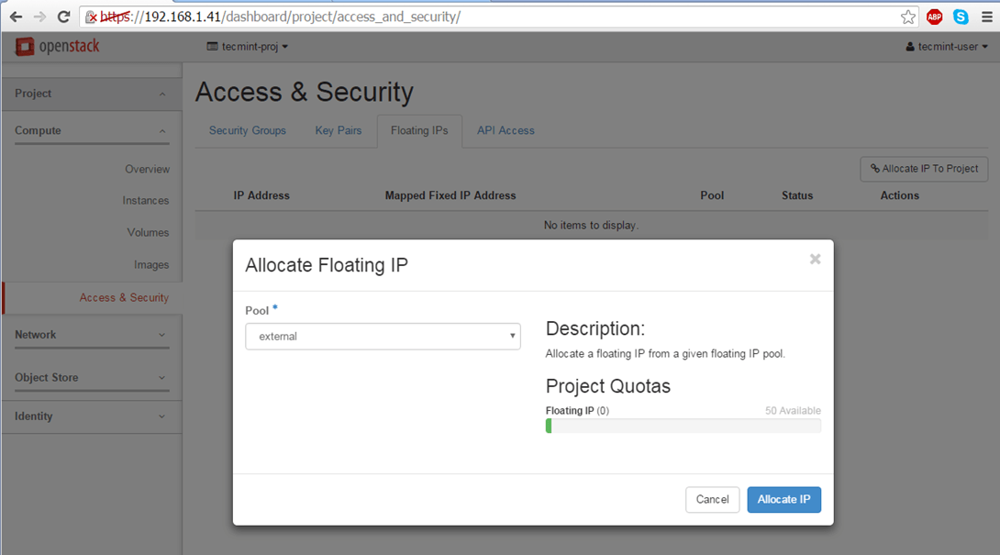](https://www.tecmint.com/wp-content/uploads/2016/04/Allocate-Floating-IP-to-External-Pool.png)Allocate Floating IP to External Pool[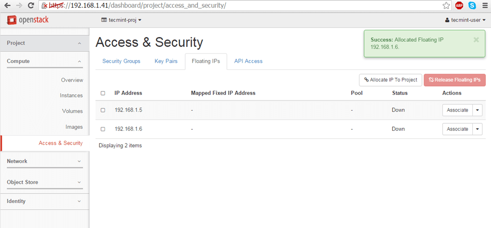](https://www.tecmint.com/wp-content/uploads/2016/04/Confirmation-of-Adding-Floating-IP.png)Confirmation of Adding Floating IP

### Step 2: Create an OpenStack Image

**2.** OpenStack images are just virtual machines already created by third-parties. You can create your own customized images on your machine by installing an Linux OS in a virtual machine using a virtualization tool, such as [KVM](https://www.tecmint.com/install-and-configure-kvm-in-linux/), [VirtualBox](https://www.tecmint.com/install-virtualbox-on-redhat-centos-fedora/), [VMware](https://www.tecmint.com/install-vmware-workstation-11-in-linux/) or [Hyper-V](https://www.tecmint.com/deploy-redhat-enterprise-virtualization-hypervisor-rhev/). 

Once you have installed the OS, just convert the file to raw and upload it to your OpenStack cloud infrastructure. 

To deploy official images provided by major Linux distributions use the following links to download the latest packaged images:

1. **CentOS 7** – <http://cloud.centos.org/centos/7/images/>
2. **CentOS 6** – <http://cloud.centos.org/centos/6/images/>
3. **Fedora 23** – <https://download.fedoraproject.org/pub/fedora/linux/releases/23/Cloud/>
4. **Ubuntu** – [http://cloud-images.ubuntu.com/](https://cloud-images.ubuntu.com/)
5. **Debian** – [http://cdimage.debian.org/cdimage/openstack/current/](https://cdimage.debian.org/cdimage/openstack/current/)
6. **Windows Server 2012 R2** – [https://cloudbase.it/windows-cloud-images/\#download](https://cloudbase.it/windows-cloud-images/#download)

Official images additionally contain the **cloud-init** package which is responsible with SSH key pair and user data injection.

On this guide we’ll deploy a test image, for demonstration purposes, based on a lightweight Cirros cloud image which can be obtained by visiting the following link <http://download.cirros-cloud.net/0.3.4/>.

The image file can be used directly from the HTTP link or downloaded locally on your machine and uploaded to OpenStack cloud. 

To create an image, go **OpenStack** web panel and navigate to **Project** -\> **Compute** -\> **Images** and hit on **Create Image** button. On the image prompt use the following settings and hit on **Create Image** when done.

    Name: tecmint-test
    Description: Cirros test image
    Image Source: Image Location  #Use Image File if you’ve downloaded the file locally on your hard disk
    Image Location: http://download.cirros-cloud.net/0.3.4/cirros-0.3.4-i386-disk.img 
    Format: QCOWW2 – QEMU Emulator
    Architecture: leave blank
    Minimum Disk: leave blank
    Minimum RAM: leave blank
    Image Location: checked
    Public: unchecked
    Protected: unchecked

[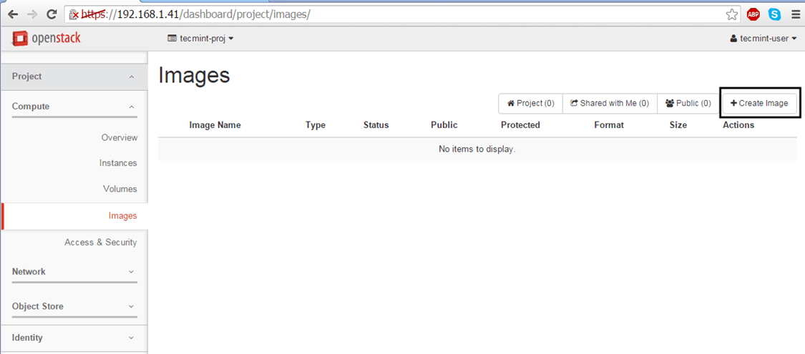](https://www.tecmint.com/wp-content/uploads/2016/04/Create-Images-in-OpenStack.png)Create Images in OpenStack[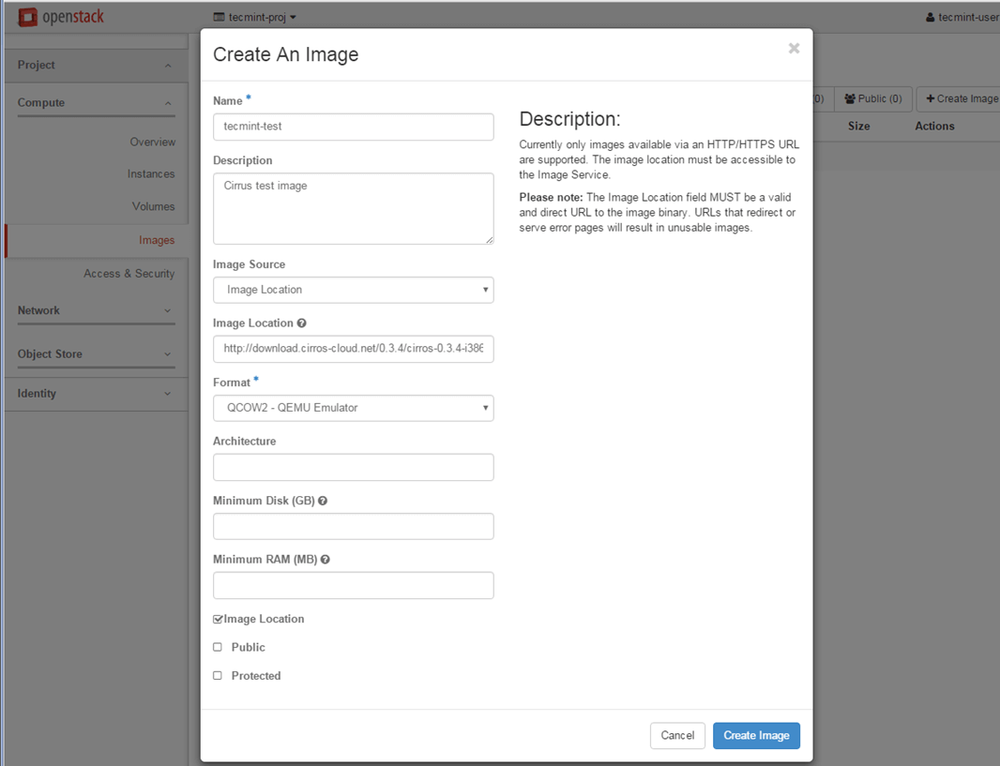](https://www.tecmint.com/wp-content/uploads/2016/04/Add-OpenStack-Image-Details.png)Add OpenStack Image Details[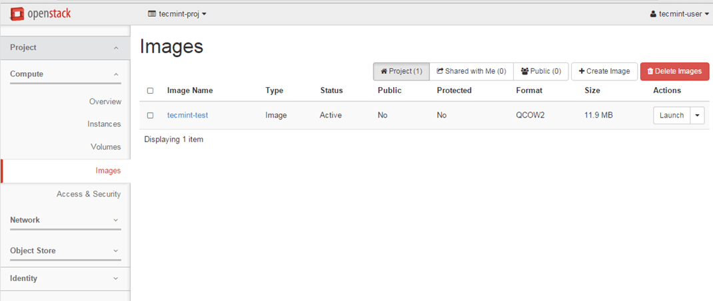](https://www.tecmint.com/wp-content/uploads/2016/04/OpenStack-Images.png)OpenStack Images

### Step 3: Launch an Image Instance in OpenStack

**3.** Once you’ve created an image you’re good to go. Now you can run the virtual machine based on the image created earlier in your cloud environment. 

Move to **Project** -\> **Instances** and hit on **Launch Instance** button and a new window will appear.

[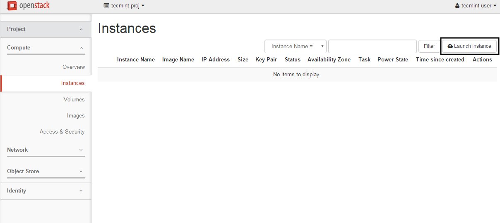](https://www.tecmint.com/wp-content/uploads/2016/04/Launch-Image-Instance-in-Openstack.png)Launch Image Instance in Openstack

**4.** On the first screen add a name for your instance, leave the **Availability Zone** to nova, use one instance count and hit on **Next** button to continue. 

Choose a descriptive **Instance Name** for your instance because this name will be used to form the virtual machine hostname. 

[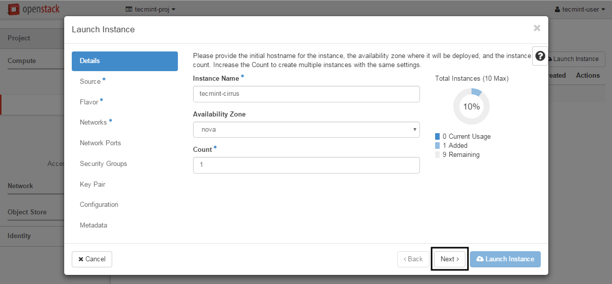](https://www.tecmint.com/wp-content/uploads/2016/04/Add-Hostname-to-OpenStack-Instance.png)Add Hostname to OpenStack Instance

**5.** Next, select Image as a **Boot Source**, add the **Cirros** test image created earlier by hitting the `+` button and hit **Next** to proceed further.

[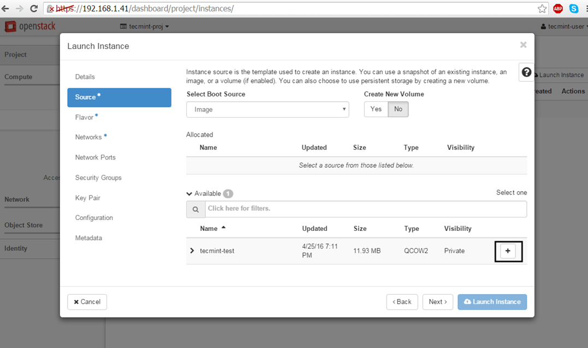](https://www.tecmint.com/wp-content/uploads/2016/04/Select-OpenStack-Instance-Boot-Source.png)Select OpenStack Instance Boot Source[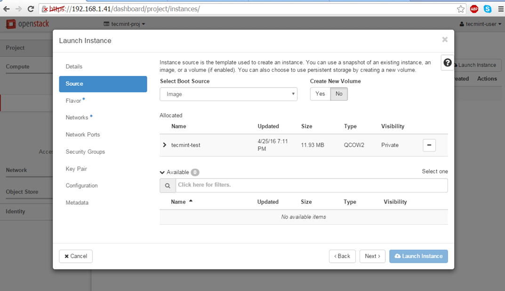](https://www.tecmint.com/wp-content/uploads/2016/04/Add-Cirros-Image.png)Add Cirros Text Image

**6.** Allocate the virtual machine resources by adding a flavor best suited for your needs and click on **Next** to move on.

[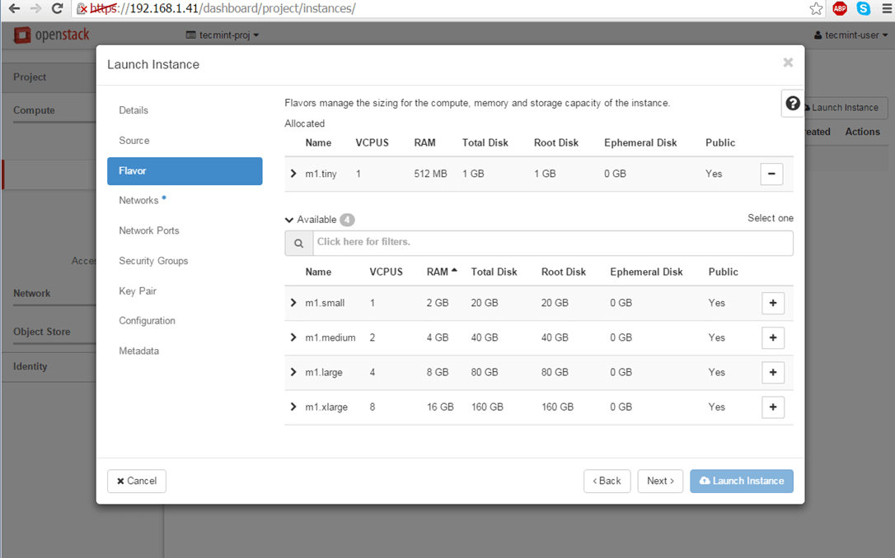](https://www.tecmint.com/wp-content/uploads/2016/04/Add-Resources-to-OpenStack-Instance.png)Add Resources to OpenStack Instance

**7.** Finally, add one of the OpenStack available networks to your instance using the `+` button and hit on **Launch Instance** to start the virtual machine.

[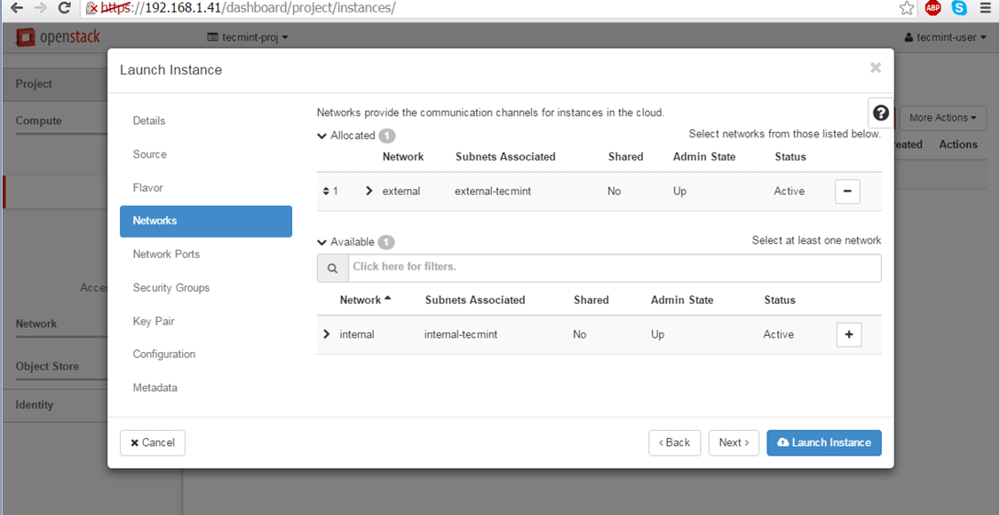](https://www.tecmint.com/wp-content/uploads/2016/04/Add-Network-to-OpenStack-Instance.png)Add Network to OpenStack Instance

**8.** Once the instance has been started, hit on the right arrow from **Create Snapshot** menu button and choose **Associate Floating IP**. 

Select one of the floating IP created earlier and hit on **Associate** button in order to make the instance reachable from your internal LAN. 

[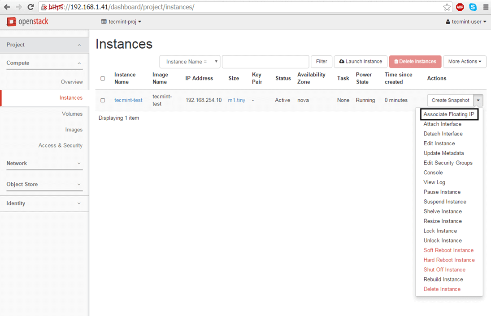](https://www.tecmint.com/wp-content/uploads/2016/04/Add-Associate-Floating-IP-to-OpenStack-Instance.png)Add Associate Floating IP to OpenStack Instance[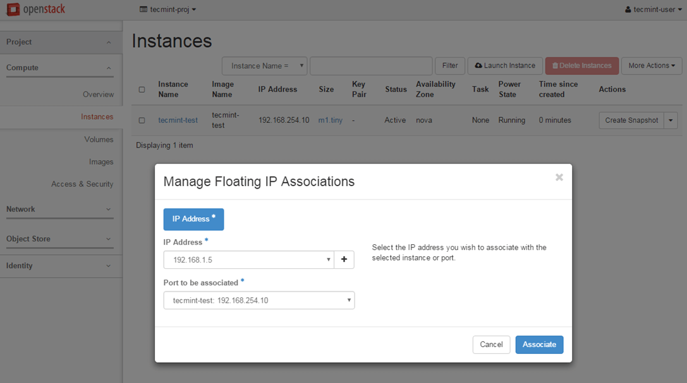](https://www.tecmint.com/wp-content/uploads/2016/04/Manage-Floating-IP-Associations.png)Manage Floating IP Associations

**9.** To test the network connectivity for your active virtual machine issue a **ping** command against the instance floating IP address from a remote computer in your LAN. 

[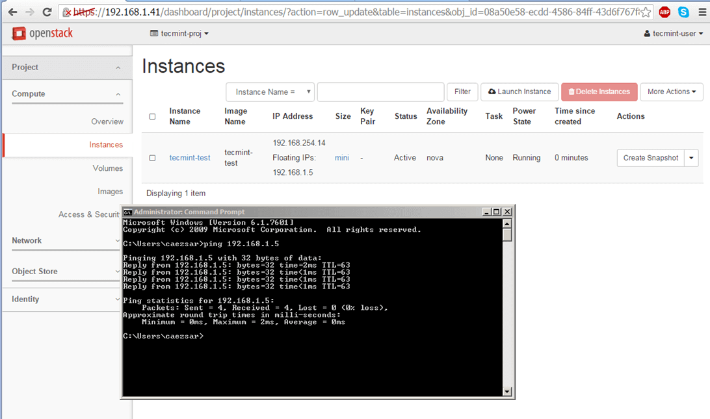](https://www.tecmint.com/wp-content/uploads/2016/04/Check-Network-of-Virtual-Machine-in-OpenStack.png)Check Network of Virtual Machine in OpenStack

**10.** In case there’s no issue with your instance and the **ping** command succeeds you can remotely login via SSH on your instance. 

Use the instance **View Log** utility to obtain **Cirros** default credentials as illustrated on the below screenshots. 

[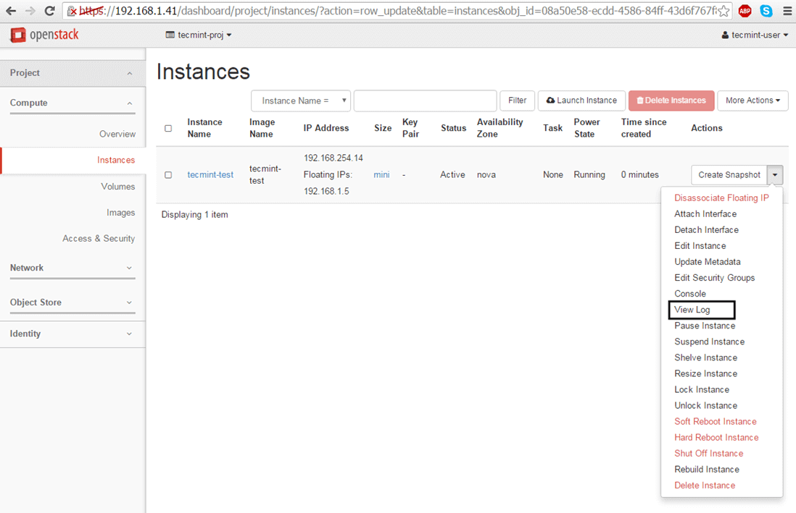](https://www.tecmint.com/wp-content/uploads/2016/04/Instance-View-Log-Utility.png)Instance View Log Utility[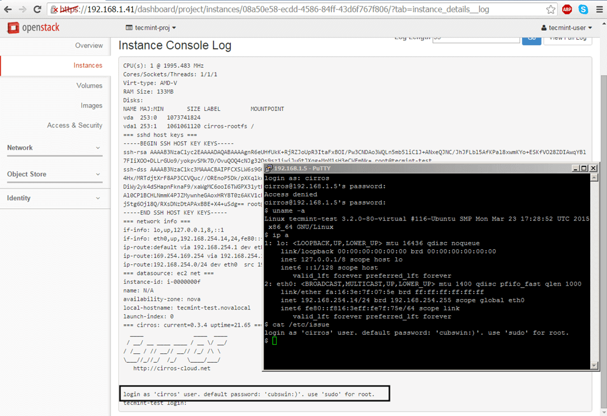](https://www.tecmint.com/wp-content/uploads/2016/04/Instance-Login-Credentials.png)Instance Login Credentials

**11.** By default, no DNS name servers will be allocated from the internal network DHCP server for your virtual machine. This problem leads to domain connectivity issues from instance counterpart. 

To solve this issue, first stop the instance and go to **Project** -\> **Network** -\> **Networks** and edit the proper subnet by hitting the **Subnet Details** button. 

Add the required DNS name servers, save the configuration, start and connect to the instance console to test if the new configuration has been applied by pinging a domain name. Use the following screenshots as a guide.

[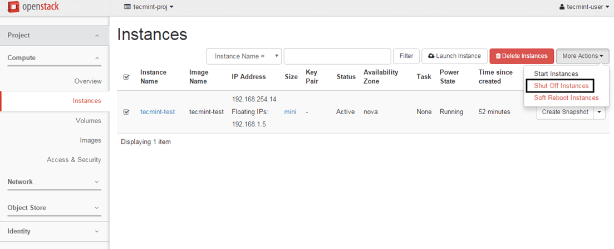](https://www.tecmint.com/wp-content/uploads/2016/04/Shutdown-Instance-in-OpenStack.png)Shutdown Instance[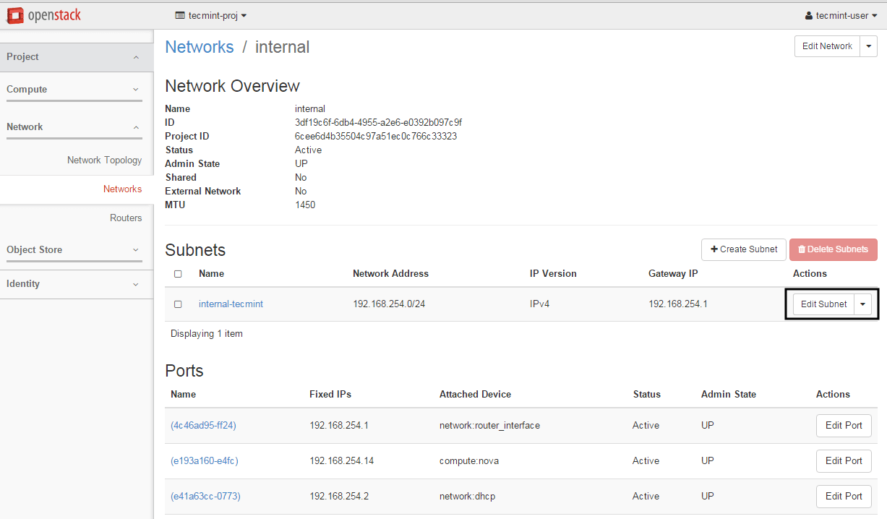](https://www.tecmint.com/wp-content/uploads/2016/04/Modify-Instance-Network-Subnet.png)Modify Instance Network Subnet[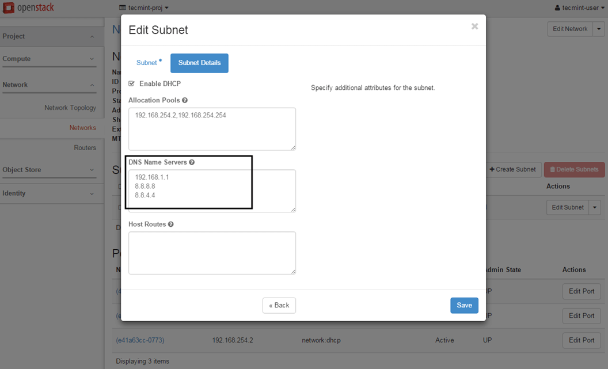](https://www.tecmint.com/wp-content/uploads/2016/04/Add-DNS-Servers-to-Instance.png)Add DNS Servers to Instance[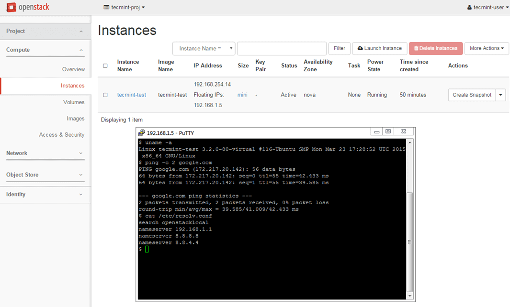](https://www.tecmint.com/wp-content/uploads/2016/04/Check-Instance-Network-Connectivity.png)Check Instance Network Connectivity

In case you have limited physical resources in your infrastructure and some of your instances refuse to start, edit the following line from nova configuration file and restart the machine in order to apply changes.

    # vi /etc/nova/nova.conf

Change the following line to look like this:

    ram_allocation_ratio=3.0

[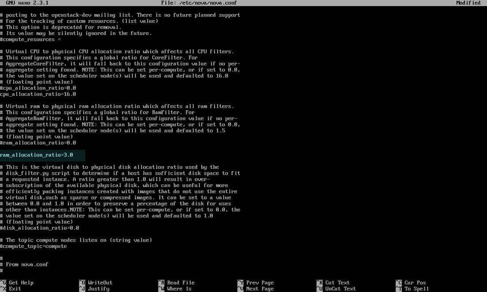](https://www.tecmint.com/wp-content/uploads/2016/04/Nova-Configuration.jpg)Configure Physical Resources in Nova Configuration

That’s all! Although this series of guides just scratched the surface of **OpenStack** mammoth, now you have the basic knowledge to start create new tenants and use real Linux OS images in order to deploy virtual machines in your own OpenStack cloud infrastructure.