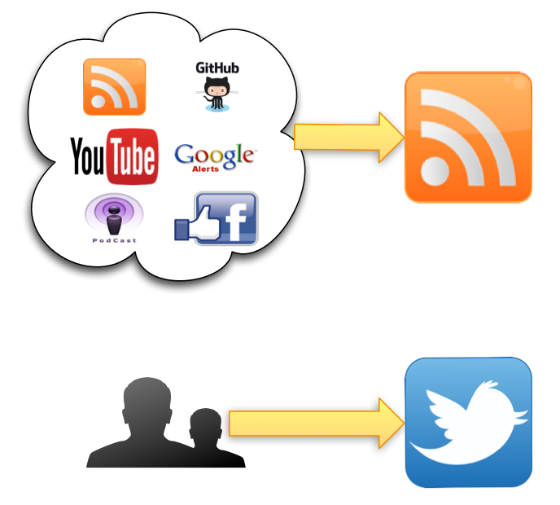

How to Stay Up-to-Date on Security Trends
=========================================

The current computer security landscape is a rapidly evolving playground. Staying on top of all the security news, knowing the latest [security trends](https://securityintelligence.com/a-look-back-at-2014-trends-and-what-2015-will-bring/) and staying aware of changing threat information has become a difficult, time-consuming, daunting task. The way we organize, follow and share news has changed significantly in the past few years.

In this article, I’ll describe how you can streamline the process of following different news and [threat information](https://securityintelligence.com/how-stix-taxii-and-cybox-can-help-with-standardizing-threat-information/) channels, classify them and bring them to good use for you and your customers.

Content Sources
---------------

The key to powering your news flow is selecting good content from a wide variety of sources and using technology that gives you easy access to the content. While the technology lets you access the content, it should not filter or limit your access.

Some content sources provide more general news, while others focus on one or more specific areas. A number of these sources are community-driven, while others have ties to a specific brand.

[Download the Free e-Book: Staying Ahead of the Cyber Security Game **](https://www-01.ibm.com/common/ssi/cgi-bin/ssialias?subtype=WH&infotype=SA&appname=SWGE_TI_SE_USEN&htmlfid=TIL14103USEN&attachment=TIL14103USEN.PDF)

Vulnerability Alerts and Advisories
-----------------------------------

Keeping track of security alerts and advisories gives the necessary information for keeping your products up-to-date and preventing you from easily falling victim to vulnerability exploits. The following are some common resources:

* The [Computer Emergency Readiness Team Coordination Center (CERT/CC)](https://www.kb.cert.org/vuls/) has up-to-date vulnerability information for the most popular products. The vulnerability database is searchable, and you can sort the entries by severity or date published.
* [SecurityFocus](http://www.securityfocus.com/) has a feed with recent advisories for almost every product. The specific feeds are not frequently updated.
* The [National Vulnerability Database](https://nvd.nist.gov/) has two feeds: One covers all the recent CVE vulnerabilities, while the other focuses on fully analyzed CVE vulnerabilities. I only follow the feed with the fully analyzed vulnerabilities because it provides the information that’s important to me: the vulnerable product names.
* [US-CERT](https://www.us-cert.gov/) and the [Industrial Control Systems CERT (ICS-CERT)](https://ics-cert.us-cert.gov/advisories) publish regularly updated summaries of the most frequent, high-impact security incidents. The information is similar to CERT/CC. The content from ICS-CERT is especially useful if you have to protect critical infrastructure.
* The feed at [Full Disclosure](http://seclists.org/fulldisclosure/), now part of SecLists.org, is one of the oldest available. It can be rather chatty, but it gives access to information on vulnerabilities that is not immediately covered via other channels.
* Most vendors have their own feed of advisories, as well. With the use of good [asset management](https://securityintelligence.com/how-to-improve-asset-management-for-risk-assessment-and-control/), you should be able to compile a list of key products and vendors to follow.

The feeds from CERT/CC and SecurityFocus provide alert and advisory data for the most commonly used products and should be checked up on daily. Combine this with the information from US-CERT, and you and your vendors should be able to closely follow what needs immediate attention or patches.

In-Depth Coverage and Security Threat Intelligence
--------------------------------------------------

There are several news sources that provide more depth on security topics and security investigations. They provide the necessary information on the latest security trends and are a key information provider for updated threat information. The following are some examples:

* The [SANS Internet Storm Center](https://isc.sans.edu/) has daily posts on threats. SANS has a number of guest writers who cover their own domain of expertise, resulting in a wide variety of topics covered.
* The website of the [European Union CERT (CERT-EU)](http://cert.europa.eu/cert/filteredition/en/CERTNewsFilter.html) has a dynamic feed that covers all the important security news. It is not information from CERT-EU itself, but rather an aggregation of other news feeds.
* The [Reddit](https://www.reddit.com/r/netsec/) security news channel lists everything that is popular in the security field. Users submit the news topics, then vote on which they deem most important. Stories with the most votes appear at the top of the feed. With this voting mechanism, the feed behaves like a self-correcting marketplace of topics.
* You should also keep an eye on new additions to the [APTnotes GitHub repository](https://github.com/kbandla/APTnotes). It contains various public documents, white papers and articles about advanced persistent threat (APT) campaigns.
* The news streams from [The Hacker News](https://thehackernews.com/), [Dark Reading](http://www.darkreading.com/) and [The Register](https://www.theregister.co.uk/)are all worth following.
* Different trending security news and investigations are covered by [Threatpost](https://threatpost.com/), [Naked Security](https://nakedsecurity.sophos.com/), [FireEye](https://www.fireeye.com/blog.html) and [Security Street](https://community.rapid7.com/content?filterID=all~objecttype~objecttype%5Bblogpost%5D). These sites report on cyberattacks from organized cybercriminal groups and provide valuable threat intelligence.
* The [Online Security Blog](https://googleonlinesecurity.blogspot.be/) from Google, [CloudFlare](https://blog.cloudflare.com/) and [Arbor](http://www.arbornetworks.com/asert/) have posts on industry observations.
* The blogs of [F-Secure](https://www.f-secure.com/weblog/), [AVG](http://now.avg.com/), [Securelist](https://securelist.com/), [Trend Micro](http://blog.trendmicro.com/) and [Malwarebytes](https://blog.malwarebytes.org/)cover security news that is mostly related to malware and exploits. They also offer good input for threat intelligence.
* [Exploit Database](https://www.exploit-db.com/) and [Packet Storm](http://packetstormsecurity.com/) give you a daily feed of new exploit codes and threat information.

When you want to limit the number of news sources you follow, subscribing to the feeds from CERT-EU and Reddit will already give you the most necessary topics.

If your focus is on gathering threat intelligence, then paying attention to news from the blogs of F-Secure, Securelist and Trend Micro will prove valuable. They publish regular research on [APTs](https://securityintelligence.com/7-recommendations-for-defending-against-advanced-persistent-threats-apts/) with detailed detection indicators. You should also stay on top of new additions to the APTnotes GitHub repository and new exploit code published by Exploit Database.

Security Professionals
----------------------

A number of security professionals cover news from their own personal point of view. [Bruce Schneier](https://www.schneier.com/) writes about all things that matter in security and [Brian Krebs](https://krebsonsecurity.com/) has in-depth security news and investigations, while [TaoSecurity](https://taosecurity.blogspot.be/) is Richard Bejtlich’s blog on digital security, strategic thought and military history.

Videos and Podcasts
-------------------

Some information is presented via videos and is both entertaining and interesting to follow, such as the following:

* The [HAK5](https://hak5.org/) podcasts are mostly instructional videos on how to use a specific tool or technique.
* [SANS podcasts](https://isc.sans.edu/podcast.html) and Daily Stormcasts are updates on information security threats.
* [IBM Security](https://www.youtube.com/user/IBMSecuritySolutions) and [SophosLabs](https://www.youtube.com/user/SophosLabs) have informational YouTube channels.
* [EuroTrash](http://www.eurotrashsecurity.eu/index.php/Main_Page) is a European Union-focused information security podcast.

Other Sources for Security Trends
---------------------------------

The [European Union Agency for Network and Information Security](https://www.enisa.europa.eu/) and the [U.S. Department of Homeland Security](http://www.dhs.gov/news) publish content that can be of use for regulatory topics and policymaking. Other sources include the following:

* Twitter is a great source for knowing what is going on in the security landscape. Depending on who you follow, you can get a wealth of information. Twitter lists make it easier for you to categorize the massive amount of content available. For example, you can build lists that contain only certain security vendors, researchers or vulnerability alerts.

* GitHub is often only seen as a code repository, but it makes perfect sense to get updates about the changes made to the tools you use daily. GitHub has a RSS feed with the tools or projects to which you subscribe. You can also subscribe to the public activity of an author.
* Google Alerts is not a real news provider; rather, it gives you alerts when specific keywords are used on the Web. The power of the alerts comes from using correct keywords. Using “security” as a keyword will give you a lot of results, but not all of them will be useful. You can choose to have the alerts emailed to you, or you can have them show up in a RSS feed.
* Facebook is one of the most popular social networks, but it’s rarely the original provider of content. Most often, the content that is published on Facebook is already published or referred to somewhere else.

Getting Organized
-----------------

The different information streams should be organized by what you plan on doing with the information afterward. Either it’s meant for immediate operational use or for intelligence use. The classification is also reflected later on in the type of tool used to access or store the content.

Operational Usage
-----------------

The topics that are covered by the sources on alerts and vulnerabilities translate to things that must be acted upon. Depending on the severity of the notice, it can become something that requires immediate attention. The information that comes out of these sources has a great influence on day-to-day operation priorities. It also acts as input for configuring security devices.

For example, you could be running a Web application and receive a notice from US-CERT about a new weakness in the application. The notice contains a description of how it is being abused. You can then schedule an upgrade cycle and configure your Web application firewall to block the attack pattern. Similarly, you can use the pattern as a new rule to look for information in your [security information and event management (SIEM) system](https://www.ibm.com/software/products/en/qradar-siem).

Intelligence Sharing
--------------------

The information you get from sites covering threat intelligence is useful for feeding your own intelligence platform. It allows you to point out where your constituency should focus. It is also your starting point for conducting incident investigations and giving security advice to your customers.

For example, consider that there is a document posted in your news stream that describes a new APT case that was discovered and investigated. The document describes the modus operandi of the attackers, their goal and how they gained access.

Typically, if you get such a document, you evaluate whether it’s a threat for your customers. If so, you notify them by stating the high-level details of the cyberattack and the threat actors. From the same document, you can then extract the tactics, techniques and procedures used by attackers. Subsequently, you can add the different indicators, such as file hashes to look for, detectable network traffic and IP addresses being used.

You can then adapt your news sources, such as your Google alerts or Twitter lists, to look for new posts on this threat. When a new article is published, you are notified automatically and you can extract potential new threat information. This increases the quality of your information.

Don’t forget that the alerts and advisories can also contain useful information to increase the quality of your threat information.

The information you have now collected through these different articles serves as a starting point for giving advice to your customers for protection, detection and mitigation. You can share the details of the cyberattacks and the threat actors with your customers. It is also the central hub for pushing threat indicators so that your customers can use these to detect incidents in their environment.

[Download the complete e-Book: Staying Ahead of the Cyber Security Game **](https://www-01.ibm.com/common/ssi/cgi-bin/ssialias?subtype=WH&infotype=SA&appname=SWGE_TI_SE_USEN&htmlfid=TIL14103USEN&attachment=TIL14103USEN.PDF)

Sharing Threat Intelligence
---------------------------

Getting and collecting all the threat information is great, but it is only beneficial if you can easily distribute it to your customers. You can share the information manually (or even semi-automatically with scripting), but that won’t scale well in the end.

This is where the Trusted Automated Exchange of Indicator Information (TAXII), Cyber Observable Expression (CybOX) and Structured Threat Information Expression (STIX) come in. They are a [set of specifications](https://securityintelligence.com/how-stix-taxii-and-cybox-can-help-with-standardizing-threat-information/) that help with the automated exchange of cyberthreat information. The combination of STIX and TAXII allow you to more easily share threat information with your constituency and peers.

If you are considering purchasing new security devices, one of the key questions you should ask is, “Does it speak STIX?” If not, it’s going to be harder to integrate them later on in an environment where you automatically push threat information. For existing equipment and software, you might want to look for tools that facilitate TAXII/STIX integration, such as the [data import tool](https://github.com/ibm-security-intelligence/data-import/tree/master/stix-import) to import data from STIX and/or TAXII repositories into [QRadar](https://securityintelligence.com/innovation-fuels-ibm-qradar-leadership-again-in-gartners-2016-magic-quadrant-for-siem/).

One of the more easy-to-use platforms for sharing threat intelligence is the [Malware Information Sharing Platform (MISP)](https://github.com/MISP/MISP). It does not yet have full integration of STIX or TAXII. The Web interface and collaborative features allow you to get quick, valuable feedback from your customers.

You can partially automate feeding your threat intelligence platform. Once you have compiled the details of a new threat from one or more news sources, you can either manually extract the indicator information or use tools to do this.

For example, with [IOC-Parser](https://github.com/armbues/ioc-parser), you can extract indicators of compromise from PDF files. Ideally, you combine this tool with a copy of the repository of PDFs listed by the APTnotes GitHub repository.

Use RSS as Content Delivery Technology
--------------------------------------

So how do you collect all this information? Manually visiting the news sites daily and checking for updates is not feasible. Luckily, there’s technology for that: RSS. RSS is a family of standard Web feed formats to track published content. It allows publishers to easily syndicate content. Most if not all the content sources above have an RSS or atom feed. It is an accessible format you can use as the central technology for collecting all the information.

Tools for Getting Content Via RSS
---------------------------------

The way you access RSS feeds depends entirely on your personal preference. You can take full control and host the service yourself ([Fever](http://feedafever.com/)) or use an external provider ([Feedly](https://feedly.com/)). Note that you can easily share your list of RSS feeds via OPML, an XML format for exchanging lists of Web feeds (see [OSINTINSIGHT](http://osintinsight.com/intelrss.opml)and [Security Bloggers Network](http://www.securitybloggersnetwork.com/wp-links-opml.php) for working example files).

Workflow Example
----------------

Once you have your feeds set up, you have to come up with a workflow on how to process them. As an example, this is a summary of the workflow I use:

The news is read via [Reeder](http://reederapp.com/). Articles that require immediate attention are forwarded for operational use. Other articles that are interesting, either for trends (starred articles) or threat intelligence ([Evernote](https://evernote.com/)), are stored for intelligence sharing.

Tweets are read via the normal Twitter feed and via Twitter lists based on the type of tweeter, whether vendor, product or news. Interesting tweets are sent to operational use or intelligence sharing via Evernote. The tweets are also stored in Elasticsearch via [Tweetsniff](https://github.com/xme/tweetsniff) and processed similarly as with the normal Twitter feed. The data stored in Elasticsearch allows a graphical representation of topics (with Kibana) that were the most tweeted. You can also sort tweets by language, country and by which links have been tweeted most, which might be a good indication of an interesting article.