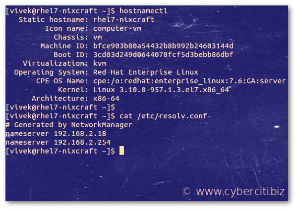
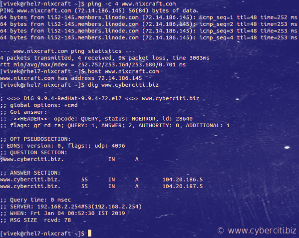
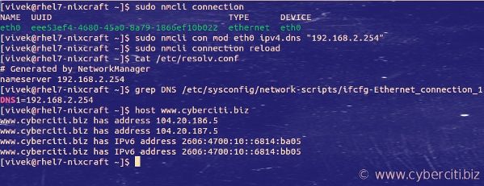

I am a new RHEL 5.x/6.x/7.x sysadmin. How do I change DNS IP address in RHEL using the CLI? What is the procedure to change the DNS IP from 8.8.8.8 to 192.168.2.254 in Red Hat Enterprise Linux desktop or server?

 Introduction – DNS is an acronym for Domain Name Server. It is possible that you set up wrong DNS ip address in RHEL. This page shows how to** change your RHEL server’s DNS IP address** settings from the CLI. 

Procedure to change DNS ip address in RHEL
------------------------------------------

1. Edit the /etc/resolv.conf file with an editor, such as nano or vim in RHEL: **sudo vim /etc/resolv.conf**
2. Set the name servers (DNS IP) that you want to use on RHEL : **nameserver 192.168.2.254**
3. Save and close the file in RHEL
4. Test new settings

How to see the current DNS settings in RHEL
-------------------------------------------

Type the following [cat command](https://www.cyberciti.biz/faq/linux-unix-appleosx-bsd-cat-command-examples/):
`cat /etc/resolv.conf`


RHEL change DNS ip address
--------------------------

Type the following vim command:
`$ sudo vim /etc/resolv.conf`
 OR
`# vim /etc/resolv.conf`
 Edit/update nameserver entry as follows (you can set maximum 3 nameserver IP address):

    ## Change DNS settings on RHEL (Red Hat Enterprise Linux) ##
    nameserver 192.168.2.254
    nameserver 192.168.2.18

Test it using the [ping command](https://www.cyberciti.biz/faq/unix-ping-command-examples/) or [host command](https://www.cyberciti.biz/faq/linux-unix-host-command-examples-usage-syntax/)/[dig command](https://www.cyberciti.biz/faq/linux-unix-dig-command-examples-usage-syntax/):

```
ping -c 4 www.nixcraft.com
host www.nixcraft.com
dig www.cyberciti.biz
```



Changed DNS settings on RHEL? Test new DNS settings with ping, host and dig commands

How to change DNS settings on RHEL using Network Manager
--------------------------------------------------------

Simply run the following nmcli command to connection names:
`$ sudo nmcli connection`
 To set up DNS IP address to 192.168.2.254 and 192.168.2.18, run:
`sudo nmcli con mod {connectionNameHere} ipv4.dns "192.168.2.254 192.168.2.18"`
 In this example just set up DNS IP to 192.168.2.254 from the CLI on RHEL:
`sudo nmcli con mod eth0 ipv4.dns "192.168.2.254"`
 Reload new DNS settings by running any one of the following command:
`sudo systemctl restart NetworkManager.service`
 OR
`sudo nmcli connection reload`
 Verify it by using the [grep command](https://www.cyberciti.biz/faq/howto-use-grep-command-in-linux-unix/) and [cat command](https://www.cyberciti.biz/faq/linux-unix-appleosx-bsd-cat-command-examples/) and [host command](https://www.cyberciti.biz/faq/linux-unix-host-command-examples-usage-syntax/):

```
cat /etc/resolv.conf
grep DNS /etc/sysconfig/network-scripts/ifcfg-Ethernet_connection_1
host www.cyberciti.biz
```



Conclusion
----------

This page described how to change your RHEL server’s DNS IP settings using the CLI.

 🐧 Get the latest tutorials on Linux, Open Source & DevOps via **[RSS feed](https://www.cyberciti.biz/atom/atom.xml)** or **[Weekly email newsletter.](https://newsletter.cyberciti.biz/subscription?f=1ojtmiv8892KQzyMsTF4YPr1pPSAhX2rq7Qfe5DiHMgXwKo892di4MTWyOdd976343rcNR6LhdG1f7k9H8929kMNMdWu3g)**

 🐧 2 comments so far... [add one](https://www.cyberciti.biz/faq/change-dns-ip-address-rhel-redhat-linux/#respond) **↓**

CategoryList of Unix and Linux commandsDisk space analyzers[df](https://www.cyberciti.biz/faq/df-command-examples-in-linux-unix/) • [ncdu](https://www.cyberciti.biz/open-source/install-ncdu-on-linux-unix-ncurses-disk-usage/) • [pydf](https://www.cyberciti.biz/tips/unix-linux-bsd-pydf-command-in-colours.html)File Management[cat](https://www.cyberciti.biz/faq/linux-unix-appleosx-bsd-cat-command-examples/) • [cp](https://www.cyberciti.biz/faq/cp-copy-command-in-unix-examples/) • [mkdir](https://www.cyberciti.biz/faq/linux-make-directory-command/) • [tree](https://www.cyberciti.biz/faq/linux-show-directory-structure-command-line/)Firewall[Alpine Awall](https://www.cyberciti.biz/faq/how-to-set-up-a-firewall-with-awall-on-alpine-linux/) • [CentOS 8](https://www.cyberciti.biz/faq/how-to-set-up-a-firewall-using-firewalld-on-centos-8/) • [OpenSUSE](https://www.cyberciti.biz/faq/set-up-a-firewall-using-firewalld-on-opensuse-linux/) • [RHEL 8 ](https://www.cyberciti.biz/faq/configure-set-up-a-firewall-using-firewalld-on-rhel-8/) • [Ubuntu 16.04](https://www.cyberciti.biz/faq/howto-configure-setup-firewall-with-ufw-on-ubuntu-linux/) • [Ubuntu 18.04](https://www.cyberciti.biz/faq/how-to-setup-a-ufw-firewall-on-ubuntu-18-04-lts-server/) • [Ubuntu 20.04](https://www.cyberciti.biz/faq/how-to-configure-firewall-with-ufw-on-ubuntu-20-04-lts/)Network Utilities[NetHogs](https://www.cyberciti.biz/faq/linux-find-out-what-process-is-using-bandwidth/) • [dig](https://www.cyberciti.biz/faq/linux-unix-dig-command-examples-usage-syntax/) • [host](https://www.cyberciti.biz/faq/linux-unix-host-command-examples-usage-syntax/) • [ip](https://www.cyberciti.biz/faq/linux-ip-command-examples-usage-syntax/) • [nmap](https://www.cyberciti.biz/security/nmap-command-examples-tutorials/)OpenVPN[CentOS 7](https://www.cyberciti.biz/faq/centos-7-0-set-up-openvpn-server-in-5-minutes/) • [CentOS 8](https://www.cyberciti.biz/faq/centos-8-set-up-openvpn-server-in-5-minutes/) • [Debian 10](https://www.cyberciti.biz/faq/debian-10-set-up-openvpn-server-in-5-minutes/) • [Debian 8/9](https://www.cyberciti.biz/faq/install-configure-openvpn-server-on-debian-9-linux/) • [Ubuntu 18.04](https://www.cyberciti.biz/faq/ubuntu-18-04-lts-set-up-openvpn-server-in-5-minutes/) • [Ubuntu 20.04](https://www.cyberciti.biz/faq/ubuntu-20-04-lts-set-up-openvpn-server-in-5-minutes/)Package Manager[apk](https://www.cyberciti.biz/faq/10-alpine-linux-apk-command-examples/) • [apt](https://www.cyberciti.biz/faq/ubuntu-lts-debian-linux-apt-command-examples/)Processes Management[bg](https://www.cyberciti.biz/faq/unix-linux-bg-command-examples-usage-syntax/) • [chroot](https://www.cyberciti.biz/faq/unix-linux-chroot-command-examples-usage-syntax/) • [cron](https://www.cyberciti.biz/faq/how-do-i-add-jobs-to-cron-under-linux-or-unix-oses/) • [disown](https://www.cyberciti.biz/faq/unix-linux-disown-command-examples-usage-syntax/) • [fg](https://www.cyberciti.biz/faq/unix-linux-fg-command-examples-usage-syntax/) • [jobs](https://www.cyberciti.biz/faq/unix-linux-jobs-command-examples-usage-syntax/) • [killall](https://www.cyberciti.biz/faq/unix-linux-killall-command-examples-usage-syntax/) • [kill](https://www.cyberciti.biz/faq/unix-kill-command-examples/) • [pidof](https://www.cyberciti.biz/faq/linux-pidof-command-examples-find-pid-of-program/) • [pstree](https://www.cyberciti.biz/faq/unix-linux-pstree-command-examples-shows-running-processestree/) • [pwdx](https://www.cyberciti.biz/faq/unix-linux-pwdx-command-examples-usage-syntax/) • [time](https://www.cyberciti.biz/faq/unix-linux-time-command-examples-usage-syntax/)Searching[grep](https://www.cyberciti.biz/faq/howto-use-grep-command-in-linux-unix/) • [whereis](https://www.cyberciti.biz/faq/unix-linux-whereis-command-examples-to-locate-binary/) • [which](https://www.cyberciti.biz/faq/unix-linux-which-command-examples-syntax-to-locate-programs/)User Information[groups](https://www.cyberciti.biz/faq/unix-linux-groups-command-examples-syntax-usage/) • [id](https://www.cyberciti.biz/faq/unix-linux-id-command-examples-usage-syntax/) • [lastcomm](https://www.cyberciti.biz/faq/linux-unix-lastcomm-command-examples-usage-syntax/) • [last](https://www.cyberciti.biz/faq/linux-unix-last-command-examples/) • [lid/libuser-lid](https://www.cyberciti.biz/faq/linux-lid-command-examples-syntax-usage/) • [logname](https://www.cyberciti.biz/faq/unix-linux-logname-command-examples-syntax-usage/) • [members](https://www.cyberciti.biz/faq/linux-members-command-examples-usage-syntax/) • [users](https://www.cyberciti.biz/faq/unix-linux-users-command-examples-syntax-usage/) • [whoami](https://www.cyberciti.biz/faq/unix-linux-whoami-command-examples-syntax-usage/) • [who](https://www.cyberciti.biz/faq/unix-linux-w-command-examples-syntax-usage-2/) • [w](https://www.cyberciti.biz/faq/unix-linux-w-command-examples-syntax-usage-2/)WireGuard VPN[Alpine](https://www.cyberciti.biz/faq/how-to-set-up-wireguard-vpn-server-on-alpine-linux/) • [CentOS 8](https://www.cyberciti.biz/faq/centos-8-set-up-wireguard-vpn-server/) • [Debian 10](https://www.cyberciti.biz/faq/debian-10-set-up-wireguard-vpn-server/) • [Firewall](https://www.cyberciti.biz/faq/how-to-set-up-wireguard-firewall-rules-in-linux/) • [Ubuntu 20.04](https://www.cyberciti.biz/faq/ubuntu-20-04-set-up-wireguard-vpn-server/)

Next FAQ: [How To Exit From top Command In Linux / Unix / BSD / OS X](https://www.cyberciti.biz/faq/howto-exit-from-top-command-in-linux-unix/)

Previous FAQ: [Python Delete/Remove a File If Exists On Disk](https://www.cyberciti.biz/faq/python-delete-remove-file-if-exists-on-disk/)