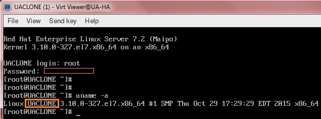

How to clone a KVM virtual Machines and reset the VM – Part 6
=============================================================

December 19, 2015 By [Lingeswaran R](https://www.unixarena.com/author/lingeswaran-r/) [1 Comment](https://www.unixarena.com/2015/12/how-to-clone-a-kvm-virtual-machines-and-reset-the-vm.html/#comments)

If you want to build several VMs with the same OS and configuration, “CLONE ” is the best method to save the time instead of installing operating system on each virtual machines. “virt-clone” is useful binary tool to clone the virtual machines with unique ID and MAC address (When you clone from existing virtual machine). To perform the clone, virtual machine should be in powered off state. You need to perform the host configuration for new VM after the build using Virt-sysprep.

### **Clone the VM:**

1.Login to the KVM host or Management node.

2.List the running VM.

    [root@UA-HA ~]# virsh list
     Id    Name                           State
    ----------------------------------------------------
     18    UAKVM2                         running

    [root@UA-HA ~]#

3.Suspend the source virtual machine. This is a requirement since it ensures that all data and network I/O on the VM is stopped. You can also shutdown the VM .

    [root@UA-HA ~]# virsh suspend UAKVM2
    Domain UAKVM2 suspended

    [root@UA-HA ~]# virsh list
     Id    Name                           State
    ----------------------------------------------------
     18    UAKVM2                         paused
    [root@UA-HA ~]#

4\. Clone the virtual machine.

    [root@UA-HA ~]# virt-clone --connect qemu:///system --original UAKVM2 --name UACLONE --file /var/lib/libvirt/images/UACLONE.qcow2
    WARNING  Setting the graphics device port to autoport, in order to avoid conflicting.
    Allocating 'UACLONE.qcow2'               100% [===================================================]  12 MB/s | 4.0 GB  00:01:19
    Clone 'UACLONE' created successfully.
    [root@UA-HA ~]#

    =================================================|
    Options    |  Value   | Description              |
    =================================================|
    --original | UAKVM2   | Source Virutal Machine   |
    --name     | UACLONE  | New Virtual Machine Name |
    --file     | File_path| New virtual Disk Path    |
    --connect  | qemu:///system | Connect to the KVM hypervisor |
    ==================================================

5\. Resume the source virtual Machine.

    [root@UA-HA ~]# virsh resume UAKVM2
    Domain UAKVM2 resumed
    [root@UA-HA ~]#
    [root@UA-HA ~]#
    [root@UA-HA ~]# virsh list --all
     Id    Name                           State
    ----------------------------------------------------
     18    UAKVM2                         running
     -     UACLONE                        shut off
    [root@UA-HA ~]#

We have successfully clone the existing virtual machine to new VM. But the newly cloned virtual machine will still have the config (Ex: IP , Hostname ) of source machine which needs to be removed.

### **virt-sysprep: Prepare the VM:**

Virt-sysprep resets or un-configures a virtual machine to Fresh OS installation state. Virt-sysprep removes SSH host keys, persistent network MAC configuration, hostname and user accounts. Each step can be enabled or disabled as required. Virt-sysprep modifies the guest or disk image without booting the VM.

**Decontextualize the image – Reset or Un-configure the VM**

    [root@UA-HA ~]# virt-sysprep -d UACLONE
    [   0.0] Examining the guest ...

    [ 171.0] Performing "abrt-data" ...
    [ 171.0] Performing "bash-history" ...
    [ 171.0] Performing "blkid-tab" ...
    [ 171.0] Performing "crash-data" ...
    [ 171.0] Performing "cron-spool" ...
    [ 171.0] Performing "dhcp-client-state" ...
    [ 171.0] Performing "dhcp-server-state" ...
    [ 171.0] Performing "dovecot-data" ...
    [ 171.0] Performing "logfiles" ...
    [ 172.0] Performing "machine-id" ...
    [ 172.0] Performing "mail-spool" ...
    [ 172.0] Performing "net-hostname" ...
    [ 172.0] Performing "net-hwaddr" ...
    [ 172.0] Performing "pacct-log" ...
    [ 172.0] Performing "package-manager-cache" ...
    [ 172.0] Performing "pam-data" ...
    [ 172.0] Performing "puppet-data-log" ...
    [ 172.0] Performing "rh-subscription-manager" ...
    [ 172.0] Performing "rhn-systemid" ...
    [ 172.0] Performing "rpm-db" ...
    [ 172.0] Performing "samba-db-log" ...
    [ 172.0] Performing "script" ...
    [ 172.0] Performing "smolt-uuid" ...
    [ 172.0] Performing "ssh-hostkeys" ...
    [ 172.0] Performing "ssh-userdir" ...
    [ 172.0] Performing "sssd-db-log" ...
    [ 172.0] Performing "tmp-files" ...
    [ 172.0] Performing "udev-persistent-net" ...
    [ 172.0] Performing "utmp" ...
    [ 172.0] Performing "yum-uuid" ...
    [ 172.0] Performing "customize" ...
    [ 172.0] Setting a random seed
    [ 173.0] Performing "lvm-uuids" ...
    [root@UA-HA ~]#
    [root@UA-HA ~]#

Have a look at the following command output to know what are the operations has been performed by virt-sysprep tool.

[root@UA-HA ~]\# virt-sysprep –list-operations

    [root@UA-HA ~]# virt-sysprep --list-operations
    abrt-data * Remove the crash data generated by ABRT
    bash-history * Remove the bash history in the guest
    blkid-tab * Remove blkid tab in the guest
    ca-certificates   Remove CA certificates in the guest
    crash-data * Remove the crash data generated by kexec-tools
    cron-spool * Remove user at-jobs and cron-jobs
    customize * Customize the guest
    dhcp-client-state * Remove DHCP client leases
    dhcp-server-state * Remove DHCP server leases
    dovecot-data * Remove Dovecot (mail server) data
    firewall-rules   Remove the firewall rules
    flag-reconfiguration   Flag the system for reconfiguration
    fs-uuids   Change filesystem UUIDs
    kerberos-data   Remove Kerberos data in the guest
    logfiles * Remove many log files from the guest
    lvm-uuids * Change LVM2 PV and VG UUIDs
    machine-id * Remove the local machine ID
    mail-spool * Remove email from the local mail spool directory
    net-hostname * Remove HOSTNAME in network interface configuration
    net-hwaddr * Remove HWADDR (hard-coded MAC address) configuration
    pacct-log * Remove the process accounting log files
    package-manager-cache * Remove package manager cache
    pam-data * Remove the PAM data in the guest
    puppet-data-log * Remove the data and log files of puppet
    rh-subscription-manager * Remove the RH subscription manager files
    rhn-systemid * Remove the RHN system ID
    rpm-db * Remove host-specific RPM database files
    samba-db-log * Remove the database and log files of Samba
    script * Run arbitrary scripts against the guest
    smolt-uuid * Remove the Smolt hardware UUID
    ssh-hostkeys * Remove the SSH host keys in the guest
    ssh-userdir * Remove ".ssh" directories in the guest
    sssd-db-log * Remove the database and log files of sssd
    tmp-files * Remove temporary files
    udev-persistent-net * Remove udev persistent net rules
    user-account   Remove the user accounts in the guest
    utmp * Remove the utmp file
    yum-uuid * Remove the yum UUID
    [root@UA-HA ~]#

**virt-sysprep Options:**

Virt-sysprep provides the additional option to configure the VM or template.

     -a file                             Add disk image file
      --add file                          Add disk image file
      -c uri                              Set libvirt URI
      --chmod PERMISSIONS:FILE            Change the permissions of a file
      --connect uri                       Set libvirt URI
      -d domain                           Set libvirt guest name
      --debug-gc                          Debug GC and memory allocations (internal)
      --delete PATH                       Delete a file or directory
      --domain domain                     Set libvirt guest name
      --dry-run                           Perform a dry run
      --dryrun                            Perform a dry run
      --dump-pod                          Dump POD (internal)
      --dump-pod-options                  Dump POD for options (internal)
      --edit FILE:EXPR                    Edit file using Perl expression
      --enable operations                 Enable specific operations
      --firstboot SCRIPT                  Run script at first guest boot
      --firstboot-command 'CMD+ARGS'      Run command at first guest boot
      --firstboot-install PKG,PKG..       Add package(s) to install at first boot
      --format format                     Set format (default: auto)
      --hostname HOSTNAME                 Set the hostname
      --install PKG,PKG..                 Add package(s) to install
      --keep-user-accounts users          Users to keep
      --link TARGET:LINK[:LINK..]         Create symbolic links
      --list-operations                   List supported operations
      --long-options                      List long options
      --mkdir DIR                         Create a directory
      --mount-options opts                Set mount options (eg /:noatime;/var:rw,noatime)
      -n                                  Perform a dry run
      --no-logfile                        Scrub build log file
      --no-selinux-relabel                Compatibility option, does nothing
      --operation                         Enable/disable specific operations
      --operations                        Enable/disable specific operations
      --password USER:SELECTOR            Set user password
      --password-crypto md5|sha256|sha512 Set password crypto
      -q                                  Don't print log messages
      --quiet                             Don't print log messages
      --remove-user-accounts users        Users to remove
      --root-password SELECTOR            Set root password
      --run SCRIPT                        Run script in disk image
      --run-command 'CMD+ARGS'            Run command in disk image
      --script script                     Script or program to run on guest
      --scriptdir dir                     Mount point on host
      --scrub FILE                        Scrub a file
      --selinux-relabel                   Relabel files with correct SELinux labels
      --timezone TIMEZONE                 Set the default timezone
      --update                            Update core packages
      --upload FILE:DEST                  Upload local file to destination
      -v                                  Enable debugging messages
      -V                                  Display version and exit
      --verbose                           Enable debugging messages
      --version                           Display version and exit
      --write FILE:CONTENT                Write file
      -x                                  Enable tracing of libguestfs calls
      -help                               Display this list of options
      --help                              Display this list of options

Let’s set the root password and hostname using virt-sysprep.

    [root@UA-HA ~]# virt-sysprep -d UACLONE  --hostname UACLONE --root-password password:123456
    [   0.0] Examining the guest ...
    [  32.0] Performing "abrt-data" ...
    [  32.0] Performing "bash-history" ...
    [  32.0] Performing "blkid-tab" ...
    [  32.0] Performing "crash-data" ...
    [  32.0] Performing "cron-spool" ...
    [  32.0] Performing "dhcp-client-state" ...
    [  32.0] Performing "dhcp-server-state" ...
    [  32.0] Performing "dovecot-data" ...
    [  32.0] Performing "logfiles" ...
    [  33.0] Performing "machine-id" ...
    [  33.0] Performing "mail-spool" ...
    [  33.0] Performing "net-hostname" ...
    [  33.0] Performing "net-hwaddr" ...
    [  33.0] Performing "pacct-log" ...
    [  33.0] Performing "package-manager-cache" ...
    [  33.0] Performing "pam-data" ...
    [  33.0] Performing "puppet-data-log" ...
    [  33.0] Performing "rh-subscription-manager" ...
    [  33.0] Performing "rhn-systemid" ...
    [  33.0] Performing "rpm-db" ...
    [  33.0] Performing "samba-db-log" ...
    [  33.0] Performing "script" ...
    [  33.0] Performing "smolt-uuid" ...
    [  33.0] Performing "ssh-hostkeys" ...
    [  33.0] Performing "ssh-userdir" ...
    [  33.0] Performing "sssd-db-log" ...
    [  33.0] Performing "tmp-files" ...
    [  33.0] Performing "udev-persistent-net" ...
    [  33.0] Performing "utmp" ...
    [  33.0] Performing "yum-uuid" ...
    [  33.0] Performing "customize" ...
    [  33.0] Setting a random seed
    [  33.0] Setting the hostname: UACLONE
    [  33.0] Setting passwords
    [  36.0] Performing "lvm-uuids" ...
    [root@UA-HA ~]#

**Power on the VM:**

1\. Power on the New VM

    [root@UA-HA ~]# virsh list --all
     Id    Name                           State
    ----------------------------------------------------
     18    UAKVM2                         running
     -     UACLONE                        shut off
    [root@UA-HA ~]# virsh start UACLONE
    Domain UACLONE started

    [root@UA-HA ~]#

2\. check the VM’s status

    [root@UA-HA ~]# virsh list
     Id    Name                           State
    ----------------------------------------------------
     18    UAKVM2                         running
     28    UACLONE                        running

    [root@UA-HA ~]#

3\. Launch virt-viewer to view the UACLONE console.

    [root@UA-HA ~]# virt-viewer 28        ------> 28 is VM ID 

    ** (virt-viewer:10053): WARNING **: Couldn't connect to accessibility bus: Failed to connect to socket /tmp/dbus-6XZ1eVgijP: Connection refused

    (virt-viewer:10053): Gdk-CRITICAL **: gdk_window_set_cursor: assertion 'GDK_IS_WINDOW (window)' failed

4\. Verify the hostname of UACLONE. You can see that “virt-sysprep” has made the settings.

[virt-sysprep – VM changes](https://www.unixarena.com/wp-content/uploads/2015/12/virt-syspref-proof.jpg)

[Looks good. We have successfully cloned the existing VM and reset the config of the clone VM using “virt-sysprep”.](https://www.unixarena.com/wp-content/uploads/2015/12/virt-syspref-proof.jpg)

[Hope this article is informative to you.](https://www.unixarena.com/wp-content/uploads/2015/12/virt-syspref-proof.jpg)