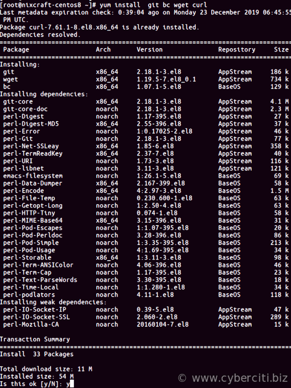
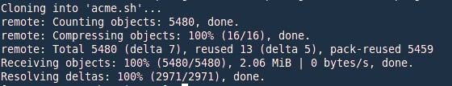

How do I secure my Nginx web server with Let’s Encrypt free ssl certificate on my CentOS 8 server? How to set up and configure Nginx with Let’s Encrypt on CentOS 8?

 Let’s Encrypt is a free, automated, and open certificate authority for your website, email server and more. This page shows how to use Let’s Encrypt to install certificate for Nginx web server get SSL labs A+ score on a CentOS 8\. 

How to secure Nginx with Let’s Encrypt on CentOS 8
--------------------------------------------------

The procedure is as follows to obtaining an SSL certificate:

1. Get acme.sh software:
git clone https://github.com/Neilpang/acme.sh.git
2. Create nginx config for your domain:
vi /etc/nginx/conf.d/your-domain-name.conf
3. Obtain an SSL certificate your domain:
acme.sh --issue -d your-domain-name --nginx
4. Configure TLS/SSL on Nginx:
vi /etc/nginx/conf.d/your-domain-name.conf
5. Setup cron job setup for auto renewal
6. Open port 443 (HTTPS) using Firwalld on CentOS 8:
sudo firewall-cmd --add-service=https

Let us see how to install [acme.sh client](https://github.com/Neilpang/acme.sh) and use it on a CentOS 8 to get an SSL certificate from Let’s Encrypt.

Step 1 – Install the required software
--------------------------------------

Install the git, wget, curl and bc packages with the [yum command](https://www.cyberciti.biz/faq/rhel-centos-fedora-linux-yum-command-howto/):
`sudo yum install git bc wget curl socat`


Step 2 – Install acme.sh Let’s Encrypt client
---------------------------------------------

Clone the repo:

```
cd /tmp/
git clone https://github.com/Neilpang/acme.sh.git
```

[](https://www.cyberciti.biz/media/new/faq/2018/01/clone-acme.sh-git.jpg)
 Install acme.sh client on to your system, run:

```
cd acme.sh/
sudo -i ## be root user ##
./acme.sh --install
```


 After install, you must close current terminal and reopen again to make the alias take effect. Or simply type the following [source command](https://bash.cyberciti.biz/guide/Source_command):
`sudo source ~/.bashrc`
 Verify installation by printing version number:

```
acme.sh --version
https://github.com/Neilpang/acme.sh
v2.8.4
```

Step 3 – Basic nginx config for http server
-------------------------------------------

I am going to create a new config for domain named c8nginx.cyberciti.biz (feel free to replace c8nginx.cyberciti.biz with your actual domain name) as follows:
`# vi /etc/nginx/conf.d/c8nginx.cyberciti.biz.conf`
 Append the following code:

    # http port 80
    server {
        listen      80;
        server_name c8nginx.cyberciti.biz;
        access_log  /var/log/nginx/http_c8nginx.cyberciti.biz_access.log;
        error_log   /var/log/nginx/http_c8nginx.cyberciti.biz_error.log;
        root        /usr/share/nginx/html;
    }

[Save and close the file](https://www.cyberciti.biz/faq/save-file-in-vi-vim-linux-apple-macos-unix-bsd/). Test [nginx set up and reload the nginx server](https://www.cyberciti.biz/faq/nginx-linux-restart/) as follows:

```
# nginx -t
# systemctl restart nginx.service
```

Step 4 – Create dhparams.pem file
---------------------------------

Run openssl command but create a new directory using the [mkdir command](https://www.cyberciti.biz/faq/linux-make-directory-command/):

```
# mkdir -pv /etc/nginx/ssl/cyberciti.biz/
# cd /etc/nginx/ssl/cyberciti.biz/
# openssl dhparam -out dhparams.pem -dsaparam 4096
```

 See “[how to speed up OpenSSL/GnuPG Entropy For Random Number Generation On Linux](https://www.cyberciti.biz/open-source/debian-ubuntu-centos-linux-setup-additional-entropy-for-server-using-aveged-rng-tools-utils/)” for more info.

Step 5 – Obtain a certificate for domain
----------------------------------------

Issue a certificate for your domain:

```
sudo acme.sh --issue -d c8nginx.cyberciti.biz -k 2048 --nginx
## for two domains ##
sudo acme.sh --issue -d c8nginx.cyberciti.biz -d www.cyberciti.biz -k 2048 --nginx
## get certs for three domains ##
sudo acme.sh --issue -d cyberciti.biz -d c8nginx.cyberciti.biz -d www.cyberciti.biz -k 2048 --nginx
## let us get cert for c8nginx.cyberciti.biz domain only ##
sudo acme.sh --issue -d c8nginx.cyberciti.biz -k 4096 --nginx
```


Step 6 – Configure Nginx
------------------------

You just successfully requested an SSL Certificate from Let’s Encrypt for your CentOS 8 Linux server. It is time to configure it. Update for ssl config as follows:
`$ sudo vi /etc/nginx/conf.d/c8nginx.cyberciti.biz.conf`
 Append the following config:

    ## http port 80: START http://c8nginx.cyberciti.biz/ config ##
    server {
        listen 80;
        listen [::]:80;
        access_log  /var/log/nginx/http_c8nginx.cyberciti.biz_access.log;
        error_log   /var/log/nginx/http_c8nginx.cyberciti.biz_error.log;
        server_name c8nginx.cyberciti.biz;
        root        /usr/share/nginx/html;
        #
        # redirect all HTTP requests to HTTPS with a 301 Moved Permanently response.
        #
        return 301 https://$host$request_uri;
    }

    ## https port 443: START https://c8nginx.cyberciti.biz/ config ##
    server {
        listen 443 ssl http2;
        listen [::]:443 ssl http2;
        server_name c8nginx.cyberciti.biz;
        root /usr/share/nginx/html;

        # certs sent to the client in SERVER HELLO are concatenated in ssl_certificate
        ssl_certificate  /etc/nginx/ssl/cyberciti.biz/c8nginx.cyberciti.biz.cer;
        ssl_certificate_key /etc/nginx/ssl/cyberciti.biz/c8nginx.cyberciti.biz.key;
        ssl_session_timeout 1d;
        ssl_session_cache shared:MozSSL:10m;  # about 40000 sessions
        ssl_session_tickets off;

        ssl_dhparam /etc/nginx/ssl/cyberciti.biz/dhparams.pem;

        #
        # Supports Firefox 27, Android 4.4.2, Chrome 31, Edge, IE 11 on Windows 7, Java 8u31, OpenSSL 1.0.1, Opera 20, and Safari 9 and above
        #
        ssl_protocols TLSv1.2 TLSv1.3;
        ssl_ciphers ECDHE-ECDSA-AES128-GCM-SHA256:ECDHE-RSA-AES128-GCM-SHA256:ECDHE-ECDSA-AES256-GCM-SHA384:ECDHE-RSA-AES256-GCM-SHA384:ECDHE-ECDSA-CHACHA20-POLY1305:ECDHE-RSA-CHACHA20-POLY1305:DHE-RSA-AES128-GCM-SHA256:DHE-RSA-AES256-GCM-SHA384;
        ssl_prefer_server_ciphers off;

        # HSTS (ngx_http_headers_module is required) (63072000 seconds)
        add_header Strict-Transport-Security "max-age=63072000" always;

        # OCSP stapling
        ssl_stapling on;
        ssl_stapling_verify on;

        # replace with the IP address of your resolver
        resolver 8.8.8.8;

        ## add other config below such as fastcgi or php and so on ##
    }

[Save and close the file in vi](https://www.cyberciti.biz/faq/save-file-in-vi-vim-linux-apple-macos-unix-bsd/)/vim text editor.

Step 7 – Install certificate
----------------------------

Install the issued cert to nginx server:

```
# acme.sh --installcert -d c8nginx.cyberciti.biz \
--key-file /etc/nginx/ssl/cyberciti.biz/c8nginx.cyberciti.biz.key \
--fullchain-file /etc/nginx/ssl/cyberciti.biz/c8nginx.cyberciti.biz.cer \
--reloadcmd 'systemctl reload nginx.service'
```


 Make sure port os open with the ss command or netstat command:
`# ss -tulpn`

Step 7 – Firewall configuration
-------------------------------

You need [to open port 443 (HTTPS) on your server so that clients can connect it using Firewalld](https://www.cyberciti.biz/faq/how-to-set-up-a-firewall-using-firewalld-on-centos-8/). Update the rules as follows:

```
$ sudo firewall-cmd --add-service=https
$ sudo firewall-cmd --runtime-to-permanent
```

Step 8 – Test it
----------------

Fire a web browser and type your domain such as:
`https://c8nginx.cyberciti.biz`
 Test it with SSLlabs test site:
`https://www.ssllabs.com/ssltest/analyze.html?d=c8nginx.cyberciti.biz`


Step 9 – acme.sh commands
-------------------------

List all certificates:
`# acme.sh --list`
 Sample outputs:

    Main_Domain            KeyLength  SAN_Domains  Created                       Renew
    c8nginx.cyberciti.biz  "4096"     no           Mon Dec 30 16:57:10 UTC 2019  Fri Feb 28 16:57:10 UTC 2020

Renew a cert for domain named c8nginx.cyberciti.biz:
`# acme.sh --renew -d c8nginx.cyberciti.biz`
 Please note that [a cron job will try to do renewal a certificate](https://www.cyberciti.biz/faq/how-do-i-add-jobs-to-cron-under-linux-or-unix-oses/) for you too. This is installed by default as follows (no action required on your part). To see job run:
`# crontab -l`
 Sample outputs:

    8 0 * * * "/root/.acme.sh"/acme.sh --cron --home "/root/.acme.sh" > /dev/null

Upgrade acme.sh client:
`# acme.sh --upgrade`
 Getting help:
`# acme.sh --help | more`

This entry is **3** of **3** in the ** Linux, Nginx, MySQL, PHP (LEMP) Stack for **CentOS 8** Tutorial** series. Keep reading the rest of the series:

1. [Nginx on CentOS 8](https://www.cyberciti.biz/faq/how-to-install-and-use-nginx-on-centos-8/)
2. [PHP 7.x on CentOS 8 For Nginx](https://www.cyberciti.biz/faq/install-php-7-x-on-centos-8-for-nginx/)
3. Setup Let's Encrypt on CentOS 8 for Nginx

This entry is **7** of **13** in the **Secure Web Server with Let's Encrypt Tutorial** series. Keep reading the rest of the series:

1. [Set up Lets Encrypt on Debian/Ubuntu Linux](https://www.cyberciti.biz/faq/how-to-configure-nginx-with-free-lets-encrypt-ssl-certificate-on-debian-or-ubuntu-linux/)
2. [Secure **Lighttpd** with Lets Encrypt certificate on Debian/Ubuntu](https://www.cyberciti.biz/faq/how-to-configure-lighttpd-web-server-with-free-lets-encrypt-ssl-certificate-on-debian-or-ubuntu-linux/)
3. [Configure **Nginx** with Lets Encrypt certificate on **Alpine** Linux](https://www.cyberciti.biz/faq/how-to-install-letsencrypt-free-ssltls-for-nginx-certificate-on-alpine-linux/)
4. [**Nginx** with Lets Encrypt on **CentOS 7**](https://www.cyberciti.biz/faq/how-to-secure-nginx-lets-encrypt-on-centos-7/)
5. [**Apache** with Lets Encrypt Certificates on **RHEL 8**](https://www.cyberciti.biz/faq/how-to-secure-apache-with-lets-encrypt-certificates-on-rhel-8/)
6. [**CentOS 8** and **Apache** with Lets Encrypt Certificates](https://www.cyberciti.biz/faq/apache-with-lets-encrypt-certificates-on-centos-8/)
7. Install Lets Encrypt certificates on **CentOS 8** for **Nginx**
8. [Forcefully renew Let's Encrypt certificate](https://www.cyberciti.biz/faq/how-to-forcefully-renew-lets-encrypt-certificate/)
9. [**OpenSUSE Linux** and Nginx with Let's Encrypt Certificates](https://www.cyberciti.biz/faq/how-to-secure-nginx-with-lets-encrypt-on-opensuse-15-1-15-2/)
10. [Configure Nginx to use TLS 1.2 / 1.3 only](https://www.cyberciti.biz/faq/configure-nginx-to-use-only-tls-1-2-and-1-3/)
11. [Let's Encrypt **wildcard certificate** with acme.sh and **Cloudflare DNS**](https://www.cyberciti.biz/faq/issue-lets-encrypt-wildcard-certificate-with-acme-sh-and-cloudflare-dns/)
12. [Nginx with Let's Encrypt on Ubuntu 18.04 with DNS Validation](https://www.cyberciti.biz/faq/secure-nginx-with-lets-encrypt-on-ubuntu-18-04-with-dns-validation/)
13. [AWS **Route 53** Let's Encrypt wildcard certificate with acme.sh](https://www.cyberciti.biz/faq/route-53-lets-encrypt-wildcard-certificate-with-acme-sh/)

 🐧 Get the latest tutorials on Linux, Open Source & DevOps via **[RSS feed](https://www.cyberciti.biz/atom/atom.xml)** or **[Weekly email newsletter.](https://newsletter.cyberciti.biz/subscription?f=1ojtmiv8892KQzyMsTF4YPr1pPSAhX2rq7Qfe5DiHMgXwKo892di4MTWyOdd976343rcNR6LhdG1f7k9H8929kMNMdWu3g)**

 🐧 0 comments... [add one](https://www.cyberciti.biz/faq/configure-nginx-with-lets-encrypt-on-centos-8/#respond) **↓**

CategoryList of Unix and Linux commandsDisk space analyzers[df](https://www.cyberciti.biz/faq/df-command-examples-in-linux-unix/) • [ncdu](https://www.cyberciti.biz/open-source/install-ncdu-on-linux-unix-ncurses-disk-usage/) • [pydf](https://www.cyberciti.biz/tips/unix-linux-bsd-pydf-command-in-colours.html)File Management[cat](https://www.cyberciti.biz/faq/linux-unix-appleosx-bsd-cat-command-examples/) • [cp](https://www.cyberciti.biz/faq/cp-copy-command-in-unix-examples/) • [mkdir](https://www.cyberciti.biz/faq/linux-make-directory-command/) • [tree](https://www.cyberciti.biz/faq/linux-show-directory-structure-command-line/)Firewall[Alpine Awall](https://www.cyberciti.biz/faq/how-to-set-up-a-firewall-with-awall-on-alpine-linux/) • [CentOS 8](https://www.cyberciti.biz/faq/how-to-set-up-a-firewall-using-firewalld-on-centos-8/) • [OpenSUSE](https://www.cyberciti.biz/faq/set-up-a-firewall-using-firewalld-on-opensuse-linux/) • [RHEL 8 ](https://www.cyberciti.biz/faq/configure-set-up-a-firewall-using-firewalld-on-rhel-8/) • [Ubuntu 16.04](https://www.cyberciti.biz/faq/howto-configure-setup-firewall-with-ufw-on-ubuntu-linux/) • [Ubuntu 18.04](https://www.cyberciti.biz/faq/how-to-setup-a-ufw-firewall-on-ubuntu-18-04-lts-server/) • [Ubuntu 20.04](https://www.cyberciti.biz/faq/how-to-configure-firewall-with-ufw-on-ubuntu-20-04-lts/)Network Utilities[NetHogs](https://www.cyberciti.biz/faq/linux-find-out-what-process-is-using-bandwidth/) • [dig](https://www.cyberciti.biz/faq/linux-unix-dig-command-examples-usage-syntax/) • [host](https://www.cyberciti.biz/faq/linux-unix-host-command-examples-usage-syntax/) • [ip](https://www.cyberciti.biz/faq/linux-ip-command-examples-usage-syntax/) • [nmap](https://www.cyberciti.biz/security/nmap-command-examples-tutorials/)OpenVPN[CentOS 7](https://www.cyberciti.biz/faq/centos-7-0-set-up-openvpn-server-in-5-minutes/) • [CentOS 8](https://www.cyberciti.biz/faq/centos-8-set-up-openvpn-server-in-5-minutes/) • [Debian 10](https://www.cyberciti.biz/faq/debian-10-set-up-openvpn-server-in-5-minutes/) • [Debian 8/9](https://www.cyberciti.biz/faq/install-configure-openvpn-server-on-debian-9-linux/) • [Ubuntu 18.04](https://www.cyberciti.biz/faq/ubuntu-18-04-lts-set-up-openvpn-server-in-5-minutes/) • [Ubuntu 20.04](https://www.cyberciti.biz/faq/ubuntu-20-04-lts-set-up-openvpn-server-in-5-minutes/)Package Manager[apk](https://www.cyberciti.biz/faq/10-alpine-linux-apk-command-examples/) • [apt](https://www.cyberciti.biz/faq/ubuntu-lts-debian-linux-apt-command-examples/)Processes Management[bg](https://www.cyberciti.biz/faq/unix-linux-bg-command-examples-usage-syntax/) • [chroot](https://www.cyberciti.biz/faq/unix-linux-chroot-command-examples-usage-syntax/) • [cron](https://www.cyberciti.biz/faq/how-do-i-add-jobs-to-cron-under-linux-or-unix-oses/) • [disown](https://www.cyberciti.biz/faq/unix-linux-disown-command-examples-usage-syntax/) • [fg](https://www.cyberciti.biz/faq/unix-linux-fg-command-examples-usage-syntax/) • [jobs](https://www.cyberciti.biz/faq/unix-linux-jobs-command-examples-usage-syntax/) • [killall](https://www.cyberciti.biz/faq/unix-linux-killall-command-examples-usage-syntax/) • [kill](https://www.cyberciti.biz/faq/unix-kill-command-examples/) • [pidof](https://www.cyberciti.biz/faq/linux-pidof-command-examples-find-pid-of-program/) • [pstree](https://www.cyberciti.biz/faq/unix-linux-pstree-command-examples-shows-running-processestree/) • [pwdx](https://www.cyberciti.biz/faq/unix-linux-pwdx-command-examples-usage-syntax/) • [time](https://www.cyberciti.biz/faq/unix-linux-time-command-examples-usage-syntax/)Searching[grep](https://www.cyberciti.biz/faq/howto-use-grep-command-in-linux-unix/) • [whereis](https://www.cyberciti.biz/faq/unix-linux-whereis-command-examples-to-locate-binary/) • [which](https://www.cyberciti.biz/faq/unix-linux-which-command-examples-syntax-to-locate-programs/)User Information[groups](https://www.cyberciti.biz/faq/unix-linux-groups-command-examples-syntax-usage/) • [id](https://www.cyberciti.biz/faq/unix-linux-id-command-examples-usage-syntax/) • [lastcomm](https://www.cyberciti.biz/faq/linux-unix-lastcomm-command-examples-usage-syntax/) • [last](https://www.cyberciti.biz/faq/linux-unix-last-command-examples/) • [lid/libuser-lid](https://www.cyberciti.biz/faq/linux-lid-command-examples-syntax-usage/) • [logname](https://www.cyberciti.biz/faq/unix-linux-logname-command-examples-syntax-usage/) • [members](https://www.cyberciti.biz/faq/linux-members-command-examples-usage-syntax/) • [users](https://www.cyberciti.biz/faq/unix-linux-users-command-examples-syntax-usage/) • [whoami](https://www.cyberciti.biz/faq/unix-linux-whoami-command-examples-syntax-usage/) • [who](https://www.cyberciti.biz/faq/unix-linux-w-command-examples-syntax-usage-2/) • [w](https://www.cyberciti.biz/faq/unix-linux-w-command-examples-syntax-usage-2/)WireGuard VPN[Alpine](https://www.cyberciti.biz/faq/how-to-set-up-wireguard-vpn-server-on-alpine-linux/) • [CentOS 8](https://www.cyberciti.biz/faq/centos-8-set-up-wireguard-vpn-server/) • [Debian 10](https://www.cyberciti.biz/faq/debian-10-set-up-wireguard-vpn-server/) • [Firewall](https://www.cyberciti.biz/faq/how-to-set-up-wireguard-firewall-rules-in-linux/) • [Ubuntu 20.04](https://www.cyberciti.biz/faq/ubuntu-20-04-set-up-wireguard-vpn-server/)