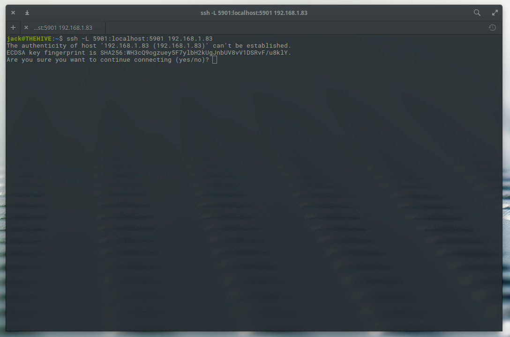

 Image: Jack Wallen 

There are times when you need to remote into a Linux desktop. When that need arises, the most obvious choice of connection is VNC. But what happens when your company (or your home) network doesn't allow the default VNC port (5901) to remain open? How do you get in?

Fortunately, you have Secure Shell (SSH) to lean on. With this handy networking tool, you can tunnel VNC through SSH, so not only are you not punching through the VNC port, but you're sending all data through an encrypted tunnel.

It's actually quite simple to do. You will instruct SSH to create a local tunnel that forwards localhost on port 5901 to a remote machine's port 5901, only through the default SSH port (22). That, of course, means you must have access to the remote machine, via port 22\. If you don't have access to the remote machine, through SSH, this won't work.

**SEE: [Information security policy template download](http://www.techproresearch.com/downloads/information-security-policy/) (Tech Pro Research)**

What you need
-------------

[](https://adclick.g.doubleclick.net/pcs/click%253Fxai%253DAKAOjsu-gBF5YPAZO0r-M0t465WzPThX0Jw1KAO1nnKnktZR-vKQ8tXjNr61MCyPM_wJrDM2ZjG8jMuzFFlzDzf-QMtwkFv2ovo4vD76QEVF92_cGV485FkmV9XSlu1Y90fb0yQzLJsiVJlc-ZrDBk87VUwOoJWvDMyWUZBMkmXo1hYS9l3ahT9pX3Uk6VVH0TyBjzCouhmvLw_7PId6Siy_twBf7l_oJd2Vcz6cAc4fJ4mQAT5AnTpH0Ne209ezKqdkgnGYMPCEc13ZZSzqqWVo-m2IkWEg0pQJMvCbMqW7AR7OOIGm1QNhvP3dDN1_%2526sai%253DAMfl-YQgtvn76Ujp-58l0rLSVxE-Ej767jVkvllDvXi26aWUOm_ohTvadfPmpR1fR5Uh2MDqMir3QJJT-K-8MKqSd7JuVgCuYZJVTj5JTqWFe84ukXhqs5KmWfcA23nVrss%2526sig%253DCg0ArKJSzC9D3PBT1RcyEAE%2526fbs_aeid%253D%255Bgw_fbsaeid%255D%2526urlfix%253D1%2526adurl%253Dhttps://lnk.techrepublic.com/redir?edition=en&ursuid=&devicetype=desktop&pagetype=&assettitle=&assettype=&topicguid=&viewguid=&docid=33171880&promo=1064&ftag_cd=TRE-00-10aaa4e&spotname=dfp-in-article&destUrl=https%253A%252F%252Fwww.techrepublic.com%252Fresource-library%252Fwhitepapers%252Fnginx-finds-out-the-truth-about-your-apps-the-good-the-bad-and-the-ugly%252F%253Fpromo%253D1064%2526ftag%253DTRE-00-10aaa4e%2526cval%253Ddfp-in-article%2526tid%253D306211452088051503&ctag=medc-proxy&siteId=&rsid=cbsitechrepublicsite&sl=&sc=us&assetguid=&q=&cval=33171880;1064&ttag=&bhid=&poolid=&tid=306211452088051503)

Here, The NGINX investigative team uncover the APPsolute best and worst of your shopping, dating and government apps. We discover how a scalable, flexible and secure real-time API solution is the lifeline of any high-traffic application. And we also find out why security is an integral part of all modern applications. Finally, we dig deep to into the machine behind high intensity applications: Microservices. 

[Resource Center](https://www.techrepublic.com/resource-library/content-type/resourcecenter/) provided by [ NGINX](https://www.techrepublic.com/resource-library/company/nginx/)

Chances are, you have everything you need already installed. This task will require the following:

* Local machine: SSH and a VNC viewer
* Remote machine: Openssh-server and a VNC server (such as [TightVNC](https://www.tightvnc.com/))

I will assume you already have everything you need installed, and your VNC server is running and accepting connections.

Create the tunnel
-----------------

The first thing to do is create the tunnel that routes packets from localhost (at port 5901) to the remote host (at port 5901) through port 22\. This is done with a single command:

    ssh -L 5901:localhost:5901 REMOTE_IP

Where REMOTE\_IP is the IP address of the remote host.

If you've never SSH'd to this remote host, you will be asked if you want to add the remote host to your local *~/.ssh/known\_hosts* file (**Figure A**).

**Figure A**

Making a first connection with SSH.

Type yes and hit Enter on your keyboard. You will then be prompted for the remote user's password. This will assume you have the same username on both local and remote machines. If you do not, you can always add the remote username like so:

    ssh -L 5901:localhost:5901 USER@REMOTE_IP

Where USER is the remote username and REMOTE\_IP is the remote IP address.

**Note: **For an even more secure connection, I suggest you make use of SSH Key Authentication. (**See: [How to set up ssh key authentication](https://www.techrepublic.com/article/how-to-setup-ssh-key-authentication/)**.)

Connecting your VNC Client
--------------------------

Now you need to fire up your VNC client. It won't matter what client you use. What does matter, however, is the address you use to make the connection. Instead of entering, say, 192.168.1.83:5901 for the remote address, enter localhost:5901\. Why? Because we've created an SSH tunnel from localhost:5901 to REMOTE\_IP:5901 (where REMOTE\_IP is the IP address of the remote machine). Once you click connect, your VNC client will use the encrypted SSH tunnel and make the connection between local and remote machines on port 5901\. You should then be able to work on the remote desktop, using VNC, thanks to SSH.

Not only is your VNC connection good to go, but it's also more secure than if you had simply used the default VNC port. Enjoy tunnelling VNC through SSH.

### Cybersecurity Insider Newsletter

 Strengthen your organization's IT security defenses by keeping abreast of the latest cybersecurity news, solutions, and best practices. Delivered Tuesdays and Thursdays 

[ Sign up today ]()

Also see
--------

* [How to run remote commands on multiple Linux servers with Parallel-SSH](https://www.techrepublic.com/article/how-to-run-remote-commands-on-multiple-linux-servers-with-parallel-ssh/) (TechRepublic)
* [EasySSH is your next favorite GUI SSH client](https://www.techrepublic.com/article/eashssh-is-your-next-favorite-gui-ssh-client/) (TechRepublic)
* [How to scan for IP addresses on your network with Linux](https://www.techrepublic.com/article/how-to-scan-for-ip-addresses-on-your-network-with-linux/) (TechRepublic)
* [How to install fail2ban on Ubuntu Server 18.04](https://www.techrepublic.com/article/how-to-install-fail2ban-on-ubuntu-server-18-04/) (TechRepublic)
* [SCP implementations impacted by 36-years-old security flaws](https://www.zdnet.com/article/scp-implementations-impacted-by-36-years-old-security-flaws/) (ZDNet)
* [Online security 101: Tips for protecting your privacy from hackers and spies](https://www.zdnet.com/article/simple-security-step-by-step-guide/) (ZDNet)
* [The best password managers of 2018](https://www.cnet.com/news/the-best-password-managers-directory/?ftag=CMG-01-10aaa1c) (CNET)
* [Cybersecurity and cyberwar: More must-read coverage](https://flipboard.com/@techrepublic/cybersecurity-and-cyberwar-r36o4ug0z) (TechRepublic on Flipboard)