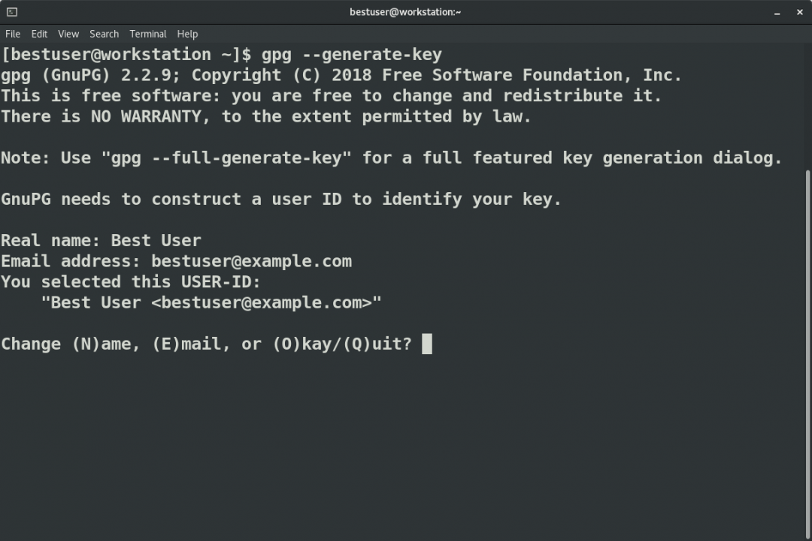
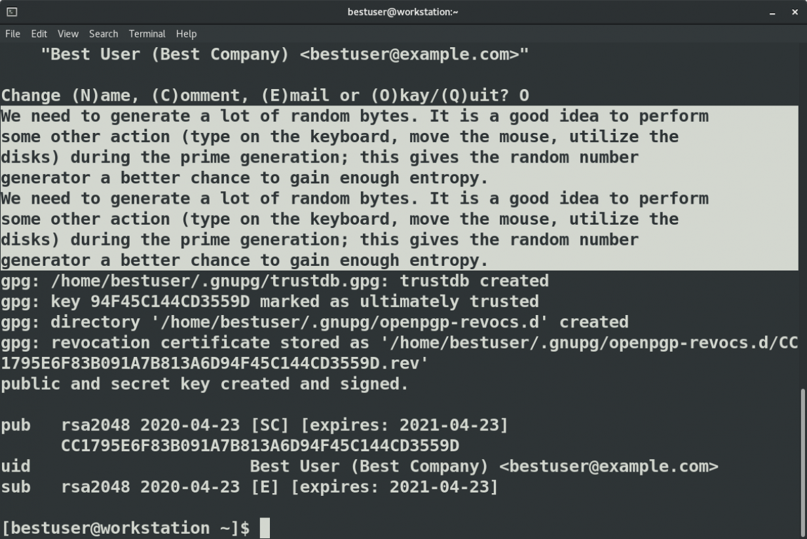

# How to create GPG keypairs

Creating GPG keypairs in Linux is a simple process, but understanding how it works can enhance your security.

Posted: May 26, 2020 | by[Susan Lauber](https://www.redhat.com/sysadmin/users/slauber)

Image 


Photo by [Ylanite Koppens](https://www.pexels.com/@nietjuh?utm_content=attributionCopyText&utm_medium=referral&utm_source=pexels) from [Pexels](https://www.pexels.com/photo/antique-crumpled-crumpled-paper-dirty-612800/?utm_content=attributionCopyText&utm_medium=referral&utm_source=pexels)

Previously, in [Getting Started with GnuPG](https://www.redhat.com/sysadmin/getting-started-gnupg), I explained how to import a public key to encrypt a file and verify a signature. Now learn how to create your own GPG key pair, add an email address, and export the public key.

Creating a GPG keypair

To receive an encrypted file that only you can open, you first need to create a key pair and then share your public key. Creating the key pair is similar to [creating ssh keys](https://www.redhat.com/sysadmin/passwordless-ssh) in that you choose a key size, specify an identifier, and set a passphrase.

The `gpg` command has three options for creating a key pair:

* The `--quick-generate-key` option requires you to specify the USER-ID field on the command line and optionally an algorithm, usage, and expire date. It implements defaults for all other options.
* The `--generate-key` option prompts for the real name and email fields before asking for a confirmation to proceed. In addition to creating the key, it also stores a revocation certificate.
* The `--full-generate-key` option, demonstrated below, provides a dialog for all options.

Image 



The `quick` and `full` generate options can also be used in a batch mode as documented in the `man` page.

Let's describe the options on the `full` generate option:

```
$ gpg --full-generate-key
Please select what kind of key you want:
   (1) RSA and RSA (default)
   (2) DSA and Elgamal
   (3) DSA (sign only)
   (4) RSA (sign only)
Your selection?
```

The first question is what kind of key algorithm you want. Defaults are that for a reason. Unless you have a company policy that specifies otherwise, choose the default of RSA and RSA for your multi-use or email exchange key pair.

```
RSA keys may be between 1024 and 4096 bits long.
What keysize do you want? (2048)
```

Next is the key size. Longer is not always better, but I would definitely go with 2048 or 4096\. The Fedora and Red Hat security keys we imported in the last article are both 4096 in length.

```
Please specify how long the key should be valid.
         0 = key does not expire
      <n>  = key expires in n days
      <n>w = key expires in n weeks
      <n>m = key expires in n months
      <n>y = key expires in n years
Key is valid for? (0)
```

Check company policies for how long the key should be valid. Then consider your security habits as well. Notice the default is "does not expire." I usually go with years for an email key. For signing keys, I think about the expected lifetime of the objects I am signing. If you don't expire the key, it is never automatically revoked even if the private key is compromised. If you do expire the key, you need a plan to update and rotate keys before the expiration. You are asked to confirm your selection before continuing.

The next set of prompts constructs the identity.

```
GnuPG needs to construct a user ID to identify your key.

Real name: Best User
Email address: bestuser@example.com
Comment: Best Company
You selected this USER-ID:
    "Best User (Best Company) <bestuser@example.com>"

Change (N)ame, (C)omment, (E)mail or (O)kay/(Q)uit?
```

The Real name is the name of a person, company, or product. Email address is the contact email for the key, and the optional Comment can identify a company, use, or version. You can use the `gpg --list-keys` command to view some of the identities for imported keys. Here are a few examples:

```
Red Hat, Inc. (Product Security) <secalert@redhat.com>
Fedora (32) <fedora-32-primary@fedoraproject.org>
Fedora (iot 2019) <fedora-iot-2019@fedoraproject.org>
Fedora EPEL (8) <epel@fedoraproject.org>
Susan Lauber (Lauber System Solutions, Inc.) <sml@laubersolutions.com>
```

After confirming the settings, you are prompted for a passphrase for the private key. The `gpg` command requires an agent for this, so you may find that you need to be logged in directly as the user. If you are on a graphical desktop such as GNOME, the agent may be a graphical pop-up box. Once completed, the key information is displayed on the screen.

Image 



Additionally, a lot of random bytes are needed to generate the key. A newly installed virtual machine may not have enough entropy. You can check the available entropy on a system by viewing a `proc` file:

```
$ cat /proc/sys/kernel/random/entropy\_avail
3859
```

If the value is less than 3000, you may need to generate more entropy. Besides the keyboard and mouse activity that is suggested in the output of the `gpg`command, additional entropy sources can be configured with the [rng-tools](https://github.com/nhorman/rng-tools)package. A Red Hat knowledge article explains how to configure [rngd](https://access.redhat.com/articles/1314933) to use the `/dev/urandom` device for additional entropy.

Editing a GPG key

Occasionally you need to edit a key. You can change expiration dates and passwords, sign or revoke keys, and add and remove emails and photos.

```
$ gpg --edit-key bestuser@example.com
gpg\>
```

At the subprompt, `help` or a `?` lists the available edit commands.

To add an email address, you will actually add a USER-ID value.

```
gpg\> adduid
Real name: Best User
Email address: bestuser@someschool.edu
Comment: Student account
You selected this USER-ID:
    "Best User (Student account) <bestuser@someschool.edu>"

Change (N)ame, (C)omment, (E)mail or (O)kay/(Q)uit? O
```

You can use `list` to show the identities, `uid` to select an identity, and `deluid` to delete an identity. The `quit` command exits the edit utility and prompts you to save your changes.

After adding a new USER-ID, both identities are shown when listing the key.

```
$ gpg --list-keys
gpg: checking the trustdb
gpg: marginals needed: 3  completes needed: 1  trust model: pgp
gpg: depth: 0  valid:   1  signed:   0  trust: 0-, 0q, 0n, 0m, 0f, 1u
gpg: next trustdb check due at 2021-04-23
/home/bestuser/.gnupg/pubring.kbx
---------------------------------
pub   rsa2048 2020-04-23 [SC] [expires: 2021-04-23]
      CC1795E6F83B091A7B813A6D94F45C144CD3559D
uid           [ultimate] Best User (Student account) <bestuser@someschool.edu>
uid           [ultimate] Best User (Best Company) <bestuser@example.com>
sub   rsa2048 2020-04-23 [E] [expires: 2021-04-23]
```

Export the public key to share with others

For others to send you encrypted messages that can only be decrypted with your private key, you must first share your public key. Use the `--export` option to export the key from the keyring to a file. In most cases, you will want to make sure the key file does not contain any binary characters so it can be displayed on a web page. The `-a` or `--armor` option encodes the output to plain text. The `-o`or `--output` option saves the output to a specified file instead of displaying it to standard out on the screen.

```
$ gpg --export --armor --output bestuser-gpg.pub
```

To allow other people a method of verifying the public key, also share the fingerprint of the public key in email signatures and even on business cards. The more places it appears, the more likely others will have a copy of the correct fingerprint to use for verification.

```
$ gpg --fingerprint
```

Publishing your exported GPG public key and fingerprint on your web site is a simple way to share the key. The key can also be shared on public keyservers, which also work with email program plugins.

Wrap up

GnuPG can help you better secure your communications and ensure that files originate from where you believe they should. Consider using it the next time you are sharing important files.

If you're interested in more on how entropy and random number generation play a role in cryptography, and how this plays out in the real world, check out these resources:

* [Understanding random number generators, and their limitations, in Linux](https://www.redhat.com/en/blog/understanding-random-number-generators-and-their-limitations-linux?intcmp=701f20000012ngPAAQ)
* [Entropy in RHEL-based cloud instances](https://developers.redhat.com/blog/2017/10/05/entropy-rhel-based-cloud-instances/?intcmp=701f20000012ngPAAQ)
* [Understanding the Red Hat Enterprise Linux random number generator interface](https://www.redhat.com/en/blog/understanding-red-hat-enterprise-linux-random-number-generator-interface?intcmp=701f20000012ngPAAQ)

*[ Want to test your sysadmin skills? Take a [skills assessment](https://www.redhat.com/rhtapps/assessment/?intcmp=701f20000012ngPAAQ) today. ]*