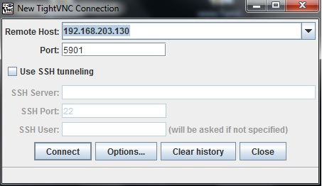
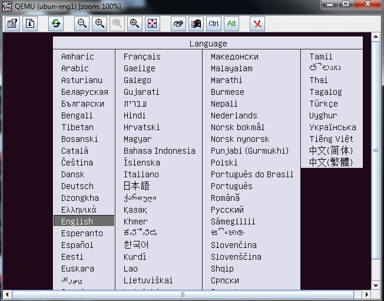
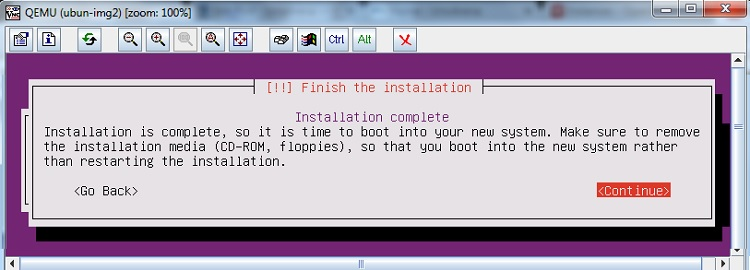
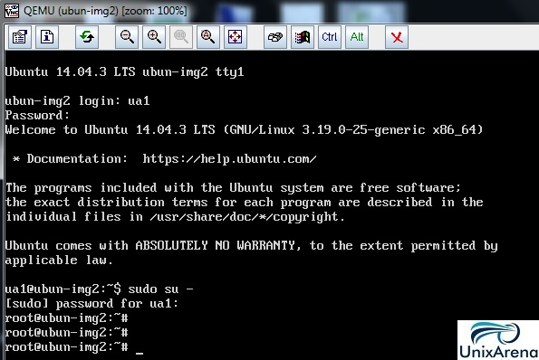
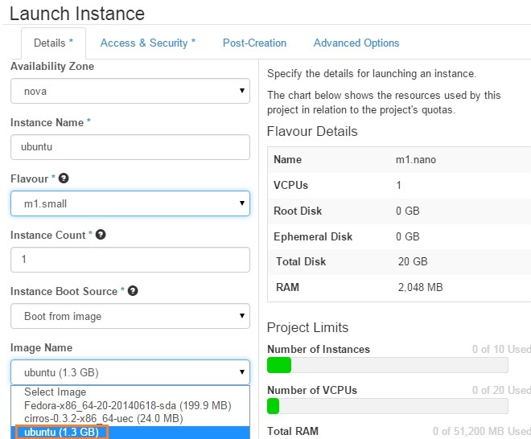
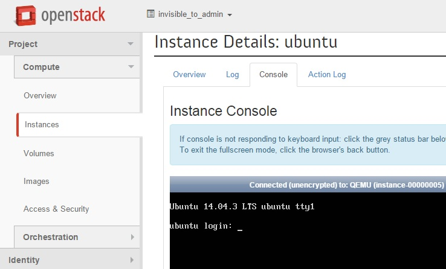

The virtual instance OS image can be created outside the openstack. By default openstack comes with small Linux foot print instance called [cirros and we have tested it](https://www.unixarena.com/2015/08/how-to-launch-the-first-openstack-instance.html). But as a customer , I would like to put custom image in openstack for various requirement. In this article, we will create Ubuntu custom image using the KVM hypervisor. This article will talk more about configuring the KVM/QEMU hypervisor , installing the required packages for KVM and creating the custom OS image using the KVM/QEMU. At the end of this article, I will demonstrate that how to import the new instance image in Openstack.

Before going forward, we need to understand the various images type supported in Linux KVM. A virtual machine image or instance image is a single file which contains a virtual disk that has a bootable operating system installed on it. Let’s see the various format used in the industry.

**1\. qcow2 ( QEMU copy on write version 2):**

qcow2 is commonly used in KVM hypervisor since its supports sparse representation and snapshot.

**2\. RAW:**

raw image format is a simple one and supported on both xen & kvm hypervisors. The raw images are created using dd command. So it doesn’t support the sparse representation and snapshot. But this format is faster than the qcow2.

**3\. AMI/AKI/ARI :**

These formats are used in Amazon EC2.

* AMI (Amazon Machine Image): This is a virtual machine image in raw format.
* AKI (Amazon Kernel Image) :A kernel file that the hypervisor will load initially to boot the image. (vmlinuz)
* ARI (Amazon Ramdisk Image) :An optional ramdisk file mounted at boot time.(initrd).

**4\. VMDK:**

VMDK (Virtual Machine DisK ) is a default format in VMware ESXi hypervisors.

**5\. VHDX:**

VHDX is the default image format in Microsoft Hyper-V.

**6\. ISO:**

The ISO format is a disk image formatted with the read-only ISO 9660 (also known as ECMA-119) filesystem commonly used for CDs and DVDs.

As I said earlier, prefer other than the Openstack controller machine for creating the OS images. In my case , I am using the Ubuntu machine with VT enabled hardware to create the custom image for Openstack.

1.Login to the Ubuntu Server which has the VT enabled processors.

2\. Verify the VT (virtualization Technology ) in that server.

    root@KVM#kvm-ok
    INFO: /dev/kvm exists
    KVM  acceleration can be used

Incase, if you are running Ubuntu in virtual box or VMware workstation , you will error like “Your CPU does not support KVM extensions” . In this case, you can use QEMU if your hardware has VT enabled processor. This can be validated using “virt-host-validate”.

    root@KVM#kvm-ok
    INFO: Your CPU does not support KVM extensions
    KVM acceleration can NOT be used
    root@KVM#
    root@KVM#/usr/bin/virt-host-validate
      QEMU: Checking for hardware virtualization                                 : WARN (Only emulated CPUs are available, performance will be significantly limited)
      QEMU: Checking for device /dev/vhost-net                                   : PASS
      QEMU: Checking for device /dev/net/tun                                     : PASS
       LXC: Checking for Linux >= 2.6.26                                         : PASS
    root@KVM#

3\. Install the KVM/QEMU packages using apt-get command. If you already have the qemu-kvm , just ignore this step.

    root@KVM#apt-get install qemu-kvm
    Reading package lists... Done
    Building dependency tree
    Reading state information... Done
    The following packages were automatically installed and are no longer required:
      python-chardet-whl python-colorama python-colorama-whl python-distlib
      python-distlib-whl python-html5lib python-html5lib-whl python-pip-whl
      python-requests-whl python-setuptools-whl python-six-whl python-urllib3-whl
      python-wheel python3-pkg-resources

4\. Copy the Ubuntu server OS ISO to the server .

    root@KVM#ls -lrt /var/tmp/ubuntu-14.04.3-server-amd64.iso
    -rw-rw-r-- 1 root root 601882624 Aug 19 16:53 /var/tmp/ubuntu-14.04.3-server-amd64.iso
    root@KVM#

5\. Install “virtinst” package.

    root@KVM#apt-get install virtinst
    Reading package lists... Done
    Building dependency tree
    Reading state information... Done
    The following packages were automatically installed and are no longer required:
      python-chardet-whl python-colorama python-colorama-whl python-distlib
      python-distlib-whl python-html5lib python-html5lib-whl python-pip-whl
      python-requests-whl python-setuptools-whl python-six-whl python-urllib3-whl
      python-wheel python3-pkg-resources
    Use 'apt-get autoremove' to remove them.
    The following extra packages will be installed:
      python-pycurl python-urlgrabber
    Suggested packages:
      libcurl4-gnutls-dev python-pycurl-dbg virt-viewer
    The following NEW packages will be installed:
      python-pycurl python-urlgrabber virtinst
    0 upgraded, 3 newly installed, 0 to remove and 19 not upgraded.
    Need to get 270 kB of archives.
    After this operation, 1,519 kB of additional disk space will be used.
    Do you want to continue? [Y/n] y
    Get:1 http://in.archive.ubuntu.com/ubuntu/ trusty/main python-pycurl amd64 7.19.3-0ubuntu3 [47.9 kB]
    Get:2 http://in.archive.ubuntu.com/ubuntu/ trusty-updates/main python-urlgrabber all 3.9.1-4ubuntu3.14.04.1 [42.3 kB]
    Get:3 http://in.archive.ubuntu.com/ubuntu/ trusty/main virtinst all 0.600.4-3ubuntu2 [179 kB]
    Fetched 270 kB in 4s (65.7 kB/s)
    Selecting previously unselected package python-pycurl.
    (Reading database ... 78622 files and directories currently installed.)
    Preparing to unpack .../python-pycurl_7.19.3-0ubuntu3_amd64.deb ...
    Unpacking python-pycurl (7.19.3-0ubuntu3) ...
    Selecting previously unselected package python-urlgrabber.
    Preparing to unpack .../python-urlgrabber_3.9.1-4ubuntu3.14.04.1_all.deb ...
    Unpacking python-urlgrabber (3.9.1-4ubuntu3.14.04.1) ...
    Selecting previously unselected package virtinst.
    Preparing to unpack .../virtinst_0.600.4-3ubuntu2_all.deb ...
    Unpacking virtinst (0.600.4-3ubuntu2) ...
    Processing triggers for man-db (2.6.7.1-1ubuntu1) ...
    Setting up python-pycurl (7.19.3-0ubuntu3) ...
    Setting up python-urlgrabber (3.9.1-4ubuntu3.14.04.1) ...
    Setting up virtinst (0.600.4-3ubuntu2) ...
    root@KVM#

6\. Create the virtual machine image file like below. Here I am using raw format to create the image.

    root@KVM#qemu-img create -f qcow2 /var/tmp/ubuntu-14.qcow2 2G
    Formatting '/var/tmp/ubuntu-14.qcow2', fmt=raw size=2147483648
    root@KVM#

7.Un-comment the below lines in qemu.conf file.

    root@KVM#grep -v "#" /etc/libvirt/qemu.conf
    user = "root"
    group = "root"
    root@KVM#

8.Create the virtual machine using below command. (Change the details according to your environment.)

    root@KVM#ls -lrt
    total 587780
    -rw-rw-r-- 1 libvirt-qemu kvm  601882624 Aug 19 16:53 ubuntu-14.04.3-server-amd64.iso
    -rw-r--r-- 1 libvirt-qemu kvm 2147483648 Aug 27 11:44 ubuntu-14.qcow2
    root@KVM#
    root@KVM#virt-install --virt-type qemu --name ubun-img1 --ram 512 --cdrom=/var/tmp/ubuntu-14.04.3-server-amd64.iso --disk /var/tmp/ubuntu-14.qcow2,format=qcow2 --network network=default --graphics vnc,listen=0.0.0.0 --noautoconsole --os-type=linux --os-variant=ubuntumaverick

    Starting install...
    Creating domain...                                                                                                                               |    0 B     00:00
    Domain installation still in progress. You can reconnect to
    the console to complete the installation process.
    root@KVM#

9\. Find the VNC port the virtual machine which you have started. Here we can see that virtual machine console is listening in “0.0.0.0:1 ” . Since the VNC port is listening in universal IP, So you can connect from anywhere. “:1” represents “5901” .

    root@KVM#ps -ef |grep ubun-img1 |grep vnc
    libvirt+ 45778     1 99 11:57 ?        00:09:35 /usr/bin/qemu-system-x86_64   rial,chardev=charserial0,id=serial0 -vnc 0.0.0.0:1 -device cirrus-vga,id=video0,bus=pci.0,addr=0x2 -device virtio-balloon-pci,id=balloon0,bus=pci.0,addr=0x4
    root@KVM#

10\. Open the VNCviewer and connect to the virtual instance VNC port.

Cloud Image Creation

11\. You could see that system is booted using the ISO. During the installation , you must choose ssh-server package for instance access and configure the network.

Cloud Image Creation

12\. Perform the typical Ubuntu installation. Once its done , just reboot the machine.

Cloud Image Creation

13\. Here you can see that system is booted from the hard-drive.

Cloud Image Creation

If the virtual guest is not started automatically , it may went to shut-off state. Login to your KVM machine and start like below. Follow the step 9 to find the VNC port for this machine.

    root@KVM:~# virsh list --all
     Id    Name                           State
    ----------------------------------------------------
     5     instance-00000003              running
     14    ubun-img2                      shut-off

    root@KVM:~# virsh start ubun-img2
    root@KVM:~# virsh list --all
     Id    Name                           State
    ----------------------------------------------------
     5     instance-00000003              running
     14    ubun-img2                      running

    root@KVM:~#

14\. Virtual instance must have internet access to install cloud-init package on it.

15\. Make sure that “/etc/apt/sources.list” file is up to date on virtual instance. If not , you may not able to install the cloud init package. If “/etc/apt/sources.list” is empty , use the “<http://repogen.simplylinux.ch/>” to generate it .

My sources.list looks like below. (You could use the same if you are using the Ubuntu 14.04.)

    root@ubun-img2:~# cat /etc/apt/sources.list
    #------------------------------------------------------------------------------#
    #                            OFFICIAL UBUNTU REPOS                             #
    #------------------------------------------------------------------------------#

    ###### Ubuntu Main Repos
    deb http://in.archive.ubuntu.com/ubuntu/ trusty main universe
    deb-src http://in.archive.ubuntu.com/ubuntu/ trusty main universe multiverse

    ###### Ubuntu Update Repos
    deb http://in.archive.ubuntu.com/ubuntu/ trusty-updates main universe
    deb http://in.archive.ubuntu.com/ubuntu/ trusty-proposed main universe
    deb http://in.archive.ubuntu.com/ubuntu/ trusty-backports main universe
    deb-src http://in.archive.ubuntu.com/ubuntu/ trusty-updates main universe multiverse
    deb-src http://in.archive.ubuntu.com/ubuntu/ trusty-proposed main universe multiverse
    deb-src http://in.archive.ubuntu.com/ubuntu/ trusty-backports main universe multiverse

    ###### Ubuntu Partner Repo
    deb http://archive.canonical.com/ubuntu trusty partner
    deb-src http://archive.canonical.com/ubuntu trusty partner

    ###### Ubuntu Extras Repo
    deb http://extras.ubuntu.com/ubuntu trusty main
    deb-src http://extras.ubuntu.com/ubuntu trusty main

    root@ubun-img2:~#

16\. Install cloud-init package.

    root@ubun-img2:~# apt-get install cloud-init
    Reading package lists... Done
    Building dependency tree
    Reading state information... Done
    The following extra packages will be installed:
      cloud-guest-utils eatmydata gdisk gir1.2-glib-2.0 groff-base iso-codes
      libasn1-8-heimdal libcurl3-gnutls libdbus-glib-1-2 libgirepository-1.0-1
      libglib2.0-0 libglib2.0-data libgssapi3-heimdal libhcrypto4-heimdal
      libheimbase1-heimdal libheimntlm0-heimdal libhx509-5-heimdal libicu52
      libkrb5-26-heimdal libldap-2.4-2 libroken18-heimdal librtmp0 libsasl2-2
      libsasl2-modules libsasl2-modules-db libwind0-heimdal libxml2 libyaml-0-2
      python-apt-common python-cheetah python-configobj python-json-pointer
      python-jsonpatch python-oauth python-prettytable python-serial python-yaml
      python3-apt python3-dbus python3-gi python3-pycurl
      python3-software-properties sgml-base shared-mime-info
      software-properties-common unattended-upgrades xml-core xz-utils
    Suggested packages:
      groff isoquery libsasl2-modules-otp libsasl2-modules-ldap
      libsasl2-modules-sql libsasl2-modules-gssapi-mit
      libsasl2-modules-gssapi-heimdal python-markdown python-pygments
      python-memcache python-wxgtk2.8 python-wxgtk python3-apt-dbg python-apt-doc
      python-dbus-doc python3-dbus-dbg libcurl4-gnutls-dev python3-pycurl-dbg
      sgml-base-doc bsd-mailx mail-transport-agent debhelper
    The following NEW packages will be installed:
      cloud-guest-utils cloud-init eatmydata gdisk gir1.2-glib-2.0 groff-base
      iso-codes libasn1-8-heimdal libcurl3-gnutls libdbus-glib-1-2
      libgirepository-1.0-1 libglib2.0-0 libglib2.0-data libgssapi3-heimdal
      libhcrypto4-heimdal libheimbase1-heimdal libheimntlm0-heimdal
      libhx509-5-heimdal libicu52 libkrb5-26-heimdal libldap-2.4-2
      libroken18-heimdal librtmp0 libsasl2-2 libsasl2-modules libsasl2-modules-db
      libwind0-heimdal libxml2 libyaml-0-2 python-apt-common python-cheetah
      python-configobj python-json-pointer python-jsonpatch python-oauth
      python-prettytable python-serial python-yaml python3-apt python3-dbus
      python3-gi python3-pycurl python3-software-properties sgml-base
      shared-mime-info software-properties-common unattended-upgrades xml-core
      xz-utils
    0 upgraded, 49 newly installed, 0 to remove and 14 not upgraded.
    Need to get 15.2 MB of archives.
    After this operation, 72.0 MB of additional disk space will be used.
    Do you want to continue? [Y/n] y
    Unpacking python-json-pointer (1.0-2build1) ...
    Selecting previously unselected package python-jsonpatch.
    Preparing to unpack .../python-jsonpatch_1.3-4_all.deb ...
    Unpacking python-jsonpatch (1.3-4) ...
    Selecting previously unselected package libgirepository-1.0-1.
    Preparing to unpack .../libgirepository-1.0-1_1.40.0-1ubuntu0.2_amd64.deb ...
    Unpacking libgirepository-1.0-1 (1.40.0-1ubuntu0.2) ...
    Selecting previously unselected package gir1.2-glib-2.0.
    Preparing to unpack .../gir1.2-glib-2.0_1.40.0-1ubuntu0.2_amd64.deb ...
    Unpacking gir1.2-glib-2.0 (1.40.0-1ubuntu0.2) ...
    Selecting previously unselected package groff-base.
    Preparing to unpack .../groff-base_1.22.2-5_amd64.deb ...

    Adding 'diversion of /etc/init/ureadahead.conf to /etc/init/ureadahead.conf.disabled by cloud-init'
    Processing triggers for libc-bin (2.19-0ubuntu6.6) ...
    Processing triggers for sgml-base (1.26+nmu4ubuntu1) ...
    Processing triggers for ureadahead (0.100.0-16) ...
    root@ubun-img2:~#

Upon the cloud-init package installation, file “/etc/cloud/cloud.cfg” will be created. cloud-init is the [Ubuntu package](https://launchpad.net/ubuntu/+source/cloud-init) that handles early initialization of a cloud instance. Each cloud instance must have the cloud-init package.

17\. Halt the instance .

    root@ubun-img2:~# /sbin/shutdown -h now

    Broadcast message from ua1@ubun-img2
            (/dev/pts/0) at 6:33 ...

    The system is going down for halt NOW!
    root@ubun-img2:~#

18.Back to the KVM machine and perform the clean up of the instance. This process will remove the MAC , network configuration and other instance specific stuffs. First we need an utility called “virt-sysperp”. Let’s install it.

    root@KVM:/opt/stack# apt-get install libguestfs-tools
    Reading package lists... Done
    Building dependency tree
    Reading state information... Done
    The following packages were automatically installed and are no longer required:
      python-chardet-whl python-colorama python-colorama-whl python-distlib
      python-distlib-whl python-html5lib python-html5lib-whl python-pip-whl
      python-requests-whl python-setuptools-whl python-six-whl python-urllib3-whl
      python-wheel python3-pkg-resources
    Use 'apt-get autoremove' to remove them.
    The following extra packages will be installed:
      libconfig9 libguestfs-perl libhivex0 libintl-perl libstring-shellquote-perl
      libsys-virt-perl libwin-hivex-perl libxml-parser-perl libxml-xpath-perl
    Suggested packages:
      libintl-xs-perl
    The following NEW packages will be installed:
      libconfig9 libguestfs-perl libguestfs-tools libhivex0 libintl-perl
      libstring-shellquote-perl libsys-virt-perl libwin-hivex-perl
      libxml-parser-perl libxml-xpath-perl
    0 upgraded, 10 newly installed, 0 to remove and 19 not upgraded.
    Need to get 4,680 kB of archives.
    After this operation, 18.1 MB of additional disk space will be used.
    Do you want to continue? [Y/n] y
    Get:1 http://in.archive.ubuntu.com/ubuntu/ trusty/main libconfig9 amd64 1.4.9-2 [21.7 kB]
    Get:2 http://in.archive.ubuntu.com/ubuntu/ trusty/universe libhivex0 amd64 1.3.9-2build1 [30.3 kB]

    Get:10 http://in.archive.ubuntu.com/ubuntu/ trusty/universe libguestfs-tools amd64 1:1.24.5-1 [2,529 kB]
    Fetched 4,680 kB in 37s (126 kB/s)
    Preconfiguring packages ...
    Selecting previously unselected package libconfig9:amd64.
    (Reading database ... 78742 files and directories currently installed.)
    Preparing to unpack .../libconfig9_1.4.9-2_amd64.deb ...
    Unpacking libconfig9:amd64 (1.4.9-2) ...

    Setting up libconfig9:amd64 (1.4.9-2) ...
    Setting up libhivex0:amd64 (1.3.9-2build1) ...
    Setting up libintl-perl (1.23-1build1) ...
    Setting up libstring-shellquote-perl (1.03-1) ...
    Setting up libsys-virt-perl (1.2.1-1) ...
    Setting up libxml-parser-perl (2.41-1build3) ...
    Setting up libxml-xpath-perl (1.13-7) ...
    Setting up libwin-hivex-perl (1.3.9-2build1) ...
    Setting up libguestfs-perl (1:1.24.5-1) ...
    Setting up libguestfs-tools (1:1.24.5-1) ...
    Processing triggers for libc-bin (2.19-0ubuntu6.6) ...
    root@KVM:/opt/stack#

19\. Run the virt-sysperp to perform the clean up against the image.

    root@uacloud:/opt/stack# virt-sysprep -d ubun-img2
    Examining the guest ...
    Fatal error: exception Guestfs.Error("/usr/bin/supermin-helper exited with error status 1.
    To see full error messages you may need to enable debugging.
    See http://libguestfs.org/guestfs-faq.1.html#debugging-libguestfs")
    root@uacloud:/opt/stack#

Command failed with error “Fatal error: exception Guestfs.Error(“/usr/bin/supermin-helper exited with error status 1.”. Let me enable the debug mode for virt-sysperp and run it to find the cause.

    root@uacloud:/opt/stack# export LIBGUESTFS_DEBUG=1
    root@uacloud:/opt/stack# export LIBGUESTFS_TRACE=1
    root@uacloud:/opt/stack# virt-sysprep -d ubun-img2
    Examining the guest ...
    libguestfs: trace: set_verbose true
    libguestfs: trace: set_verbose = 0
    supermin helper [00000ms] whitelist = (not specified)
    supermin helper [00000ms] host_cpu = x86_64
    supermin helper [00000ms] dtb_wildcard = (not specified)
    supermin helper [00000ms] inputs:
    supermin helper [00009ms] finished creating kernel
    supermin helper [00845ms] finished mke2fs
    supermin helper [00845ms] visiting /usr/lib/guestfs/supermin.d
    supermin helper [00845ms] visiting /usr/lib/guestfs/supermin.d/daemon.img.gz
    supermin helper [00910ms] visiting /usr/lib/guestfs/supermin.d/init.img
    supermin helper [00911ms] visiting /usr/lib/guestfs/supermin.d/udev-rules.img
    /usr/bin/supermin-helper: ext2: parent directory not found: /lib: File not found by ext2_lookup
    libguestfs: command: run: rm
    libguestfs: command: run: \ -rf /var/tmp/guestfs.A4gcOt
    libguestfs: trace: launch = -1 (error)
    Fatal error: exception Guestfs.Error("/usr/bin/supermin-helper exited with error status 1, see debug messages above")
    libguestfs: trace: close
    libguestfs: closing guestfs handle 0x235d5c0 (state 0)
    libguestfs: command: run: rm
    libguestfs: command: run: \ -rf /tmp/libguestfsUivezT
    root@uacloud:/opt/stack#

It’s failing with known error “/usr/bin/supermin-helper: ext2: parent directory not found: /lib: File not found by ext2\_lookup “. To fix the issue , First Update the “febootstrap” .

    root@uacloud:/opt/stack# apt-get upgrade febootstrap
    Reading package lists... Done
    Building dependency tree
    Reading state information... Done
    Calculating upgrade... Done
    The following packages were automatically installed and are no longer required:
      python-chardet-whl python-colorama python-colorama-whl python-distlib
      python-distlib-whl python-html5lib python-html5lib-whl python-pip-whl
      python-requests-whl python-setuptools-whl python-six-whl python-urllib3-whl
      python-wheel python3-pkg-resources
    Use 'apt-get autoremove' to remove them.
    The following NEW packages will be installed:
      febootstrap
    The following packages have been kept back:
      linux-generic-lts-vivid linux-headers-generic-lts-vivid
      linux-image-generic-lts-vivid
    The following packages will be upgraded:
      apparmor apport libapparmor-perl libapparmor1 libxen-4.4 libxenstore3.0
      linux-firmware openssh-sftp-server python3-apport python3-problem-report
      qemu-keymaps qemu-kvm qemu-system-common qemu-system-x86 qemu-utils tzdata
    16 upgraded, 1 newly installed, 0 to remove and 3 not upgraded.
    Need to get 28.0 MB of archives.
    After this operation, 5,720 kB of additional disk space will be used.
    Do you want to continue? [Y/n] y

Second, update the guestfs appliance. Perform the guestfs test tool to validate it. If you get “TEST FINISHED OK” , then you are good to proceed with virt-sysprep”.

    root@uacloud:/opt/stack# update-guestfs-appliance
    root@uacloud:/opt/stack# libguestfs-test-tool
    libguestfs: closing guestfs handle 0x19b6150 (state 0)
    libguestfs: command: run: rm
    libguestfs: command: run: \ -rf /tmp/libguestfs2BMBk1
    ===== TEST FINISHED OK =====

Re-run the command “virt-sysprep” for the newly created instance.

    root@uacloud:/opt/stack# virt-sysprep -d ubun-img2
    Examining the guest ...
    libguestfs: trace: set_verbose true
    libguestfs: trace: set_verbose = 0
    libguestfs: create: flags = 0, handle = 0xcce5c0, program = virt-sysprep
    libguestfs: trace: add_domain "ubun-img2" "readonly:false" "allowuuid:true" "readonlydisk:ignore"
    libguestfs: opening libvirt handle: URI = NULL, auth = virConnectAuthPtrDefault, flags = 1
    libguestfs: successfully opened libvirt handle: conn = 0xcceda0
    libguestfs: trace: internal_set_libvirt_selinux_norelabel_disks false
    libguestfs: trace: internal_set_libvirt_selinux_norelabel_disks = 0
    libguestfs: disk[0]: filename: /var/tmp/ubuntu-14.qcow2
    libguestfs: trace: add_drive "/var/tmp/ubuntu-14.qcow2" "readonly:false" "format:qcow2"

20\. Un-define the virtual instance. The instances’ image file is now good to upload it in openstack.

    root@uacloud:/opt/stack# virsh list --all
     Id    Name                           State
    ----------------------------------------------------
     5     instance-00000003              running
     -     ubun-img2                      shut off
    root@uacloud:/opt/stack# virsh undefine ubun-img2
    Domain ubun-img2 has been undefined
    root@uacloud:/opt/stack# virsh list --all
     Id    Name                           State
    ----------------------------------------------------
     5     instance-00000003              running
    root@uacloud:/opt/stack#

In my setup, image is located in /var/tmp. Refer step 8 to know the image file location.

    root@KVM#ls -lrt
    total 2002636
    -rw-rw-r-- 1 libvirt-qemu kvm   601882624 Aug 19 16:53 ubuntu-14.04.3-server-amd64.iso
    -rw-r--r-- 1 root         root 1448869888 Aug 28 04:05 ubuntu-14.qcow2
    root@KVM#pwd
    /var/tmp
    root@KVM#

We have successfully created the Ubuntu cloud instance image.

### Import the newly created Instance Image in Openstack:

1\. Login to Openstack controller node.

2\. Copy the Ubuntu image file which we have created in the KVM machine. I kept the new image instance file in /var/tmp.

    stack@uacloud:~$ ls -lrt /var/tmp/ubuntu-14.qcow2
    -rw-r--r-- 1 stack stack 1448869888 Aug 28 04:05 /var/tmp/ubuntu-14.qcow2
    stack@uacloud:~$

3.Create the image using glance using the source image file.

    stack@uacloud:~$ glance image-create --name ubuntu --disk-format qcow2 --container-format bare --is-public true --file /var/tmp/ubuntu-14.qcow2
    +------------------+--------------------------------------+
    | Property         | Value                                |
    +------------------+--------------------------------------+
    | checksum         | baeaa3f65400d2a72878693c538f2674     |
    | container_format | bare                                 |
    | created_at       | 2015-08-28T00:08:17                  |
    | deleted          | False                                |
    | deleted_at       | None                                 |
    | disk_format      | qcow2                                |
    | id               | b67dca39-2d5b-4e89-936b-3e2162794593 |
    | is_public        | True                                 |
    | min_disk         | 0                                    |
    | min_ram          | 0                                    |
    | name             | ubuntu                               |
    | owner            | 83a5fbedfb244b238ed7539353f59871     |
    | protected        | False                                |
    | size             | 1448869888                           |
    | status           | active                               |
    | updated_at       | 2015-08-28T00:08:56                  |
    | virtual_size     | None                                 |
    +------------------+--------------------------------------+
    stack@uacloud:~$

In-case if you get error like below (403 Forbidden,Access was denied to this resource), make sure you have sourced properly.

    stack@uacloud:~$ glance image-create --name ubuntu --disk-format qcow2 --container-format bare --is-public true --file /var/tmp/ubuntu-14.qcow2403 Forbidden
    403 Forbidden
    Access was denied to this resource.
    (HTTP 403)
    stack@uacloud:~$

Gain the admin access and try to re-run it if you get the above error.

    stack@uacloud:~$ source ~stack/devstack/openrc admin admin
    stack@uacloud:~$
    stack@uacloud:~$ glance image-create --name ubuntu --disk-format qcow2 --container-format bare --is-public true --file /var/tmp/ubuntu-14.qcow2

### Launch the Ubuntu Instance from Dashboard:

1\. Login to openstack Dashboard.

2\. When you click on launch instance tab , you should be able to choose ubuntu image like below.

Lanuch Ubuntu instance

3\. Once the instance is up & running , click on the instance & see the console.

Instance Console

In this article , we have seen that how to create the custom OS image for the cloud instance and importing in to the openstack’s glance service . At last ,we have launched the instance using the newly created image. Hope this article is informative to you.

Advertisements