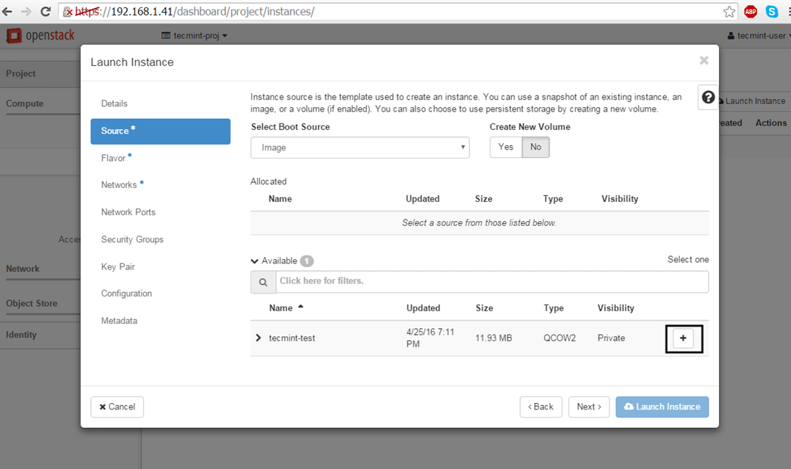

How to create an instance in OpenStack
======================================

Hi@akhtar,

When we try to launch an instance in AWS, we need **AMI, security groups** etc. In OpenStack also we need **image, security group** etc. So, First create an image and security group and after that follow the below given steps.

* Move to Project -\> Instances and hit on Launch Instance button and a new window will appear.

* On the first screen add a name for your instance, leave the Availability Zone to nova, use one instance count and hit on Next button to continue

* Next, select Image as a Boot Source, add the Cirros test image created earlier by hitting the + button and hit Next to proceed further.

* Allocate the virtual machine resources by adding a flavor best suited for your needs and click on Next to move on.

* Finally, add one of the OpenStack available networks to your instance using the + button and hit on Launch Instance to start the virtual machine.

