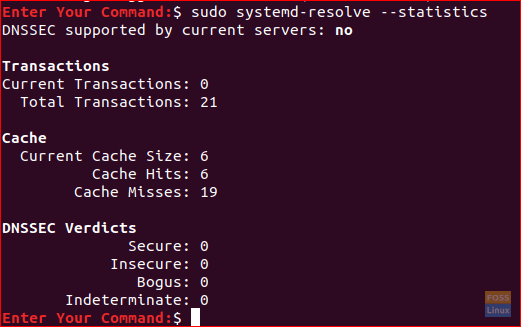
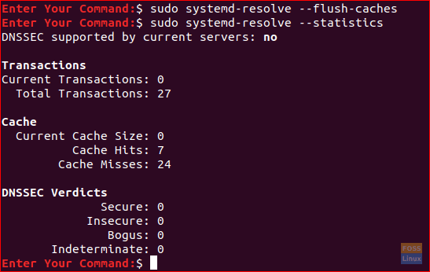

How to flush DNS on Ubuntu and CentOS
=====================================

[Hend Adel](https://www.fosslinux.com/author/hend-adel)December 22, 2019

DNS (**D**omain **N**ame **S**ervice) is responsible for mapping a website name into the respective IP. Click [here](https://www.fosslinux.com/7631/how-to-install-and-configure-dns-on-ubuntu.htm) to know how to install and configure DNS on Ubuntu.

Therefore, DNS is considered being one of the critical parts of your connection to the internet. To access the frequently visited websites faster, our machines keep track of DNS records, or in other words, it caches it.

What if a website changed its address? It may cause an IP conflict. So, to avoid such a problem, your machine DNS cache should be flushed regularly. Also, clearing your DNS cache will help you removing unneeded data occupying your system and solve some technical problems related to the famous “outdated entries” error.

In this tutorial, we will show you how to flush your DNS on Ubuntu and CentOS operating systems in easy and clear steps.

Flush DNS on Ubuntu Machine
---------------------------

### First Method: Flush DNS by using systemd-resolve

Step 1\. Before flushing your DNS, you can check DNS statistics using the next command.

    sudo systemd-resolve --statistics

The output should be something like that:

Cache Statistics

As per the previous screenshot, the current cache size is 6.

Step 2\. Flush DNS using systemd-resolve. Since the systemd-resolve daemon is almost running on all Ubuntu systems, then we can use it to clear our DNS cache using the next command.

    sudo systemd-resolve --flush-caches

Step 3\. Re-run the cache statistics command.

    sudo systemd-resolve --statistics

Cache Statistics After Flush

As you can see from the above screenshot, the current cache size parameter is Zero, and that is what we need.

### Second Method: Flush Cache using the dns-clean command

Another method to clear our DNS cache is using the next command:

    sudo /etc/init.d/dns-clean start

Third Method: Flush Cache for some Ubuntu DNS Services

Next, we will show you some commands for clearing DNS cache for some various DNS services:

* Flush nscd service DNS Cache:

    sudo /etc/init.d/nscd restart

* Flush BIND service DNS Cache:

    sudo /etc/init.d/named restart

* Flush dnsmasq service DNS Cache:

    sudo /etc/init.d/dnsmasq restart

* If you need to flush the DNS cache for a specific domain, use the following command:

    sudo rndc flushname test.com

* Flush DNS cache for entire LAN:

    sudo rndc flush lan

* Respectively, to flush DNS cache for entire WAN:

    sudo rndc flush wan

Flush DNS on CentOS Machine
---------------------------

To clear your system DNS cache on a machine running CentOS platform, you can use the following command.

    systemctl restart dnsmasq.service

The output should be something like that:

CentOS Flush DNS

That’s all you need to know on how to flush DNS on Ubuntu and CentOS. For any further questions, leave us a comment, and we will be happy helping you.