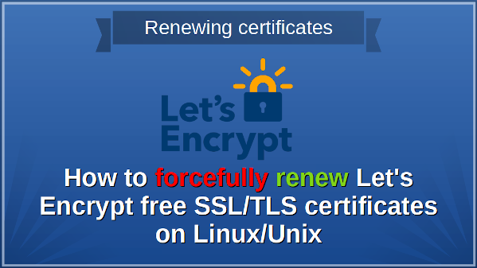

How do I forcefully renew the Letsencrypt certificate on an Ubuntu, Debian, CentOS, RHEL, Fedora, or FreeBSD Unix systems?

 As you know, Let’s Encrypt is a free, automated, and open certificate authority that one can use to issue TLS/SSL certificates for web servers, mail servers, and more. This page explains how to renew the Let’s Encrypt certificate forcefully on Linux, FreeBSD, and Unix-like systems using the CLI tools. 

How to forcefully renew Let’s Encrypt certificate
-------------------------------------------------

In Linux and Unix, there are multiple ways to issue and renew the Letsencrypt TLS/SSL certificates. However, in this tutorial, we are going to use the two most popular command-line tools that you can use:

1. We can always force cert renewal even if it is not near its expiration date.
2. **certbot** – Request a new certificate using **certbot renew --force-renewal** command. We can specify domains using the -d option. For example, **certbot -d cyberciti.biz,www.cyberciti.biz,test.cyberciti.biz --force-renewal**
3. **acme.sh** – Force to renew a cert immediately using the **acme.sh -f -r -d www.cyberciti.biz**

### Let’s Encrypt certificate expiration notice

You might an an notice as follows for your domain:

> Hello,
> 
> Your certificate (or certificates) for the names listed below will expire in 10 days (on 14 May 20 12:16 +0000). Please make sure to renew your certificate before then, or visitors to your website will encounter errors.
> 
> We recommend renewing certificates automatically when they have a third of their total lifetime left. For Let’s Encrypt’s current 90-day certificates, that means renewing 30 days before expiration. See
>  https://letsencrypt.org/docs/integration-guide/ for details.
> 
> www.cyberciti.biz
> 
> For any questions or support, please visit https://community.letsencrypt.org/. Unfortunately, we can’t provide support by email.

So let us see all other options, commands, and examples in detail for renewing certificates for our web server.

Renewing the LetsEncrypt certificate using the certbot
------------------------------------------------------

Certbot is the most popular tool for: 

* Automatically prove to the Let’s Encrypt CA that you control the website
* Obtain a browser-trusted certificate and set it up on your web server
* Keep track of when your certificate is going to expire, and renew it
* Help you revoke the certificate if that ever becomes necessary
* Renew the certificate forcefully if the need arises

The main aim for certbot command-line tool is to set up an HTTPS server and have it automatically obtain a browser-trusted certificate, without any human intervention. However, some times the renewal process fails for various reasons, and you need to issue the following manual command for forceful renewal:

```
certbot --force-renewal
certbot --force-renewal -d domain-name-1-here,domain-name-2-here
certbot --force-renewal -d www.nixcraft.com,nixcraft.com
```

 See the certbot [docs here](https://certbot.eff.org/docs/using.html?highlight=--force-renewal) for more info or use the following command :

```
certbot --help
certbot --help all
## filter out renewal option using the grep command/egrep command ##
certbot --help all | grep -i force
certbot --help all | egrep -i 'renewal|force'
```

How to renew a specific certificate using the acme.sh
-----------------------------------------------------

The syntax is as follows:

```
acme.sh -f -r -d {your-domain-here}
acme.sh --force --renew --domain {your-domain-name-here}
acme.sh -f -r -d www.cyberciti.biz
acme.sh -f -r -d www.cyberciti.biz -d server1.cyberciti.biz
```


 Where,

* **--renew** OR **-r** : Renew a cert.
* **--domain** OR **-d** : Specifies a domain, used to issue, renew or revoke etc.
* **--force** OR **-f** : Used to force to install or force to renew a cert immediately.

### Restart / reload your web server and service

Finally, restart the Nginx server or restart the Apache webserver for the changes to apply. In other words, you need to restart your web server so that clients can see renewed certificates:

```
sudo service nginx reload
## or ##
sudo service httpd reload
## Systemd GNU/Linux ##
sudo systemctl reload nginx.service
sudo systemctl reload httpd.service
sudo systemctl reload apache2.service
```

 See the following for more info

* [Gracefully Restart Nginx Web Server After Changes Made In a Config File](https://www.cyberciti.biz/faq/howto-unix-linux-gracefully-reload-restart-nginx-webserver/)
* [FreeBSD Start / Stop / Restart Nginx Web Server](https://www.cyberciti.biz/faq/freebsd-start-stop-restart-nginx-webserver/)
* [Ubuntu Linux: Start / Restart / Stop Nginx Web Server](https://www.cyberciti.biz/faq/nginx-restart-ubuntu-linux-command/)
* [Linux Restart Nginx WebServer Command](https://www.cyberciti.biz/faq/nginx-linux-restart/)
* [Start / Stop and Restart Apache 2 Web Server Command](https://www.cyberciti.biz/faq/star-stop-restart-apache2-webserver/)
* [Apache 2: Reload HTTPD Configuration File Without Restarting Apache Config Changes](https://www.cyberciti.biz/faq/apache-2-reload-httpd-config-file-unix-linux-command/)
* [Ubuntu Linux: Start / Restart / Stop Apache Web Server](https://www.cyberciti.biz/faq/ubuntu-linux-start-restart-stop-apache-web-server/)

Conclusion
----------

In this tutorial, you learned how to renew Let’s Encrypt free SSL/TLS Certificates for Nginx or Apache web server running on Linux or Unix like systems.

This entry is **8** of **13** in the **Secure Web Server with Let's Encrypt Tutorial** series. Keep reading the rest of the series:

1. [Set up Lets Encrypt on Debian/Ubuntu Linux](https://www.cyberciti.biz/faq/how-to-configure-nginx-with-free-lets-encrypt-ssl-certificate-on-debian-or-ubuntu-linux/)
2. [Secure **Lighttpd** with Lets Encrypt certificate on Debian/Ubuntu](https://www.cyberciti.biz/faq/how-to-configure-lighttpd-web-server-with-free-lets-encrypt-ssl-certificate-on-debian-or-ubuntu-linux/)
3. [Configure **Nginx** with Lets Encrypt certificate on **Alpine** Linux](https://www.cyberciti.biz/faq/how-to-install-letsencrypt-free-ssltls-for-nginx-certificate-on-alpine-linux/)
4. [**Nginx** with Lets Encrypt on **CentOS 7**](https://www.cyberciti.biz/faq/how-to-secure-nginx-lets-encrypt-on-centos-7/)
5. [**Apache** with Lets Encrypt Certificates on **RHEL 8**](https://www.cyberciti.biz/faq/how-to-secure-apache-with-lets-encrypt-certificates-on-rhel-8/)
6. [**CentOS 8** and **Apache** with Lets Encrypt Certificates](https://www.cyberciti.biz/faq/apache-with-lets-encrypt-certificates-on-centos-8/)
7. [Install Lets Encrypt certificates on **CentOS 8** for **Nginx**](https://www.cyberciti.biz/faq/configure-nginx-with-lets-encrypt-on-centos-8/)
8. Forcefully renew Let's Encrypt certificate
9. [**OpenSUSE Linux** and Nginx with Let's Encrypt Certificates](https://www.cyberciti.biz/faq/how-to-secure-nginx-with-lets-encrypt-on-opensuse-15-1-15-2/)
10. [Configure Nginx to use TLS 1.2 / 1.3 only](https://www.cyberciti.biz/faq/configure-nginx-to-use-only-tls-1-2-and-1-3/)
11. [Let's Encrypt **wildcard certificate** with acme.sh and **Cloudflare DNS**](https://www.cyberciti.biz/faq/issue-lets-encrypt-wildcard-certificate-with-acme-sh-and-cloudflare-dns/)
12. [Nginx with Let's Encrypt on Ubuntu 18.04 with DNS Validation](https://www.cyberciti.biz/faq/secure-nginx-with-lets-encrypt-on-ubuntu-18-04-with-dns-validation/)
13. [AWS **Route 53** Let's Encrypt wildcard certificate with acme.sh](https://www.cyberciti.biz/faq/route-53-lets-encrypt-wildcard-certificate-with-acme-sh/)

 🐧 Get the latest tutorials on Linux, Open Source & DevOps via **[RSS feed](https://www.cyberciti.biz/atom/atom.xml)** or **[Weekly email newsletter.](https://newsletter.cyberciti.biz/subscription?f=1ojtmiv8892KQzyMsTF4YPr1pPSAhX2rq7Qfe5DiHMgXwKo892di4MTWyOdd976343rcNR6LhdG1f7k9H8929kMNMdWu3g)**

 🐧 1 comment so far... [add one](https://www.cyberciti.biz/faq/how-to-forcefully-renew-lets-encrypt-certificate/#respond) **↓**

CategoryList of Unix and Linux commandsDisk space analyzers[df](https://www.cyberciti.biz/faq/df-command-examples-in-linux-unix/) • [ncdu](https://www.cyberciti.biz/open-source/install-ncdu-on-linux-unix-ncurses-disk-usage/) • [pydf](https://www.cyberciti.biz/tips/unix-linux-bsd-pydf-command-in-colours.html)File Management[cat](https://www.cyberciti.biz/faq/linux-unix-appleosx-bsd-cat-command-examples/) • [cp](https://www.cyberciti.biz/faq/cp-copy-command-in-unix-examples/) • [mkdir](https://www.cyberciti.biz/faq/linux-make-directory-command/) • [tree](https://www.cyberciti.biz/faq/linux-show-directory-structure-command-line/)Firewall[Alpine Awall](https://www.cyberciti.biz/faq/how-to-set-up-a-firewall-with-awall-on-alpine-linux/) • [CentOS 8](https://www.cyberciti.biz/faq/how-to-set-up-a-firewall-using-firewalld-on-centos-8/) • [OpenSUSE](https://www.cyberciti.biz/faq/set-up-a-firewall-using-firewalld-on-opensuse-linux/) • [RHEL 8 ](https://www.cyberciti.biz/faq/configure-set-up-a-firewall-using-firewalld-on-rhel-8/) • [Ubuntu 16.04](https://www.cyberciti.biz/faq/howto-configure-setup-firewall-with-ufw-on-ubuntu-linux/) • [Ubuntu 18.04](https://www.cyberciti.biz/faq/how-to-setup-a-ufw-firewall-on-ubuntu-18-04-lts-server/) • [Ubuntu 20.04](https://www.cyberciti.biz/faq/how-to-configure-firewall-with-ufw-on-ubuntu-20-04-lts/)Network Utilities[NetHogs](https://www.cyberciti.biz/faq/linux-find-out-what-process-is-using-bandwidth/) • [dig](https://www.cyberciti.biz/faq/linux-unix-dig-command-examples-usage-syntax/) • [host](https://www.cyberciti.biz/faq/linux-unix-host-command-examples-usage-syntax/) • [ip](https://www.cyberciti.biz/faq/linux-ip-command-examples-usage-syntax/) • [nmap](https://www.cyberciti.biz/security/nmap-command-examples-tutorials/)OpenVPN[CentOS 7](https://www.cyberciti.biz/faq/centos-7-0-set-up-openvpn-server-in-5-minutes/) • [CentOS 8](https://www.cyberciti.biz/faq/centos-8-set-up-openvpn-server-in-5-minutes/) • [Debian 10](https://www.cyberciti.biz/faq/debian-10-set-up-openvpn-server-in-5-minutes/) • [Debian 8/9](https://www.cyberciti.biz/faq/install-configure-openvpn-server-on-debian-9-linux/) • [Ubuntu 18.04](https://www.cyberciti.biz/faq/ubuntu-18-04-lts-set-up-openvpn-server-in-5-minutes/) • [Ubuntu 20.04](https://www.cyberciti.biz/faq/ubuntu-20-04-lts-set-up-openvpn-server-in-5-minutes/)Package Manager[apk](https://www.cyberciti.biz/faq/10-alpine-linux-apk-command-examples/) • [apt](https://www.cyberciti.biz/faq/ubuntu-lts-debian-linux-apt-command-examples/)Processes Management[bg](https://www.cyberciti.biz/faq/unix-linux-bg-command-examples-usage-syntax/) • [chroot](https://www.cyberciti.biz/faq/unix-linux-chroot-command-examples-usage-syntax/) • [cron](https://www.cyberciti.biz/faq/how-do-i-add-jobs-to-cron-under-linux-or-unix-oses/) • [disown](https://www.cyberciti.biz/faq/unix-linux-disown-command-examples-usage-syntax/) • [fg](https://www.cyberciti.biz/faq/unix-linux-fg-command-examples-usage-syntax/) • [jobs](https://www.cyberciti.biz/faq/unix-linux-jobs-command-examples-usage-syntax/) • [killall](https://www.cyberciti.biz/faq/unix-linux-killall-command-examples-usage-syntax/) • [kill](https://www.cyberciti.biz/faq/unix-kill-command-examples/) • [pidof](https://www.cyberciti.biz/faq/linux-pidof-command-examples-find-pid-of-program/) • [pstree](https://www.cyberciti.biz/faq/unix-linux-pstree-command-examples-shows-running-processestree/) • [pwdx](https://www.cyberciti.biz/faq/unix-linux-pwdx-command-examples-usage-syntax/) • [time](https://www.cyberciti.biz/faq/unix-linux-time-command-examples-usage-syntax/)Searching[grep](https://www.cyberciti.biz/faq/howto-use-grep-command-in-linux-unix/) • [whereis](https://www.cyberciti.biz/faq/unix-linux-whereis-command-examples-to-locate-binary/) • [which](https://www.cyberciti.biz/faq/unix-linux-which-command-examples-syntax-to-locate-programs/)User Information[groups](https://www.cyberciti.biz/faq/unix-linux-groups-command-examples-syntax-usage/) • [id](https://www.cyberciti.biz/faq/unix-linux-id-command-examples-usage-syntax/) • [lastcomm](https://www.cyberciti.biz/faq/linux-unix-lastcomm-command-examples-usage-syntax/) • [last](https://www.cyberciti.biz/faq/linux-unix-last-command-examples/) • [lid/libuser-lid](https://www.cyberciti.biz/faq/linux-lid-command-examples-syntax-usage/) • [logname](https://www.cyberciti.biz/faq/unix-linux-logname-command-examples-syntax-usage/) • [members](https://www.cyberciti.biz/faq/linux-members-command-examples-usage-syntax/) • [users](https://www.cyberciti.biz/faq/unix-linux-users-command-examples-syntax-usage/) • [whoami](https://www.cyberciti.biz/faq/unix-linux-whoami-command-examples-syntax-usage/) • [who](https://www.cyberciti.biz/faq/unix-linux-w-command-examples-syntax-usage-2/) • [w](https://www.cyberciti.biz/faq/unix-linux-w-command-examples-syntax-usage-2/)WireGuard VPN[Alpine](https://www.cyberciti.biz/faq/how-to-set-up-wireguard-vpn-server-on-alpine-linux/) • [CentOS 8](https://www.cyberciti.biz/faq/centos-8-set-up-wireguard-vpn-server/) • [Debian 10](https://www.cyberciti.biz/faq/debian-10-set-up-wireguard-vpn-server/) • [Firewall](https://www.cyberciti.biz/faq/how-to-set-up-wireguard-firewall-rules-in-linux/) • [Ubuntu 20.04](https://www.cyberciti.biz/faq/ubuntu-20-04-set-up-wireguard-vpn-server/)