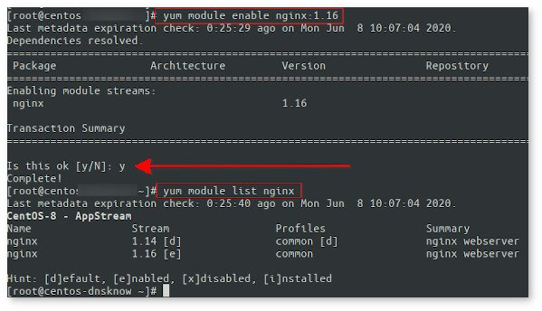

How do I Install Nginx on CentOS 8 Linux server? How can configure the latest version of Nginx web server on a CentOS Linux 8 server using the CLI and host a static site?

 Nginx [engine X] is a free and open-source high-performance web server. It also acts as a reverse proxy server and load balancer. This page shows how to install Nginx on CentOS 8 and configure a static web site using the CLI.

How to install Nginx on CentOS 8
--------------------------------

The procedure to install Nginx web server on a CentOS Linux 8 is as follows:

1. Login to your cloud server or bare metal server using ssh command:
**ssh user@cloud-server-ip**
2. Search for Nginx package:
**sudo yum search nginx**
3. Install nginx package using the [yum command](https://www.cyberciti.biz/faq/rhel-centos-fedora-linux-yum-command-howto/) on CentOS 8:
**sudo yum update
 sudo yum install nginx**
4. Update firewall settings and open TCP port 80 and 443\. Run:
**sudo firewall-cmd --permanent --zone=public --add-service=https --add-service=http
 sudo firewall-cmd --reload**

Let us see all commands and examples in details.

### Step 1 – Update the system

Keeping your system, kernel, and [update all installed packages for security](https://www.cyberciti.biz/faq/centos-8-update-installed-packages-for-security/) is an essential sysadmin task. So update the system, run:

```
$ sudo yum updateinfo
$ sudo yum update
## Reboot the system if a new kernel update was installed ##
$ sudo reboot
```

### Step 2 – Search for Nginx package

Is web server available in my Linux distro? Let us find out:

```
$ sudo yum search nginx
$ sudo yum list nginx
```

Sample outputs:

     Last metadata expiration check: 1:09:02 ago on Sun Nov 24 17:24:15 2019.
    ============================== Name Exactly Matched: nginx ==============================
    nginx.x86_64 : A high performance web server and reverse proxy server
    ============================= Name &amp; Summary Matched: nginx =============================
    nginx-mod-mail.x86_64 : Nginx mail modules
    nginx-mod-stream.x86_64 : Nginx stream modules
    collectd-nginx.x86_64 : Nginx plugin for collectd
    nginx-mod-http-perl.x86_64 : Nginx HTTP perl module
    nginx-mod-http-xslt-filter.x86_64 : Nginx XSLT module
    nginx-mod-http-image-filter.x86_64 : Nginx HTTP image filter module
    nginx-filesystem.noarch : The basic directory layout for the Nginx server
    pcp-pmda-nginx.x86_64 : Performance Co-Pilot (PCP) metrics for the Nginx Webserver
    nginx-all-modules.noarch : A meta package that installs all available Nginx modules

What version of Nginx am I going to install? Get Nginx version information that you are going to install, execute:
`$ sudo yum info nginx`
 Sample outputs:

    Last metadata expiration check: 0:16:18 ago on Mon Jun  8 10:07:04 2020.
    Available Packages
    Name         : nginx
    Epoch        : 1
    Version      : 1.14.1
    Release      : 9.module_el8.0.0+184+e34fea82
    Architecture : x86_64
    Size         : 570 k
    Source       : nginx-1.14.1-9.module_el8.0.0+184+e34fea82.src.rpm
    Repository   : AppStream
    Summary      : A high performance web server and reverse proxy server
    URL          : http://nginx.org/
    License      : BSD
    Description  : Nginx is a web server and a reverse proxy server for HTTP, SMTP,
                 : POP3 and IMAP protocols, with a strong focus on high
                 : concurrency, performance and low memory usage.

We can lists all Nginx module streams, their profiles and states using the following dnf command:
`$ sudo yum module list nginx`
 The default version is 1.14 but we can install version 1.16 too. Here is what it says:

    Last metadata expiration check: 0:18:57 ago on Mon Jun  8 10:07:04 2020.
    CentOS-8 - AppStream
    Name            Stream            Profiles            Summary                 
    nginx           1.14 [d]          common [d]          nginx webserver         
    nginx           1.16              common              nginx webserver         

    Hint: [d]efault, [e]nabled, [x]disabled, [i]nstalled

Want to try out version 1.16? Try the following commands:

```
$ sudo yum module reset nginx
$ sudo yum module enable nginx:1.16
## verify it version set to 1.16 ##
$ sudo yum module list nginx
```



Enable and install Nginx version 1.16 on CentOS 8

### Step 3 – Installing Nginx on CentOS 8

To install the latest stable nginx server, run the following [yum command](https://www.cyberciti.biz/faq/rhel-centos-fedora-linux-yum-command-howto/):
`$ sudo yum install nginx`


### Step 4 – Enable nginx server

First, enable nginx service by running systemctl command so that it starts at server boot time:
`$ sudo systemctl enable nginx`
 Sample outputs:

    Created symlink /etc/systemd/system/multi-user.target.wants/nginx.service ? /usr/lib/systemd/system/nginx.service.

Start the service, run:
`$ sudo systemctl start nginx`

#### Commands to start/stop/restart nginx server

Run command as per your needs.

```
$ sudo systemctl start nginx ## <-- start the server ##
$ sudo systemctl stop nginx ## <-- stop the server ##
$ sudo systemctl restart nginx ## <-- restart the server ##
$ sudo systemctl reload nginx ## <-- reload the server ##
$ sudo systemctl status nginx ## <-- get status of the server ##
```


### Step 5 – Open port 80 and 443 using firewall-cmd

You must open and enable port 80 and 443 using the firewall-cmd command:

```
$ sudo firewall-cmd --permanent --zone=public --add-service=http --add-service=https
$ sudo firewall-cmd --reload
$ sudo firewall-cmd --list-services --zone=public
```


Firewall configuration to open http/https port

See “[how to set up a firewall using FirewallD on CentOS 8](https://www.cyberciti.biz/faq/how-to-set-up-a-firewall-using-firewalld-on-centos-8/)” for more info

### Step 6 – Test it

Verify that TCP port 80 or 443 opened using ss command command:
`$ sudo ss -tulpn`
 Sample outputs (look out for :80 and :443 lines) :

    Netid       State         Recv-Q        Send-Q                    Local Address:Port               Peer Address:Port                                                                                               
    udp         UNCONN        0             0                     10.147.164.2%eth0:68                      0.0.0.0:*           users:(("NetworkManager",pid=50,fd=15))                                                
    tcp         LISTEN        0             128                             0.0.0.0:80                      0.0.0.0:*           users:(("nginx",pid=1316,fd=6),("nginx",pid=1315,fd=6),("nginx",pid=1314,fd=6))        
    tcp         LISTEN        0             128                                [::]:80                         [::]:*           users:(("nginx",pid=1316,fd=7),("nginx",pid=1315,fd=7),("nginx",pid=1314,fd=7)) 
    tcp         LISTEN        0             128                                [::]:443                         [::]:*           users:(("nginx",pid=1316,fd=7),("nginx",pid=1315,fd=7),("nginx",pid=1314,fd=7))

If you do not know your server IP address run the following [ip command](https://www.cyberciti.biz/faq/linux-ip-command-examples-usage-syntax/):
`$ ip a`
 Sample outputs:

    1: lo: &lt;LOOPBACK,UP,LOWER_UP&gt; mtu 65536 qdisc noqueue state UNKNOWN group default qlen 1000
        link/loopback 00:00:00:00:00:00 brd 00:00:00:00:00:00
        inet 127.0.0.1/8 scope host lo
           valid_lft forever preferred_lft forever
        inet6 ::1/128 scope host 
           valid_lft forever preferred_lft forever
    6: eth0@if7: &lt;BROADCAST,MULTICAST,UP,LOWER_UP&gt; mtu 1500 qdisc noqueue state UP group default qlen 1000
        link/ether 00:16:3e:6b:8d:f7 brd ff:ff:ff:ff:ff:ff link-netnsid 0
        inet 10.147.164.2/24 brd 10.147.164.255 scope global dynamic noprefixroute eth0
           valid_lft 3067sec preferred_lft 3067sec
        inet6 fe80::216:3eff:fe6b:8df7/64 scope link 
           valid_lft forever preferred_lft forever

For example my IP address reported as **10.147.164.2**. Fire a web browser and type the URL(domain name)/IP address:
`http://10.147.164.2`


Nginx running on a CentOS Enterprise Linux 8 server

One can also use the curl command to get same info using the cli:

```
$ curl -I http://10.147.164.2
$ curl http://10.147.164.2
```


### Step 7 – Configure Nginx server

Now you know how to install Nginx on a CentOS 8 server. It is time to learn about configuration options:

* Config directory – **/etc/nginx/**
* Maibn global config file – **/etc/nginx/nginx.conf**
* TCP ports opened by Nginx – **80** (HTTP), **443** (HTTPS)
* Default web document root directory – **/usr/share/nginx/html**
* Access log file – **/var/log/nginx/access.log**
* Error log file – **/var/log/nginx/error.log**

To edit files use a text editor such as vi command/nano command:
`$ sudo vi /etc/nginx/nginx.conf`
 Sample outputs:

    # For more information on configuration, see:
    user nginx;
    worker_processes auto;
    error_log /var/log/nginx/error.log;
    pid /run/nginx.pid;

    # Load dynamic modules. See /usr/share/doc/nginx/README.dynamic.
    include /usr/share/nginx/modules/*.conf;

    events {
        worker_connections 1024;
    }

    http {
        log_format  main  '$remote_addr - $remote_user [$time_local] "$request" '
                          '$status $body_bytes_sent "$http_referer" '
                          '"$http_user_agent" "$http_x_forwarded_for"';

        access_log  /var/log/nginx/access.log  main;

        sendfile            on;
        tcp_nopush          on;
        tcp_nodelay         on;
        keepalive_timeout   65;
        types_hash_max_size 2048;

        include             /etc/nginx/mime.types;
        default_type        application/octet-stream;

        # Load modular configuration files from the /etc/nginx/conf.d directory.
        # See http://nginx.org/en/docs/ngx_core_module.html#include
        # for more information.
        include /etc/nginx/conf.d/*.conf;

        server {
            listen       80 default_server;
            listen       [::]:80 default_server;
            server_name  _;
            root         /usr/share/nginx/html;

            # Load configuration files for the default server block.
            include /etc/nginx/default.d/*.conf;

            location / {
            }

            error_page 404 /404.html;
                location = /40x.html {
            }

            error_page 500 502 503 504 /50x.html;
                location = /50x.html {
            }
        }
    }

See Nginx server docs [here](https://nginx.org/en/docs/).
 You can upload or copy your html/css/js and images to /usr/share/nginx/html/

```
$ cd /usr/share/nginx/html/
$ sudo cp /backups/cyberciti.biz/*.html .
$ sudo cp /backups/cyberciti.biz/*.css .
```

 Copy from local desktop to the remote server using the rsync command or scp command/sftp command:
`$ rsync ~/projects/static/www.cyberciti.biz/prod/* your-username@10.147.164.2:/usr/share/nginx/html/`

### Step 8 – Setting up virtual domain/host

Let us create a new user for our virtual host by typing the following useradd command:
`$ sudo useradd -d /home/cyberciti.biz -m -k /dev/null -s /usr/sbin/nologin cbz-www`
 Where,

* **-d /home/cyberciti.biz** : Home directory to store all files for our virtual domain named cyberciti.biz
* **-m** : Make a new directory to store files.
* **-k /dev/null** : Do not create any dot files in the directory.
* **-s /usr/sbin/nologin** : Do not allow cbz-www user to log in into the server. This is a security feature.
* **cbz-www** : User name for my virtual domain called cyberciti.biz

[Lock the Linux user account](https://www.cyberciti.biz/faq/linux-locking-an-account/), enter:
`$ sudo passwd -l cbz-www`
 Next make html dir using the [mkdir command](https://www.cyberciti.biz/faq/linux-make-directory-command/):

```
$ sudo mkdir -pv /home/cyberciti.biz/html
mkdir: created directory '/home/cyberciti.biz/html'
```

 Finally, make a sample html page as follows for testing purpose using a text editor such as vim command/nano command:
`$ sudo vim /home/cyberciti.biz/html/index.html`

    <html>
    <head>
     <title>www.cyberciti.biz - welcome to my sweet home page</title>
    </head>
    <body>
     <h2>www.cyberciti.biz - virtual domain</h2>
     <p>This is a test page running on:</p>
     <ul>
    	 <li>CentOS Linux 8.0</li>
    	 <li>Nginx web server</li>
     </ul>
     <hr>
     <small>Send all feedback and errors to me @ webmaster@cyberciti.biz</small>
    </body>
    </html>

Set permission using the chown command/[nicmd name=”chmod”] and correct SELinux permissions using the chcon command:

```
$ sudo chmod -R 0555 /home/cyberciti.biz/
$ sudo chown -R cbz-www:cbz-www /home/cyberciti.biz/
changed ownership of '/home/cyberciti.biz/html/index.html' from root:root to cbz-www:cbz-www
changed ownership of '/home/cyberciti.biz/html' from root:root to cbz-www:cbz-www
ownership of '/home/cyberciti.biz/' retained as cbz-www:cbz-www
## avoid errors when SELinux enabled and root is outside /usr/local/share/www OR /var/www ##
$ sudo chcon -vR system_u:object_r:httpd_sys_content_t:s0 /home/cyberciti.biz/
```

 Create a virtual domain/host block file with the correct config options:
`$ sudo vim /etc/nginx/conf.d/cyberciti.biz.conf`
 Append the following directives:

    server {
       ## Listen to TCP port 80 ##
            listen 80;
            listen [::]:80;

       ## Set document web root to directory ##
            root /home/cyberciti.biz/html;
            index index.html;

       ## Set virtual domain/host name here ##
            server_name cyberciti.biz www.cyberciti.biz;

       ## Set default access and error log file ##
            access_log  /var/log/nginx/cyberciti.biz_access.log  main;
            error_log /var/log/nginx/cyberciti.biz_error.log;

       ## Set default error ##
            location / {
                    try_files $uri $uri/ =404;
            }
    }

Check Nginx for syntax errors:

```
$ sudo nginx -t
nginx: the configuration file /etc/nginx/nginx.conf syntax is ok
nginx: configuration file /etc/nginx/nginx.conf test is successful
```

If not erros means reload the Nginx server:

```
$ sudo nginx -s reload
## or ##
$ sudo systemcl reload nginx
```

 Start a web-browser and type virtual domain url. For instance:

```
http://your-domain-name-here
http://www.cyberciti.biz
```


### Step 9 – View log files

Use the tail command/[cat command](https://www.cyberciti.biz/faq/linux-unix-appleosx-bsd-cat-command-examples/) or [grep command](https://www.cyberciti.biz/faq/howto-use-grep-command-in-linux-unix/)/[egrep command](https://www.cyberciti.biz/faq/grep-regular-expressions/) as follows:

```
$ sudo cat /var/log/nginx/cyberciti.biz_access.log
$ sudo grep 'GET /foo' /var/log/nginx/cyberciti.biz_access.log
$ sudo tail -f /var/log/nginx/cyberciti.biz_error.log
```

 Sample session

    10.147.164.2 - - [08/Jun/2020:12:12:37 +0000] "HEAD /index.html HTTP/1.1" 404 0 "-" "curl/7.61.1" "-"
    10.147.164.2 - - [08/Jun/2020:12:13:12 +0000] "HEAD /index.html HTTP/1.1" 200 0 "-" "curl/7.61.1" "-"
    10.147.164.2 - - [08/Jun/2020:12:13:14 +0000] "HEAD /index.html HTTP/1.1" 200 0 "-" "curl/7.61.1" "-"
    10.147.164.2 - - [08/Jun/2020:12:13:19 +0000] "HEAD / HTTP/1.1" 200 0 "-" "curl/7.61.1" "-"
    10.147.164.2 - - [08/Jun/2020:12:15:21 +0000] "GET /index.html HTTP/1.1" 200 348 "-" "curl/7.61.1" "-"
    10.147.164.1 - - [08/Jun/2020:12:15:49 +0000] "HEAD /index.html HTTP/1.1" 200 0 "-" "curl/7.68.0" "-"
    139.151.zzz.yyy - - [08/Jun/2020:12:28:04 +0000] "GET / HTTP/1.1" 200 348 "-" "Mozilla/5.0 (X11; Linux x86_64) AppleWebKit/537.36 (KHTML, like Gecko) snap Chromium/83.0.4103.61 Chrome/83.0.4103.61 Safari/537.36" "-"
    139.151.zzz.yyy- - [08/Jun/2020:12:28:04 +0000] "GET /favicon.ico HTTP/1.1" 404 571 "http://52.44.236.32/" "Mozilla/5.0 (X11; Linux x86_64) AppleWebKit/537.36 (KHTML, like Gecko) snap Chromium/83.0.4103.61 Chrome/83.0.4103.61 Safari/537.36" "-"

How to secure Nginx server
--------------------------

See “[Top 25 Nginx Web Server Best Security Practices](https://www.cyberciti.biz/tips/linux-unix-bsd-nginx-webserver-security.html)” and “[40 Linux server security tips](https://www.cyberciti.biz/tips/linux-security.html)” for more info.

Conclusion
----------

You just learned how to install, set up and configure Nginx server on a CentOS Enterprise Linux 8 server. Further we explained how to open TCP ports and configure virtual hosting. Next you can install PHP/MySQL or Python/Perl to run your webapps. See nginx [docs here](https://nginx.org/en/docs/) for more information.

This entry is **1** of **3** in the ** Linux, Nginx, MySQL, PHP (LEMP) Stack for **CentOS 8** Tutorial** series. Keep reading the rest of the series:

1. Nginx on CentOS 8
2. [PHP 7.x on CentOS 8 For Nginx](https://www.cyberciti.biz/faq/install-php-7-x-on-centos-8-for-nginx/)
3. [Setup Let's Encrypt on CentOS 8 for Nginx](https://www.cyberciti.biz/faq/configure-nginx-with-lets-encrypt-on-centos-8/)

 🐧 Get the latest tutorials on Linux, Open Source & DevOps via **[RSS feed](https://www.cyberciti.biz/atom/atom.xml)** or **[Weekly email newsletter.](https://newsletter.cyberciti.biz/subscription?f=1ojtmiv8892KQzyMsTF4YPr1pPSAhX2rq7Qfe5DiHMgXwKo892di4MTWyOdd976343rcNR6LhdG1f7k9H8929kMNMdWu3g)**

 🐧 1 comment so far... [add one](https://www.cyberciti.biz/faq/how-to-install-and-use-nginx-on-centos-8/#respond) **↓**

CategoryList of Unix and Linux commandsDisk space analyzers[df](https://www.cyberciti.biz/faq/df-command-examples-in-linux-unix/) • [ncdu](https://www.cyberciti.biz/open-source/install-ncdu-on-linux-unix-ncurses-disk-usage/) • [pydf](https://www.cyberciti.biz/tips/unix-linux-bsd-pydf-command-in-colours.html)File Management[cat](https://www.cyberciti.biz/faq/linux-unix-appleosx-bsd-cat-command-examples/) • [cp](https://www.cyberciti.biz/faq/cp-copy-command-in-unix-examples/) • [mkdir](https://www.cyberciti.biz/faq/linux-make-directory-command/) • [tree](https://www.cyberciti.biz/faq/linux-show-directory-structure-command-line/)Firewall[Alpine Awall](https://www.cyberciti.biz/faq/how-to-set-up-a-firewall-with-awall-on-alpine-linux/) • [CentOS 8](https://www.cyberciti.biz/faq/how-to-set-up-a-firewall-using-firewalld-on-centos-8/) • [OpenSUSE](https://www.cyberciti.biz/faq/set-up-a-firewall-using-firewalld-on-opensuse-linux/) • [RHEL 8 ](https://www.cyberciti.biz/faq/configure-set-up-a-firewall-using-firewalld-on-rhel-8/) • [Ubuntu 16.04](https://www.cyberciti.biz/faq/howto-configure-setup-firewall-with-ufw-on-ubuntu-linux/) • [Ubuntu 18.04](https://www.cyberciti.biz/faq/how-to-setup-a-ufw-firewall-on-ubuntu-18-04-lts-server/) • [Ubuntu 20.04](https://www.cyberciti.biz/faq/how-to-configure-firewall-with-ufw-on-ubuntu-20-04-lts/)Network Utilities[NetHogs](https://www.cyberciti.biz/faq/linux-find-out-what-process-is-using-bandwidth/) • [dig](https://www.cyberciti.biz/faq/linux-unix-dig-command-examples-usage-syntax/) • [host](https://www.cyberciti.biz/faq/linux-unix-host-command-examples-usage-syntax/) • [ip](https://www.cyberciti.biz/faq/linux-ip-command-examples-usage-syntax/) • [nmap](https://www.cyberciti.biz/security/nmap-command-examples-tutorials/)OpenVPN[CentOS 7](https://www.cyberciti.biz/faq/centos-7-0-set-up-openvpn-server-in-5-minutes/) • [CentOS 8](https://www.cyberciti.biz/faq/centos-8-set-up-openvpn-server-in-5-minutes/) • [Debian 10](https://www.cyberciti.biz/faq/debian-10-set-up-openvpn-server-in-5-minutes/) • [Debian 8/9](https://www.cyberciti.biz/faq/install-configure-openvpn-server-on-debian-9-linux/) • [Ubuntu 18.04](https://www.cyberciti.biz/faq/ubuntu-18-04-lts-set-up-openvpn-server-in-5-minutes/) • [Ubuntu 20.04](https://www.cyberciti.biz/faq/ubuntu-20-04-lts-set-up-openvpn-server-in-5-minutes/)Package Manager[apk](https://www.cyberciti.biz/faq/10-alpine-linux-apk-command-examples/) • [apt](https://www.cyberciti.biz/faq/ubuntu-lts-debian-linux-apt-command-examples/)Processes Management[bg](https://www.cyberciti.biz/faq/unix-linux-bg-command-examples-usage-syntax/) • [chroot](https://www.cyberciti.biz/faq/unix-linux-chroot-command-examples-usage-syntax/) • [cron](https://www.cyberciti.biz/faq/how-do-i-add-jobs-to-cron-under-linux-or-unix-oses/) • [disown](https://www.cyberciti.biz/faq/unix-linux-disown-command-examples-usage-syntax/) • [fg](https://www.cyberciti.biz/faq/unix-linux-fg-command-examples-usage-syntax/) • [jobs](https://www.cyberciti.biz/faq/unix-linux-jobs-command-examples-usage-syntax/) • [killall](https://www.cyberciti.biz/faq/unix-linux-killall-command-examples-usage-syntax/) • [kill](https://www.cyberciti.biz/faq/unix-kill-command-examples/) • [pidof](https://www.cyberciti.biz/faq/linux-pidof-command-examples-find-pid-of-program/) • [pstree](https://www.cyberciti.biz/faq/unix-linux-pstree-command-examples-shows-running-processestree/) • [pwdx](https://www.cyberciti.biz/faq/unix-linux-pwdx-command-examples-usage-syntax/) • [time](https://www.cyberciti.biz/faq/unix-linux-time-command-examples-usage-syntax/)Searching[grep](https://www.cyberciti.biz/faq/howto-use-grep-command-in-linux-unix/) • [whereis](https://www.cyberciti.biz/faq/unix-linux-whereis-command-examples-to-locate-binary/) • [which](https://www.cyberciti.biz/faq/unix-linux-which-command-examples-syntax-to-locate-programs/)User Information[groups](https://www.cyberciti.biz/faq/unix-linux-groups-command-examples-syntax-usage/) • [id](https://www.cyberciti.biz/faq/unix-linux-id-command-examples-usage-syntax/) • [lastcomm](https://www.cyberciti.biz/faq/linux-unix-lastcomm-command-examples-usage-syntax/) • [last](https://www.cyberciti.biz/faq/linux-unix-last-command-examples/) • [lid/libuser-lid](https://www.cyberciti.biz/faq/linux-lid-command-examples-syntax-usage/) • [logname](https://www.cyberciti.biz/faq/unix-linux-logname-command-examples-syntax-usage/) • [members](https://www.cyberciti.biz/faq/linux-members-command-examples-usage-syntax/) • [users](https://www.cyberciti.biz/faq/unix-linux-users-command-examples-syntax-usage/) • [whoami](https://www.cyberciti.biz/faq/unix-linux-whoami-command-examples-syntax-usage/) • [who](https://www.cyberciti.biz/faq/unix-linux-w-command-examples-syntax-usage-2/) • [w](https://www.cyberciti.biz/faq/unix-linux-w-command-examples-syntax-usage-2/)WireGuard VPN[Alpine](https://www.cyberciti.biz/faq/how-to-set-up-wireguard-vpn-server-on-alpine-linux/) • [CentOS 8](https://www.cyberciti.biz/faq/centos-8-set-up-wireguard-vpn-server/) • [Debian 10](https://www.cyberciti.biz/faq/debian-10-set-up-wireguard-vpn-server/) • [Firewall](https://www.cyberciti.biz/faq/how-to-set-up-wireguard-firewall-rules-in-linux/) • [Ubuntu 20.04](https://www.cyberciti.biz/faq/ubuntu-20-04-set-up-wireguard-vpn-server/)