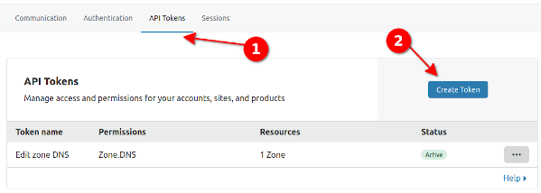
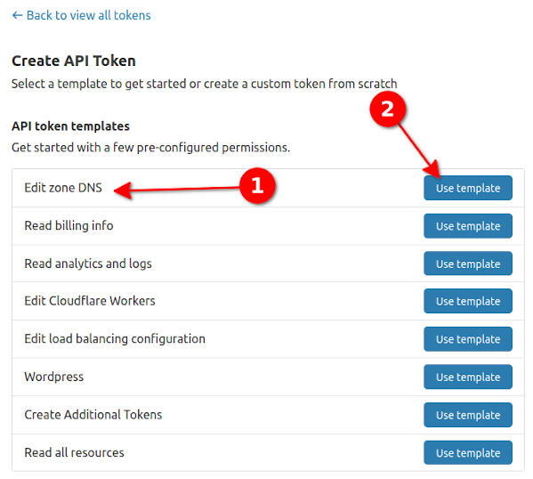
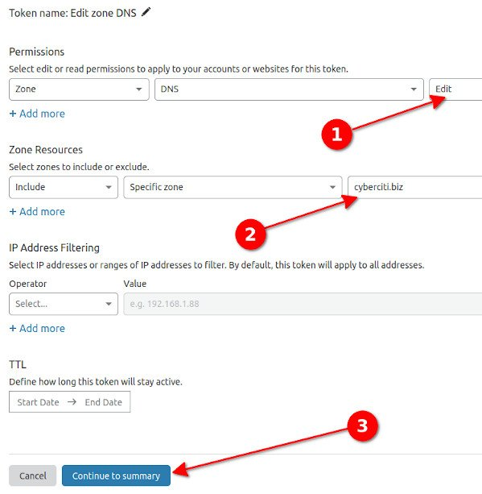
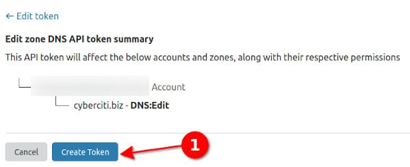
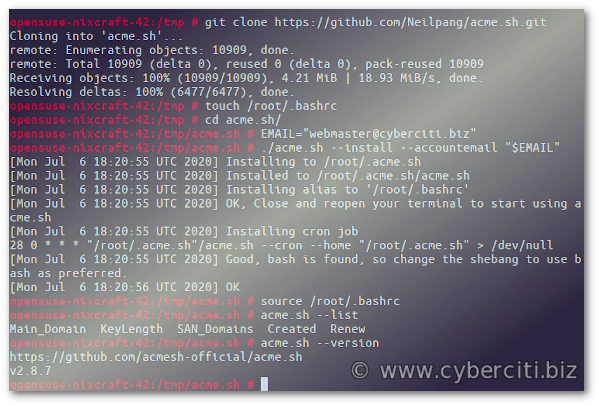

I read your [Let’s Encrypt TLS/SSL certificate](https://www.cyberciti.biz/faq/tag/lets-encrypt-certificate/) acme.sh tutorial. But, I need to set up and use Cloudflare DNS with acme.sh. How do I secure my Nginx web server with Let’s Encrypt TLS/SSL certificate issue with Cloudflare DNS?

 For wildcard TLS/SSL certificates, the only challenge method Let’s Encrypt accepts is the DNS challenge to authenticate the domain ownership. Therefore, we need to Cloudflare DNS API to add/modify DNS for our domain. This tutorial explains how to generate a wildcard TLS/SSL certificate using Let’s Encrypt client called acme.sh running on Linux or Unix-like systems.

Prerequisite to get Let’s Encrypt wildcard certificate
------------------------------------------------------

You need the Nginx server installed and running. For example:

```
$ sudo apt install nginx
$ sudo yum install nginx
```

 See the following tutorials:

* [Install Nginx on CentOS 8](https://www.cyberciti.biz/faq/how-to-install-and-use-nginx-on-centos-8/) (See [CentOS 7/RHEL 7 specific instructions here](https://www.cyberciti.biz/faq/how-to-install-and-use-nginx-on-centos-7-rhel-7/))
* How to [install Nginx on Ubuntu 20.04 LTS](https://www.cyberciti.biz/faq/how-to-install-nginx-on-ubuntu-20-04-lts/)
* Set up and [install Nginx on OpenSUSE Linux](https://www.cyberciti.biz/faq/install-and-use-nginx-on-opensuse-linux/)
* [Installing and setting up Nginx on Debian Linux 9](https://www.cyberciti.biz/faq/howto-install-setup-nginx-on-debian-linux-9/)
* [How to install Nginx on an Alpine Linix](https://www.cyberciti.biz/faq/how-to-install-nginx-web-server-on-alpine-linux/)

### Step 1 – Getting Cloudflare API key

Head over to Cloudflare control panel and [obtain API key](https://dash.cloudflare.com/profile/api-tokens):

 Click on the “**Create Token**” \> “**Edit zone DNS**” \> **Use template **:

 Make sure you set up DNS **Permissions** to **Edit** and include zone to your DNS domain name such as [cyberciti.biz]():

 Finally click on the “**Continue to summary**” to see your “**Edit zone DNS API token summary**” as follows:

 Finally, copy token displayed on the screen to access the Cloudflare API. Do not share this token with anyone. Keep it secure and secret.

### Step 2 – Installing acme.sh client

After getting Cloudflare DNS API key, now set up the acme.sh client. Hence, clone the acme.sh [repo](https://github.com/acmesh-official/acme.sh) using the git command:

```
$ cd /tmp/
$ git clone https://github.com/Neilpang/acme.sh.git
```

 Install the client but first log in as root user using the su command/sudo command:

```
$ sudo -i
# touch /root/.bashrc
# cd /tmp/acme.sh/
# acme.sh --install --accountemail your-email-id@domain-here
```

[](https://www.cyberciti.biz/faq/how-to-secure-nginx-with-lets-encrypt-on-opensuse-15-1-15-2/)

Installing acme.sh Let’s Encrypt client

### Step 3 – Issuing Let’s Encrypt wildcard certificate

So far we set up Nginx, obtained Cloudflare DNS API key, and now it is time to use acme.sh to get a wildcard certificate for cyberciti.biz domain. First set up the CF\_Token using export command as follows:

```
# Export single variable for the CloudFlare DNS challenge to work #
# export CF_Token="Your_Cloudflare_DNS_API_Key_Goes_here"
```

 No need to define shell variable CF\_Account\_ID and CF\_Zone\_ID as those will be automatically pulled by the acme.sh. Then request the certificate. Make sure you replace cyberciti.biz with your domain name:
`# acme.sh --issue --dns dns_cf --ocsp-must-staple --keylength 4096 -d cyberciti.biz -d '*.cyberciti.biz'`
 If you prefer Elliptic-curve cryptography (ECC/ECDSA) instead of RSA, try:

Although it is possible to configure Nginx to use RSA and ECDSA certificates, I will use RSA here as my LB only supports RSA. But you can serve a dual-cert config too which offers an RSA certificate by default, and a (much smaller) ECDSA certificate to those clients that indicate support. 

`# acme.sh --issue --dns dns_cf --ocsp-must-staple --keylength ec-384 -d cyberciti.biz -d '*.cyberciti.biz'`

    [Tue 21 Jul 2020 09:41:22 AM UTC] Creating domain key
    [Tue 21 Jul 2020 09:41:22 AM UTC] The domain key is here: /root/.acme.sh/cyberciti.biz_ecc/cyberciti.biz.key
    [Tue 21 Jul 2020 09:41:22 AM UTC] Multi domain='DNS:cyberciti.biz,DNS:*.cyberciti.biz'
    [Tue 21 Jul 2020 09:41:22 AM UTC] Getting domain auth token for each domain
    [Tue 21 Jul 2020 09:41:23 AM UTC] Getting webroot for domain='cyberciti.biz'
    [Tue 21 Jul 2020 09:41:23 AM UTC] Getting webroot for domain='*.cyberciti.biz'
    [Tue 21 Jul 2020 09:41:23 AM UTC] cyberciti.biz is already verified, skip dns-01.
    [Tue 21 Jul 2020 09:41:23 AM UTC] *.cyberciti.biz is already verified, skip dns-01.
    [Tue 21 Jul 2020 09:41:23 AM UTC] Verify finished, start to sign.
    [Tue 21 Jul 2020 09:41:23 AM UTC] Lets finalize the order, Le_OrderFinalize: https://acme-v02.api.letsencrypt.org/acme/finalize/91904709/4305779370
    [Tue 21 Jul 2020 09:41:24 AM UTC] Download cert, Le_LinkCert: https://acme-v02.api.letsencrypt.org/acme/cert/0436c4ebf2a5784d099b29e0debb715b9b21
    [Tue 21 Jul 2020 09:41:24 AM UTC] Cert success.
    -----BEGIN CERTIFICATE-----
    MIIEyDCCA7CgAwIBAgISBDbE6/KleE0Jmyng3rtxW5shMA0GCSqGSIb3DQEBCwUA
    MDEwMTkwODQxMjNaMBgxFjAUBgNVBAMTDWN5YmVyY2l0aS5iaXowdjAQBgcqhkjO
    PQIBBgUrgQQAIgNiAATgsEKKKKZQBxND706ETdaZUwapb8439jksX4P4eJldG03A
    .....
    ..
    RuA8fFmhcftOGL2FZmQibR0m2ReMiAAf4m4dmU4uJ1UNp6AabA6Fj+BTbaLRFQqJ
    SFGM3REOsgJxWt4ee+oDwZXkpDwUHNqiA7ldyw==
    -----END CERTIFICATE-----
    [Tue 21 Jul 2020 09:41:24 AM UTC] Your cert is in  /root/.acme.sh/cyberciti.biz_ecc/cyberciti.biz.cer 
    [Tue 21 Jul 2020 09:41:24 AM UTC] Your cert key is in  /root/.acme.sh/cyberciti.biz_ecc/cyberciti.biz.key 
    [Tue 21 Jul 2020 09:41:24 AM UTC] The intermediate CA cert is in  /root/.acme.sh/cyberciti.biz_ecc/ca.cer 
    [Tue 21 Jul 2020 09:41:24 AM UTC] And the full chain certs is there:  /root/.acme.sh/cyberciti.biz_ecc/fullchain.cer

Your Cloudflare DNS API key is sotred in /root/.acme.sh/account.conf file and we can see it using the [cat command](https://www.cyberciti.biz/faq/linux-unix-appleosx-bsd-cat-command-examples/) or [grep command](https://www.cyberciti.biz/faq/howto-use-grep-command-in-linux-unix/):

```
# cat /root/.acme.sh/account.conf
# grep '_CF_' /root/.acme.sh/account.conf
```

### Step 4 – Configuring Nginx web server

Make sure you create a Diffie-Hellman key exchange file as follows using the openssl command:

```
# mkdir -pv /etc/nginx/ssl/cyberciti.biz/
# cd /etc/nginx/ssl/cyberciti.biz/
# openssl dhparam -out /etc/nginx/ssl/cyberciti.biz/dhparams.pem -dsaparam 4096
```

 Then edit your Nginx config file:
`# vi /etc/nginx/nginx.conf`
 Edit/update as follows:

    # Port 80 config
    server {
     listen      80 default_server; # IPv4
     listen [::]:80 default_server; # IPv6
     server_name www.cyberciti.biz;
     access_log  off;
     error_log   off;
     root        /var/www/html;
     return 301 https://$host$request_uri;
    }

    # Port 443 config
    server {
     listen 443 ssl http2;                # IPv4
     listen [::]:443 ssl http2;           # HTTP/2 TLS IPv6
     server_name www.cyberciti.biz;  # domain name 
     # Set document root 
     location / {
     root   /var/www/html;
     index  index.html;
     }

     # Set access and error log for this vhos
     access_log /var/log/nginx/cyberciti.biz_access.log;
     error_log  /var/log/nginx/cyberciti.biz_error.log;  
     # TLS/SSL CONFIG 
     ssl_certificate /etc/nginx/ssl/cyberciti.biz/cyberciti.biz.fullchain.cer;
     ssl_certificate_key /etc/nginx/ssl/cyberciti.biz/cyberciti.biz.key;

     # ECC/ECDSA certificates (dual config)
     #ssl_certificate /etc/nginx/ssl/cyberciti.biz/cyberciti.biz.fullchain.cer.ecc;
     #ssl_certificate_key /etc/nginx/ssl/cyberciti.biz/cyberciti.biz.key.ecc;
     ssl_dhparam  /etc/nginx/ssl/cyberciti.biz/dhparams.pem;

     # A little bit of optimization 
     ssl_session_timeout 1d;
     ssl_session_cache shared:NixCraftSSL:10m;

     # TLS version 1.2 and 1.3 only
     ssl_session_tickets off;  
     ssl_protocols TLSv1.2 TLSv1.3;
     ssl_ciphers ECDHE-ECDSA-AES128-GCM-SHA256:ECDHE-RSA-AES128-GCM-SHA256:ECDHE-ECDSA-AES256-GCM-SHA384:ECDHE-RSA-AES256-GCM-SHA384:ECDHE-ECDSA-CHACHA20-POLY1305:ECDHE-RSA-CHACHA20-POLY1305:DHE-RSA-AES128-GCM-SHA256:DHE-RSA-AES256-GCM-SHA384;
     ssl_prefer_server_ciphers off;  

     # HSTS (ngx_http_headers_module is required)
     # *************************************************************************
     # WARNING - Wrong headers can create problems. Read docs otherwise
     #           all 3rd party scripts/ads won't load and in some case 
     #           browser won't work. Read docs @ https://developer.mozilla.org
     # ************************************************************************* 
     add_header Strict-Transport-Security "max-age=63072000" always;
     add_header X-Content-Type-Options "nosniff" always;
     add_header X-Frame-Options "SAMEORIGIN" always;
     add_header X-Xss-Protection "1; mode=block" always;
     add_header Referrer-Policy  strict-origin-when-cross-origin always;
     add_header Feature-policy "accelerometer 'none'; camera 'none'; geolocation 'none'; gyroscope 'none'; magnetometer 'none'; microphone 'none'; payment 'none'; usb 'none'" always;
     # ***************************************************************************************************
     # WARNING: The HTTP Content-Security-Policy response header allows sysadmin/developers 
     # to control resources the user agent is allowed to load for a given page. 
     # Wrong config can create problems for third party scripts/ad networks. Hence read the following url: 
     # https://developer.mozilla.org/en-US/docs/Web/HTTP/Headers/Content-Security-Policy
     # ****************************************************************************************************
     add_header content-security-policy "default-src https://www.cyberciti.biz:443" always;  # OCSP stapling

     # Verify chain of trust of OCSP response using Root CA and Intermediate certs
     ssl_stapling on;
     ssl_stapling_verify on;  
     ssl_trusted_certificate /etc/nginx/ssl/cyberciti.biz/cyberciti.biz.fullchain.cer;  

     # Replace with the IP address of your resolver
     resolver 1.1.1.1;
    }

[Save and close the file in vim.](https://www.cyberciti.biz/faq/linux-unix-vim-save-and-quit-command/)

### Step 5 – Installing Let’s Encrypt wildcard certificate

Install your certificate (replace the systemctl reload nginx command as per your Linux/Unix distro)::

```
# DOMAIN="cyberciti.biz"
# CONFIG_ROOT="/etc/nginx/ssl/${DOMAIN}"
# acme.sh -d "$DOMAIN" \
--install-cert \
--reloadcmd "systemctl reload nginx" \
--fullchain-file "${CONFIG_ROOT}/$DOMAIN.fullchain.cer" \
--key-file "${CONFIG_ROOT}/$DOMAIN.key" \
--cert-file "${CONFIG_ROOT}/$DOMAIN.cer"
```

 Install ECC/ECDSA if you need them too (again, replace the systemctl reload nginx command as per your Linux/Unix distro):

```
# acme.sh -d "$DOMAIN" \
--ecc \
--install-cert \
--reloadcmd "systemctl reload nginx" \
--fullchain-file "${CONFIG_ROOT}/$DOMAIN.fullchain.cer.ecc" \
--key-file "${CONFIG_ROOT}/$DOMAIN.key.ecc" \
--cert-file "${CONFIG_ROOT}/$DOMAIN.cer.ecc"
```

### Step 6 – Testing

Make sure you open Nginx server tcp port \# 443 if not already opened. For example, here is how we can open it on Ubuntu or Debian Linux:
`$ sudo ufw allow https comment 'Open all to access Nginx port 443'`
 Fire a web browser and type the url:
`https://www.cyberciti.biz/`
 Of course, we can visit [SSL labs](https://www.ssllabs.com/ssltest/) to test our TLS/SSL config page. Another option is to run the testssl.sh command as follows:
`$ testssl.sh --fast --parallel https://www.cyberciti.biz/`


### Step 7 – Renewing Let’s Encrypt wildcard DNS certificate

Renewal will take place automatically via [cronjob](https://www.cyberciti.biz/faq/how-do-i-add-jobs-to-cron-under-linux-or-unix-oses/). We can [list / display and view all cron jobs](https://www.cyberciti.biz/faq/linux-show-what-cron-jobs-are-setup/) including acme.sh job as follows:
`# crontab -l`
 Here is what we see:

    35 0 * * * "/root/.acme.sh"/acme.sh --cron --home "/root/.acme.sh" > /dev/null

However, if need arriases we can do manual renewal. Here is how to [forcefully renew Let’s Encrypt DNS wildcard certificate](https://www.cyberciti.biz/faq/how-to-forcefully-renew-lets-encrypt-certificate/):
`# acme.sh --renew --force --dns dns_cf --ocsp-must-staple --keylength 4096 -d cyberciti.biz -d '*.cyberciti.biz'`

Conclusion
----------

You created a wildcard TLS/SSL certificate for your domain using acme.sh and Cloudflare DNS API for domain verification. Please note that acme.sh automatically configure a [cron jobs](https://www.cyberciti.biz/faq/how-do-i-add-jobs-to-cron-under-linux-or-unix-oses/) to renew our wildcard based certificate. You can now install certificates to ISP load balancer or even use on LAN that are not open from the internet.

This entry is **11** of **13** in the **Secure Web Server with Let's Encrypt Tutorial** series. Keep reading the rest of the series:

1. [Set up Lets Encrypt on Debian/Ubuntu Linux](https://www.cyberciti.biz/faq/how-to-configure-nginx-with-free-lets-encrypt-ssl-certificate-on-debian-or-ubuntu-linux/)
2. [Secure **Lighttpd** with Lets Encrypt certificate on Debian/Ubuntu](https://www.cyberciti.biz/faq/how-to-configure-lighttpd-web-server-with-free-lets-encrypt-ssl-certificate-on-debian-or-ubuntu-linux/)
3. [Configure **Nginx** with Lets Encrypt certificate on **Alpine** Linux](https://www.cyberciti.biz/faq/how-to-install-letsencrypt-free-ssltls-for-nginx-certificate-on-alpine-linux/)
4. [**Nginx** with Lets Encrypt on **CentOS 7**](https://www.cyberciti.biz/faq/how-to-secure-nginx-lets-encrypt-on-centos-7/)
5. [**Apache** with Lets Encrypt Certificates on **RHEL 8**](https://www.cyberciti.biz/faq/how-to-secure-apache-with-lets-encrypt-certificates-on-rhel-8/)
6. [**CentOS 8** and **Apache** with Lets Encrypt Certificates](https://www.cyberciti.biz/faq/apache-with-lets-encrypt-certificates-on-centos-8/)
7. [Install Lets Encrypt certificates on **CentOS 8** for **Nginx**](https://www.cyberciti.biz/faq/configure-nginx-with-lets-encrypt-on-centos-8/)
8. [Forcefully renew Let's Encrypt certificate](https://www.cyberciti.biz/faq/how-to-forcefully-renew-lets-encrypt-certificate/)
9. [**OpenSUSE Linux** and Nginx with Let's Encrypt Certificates](https://www.cyberciti.biz/faq/how-to-secure-nginx-with-lets-encrypt-on-opensuse-15-1-15-2/)
10. [Configure Nginx to use TLS 1.2 / 1.3 only](https://www.cyberciti.biz/faq/configure-nginx-to-use-only-tls-1-2-and-1-3/)
11. Let's Encrypt **wildcard certificate** with acme.sh and **Cloudflare DNS**
12. [Nginx with Let's Encrypt on Ubuntu 18.04 with DNS Validation](https://www.cyberciti.biz/faq/secure-nginx-with-lets-encrypt-on-ubuntu-18-04-with-dns-validation/)
13. [AWS **Route 53** Let's Encrypt wildcard certificate with acme.sh](https://www.cyberciti.biz/faq/route-53-lets-encrypt-wildcard-certificate-with-acme-sh/)

 🐧 Get the latest tutorials on Linux, Open Source & DevOps via **[RSS feed](https://www.cyberciti.biz/atom/atom.xml)** or **[Weekly email newsletter.](https://newsletter.cyberciti.biz/subscription?f=1ojtmiv8892KQzyMsTF4YPr1pPSAhX2rq7Qfe5DiHMgXwKo892di4MTWyOdd976343rcNR6LhdG1f7k9H8929kMNMdWu3g)**

 🐧 6 comments so far... [add one](https://www.cyberciti.biz/faq/issue-lets-encrypt-wildcard-certificate-with-acme-sh-and-cloudflare-dns/#respond) **↓**

CategoryList of Unix and Linux commandsDisk space analyzers[df](https://www.cyberciti.biz/faq/df-command-examples-in-linux-unix/) • [ncdu](https://www.cyberciti.biz/open-source/install-ncdu-on-linux-unix-ncurses-disk-usage/) • [pydf](https://www.cyberciti.biz/tips/unix-linux-bsd-pydf-command-in-colours.html)File Management[cat](https://www.cyberciti.biz/faq/linux-unix-appleosx-bsd-cat-command-examples/) • [cp](https://www.cyberciti.biz/faq/cp-copy-command-in-unix-examples/) • [mkdir](https://www.cyberciti.biz/faq/linux-make-directory-command/) • [tree](https://www.cyberciti.biz/faq/linux-show-directory-structure-command-line/)Firewall[Alpine Awall](https://www.cyberciti.biz/faq/how-to-set-up-a-firewall-with-awall-on-alpine-linux/) • [CentOS 8](https://www.cyberciti.biz/faq/how-to-set-up-a-firewall-using-firewalld-on-centos-8/) • [OpenSUSE](https://www.cyberciti.biz/faq/set-up-a-firewall-using-firewalld-on-opensuse-linux/) • [RHEL 8 ](https://www.cyberciti.biz/faq/configure-set-up-a-firewall-using-firewalld-on-rhel-8/) • [Ubuntu 16.04](https://www.cyberciti.biz/faq/howto-configure-setup-firewall-with-ufw-on-ubuntu-linux/) • [Ubuntu 18.04](https://www.cyberciti.biz/faq/how-to-setup-a-ufw-firewall-on-ubuntu-18-04-lts-server/) • [Ubuntu 20.04](https://www.cyberciti.biz/faq/how-to-configure-firewall-with-ufw-on-ubuntu-20-04-lts/)Network Utilities[NetHogs](https://www.cyberciti.biz/faq/linux-find-out-what-process-is-using-bandwidth/) • [dig](https://www.cyberciti.biz/faq/linux-unix-dig-command-examples-usage-syntax/) • [host](https://www.cyberciti.biz/faq/linux-unix-host-command-examples-usage-syntax/) • [ip](https://www.cyberciti.biz/faq/linux-ip-command-examples-usage-syntax/) • [nmap](https://www.cyberciti.biz/security/nmap-command-examples-tutorials/)OpenVPN[CentOS 7](https://www.cyberciti.biz/faq/centos-7-0-set-up-openvpn-server-in-5-minutes/) • [CentOS 8](https://www.cyberciti.biz/faq/centos-8-set-up-openvpn-server-in-5-minutes/) • [Debian 10](https://www.cyberciti.biz/faq/debian-10-set-up-openvpn-server-in-5-minutes/) • [Debian 8/9](https://www.cyberciti.biz/faq/install-configure-openvpn-server-on-debian-9-linux/) • [Ubuntu 18.04](https://www.cyberciti.biz/faq/ubuntu-18-04-lts-set-up-openvpn-server-in-5-minutes/) • [Ubuntu 20.04](https://www.cyberciti.biz/faq/ubuntu-20-04-lts-set-up-openvpn-server-in-5-minutes/)Package Manager[apk](https://www.cyberciti.biz/faq/10-alpine-linux-apk-command-examples/) • [apt](https://www.cyberciti.biz/faq/ubuntu-lts-debian-linux-apt-command-examples/)Processes Management[bg](https://www.cyberciti.biz/faq/unix-linux-bg-command-examples-usage-syntax/) • [chroot](https://www.cyberciti.biz/faq/unix-linux-chroot-command-examples-usage-syntax/) • [cron](https://www.cyberciti.biz/faq/how-do-i-add-jobs-to-cron-under-linux-or-unix-oses/) • [disown](https://www.cyberciti.biz/faq/unix-linux-disown-command-examples-usage-syntax/) • [fg](https://www.cyberciti.biz/faq/unix-linux-fg-command-examples-usage-syntax/) • [jobs](https://www.cyberciti.biz/faq/unix-linux-jobs-command-examples-usage-syntax/) • [killall](https://www.cyberciti.biz/faq/unix-linux-killall-command-examples-usage-syntax/) • [kill](https://www.cyberciti.biz/faq/unix-kill-command-examples/) • [pidof](https://www.cyberciti.biz/faq/linux-pidof-command-examples-find-pid-of-program/) • [pstree](https://www.cyberciti.biz/faq/unix-linux-pstree-command-examples-shows-running-processestree/) • [pwdx](https://www.cyberciti.biz/faq/unix-linux-pwdx-command-examples-usage-syntax/) • [time](https://www.cyberciti.biz/faq/unix-linux-time-command-examples-usage-syntax/)Searching[grep](https://www.cyberciti.biz/faq/howto-use-grep-command-in-linux-unix/) • [whereis](https://www.cyberciti.biz/faq/unix-linux-whereis-command-examples-to-locate-binary/) • [which](https://www.cyberciti.biz/faq/unix-linux-which-command-examples-syntax-to-locate-programs/)User Information[groups](https://www.cyberciti.biz/faq/unix-linux-groups-command-examples-syntax-usage/) • [id](https://www.cyberciti.biz/faq/unix-linux-id-command-examples-usage-syntax/) • [lastcomm](https://www.cyberciti.biz/faq/linux-unix-lastcomm-command-examples-usage-syntax/) • [last](https://www.cyberciti.biz/faq/linux-unix-last-command-examples/) • [lid/libuser-lid](https://www.cyberciti.biz/faq/linux-lid-command-examples-syntax-usage/) • [logname](https://www.cyberciti.biz/faq/unix-linux-logname-command-examples-syntax-usage/) • [members](https://www.cyberciti.biz/faq/linux-members-command-examples-usage-syntax/) • [users](https://www.cyberciti.biz/faq/unix-linux-users-command-examples-syntax-usage/) • [whoami](https://www.cyberciti.biz/faq/unix-linux-whoami-command-examples-syntax-usage/) • [who](https://www.cyberciti.biz/faq/unix-linux-w-command-examples-syntax-usage-2/) • [w](https://www.cyberciti.biz/faq/unix-linux-w-command-examples-syntax-usage-2/)WireGuard VPN[Alpine](https://www.cyberciti.biz/faq/how-to-set-up-wireguard-vpn-server-on-alpine-linux/) • [CentOS 8](https://www.cyberciti.biz/faq/centos-8-set-up-wireguard-vpn-server/) • [Debian 10](https://www.cyberciti.biz/faq/debian-10-set-up-wireguard-vpn-server/) • [Firewall](https://www.cyberciti.biz/faq/how-to-set-up-wireguard-firewall-rules-in-linux/) • [Ubuntu 20.04](https://www.cyberciti.biz/faq/ubuntu-20-04-set-up-wireguard-vpn-server/)