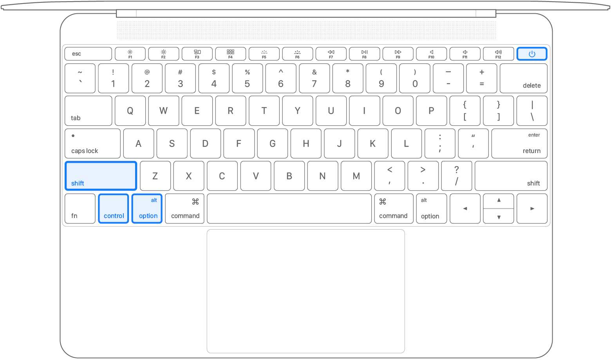

This article applies only to [Mac computers with an Intel processor](https://support.apple.com/kb/HT211814).

Reset the SMC on computers that have the T2 chip
------------------------------------------------

[If your Mac has the Apple T2 Security Chip](https://support.apple.com/kb/HT208862), follow these steps. If you need help, [contact Apple Support](https://support.apple.com/contact). 

### Notebook computers with the T2 chip

Before resetting the SMC, try these steps:

1. Shut down your Mac.
2. Press and hold the **power button** for 10 seconds, then release the button.
3. Wait a few seconds, then press the **power button** to turn on your Mac.

If the issue persists, follow these steps to reset the SMC:

1. Shut down your Mac.
2. On your built-in keyboard, press and hold all of the following keys. Your Mac might turn on.
  * **Control**  on the left side of your keyboard
  * **Option** (Alt)  on the left side of your keyboard
  * **Shift**  on the right side of your keyboard
3. Keep holding **all three keys** for 7 seconds, then press and hold the **power button** as well. If your Mac is on, it will turn off as you hold the keys.

4. Keep holding **all four keys** for another 7 seconds, then release them.
5. Wait a few seconds, then press the **power button** to turn on your Mac.

### Desktop computers with the T2 chip

1. Shut down your Mac, then unplug the power cord.
2. Wait 15 seconds, then plug the power cord back in.
3. Wait 5 seconds, then press the **power button** to turn on your Mac.

Reset the SMC on other computers
--------------------------------

If your Mac doesn't have the [Apple T2 Security Chip](https://support.apple.com/kb/HT208862), follow these steps. If you need help, [contact Apple Support](https://support.apple.com/contact). 

### Notebook computers with a nonremovable battery

This applies to [MacBook Pro](https://support.apple.com/kb/HT201300) models introduced in mid-2009 through 2017, [MacBook Air](https://support.apple.com/kb/HT201862) models introduced in 2017 or earlier, and all [MacBook](https://support.apple.com/kb/HT201608) models except the MacBook (13-inch, Mid 2009).

1. Shut down your Mac.
2. On your built-in keyboard, press and hold all of these keys:
  * **Shift**  on the left side of your keyboard
  * **Control**  on the left side of your keyboard
  * **Option** (Alt)  on the left side of your keyboard
3. While holding **all three keys**, press and hold the **power button** as well.

4. Keep holding **all four keys** for 10 seconds.
5. Release all keys, then press the **power button** to turn on your Mac.

### Notebook computers with a battery that can be removed

This applies to all [MacBook Pro](https://support.apple.com/kb/HT201300) and [MacBook](https://support.apple.com/kb/HT201608) models introduced in early 2009 or earlier, as well as the MacBook (13-inch, Mid 2009). 

1. Shut down your Mac.
2. Remove the battery. (If you need help removing it, contact an [Apple Store](http://www.apple.com/retail/storelist/) or [Apple Authorized Service Provider](https://locate.apple.com/).)
3. Press and hold the **power button** for 5 seconds.
4. Reinstall the battery.
5. Press the **power button** to turn on your Mac.

### Desktop computers

1. Shut down your Mac, then unplug the power cord.
2. Wait 15 seconds, then plug the power cord back in.
3. Wait 5 seconds, then press the **power button** to turn on your Mac.

About the SMC
-------------

The system management controller is responsible for managing behaviors related to these features:

* Power, including the power button and power to the USB ports
* Battery and charging
* Fans and other thermal-management features
* Indicators or sensors such as status indicator lights (sleep status, battery charging status, and others), the sudden motion sensor, the ambient light sensor, and keyboard backlighting
* Behavior when opening and closing the lid of a notebook computer

Resetting the SMC doesn't affect the contents of [NVRAM or PRAM](https://support.apple.com/kb/HT204063).