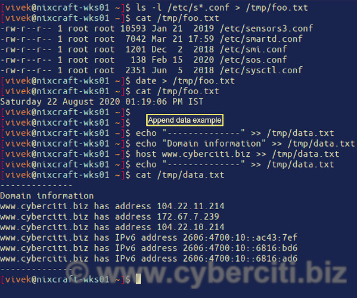

How to write the output into the file in Linux
==============================================

Author: Vivek Gite Last updated: August 22, 2020 [1 comment](https://www.cyberciti.biz/faq/how-to-write-the-output-into-the-file-in-linux/#comments)

[](safari-reader://www.cyberciti.biz/faq/category/linux/ "See all GNU/Linux related FAQ")

How do I write the output into the file in Linux bash shell? Can you explain I/O redirection for both bash and POSIX shell to write data to the file under Unix or Linux?

When you type a command at the shell prompt, it displays output on screen or terminal. However, bash allows you to redirect and write the output into the file in Linux or Unix-like systems. This is useful for processing or saves the terminal output to a file for other purposes.

How do I save terminal output to a file?
----------------------------------------

A command can receive input from a file and send output to a file. 

### Writing the output into the file

The syntax is
`command > filename`
For example, send output of the ls command to file named foo.txt
`$ ls > foo.txt`
View foo.txt using the [cat command](https://www.cyberciti.biz/faq/linux-unix-appleosx-bsd-cat-command-examples/ "See Linux/Unix cat command examples for more info"):
`$ cat foo.txt`
Please note that when you type ‘ls \> foo.txt’, shell redirects the output of the ls command to a file named foo.txt, replacing the existing contents of the file. In other words, the contents of the file will be overwritten.

### Appending the output or data to the file

The syntax is
`command >> filename`
For example the following will append data:

    echo "--------------" \>\> /tmp/data.txt
    echo "Domain information" \>\> /tmp/data.txt
    host www.cyberciti.biz \>\> /tmp/data.txt
    echo "--------------" \>\> /tmp/data.txt

Verify it:
`cat /tmp/data.txt`


How to save the output of a command to a file in bash using tee command
-----------------------------------------------------------------------

The tee command read from standard input and write to standard output and files. The syntax is as follows for writing data into the file:
`command | tee file.txt`
Want to append data? Try
`command | tee -a output.txt`

### Examples

Display output of the [date command](https://www.cyberciti.biz/faq/unix-date-command-howto-see-set-date-time/ "See Linux/Unix date command examples for more info") on screen and save to the file named /tmp/output.txt. If the output.txt already exists, it gets overwritten:

```
$ date | tee /tmp/output.txt
$ cat /tmp/output.txt
```

Same as above but append to the given files, do not overwrite file:

```
$ pwd | tee -a /tmp/test.txt
$ echo "Today is $(date)" | tee -a /tmp/test.txt
$ hostnamectl | tee -a /tmp/test.txt
$ cat /tmp/test.txt
```

The above commands will append the output to the end of the file, just like the shell \>\> operator as explained earlier. 

I/O redirection summary for bash and POSIX shell
------------------------------------------------

Shell operatorDescriptionOverwrite existing file?command \> output.txtSave terminal output (standard output) to a file named output.txtYescommand \>\> output.txtAppend terminal output (standard output) to a file named output.txtNocommand \< output.txtTakes standard input from output.txt fileN/Acommand 0\< output.txtTakes standard input from output.txt fileN/Acommand 1\> output.txtPuts standard output to output.txt fileYescommand 1\>\> output.txtAppends standard output to output.txtNocommand 2\> output.txtPuts standard error to output.txtYescommand 2\>\> output.txtAppends standard error to output.txt fileNocommand &\> output.txtPuts both standard error and output to output.txtYescommand \> output.txt 2\>&1{**POSIX**} Puts both standard error and output to file named output.txtYescommand &\>\> output.txtAppends both standard error and output to file named output.txtNocommand \>\> output.txt 2\>&1{**POSIX**} Appends both standard error and output to file called output.txtNocommand | tee output.txtPuts standard output to output.txt while displaying output on screenYescommand | tee -a output.txtAppends standard output to output.txt while displaying output on screenNocommand |& tee output.txtPuts both standard output and error to output.txt while displaying output on terminalYescommand 2\>&1 | tee output.txt{**POSIX**} Puts both standard output and error to file named output.txt while displaying output on terminalYescommand |& tee -a output.txtAppend both standard output and error to file called output.txt while displaying output on terminalNocommand 2\>&1 | tee -a output.txt{**POSIX**} Append both standard output and error to file named output.txt while displaying output on terminalNo

Conclusion
----------

You learned how to write the output to the file in Linux or Unix-like system when using bash or POSIX shell. We have:

1. /dev/stdin (standard input) - File descriptor 0 is duplicated.
2. /dev/stdout (standard output) - File descriptor 1 is duplicated.
3. /dev/stderr (standard error) - File descriptor 2 is duplicated.

See [I/O redirection documentation](https://www.gnu.org/software/bash/manual/html_node/Redirections.html) for more information. We can read bash man page as follows using the man command:
`man bash`

🐧 Get the latest tutorials on Linux, Open Source & DevOps via **[RSS feed](https://www.cyberciti.biz/atom/atom.xml)** or **[Weekly email newsletter.](https://newsletter.cyberciti.biz/subscription?f=1ojtmiv8892KQzyMsTF4YPr1pPSAhX2rq7Qfe5DiHMgXwKo892di4MTWyOdd976343rcNR6LhdG1f7k9H8929kMNMdWu3g)**

🐧 1 comment so far... add one **↓**

CategoryList of Unix and Linux commandsDisk space analyzers[df](https://www.cyberciti.biz/faq/df-command-examples-in-linux-unix/ "df Linux/Unix examples and syntax") • [ncdu](https://www.cyberciti.biz/open-source/install-ncdu-on-linux-unix-ncurses-disk-usage/ "ncdu Linux/Unix examples and syntax") • [pydf](https://www.cyberciti.biz/tips/unix-linux-bsd-pydf-command-in-colours.html "pydf Unix/Linux examples and syntax")File Management[cat](https://www.cyberciti.biz/faq/linux-unix-appleosx-bsd-cat-command-examples/ "cat command examples and syntax") • [tree](https://www.cyberciti.biz/faq/linux-show-directory-structure-command-line/ "tree command examples and syntax")Firewall[Alpine Awall](https://www.cyberciti.biz/faq/how-to-set-up-a-firewall-with-awall-on-alpine-linux/ "Awall firewall on Alpine Linux examples and syntax") • [CentOS 8](https://www.cyberciti.biz/faq/how-to-set-up-a-firewall-using-firewalld-on-centos-8/ "firewalld on CentOS 8 examples and syntax") • [OpenSUSE](https://www.cyberciti.biz/faq/set-up-a-firewall-using-firewalld-on-opensuse-linux/ "firewalld on OpenSUSE Linux examples and syntax") • [RHEL 8 ](https://www.cyberciti.biz/faq/configure-set-up-a-firewall-using-firewalld-on-rhel-8/ "firewalld on RHEL (Red Hat Enterprise Linux) 8 examples and syntax")• [Ubuntu 16.04](https://www.cyberciti.biz/faq/howto-configure-setup-firewall-with-ufw-on-ubuntu-linux/ "ufw on Ubuntu 16.04 LTS examples and syntax") •[Ubuntu 18.04](https://www.cyberciti.biz/faq/how-to-setup-a-ufw-firewall-on-ubuntu-18-04-lts-server/ "ufw on Ubuntu 18.04 LTS examples and syntax") • [Ubuntu 20.04](https://www.cyberciti.biz/faq/how-to-configure-firewall-with-ufw-on-ubuntu-20-04-lts/ "ufw on Ubuntu 20.04 LTS examples and syntax")Network Utilities[NetHogs](https://www.cyberciti.biz/faq/linux-find-out-what-process-is-using-bandwidth/ "NetHogs - Monitor per process network bandwidth usage under Linux examples and syntax") • [dig](https://www.cyberciti.biz/faq/linux-unix-dig-command-examples-usage-syntax/ "dig command examples and syntax") • [host](https://www.cyberciti.biz/faq/linux-unix-host-command-examples-usage-syntax/ "host command examples and syntax") • [ip](https://www.cyberciti.biz/faq/linux-ip-command-examples-usage-syntax/ "ip command in Linux examples and syntax") • [nmap](https://www.cyberciti.biz/security/nmap-command-examples-tutorials/ "nmap command in Linux examples and syntax")OpenVPN[CentOS 7](https://www.cyberciti.biz/faq/centos-7-0-set-up-openvpn-server-in-5-minutes/ "CentOS 7 Set Up OpenVPN Server In 5 Minutes examples and syntax") • [CentOS 8](https://www.cyberciti.biz/faq/centos-8-set-up-openvpn-server-in-5-minutes/ "CentOS 8 OpenVPN server in 5 mintues examples and syntax") • [Debian 10](https://www.cyberciti.biz/faq/debian-10-set-up-openvpn-server-in-5-minutes/ "Debian 10 Set Up OpenVPN Server In 5 Minutes examples and syntax") • [Debian 8/9](https://www.cyberciti.biz/faq/install-configure-openvpn-server-on-debian-9-linux/ "OpenVPN server on Debian 9/8 examples and syntax") • [Ubuntu 18.04](https://www.cyberciti.biz/faq/ubuntu-18-04-lts-set-up-openvpn-server-in-5-minutes/ "Ubuntu 18.04 LTS Set Up OpenVPN Server In 5 Minutes examples and syntax") •[Ubuntu 20.04](https://www.cyberciti.biz/faq/ubuntu-20-04-lts-set-up-openvpn-server-in-5-minutes/ "Ubuntu 20.04 LTS OpenVPN server in 5 mintues examples and syntax")Package Manager[apk](https://www.cyberciti.biz/faq/10-alpine-linux-apk-command-examples/ "apk command in Apline Linux examples and syntax") • [apt](https://www.cyberciti.biz/faq/ubuntu-lts-debian-linux-apt-command-examples/ "apt command in Debian/Ubuntu Linux examples and syntax")Processes Management[bg](https://www.cyberciti.biz/faq/unix-linux-bg-command-examples-usage-syntax/ "bg command examples and syntax") • [chroot](https://www.cyberciti.biz/faq/unix-linux-chroot-command-examples-usage-syntax/ "chroot command examples and syntax") • [cron](https://www.cyberciti.biz/faq/how-do-i-add-jobs-to-cron-under-linux-or-unix-oses/ "cron and crontab command examples and syntax") • [disown](https://www.cyberciti.biz/faq/unix-linux-disown-command-examples-usage-syntax/ "disown command examples and syntax") • [fg](https://www.cyberciti.biz/faq/unix-linux-fg-command-examples-usage-syntax/ "fg command examples and syntax") • [jobs](https://www.cyberciti.biz/faq/unix-linux-jobs-command-examples-usage-syntax/ "jobs command examples and syntax") • [killall](https://www.cyberciti.biz/faq/unix-linux-killall-command-examples-usage-syntax/ "killall command examples and syntax") • [kill](https://www.cyberciti.biz/faq/unix-kill-command-examples/ "kill command examples and syntax") • [pidof](https://www.cyberciti.biz/faq/linux-pidof-command-examples-find-pid-of-program/ "pidof command examples and syntax") • [pstree](https://www.cyberciti.biz/faq/unix-linux-pstree-command-examples-shows-running-processestree/ "pstree command examples and syntax") •[pwdx](https://www.cyberciti.biz/faq/unix-linux-pwdx-command-examples-usage-syntax/ "pwdx command examples and syntax") • [time](https://www.cyberciti.biz/faq/unix-linux-time-command-examples-usage-syntax/ "time command examples and syntax")Searching[grep](https://www.cyberciti.biz/faq/howto-use-grep-command-in-linux-unix/ "grep command examples and syntax") • [whereis](https://www.cyberciti.biz/faq/unix-linux-whereis-command-examples-to-locate-binary/ "whereis command examples and syntax") • [which](https://www.cyberciti.biz/faq/unix-linux-which-command-examples-syntax-to-locate-programs/ "which command examples and syntax")User Information[groups](https://www.cyberciti.biz/faq/unix-linux-groups-command-examples-syntax-usage/ "groups command examples and syntax") • [id](https://www.cyberciti.biz/faq/unix-linux-id-command-examples-usage-syntax/ "id command examples and syntax") • [lastcomm](https://www.cyberciti.biz/faq/linux-unix-lastcomm-command-examples-usage-syntax/ "lastcomm command examples and syntax") • [last](https://www.cyberciti.biz/faq/linux-unix-last-command-examples/ "last command examples and syntax") • [lid/libuser-lid](https://www.cyberciti.biz/faq/linux-lid-command-examples-syntax-usage/ "lid/libuser-lid command examples and syntax") • [logname](https://www.cyberciti.biz/faq/unix-linux-logname-command-examples-syntax-usage/ "longname command examples and syntax") • [members](https://www.cyberciti.biz/faq/linux-members-command-examples-usage-syntax/ "members command examples and syntax")• [users](https://www.cyberciti.biz/faq/unix-linux-users-command-examples-syntax-usage/ "users command examples and syntax") • [whoami](https://www.cyberciti.biz/faq/unix-linux-whoami-command-examples-syntax-usage/ "whoami command examples and syntax") • [who](https://www.cyberciti.biz/faq/unix-linux-w-command-examples-syntax-usage-2/ "who command examples and syntax") • [w](https://www.cyberciti.biz/faq/unix-linux-w-command-examples-syntax-usage-2/ "w command examples and syntax")WireGuard VPN[Alpine](https://www.cyberciti.biz/faq/how-to-set-up-wireguard-vpn-server-on-alpine-linux/ "Alpine Linux set up WireGuard VPN server examples and syntax") • [CentOS 8](https://www.cyberciti.biz/faq/centos-8-set-up-wireguard-vpn-server/ "CentOS 8 set up WireGuard VPN server examples and syntax") • [Debian 10](https://www.cyberciti.biz/faq/debian-10-set-up-wireguard-vpn-server/ "Debian 10 set up WireGuard VPN server examples and syntax") • [Firewall](https://www.cyberciti.biz/faq/how-to-set-up-wireguard-firewall-rules-in-linux/ "WireGuard Firewall Rules in Linux examples and syntax") • [Ubuntu 20.04](https://www.cyberciti.biz/faq/ubuntu-20-04-set-up-wireguard-vpn-server/ "Ubuntu 20.04 set up WireGuard VPN server examples and syntax")