In the following example, an instance named WEB1 has been created that acts as a web server running Apache on ports 80 and 443\. Making a request to the web server at 192.168.206.6:80 eventually times out:

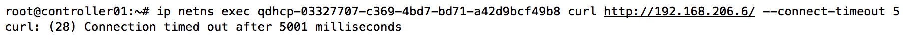

To demonstrate how security group rules are implemented on a compute node, take note of the following WEB\_SERVERS security group:

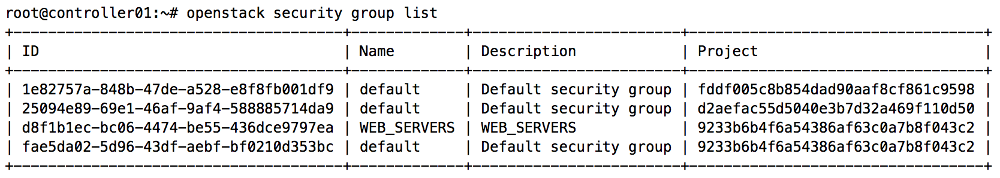

The following screenshot demonstrates two security group rules being added to the WEB\_SERVERS security group using the openstack security group rule create command. The rules allow inbound connections on ports 80 and 443 from any remote host, as defined by the CIDR 0.0.0.0/0:

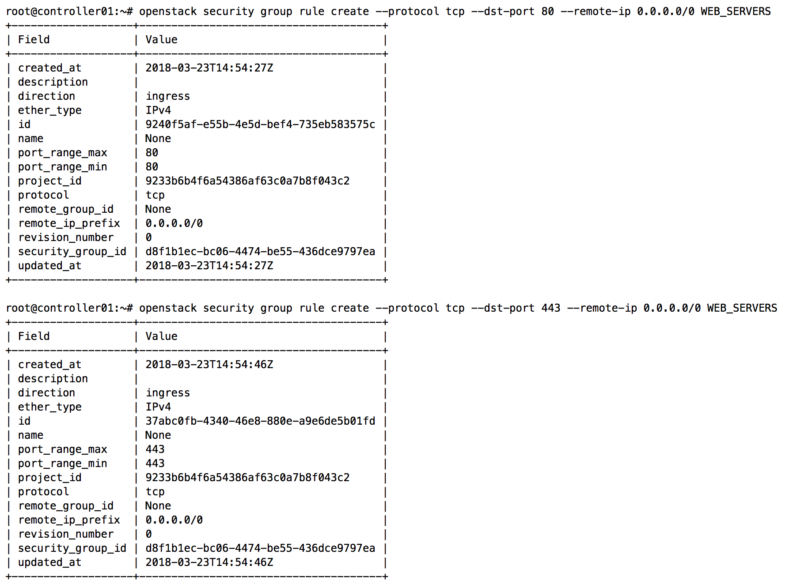

Using the openstack server add security group command, the WEB\_SERVERS security group can be applied to the WEB1 instance, as shown in the following screenshot:

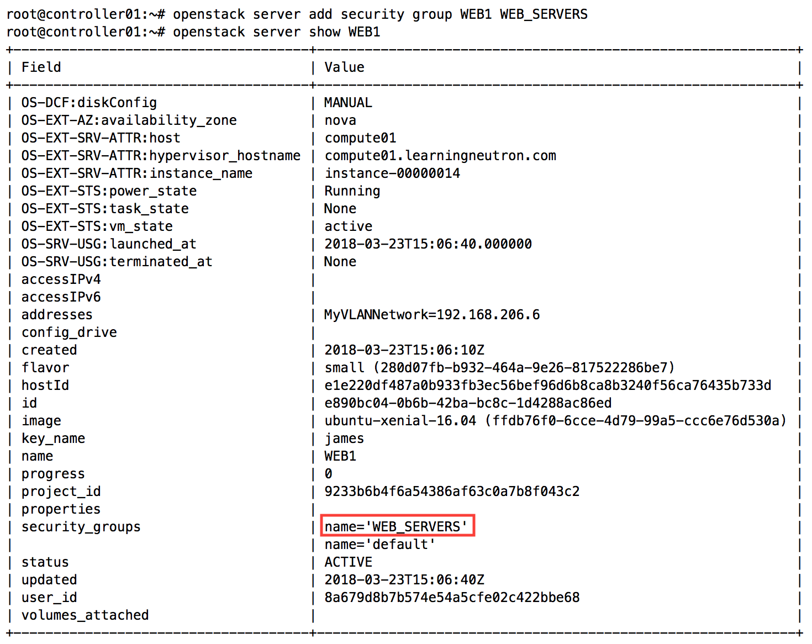

Once a security group has been applied to the corresponding port of an instance, a series of iptables rules and chains are implemented on the compute node hosting the instance. A quick connectivity check shows that the rule(s) work as expected:

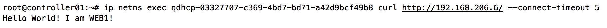

Stepping through the chains
---------------------------

The implementation of security group rules using iptables is similar in both Linux bridge and Open vSwitch-based environments. On compute01, a compute node running the Linux bridge agent and hosting the instance in this example, shows that iptables rules applied by the Neutron agent can be observed using the iptables-save or iptables -L commands.

For readability, only the raw and filter tables of rules related to the instance are shown in the following screenshot. Some comments have been removed or truncated to fit the page:

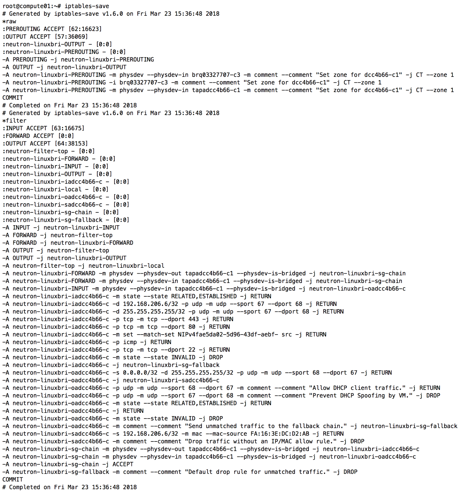

First, the PREROUTING chain of the raw table is consulted. In the PREROUTING chain, we can find rules associating traffic traversing an instance's interface and/or related network to specific conntrack zone(s):

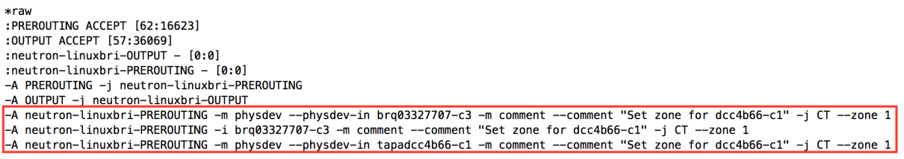

Next, network traffic may traverse the INPUT chain of the filter table as follows:

    -A INPUT -j neutron-linuxbri-INPUT 

This rule jumps to a chain named neutron-linuxbri-INPUT, as shown here:

    -A neutron-linuxbri-INPUT -m physdev 
    --physdev-in tapadcc4b66-c1 
    --physdev-is-bridged -j neutron-linuxbri-oadcc4b66-c 

The rule states that traffic leaving the instance through the tapadcc4b66-c1 interface should be forwarded to the neutron-linuxbri-oadcc4b66-c chain, as shown here:

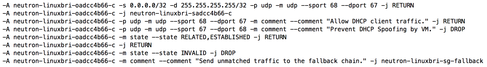

The rules of the neutron-linuxbri-oadcc4b66-c chain states that outgoing DHCP traffic should only be allowed when the client is attempting to obtain an address from a DHCP server. By default, instances are not allowed to act as DHCP servers and traffic will be dropped accordingly. The rules also state that traffic marked as RETURN or ESTABLISHED will be allowed, but INVALID packets will be dropped. Lastly, any traffic that does not match is dropped by a rule in the neutron-linuxbri-sg-fallback chain.

If traffic has survived the INPUT chains, it then moves on to the FORWARD chains seen here:

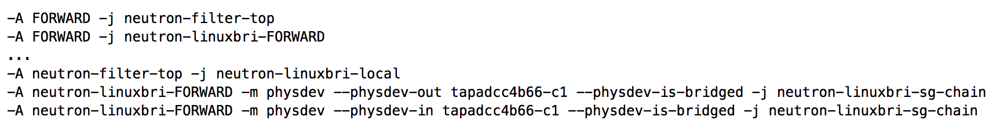

The first rule causes iptables to jump to the neutron-filter-top chain. From there, iptables jumps to the neutron-linuxbri-local chain for further processing. Because there are no rules defined in that chain, iptables returns to the calling chain, neutron-filter-top. Once all rules have been processed, iptables returns to the previous calling chain, FORWARD.

The next rule in the FORWARD chain that is processed is as follows:

    -A FORWARD -j neutron-linuxbri-FORWARD 

The mentioned rule causes iptables to jump to the neutron-linuxbri-FORWARD chain seen here:

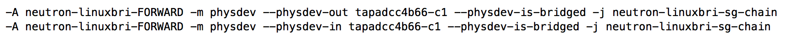

The -m flag followed by physdev is a directive to iptables to use an extended packet matching module that supports devices enslaved to a bridge device.

The packet will match one of the two rules based on the direction the packet is headed through the interface. In either case, iptables jumps to the neutron-linuxbri-sg-chain chain, as shown here:

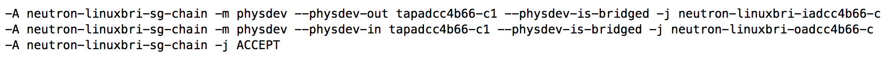

The direction of the packet will again dictate which rule is matched. Traffic centering the instance through the tapadcc4b66-c1 interface will be processed by the neutron-linuxbri-iadcc4b66-c chain as follows:

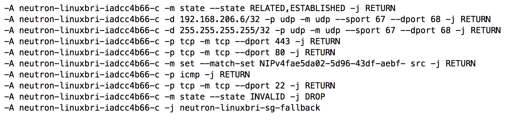

In the mentioned rule, iptables uses the state module to determine the state of the packet. Combined with connection tracking, iptables is able to track the connection and determine the following states of the packet: INVALID, NEW, RELATED, or ESTABLISHED. The state of the packet results in an appropriate action being taken. Traffic not matched by any rule is dropped by the neutron-linuxbri-sg-fallback chain:

    -A neutron-linuxbri-sg-fallback -j DROP

Traffic exiting the instance through the tapadcc4b66-c1 interface is processed by the neutron-linuxbri-oadcc4b66-c chain as follows:

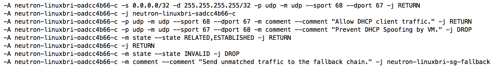

The first UDP rule allows the instance to send DHCPDISCOVER and DHCPREQUEST broadcast packets on UDP port 67\. All other traffic is then processed by the neutron-linuxbri-sadcc4b66-c chain as follows:

The preceding rule prevents an instance from performing IP and MAC address spoofing. Any traffic exiting the tapadcc4b66-c1 interface must be sourced from IP address 192.168.206.6/32 and MAC address FA:16:3E:DC:D2:AB. To permit outbound traffic from additional IP or MAC addresses, use the Neutron allowed-address-pairs extension, which will be discussed later on in this chapter.

Further processing includes preventing DHCP spoofing and verifying the state of the packet and performing the appropriate action. Traffic eventually returns to the neutron-linuxbri-sg-chain, calling chain where it is allowed through:

    -A neutron-linuxbri-sg-chain -j ACCEPT