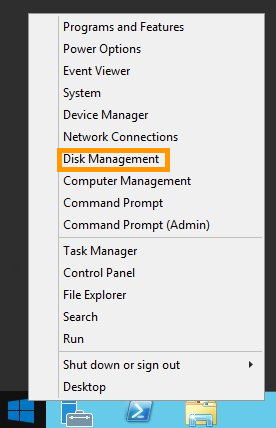
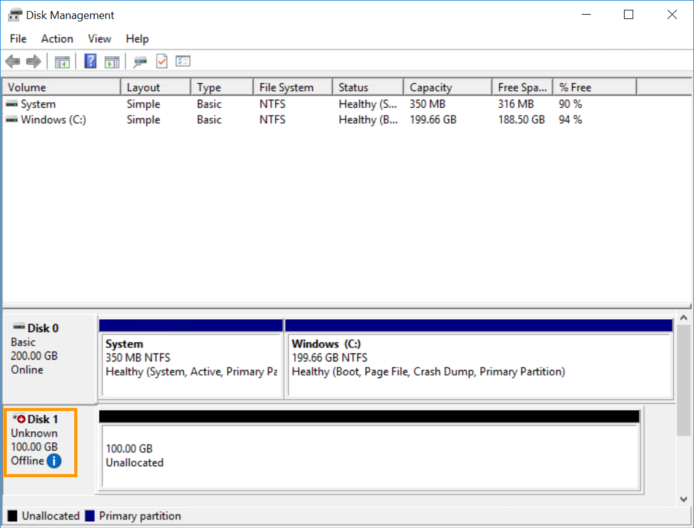
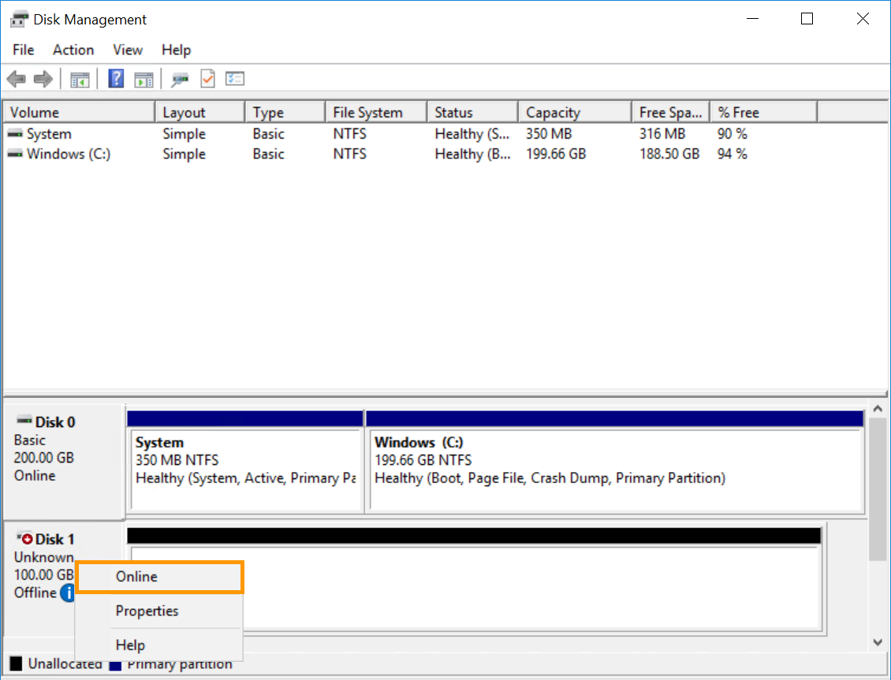

**Last updated 14th November 2019**

Objective
---------

If you have reached the maximum storage capacity on your additional disk, you can still increase its size. 

**This guide will show you how to increase the size of an additional disk as well as enlarging its main partition.**

Requirements
------------

* a [Public Cloud Instance](https://www.ovhcloud.com/en-gb/public-cloud/) in your your OVHcloud account
* an [additional disk](https://www.ovhcloud.com/en-gb/public-cloud/block-storage/) attached to your instance
* access to the [OVHcloud Control Panel](https://www.ovh.com/auth/?action=gotomanager&from=https://www.ovh.co.uk/&ovhSubsidiary=GB)
* administrative (root) access to your instance via SSH (for Linux only)
* administrative access to your instance via RDP (for Windows only)

Intructions
-----------

### Using the OVHcloud Control Panel.

In order to deploy a public cloud instance, log in to the [OVHcloud Control Panel](https://www.ovh.com/auth/?action=gotomanager&from=https://www.ovh.co.uk/&ovhSubsidiary=GB). Click `Public Cloud` in the top-left corner of the page. Then, on the following screen, click the arrow button next to your default project name in the top-left corner of the screen. Now select the project on which you would like to edit the size of the additional disk.

Locate your Block Storage disk under “Storage” section on the left-hand sidebar.

Next, click on the 3 dots on the right of the disk and click Edit. You will be redirected to this page where you can change the volume capacity.

When you’ve finished, click the `Modify the volume` button.

### Using Linux.

First, unmount the disk using this command.

    admin@server-1:~$ sudo umount /mnt/disk

Next, recreate the partition.

    admin@server-1:~$ sudo fdisk /dev/vdb
    Welcome to fdisk (util-linux 2.25.2).
    Changes will remain in memory only, until you decide to write them.
    Be careful before using the write command

    Command (m for help): d

    Selected partition 1
    Partition 1 has been deleted.

    Command (m for help): n

    Partition type
    p primary (0 primary, 0 extended, 4 free)
    e extended (container for logical partitions)
    Select (default p):
    Using default response p.
    Partition number (1-4, default 1):
    First sector (2048-146800639, default 2048):
    Last sector, +sectors or +size{K,M,G,T,P} (2048-146800639, default 146800639):

    Created a new partition 1 of type 'Linux' and of size 70 GiB.

    Command (m for help): w

    The partition table has been altered.
    Calling ioctl() to re-read partition table.
    Syncing disks.

Next, verify and recheck the partition.

    #admin@server-1:~$ sudo e2fsck -f /dev/vdb1

    e2fsck 1.42.12 (29-Aug-2014)
    Pass 1: Checking inodes, blocks, and sizes
    Pass 2: Checking directory structure
    Pass 3: Checking directory connectivity
    Pass 4: Checking reference counts
    Pass 5: Checking group summary information
    /dev/vdb: 12/3276800 files (0.0% non-contiguous), 251700/13107200 blocks

    #admin@server-1:~$ sudo resize2fs /dev/vdb1

    resize2fs 1.42.12 (29-Aug-2014)
    Resizing the filesystem on /dev/vdb to 18350080 (4k) blocks.
    The filesystem on /dev/vdb is now 18350080 (4k) blocks long.

Finally, mount and check the disk.

    #admin@server-1:~$ sudo mount /dev/vdb1 /mnt/disk/

    #admin@server-1:~$ df -h
    Filesystem Size Used Avail Use% Mounted on
    /dev/vda1 9.8G 840M 8.6G 9% /
    udev 10M 0 10M 0% /dev
    tmpfs 393M 5.2M 388M 2% /run
    tmpfs 982M 0 982M 0% /dev/shm
    tmpfs 5.0M 0 5.0M 0% /run/lock
    tmpfs 982M 0 982M 0% /sys/fs/cgroup
    /dev/vdb1 69G 52M 66G 1% /mnt/disk

### Using Windows.

Establish an RDP connection to your instance. When you’ve logged in, right-click on the `Start Menu` button, and then click `Disk Management`.

When the disk management tool opens, you’ll see your new disk as an unknown volume with unallocated space as shown below.

If the disk is offline, this is likely due to a policy in place on the instance. To fix this, right-click on the disk and select Online.

Depending on your version of Windows, you may need to initialise your additional disk before you can use it. To initialise your disk, right-click it again and this time select `Initialise Disk`. 

If the main volume on you disk is smaller than the entire disk capacity, right-click on the volume and then click `Extend Volume`.

The Extend Volume Wizard will now be displayed. Click `Next` to start the wizard.

Now increase the volume to the size you want, and click `Next` when you’re finished.

Finally, click `Finish` to complete the process.

Go further
----------

[Create and configure an additional disk on an instance](https://docs.ovh.com/gb/en/public-cloud/create_and_configure_an_additional_disk_on_an_instance)

Join our community of users on <https://community.ovh.com/en/>.

### Did you find this guide useful?

### These guides might also interest you…