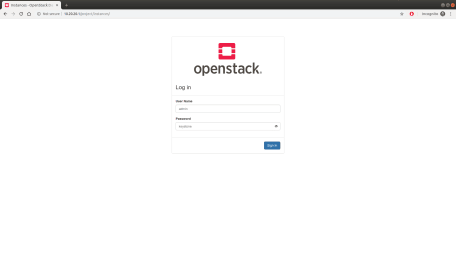
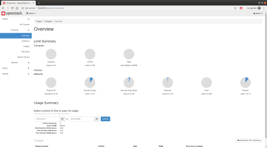

Test OpenStack on your workstation, set up an edge cloud or deploy a production-grade cloud across hundreds of physical servers in a data centre. You will use [MicroStack](https://microstack.run/) or [Charmed OpenStack](https://jaas.ai/openstack) depending on the requirements.

If you run into issues, or if you want support, training or architecture design consulting, please contact Canonical — we help the world’s largest OpenStack users keep their clouds running smoothly.

[ Contact Canonical ](https://ubuntu.com/openstack/contact-us)

[ Read the whitepaper - “A guide to a successful OpenStack adoption and deployment” › ](https://ubuntu.com/engage/charmed-openstack-adoption-whitepaper)

Single-node, multi-node or data centre cluster?
-----------------------------------------------

These instructions cover three scenarios: single-node deployment; ideal for testing and development, multi-node deployment; suitable for the edge and IoT, and data centre cluster deployment; designed for large and complex architectures.

### Single‐node deployment

* Uses MicroStack – snap‐based installation
* Single machine needed
* 16GB RAM or more
* Multi-core processor
* 50GB of free disk space
* Ubuntu 18.04 LTS or later
* Includes all key OpenStack components
* Fully compatible with the upstream
* Supports development iteration

This is the recommended approach if you want to try OpenStack on your workstation or use it for development purposes. You will be able to perform all basic operations (e.g. upload images, create networks, launch instances, etc.) on a fully functional OpenStack. It takes just a few minutes to install it.

[Deploy OpenStack on a single node ›](https://ubuntu.com/openstack/install#single-node-deployment)

### Multi‐node deployment

* Uses MicroStack – snap‐based installation
* At least two machines needed
* 16GB RAM or more each
* Multi-core processor each
* 50GB of free disk space each
* Ubuntu 18.04 LTS or later
* Includes all key OpenStack components
* Fully compatible with the upstream
* Supports development iteration

If you are planning to deploy an edge cloud or looking for a solution for the IoT, this approach is the way to go. Similar to the single-node deployment instructions, this method is based on MicroStack which provides access to OpenStack base services and allows basic operations.

[Deploy OpenStack on multiple nodes ›](https://ubuntu.com/openstack/install#multi-node-deployment)

### Data centre cluster deployment

* Based on [OpenStack Charms](https://docs.openstack.org/charm-guide/latest/)
* Based on bare-metal machines
* At least 6 servers required, each with 8GB RAM or more, IPMI BMCs and dual NICs
* Network switch and Internet gateway needed
* HA architectures supported
* Scalable up to hundreds of nodes

This is a starting point for your production cloud designed to run in a data centre. You will step through the deployment of OpenStack services across bare‐metal machines in the cluster. For reference architectures, hardware recommendations, specialised telco, compliance, regulatory or HPS requirements, consulting services, support and operations insights [contact Canonical](https://ubuntu.com/openstack/contact-us).

[Deploy OpenStack on cluster ›](https://ubuntu.com/openstack/install#cluster-deployment)

Single-node OpenStack deployment
--------------------------------

These instructions use [MicroStack](https://snapcraft.io/microstack), an upstream single-node OpenStack deployment which can run directly on your workstation. MicroStack is OpenStack in a [snap](https://snapcraft.io/) which means that all services and supporting libraries are together in a single package that can be easily installed, upgraded or removed. MicroStack includes all key OpenStack components: Keystone, Nova, Neutron, Glance, and is evolving extremely fast. You can use it for development, prototyping and testing, but it is also perfectly suitable for the network edge, IoT and appliances.

NOTE: MicroStack is in a beta state. We encourage you to test it, give us your [feedback](https://bugs.launchpad.net/microstack) and [ask questions](https://discourse.juju.is/search?q=microstack). 

### Installation instructions

1. #### Minimum requirements

  * Single machine with 16GB RAM and a multi-core processor, running Ubuntu 18.04 LTS or later and at least 50GB of free disk space.
2. #### Install MicroStack

  You can install MicroStack right away by running the following command from the terminal:

  Once installed, you should see the following message on the terminal:

      microstack (beta) ussuri from Canonical✓ installed

  The version displayed (here, Ussuri) matches the most recent stable OpenStack release available with MicroStack.

  NOTE: MicroStack installed with the `--devmode` flag will not receive updates.
3. #### Initialise MicroStack

  Before using your OpenStack installation, it has to be initialised, so that networks and databases get configured. In order to do so, run:

      $ sudo microstack init --auto --control
    ...
    2019-12-16 12:38:33,223 - microstack_init - INFO - Complete. Marked microstack as initialized!

  Your local OpenStack cloud is now running and is ready for use!
4. #### Interact with MicroStack

  You can interact with your OpenStack either via the web GUI or the CLI.

  **Web GUI:**

  To interact with your OpenStack via the web GUI visit http://10.20.20.1/ and log in with the ‘admin’ user. The password is obtained in this way:

  Type the credentials and press the ‘Sign In’ button:

  You should now see the OpenStack dashboard:

  You can start playing with your local private cloud (i.e. create additional users, launch instances, etc.).

  **CLI:**

  You can also interact with OpenStack via the CLI by using the `microstack.openstack` command. The MicroStack CLI syntax is identical to the client delivered by the [python-openstackclient](https://docs.openstack.org/python-openstackclient/latest/cli/command-list.html) package.

  For example, to list available OpenStack endpoints run:

  It should return the following list:

      +-----------+-----------+-----------------------------------------+
    | Name      | Type      | Endpoints                               |
    +-----------+-----------+-----------------------------------------+
    | keystone  |  identity | <none>                                  |
    |           |           | public: http://10.20.20.1:5000/v3/      |
    |           |           | <none>                                  |
    |           |           | internal: http://10.20.20.1:5000/v3/    |
    |           |           | <none>                                  |
    |           |           | admin: http://10.20.20.1:5000/v3/       |
    |           |           |                                         |
    | glance    | image     | microstack                              |
    |           |           |   admin: http://10.20.20.1:9292         |
    |           |           | microstack                              |
    |           |           |   public: http://10.20.20.1:9292        |
    |           |           | microstack                              |
    |           |           |   internal: http://10.20.20.1:9292      |
    |           |           |                                         |
    | neutron   | network   | microstack                              |
    |           |           |   public: http://10.20.20.1:9696        |
    |           |           | microstack                              |
    |           |           |   admin: http://10.20.20.1:9696         |
    |           |           | microstack                              |
    |           |           |   internal: http://10.20.20.1:9696      |
    |           |           |                                         |
    | placement | placement | microstack                              |
    |           |           |   public: http://10.20.20.1:8778        |
    |           |           | microstack                              |
    |           |           |   admin: http://10.20.20.1:8778         |
    |           |           | microstack                              |
    |           |           |   internal: http://10.20.20.1:8778      |
    |           |           |                                         |
    | nova      | compute   | microstack                              |
    |           |           |   public: http://10.20.20.1:8774/v2.1   |
    |           |           | microstack                              |
    |           |           |   admin: http://10.20.20.1:8774/v2.1    |
    |           |           | microstack                              |
    |           |           |   internal: http://10.20.20.1:8774/v2.1 |
    |           |           |                                         |
    +-----------+-----------+-----------------------------------------+

  Running `microstack.openstack --help` will get you a list of available subcommands and their required syntax.
5. #### Launch an instance

  The quickest way to launch your first OpenStack instance (or a VM) is to run the following command:

  The resulting output provides the information you need to SSH to the instance:

      Access it with `ssh -i /home/ubuntu/snap/microstack/common/.ssh/id_microstack cirros@10.20.20.123`

  Note that the IP address of the instance may be different in your environment. In order to connect to the instance run the ‘ssh’ command from the output:

  You are now connected to your first instance on your OpenStack cluster. You can start playing with it by executing various commands, for example:

      uptime
    14:51:42 up 4 min,  1 users,  load average: 0.00, 0.00, 0.00

  In order to disconnect from the instance type `exit`.

  You can also view the instance from the web GUI. Go to http://10.20.20.1/ and click on the “Instances” tab on the left:

  In order to perform a more advanced launch (e.g. specify the flavor, use a different image, etc.) refer to the python-openstackclient [documentation](https://docs.openstack.org/python-openstackclient/latest/cli/command-list.html). The syntax of the `microstack.openstack` command is the same as the syntax of the upstream client (for example `microstack.openstack server list`).

To learn more about MicroStack, visit [https://microstack.run](https://microstack.run/)

Multi-node OpenStack deployment
-------------------------------

These instructions use [MicroStack](https://snapcraft.io/microstack) too. However, in this case a clustering feature is used.

NOTE: MicroStack is in a beta state. We encourage you to test it, give us your [feedback](https://bugs.launchpad.net/microstack) and [ask questions](https://discourse.juju.is/search?q=microstack). 

### Installation instructions

1. #### Minimum requirements

  * At least two machines, each with 16GB RAM, a multi-core processor and at least 50GB of free disk space, connected to a network, and running Ubuntu 18.04 LTS.
2. #### Install MicroStack

  You can install MicroStack right away by running the following command from the terminal:

  Once installed, you should see the following message on the terminal:

      microstack (beta) ussuri from Canonical✓ installed

  The version displayed (here, Ussuri) matches the most recent stable OpenStack release available with MicroStack.

  Install MicroStack on all machines which will be used for OpenStack clustering purposes.

  NOTE: MicroStack installed with the `--devmode` flag will not receive updates.
3. #### Initialise MicroStack on the control machine

  Run the following command on the machine you want to act as a controller.

  Your OpenStack control machine is now running and is ready for adding compute machines.
4. #### Generate a compute node connection string

  Run the following command on the control node. It will generate an encoded string that will be needed when adding a compute node in the next step:
5. #### Initialise MicroStack on compute machines

  Run the following command on all machines you want to act as compute nodes. Each will require a unique connection string from the control node:

  Your OpenStack cloud is now running and is ready for use!
6. #### Interact with MicroStack

  You can interact with your OpenStack either via the web GUI or the CLI.

  **Web GUI:**

  To interact with your OpenStack via the web GUI visit http://10.20.20.1/ and log in with the’admin’ user. The password is obtained in this way:

  Type the credentials and press the ‘Sign In’ button:

  You should now see the OpenStack dashboard:

  You can start playing with your local private cloud (i.e. create additional users, launch instances, etc.).

  **CLI:**

  You can also interact with OpenStack via the CLI by using the `microstack.openstack` command. The MicroStack CLI syntax is identical to the client delivered by the [python-openstackclient](https://docs.openstack.org/python-openstackclient/latest/cli/command-list.html) package.

  For example, to list available OpenStack endpoints run:

  It should return the following list:

      +-----------+-----------+-----------------------------------------+
    | Name      | Type      | Endpoints                               |
    +-----------+-----------+-----------------------------------------+
    | keystone  |  identity | microstack                              |
    |           |           | public: http://10.20.20.1:5000/v3/      |
    |           |           | microstack                              |
    |           |           | internal: http://10.20.20.1:5000/v3/    |
    |           |           | microstack                              |
    |           |           | admin: http://10.20.20.1:5000/v3/       |
    |           |           |                                         |
    | glance    | image     | microstack                              |
    |           |           |   admin: http://10.20.20.1:9292         |
    |           |           | microstack                              |
    |           |           |   public: http://10.20.20.1:9292        |
    |           |           | microstack                              |
    |           |           |   internal: http://10.20.20.1:9292      |
    |           |           |                                         |
    | neutron   | network   | microstack                              |
    |           |           |   public: http://10.20.20.1:9696        |
    |           |           | microstack                              |
    |           |           |   admin: http://10.20.20.1:9696         |
    |           |           | microstack                              |
    |           |           |   internal: http://10.20.20.1:9696      |
    |           |           |                                         |
    | nova      | compute   | microstack                              |
    |           |           |   public: http://10.20.20.1:8774/v2.1   |
    |           |           | microstack                              |
    |           |           |   admin: http://10.20.20.1:8774/v2.1    |
    |           |           | microstack                              |
    |           |           |   internal: http://10.20.20.1:8774/v2.1 |
    |           |           |                                         |
    | placement | placement | microstack                              |
    |           |           |   public: http://10.20.20.1:8778        |
    |           |           | microstack                              |
    |           |           |   admin: http://10.20.20.1:8778         |
    |           |           | microstack                              |
    |           |           |   internal: http://10.20.20.1:8778      |
    |           |           |                                         |
    +-----------+-----------+-----------------------------------------+

  Running `microstack.openstack --help` will get you a list of available subcommands and their required syntax.
7. #### Launch an instance

  The quickest way to launch your first OpenStack instance (or a VM) is to run the following command:

      $ microstack launch cirros --name test --availability-zone
    nova:<compute nodehostname>

  For example:

      $ microstack launch cirros --name test --availability-zone
    nova:ip-172-31-24-59

  The resulting output provides the information you need to SSH to the instance:

      Access it with `ssh -i /home/ubuntu/snap/microstack/common/.ssh/id_microstack cirros@10.20.20.123`

  Note that the IP address of the instance may be different in your environment. In order to connect to the instance run the ‘ssh’ command from the output:

  You are now connected to your first instance on your OpenStack cluster. You can start playing with it by executing various commands, for example:

      uptime
    15:17:19 up 5 min, 1 users, load average: 0.00, 0.00, 0.00

  In order to disconnect from the instance type `exit`.

  In order to perform a more advanced launch (e.g. specify the flavor, use a different image, etc.) refer to the python-openstackclient [documentation](https://docs.openstack.org/python-openstackclient/latest/cli/command-list.html). The syntax of the `microstack.openstack` command is the same as the syntax of the upstream client (for example `microstack.openstack server list`).

To learn more about MicroStack, visit [https://microstack.run](https://microstack.run/)

Data centre cluster deployment
------------------------------

This is the simplest Charmed OpenStack deployment process across a small cluster of bare-metal machines. It uses OpenStack charms which provide the operator functionality for OpenStack services, abstracting the entire operations complexity in a form of primitives. OpenStack charms not only simplify the entire deployment process, but also make post-deployment easier, supporting even very complex operations, such as OpenStack upgrades. Use the following instructions for your first data center cluster deployment and [contact us](https://ubuntu.com/openstack/contact-us) to continue the journey.

### Installation instructions

1. #### Minimum requirements

  6 x Intel, POWER or ARM servers each with:

  * IPMI BMC
  * at least 8GB RAM
  * at least 2 Ethernet NICs
  * at least 2 disks

  All machines have to be connected with an Ethernet switch. There should be two isolated /24 subnets configured and each machine should be connected to both. We will call them provisioning and cloud, and use 172.16.7.0/24, and 172.16.8.0/24 subnets respectively. There must not be a DHCP server on the provisioning subnet. There must be access to the Internet from both subnets. We will use 172.16.7.1 and 172.16.8.1 IP addresses as gateways.

  Note: HA clouds require 12 nodes for service isolation.
2. #### Bootstrap and configure the first node

  The first node, referred to as the MAAS node in the following part of the tutorial, has to be bootstrapped and configured manually.

  Download Ubuntu Server LTS from [here](https://ubuntu.com/download/server) and install it on the first node. We will call this node a MAAS node. Make sure that both NICs have IP addresses configured. We will use 172.16.7.2 and 172.16.8.2 respectively.

  Then install prerequisites:

  And update the `PATH` environment variable:

      $ export PATH=$PATH:/snap/bin
    $ echo "export PATH=$PATH:/snap/bin" >> .bashrc

  Now you can move to MAAS installation and configuration.
3. #### Install and configure MAAS

  On the MAAS node, install MAAS by executing the following command:

  This command takes a while. Once finished, initialise MAAS by running:

  Answer the questions accordingly to create an admin user account, set up its password. You can optionally import public SSH keys from GitHub or Launchpad. Those keys will be used to provide an access to provisioned instances, so ifyou store your public SSH keys in GitHub or Launchpad, it is a good idea to import them now:

      Create first admin account:
      Username: admin
      Password:
      Again:
      Email: admin@example.com
      Import SSH keys [] (lp:user-id or gh:user-id): lp:tkurek

  At this point you can access MAAS at `http://<MAAS_IP>:5240/MAAS`. Fill in admin user credentials and press the “Login” button:

  Configure the “DNS forwarder” field to an IP address of a DNS server of your choice:

  Then scroll down and press the “Continue” button:

  One more time you have an opportunity to import public SSH keys from GitHub or Launchpad. Once you are done, press the “Go to dashboard” button:

  You should see the MAAS Machines page. Do not worry about the warning message for now:

  Unless you have imported your public SSH keys from GitHub/Launchpad in one of the previous steps, navigate the “admin” tab in the top right corner and go to the “SSH keys” section. You can use the “Source” drop-down list to either upload or import the keys:

  For example, to upload the key, paste its value to the “Public key” field and press the “Import” button:

  Then navigate to the ’Subnets” tab in the top menu and press on the “untagged” VLAN next to the “172.16.7.0/24″ subnet (the `provisioning` subnet):

  From the “Take action” drop-down menu on the right select “Provide DHCP”:

  Fill in the “Dynamic range start IP” and “Dynamic range end IP” fields and press the “Provide DHCP” button:

  At this point, your MAAS instance is ready to provision other machines.
4. #### Bootstrap and configure other nodes

  All other nodes should be configured to PXE boot from the provisioning subnet by default.

  Once configured, power them on and wait until they show up in the “Machines” tab in MAAS:

  Then click on each of those machines and for each of them perform the following actions:

  * Change their name to something more meaningful. Click on the old name, type the new one and press the “Save” button:
  * Add power configuration if missing. Navigate to the “Configuration” tab in the machine menu and scroll down to the “Power configuration section”. Select power type (IPMI in this case) and fill in other required fields. Once done, press the “Save changes” button:

  Once all machines are configured, navigate to the “Machines” tab in the main menu, check all machines and select “Commission” from the “Take action” menu on the right:

  Press “Commission 5 machines” button:

  The nodes are going through the commissioning process. It may take a while. Once finished, you should see the following output:

  Click on each of the machines again and for each of them go to the “Interfaces” tab in the machine menu. Make sure that both interfaces are configured as per the screenshot below. Adjust them if needed by pressing the lines under “Actions” and selecting “Edit Physical”:

  At this point the remaining machines are ready for being provisioned.
5. #### Bootstrap Juju controller

  On the MAAS node, install Juju client by executing the following command:

  Add MAAS cloud by running:

  Answer the questions accordingly:

      Select cloud type: maas
      Enter a name for your maas cloud: maas
      Enter the API endpoint url: http://172.16.7.2:5240/MAAS
      Cloud "maas" successfully added to your local client.

  Display the MAAS API key. You will need it in the next step.

  Add credentials for the MAAS cloud:

  And answer the questions accordingly. Use the MAAS API key in the maas-oauth line:

      Do you ONLY want to add a credential to this client? (Y/n): Y
      Enter credential name: maas
      Regions
      default
      Select region [any region, credential is not region specific]: default
      Using auth-type "oauth1".
      Enter maas-oauth:
      Credential "maas" added locally for cloud "maas".

  At this point you can bootstrap the Juju controller on the MAAS cloud:

  This command takes a while. Once finished, add a model for your OpenStack installation:

  At this point, Juju is ready to deploy OpenStack on the remaining four machines.
6. #### Deploy OpenStack

  In this example, we are using the [OpenStack Base](https://jaas.ai/openstack-base/bundle/65) bundle which provides basic OpenStack services and no HA. If you need more advanced architecture, we encourage you to [contact Canonical](https://ubuntu.com/openstack/contact-us).

  Run the following command to deploy OpenStack Base bundle:

  This command takes a while. Once finished you should see the following output on the bottom:

      Deploy of bundle completed.

  But it does not mean that your OpenStack deployment is done. In fact, it hasjust started. You have to monitor the status by running juju status command.The deployment is completed once all applications, units and machines turn to the “active” state as depicted on the listing below:

      $ juju status
      Model      Controller       Cloud/Region  Version  SLA          Timestamp
      openstack  maas-controller  maas/default  2.7.0    unsupported  12:22:38-05:00

      App                    Version  Status  Scale  Charm                  Store       Rev  OS      Notes
      ceph-mon               14.2.2   active      3  ceph-mon               jujucharms   44  ubuntu
      ceph-osd               14.2.2   active      3  ceph-osd               jujucharms  294  ubuntu
      ceph-radosgw           14.2.2   active      1  ceph-radosgw           jujucharms  283  ubuntu
      cinder                 15.0.0   active      1  cinder                 jujucharms  297  ubuntu
      cinder-ceph            15.0.0   active      1  cinder-ceph            jujucharms  251  ubuntu
      glance                 19.0.0   active      1  glance                 jujucharms  291  ubuntu
      keystone               16.0.0   active      1  keystone               jujucharms  309  ubuntu
      mysql                  5.7.20   active      1  percona-cluster        jujucharms  281  ubuntu
      neutron-api            15.0.0   active      1  neutron-api            jujucharms  282  ubuntu
      neutron-gateway        15.0.0   active      1  neutron-gateway        jujucharms  276  ubuntu
      neutron-openvswitch    15.0.0   active      3  neutron-openvswitch    jujucharms  269  ubuntu
      nova-cloud-controller  20.0.0   active      1  nova-cloud-controller  jujucharms  339  ubuntu
      nova-compute           20.0.0   active      3  nova-compute           jujucharms  309  ubuntu
      ntp                    3.2      active      4  ntp                    jujucharms   36  ubuntu
      openstack-dashboard    16.0.0   active      1  openstack-dashboard    jujucharms  297  ubuntu
      placement              2.0.0    active      1  placement              jujucharms    1  ubuntu
      rabbitmq-server        3.6.10   active      1  rabbitmq-server        jujucharms   97  ubuntu

      Unit                      Workload  Agent  Machine  Public address  Ports              Message
      ceph-mon/0                active    idle   1/lxd/0  172.16.7.164                       Unit is ready and clustered
      ceph-mon/1                active    idle   2/lxd/1  172.16.7.163                       Unit is ready and clustered
      ceph-mon/2*               active    idle   3/lxd/0  172.16.7.165                       Unit is ready and clustered
      ceph-osd/0*               active    idle   1        172.16.7.160                       Unit is ready (1 OSD)
      ceph-osd/1                active    idle   2        172.16.7.161                       Unit is ready (1 OSD)
      ceph-osd/2                active    idle   3        172.16.7.162                       Unit is ready (1 OSD)
      ceph-radosgw/0*           active    idle   0/lxd/0  172.16.7.166    80/tcp             Unit is ready
      cinder/0*                 active    idle   1/lxd/2  172.16.7.168    8776/tcp           Unit is ready
      cinder-ceph/0*          active    idle            172.16.7.168                       Unit is ready
      glance/0*                 active    idle   2/lxd/1  172.16.7.167    9292/tcp           Unit is ready
      keystone/0*               active    idle   3/lxd/2  172.16.7.169    5000/tcp           Unit is ready
      mysql/0*                  active    idle   0/lxd/2  172.16.7.170    3306/tcp           Unit is ready
      neutron-api/0*            active    idle   1/lxd/2  172.16.7.171    9696/tcp           Unit is ready
      neutron-gateway/0*        active    idle   0        172.16.7.159                       Unit is ready
      ntp/0*                  active    idle            172.16.7.159    123/udp            chrony: Ready
      nova-cloud-controller/0*  active    idle   2/lxd/2  172.16.7.172    8774/tcp,8775/tcp  Unit is ready
      nova-compute/0*           active    idle   1        172.16.7.160                       Unit is ready
      neutron-openvswitch/2   active    idle            172.16.7.160                       Unit is ready
      ntp/3                   active    idle            172.16.7.160    123/udp            chrony: Ready
      nova-compute/1            active    idle   2        172.16.7.161                       Unit is ready
      neutron-openvswitch/1   active    idle            172.16.7.161                       Unit is ready
      ntp/2                   active    idle            172.16.7.161    123/udp            chrony: Ready
      nova-compute/2            active    idle   3        172.16.7.162                       Unit is ready
      neutron-openvswitch/0*  active    idle            172.16.7.162                       Unit is ready
      ntp/1                   active    idle            172.16.7.162    123/udp            chrony: Ready
      openstack-dashboard/0*    active    idle   3/lxd/2  172.16.7.174    80/tcp,443/tcp     Unit is ready
      placement/0*              active    idle   2/lxd/3  172.16.7.175    8778/tcp           Unit is ready
      rabbitmq-server/0*        active    idle   0/lxd/2  172.16.7.176    5672/tcp           Unit is ready

      Machine  State    DNS           Inst id              Series  AZ       Message
      0        started  172.16.7.159  openstack1           bionic  default  Deployed
      0/lxd/0  started  172.16.7.166  juju-592de2-0-lxd-3  bionic  default  Container started
      0/lxd/1  started  172.16.7.170  juju-592de2-0-lxd-4  bionic  default  Container started
      0/lxd/2  started  172.16.7.176  juju-592de2-0-lxd-5  bionic  default  Container started
      1        started  172.16.7.160  openstack2           bionic  default  Deployed
      1/lxd/0  started  172.16.7.164  juju-592de2-1-lxd-3  bionic  default  Container started
      1/lxd/1  started  172.16.7.168  juju-592de2-1-lxd-4  bionic  default  Container started
      1/lxd/2  started  172.16.7.171  juju-592de2-1-lxd-5  bionic  default  Container started
      2        started  172.16.7.161  openstack3           bionic  default  Deployed
      2/lxd/0  started  172.16.7.163  juju-592de2-2-lxd-4  bionic  default  Container started
      2/lxd/1  started  172.16.7.167  juju-592de2-2-lxd-5  bionic  default  Container started
      2/lxd/2  started  172.16.7.172  juju-592de2-2-lxd-6  bionic  default  Container started
      2/lxd/3  started  172.16.7.175  juju-592de2-2-lxd-7  bionic  default  Container started
      3        started  172.16.7.162  openstack4           bionic  default  Deployed
      3/lxd/0  started  172.16.7.165  juju-592de2-3-lxd-3  bionic  default  Container started
      3/lxd/1  started  172.16.7.169  juju-592de2-3-lxd-4  bionic  default  Container started
      3/lxd/2  started  172.16.7.174  juju-592de2-3-lxd-5  bionic  default  Container started

  This is what you should be able to see in the “Machines” tab in MAAS:

  At this point, your OpenStack installation is ready for being tested.
7. #### Interact with OpenStack

  Set the admin user’s password for your OpenStack cluster by executing the following command:

  The Horizon service is available at the IP address displayed by running:

  Go to `http://<Horizon IP>:80/horizon` URL. You should see the OpenStack login screen. Type your credentials and press the “Sign In” button. Use “admin\_domain” in the “Domain” field:

  You should be able to see the OpenStack welcome screen. Click on the “admin” drop-down list in the top right corner and press “OpenStack RC File”:

  Some browsers may require that you confirm that you want to download this file. If you are using Google Chrome, press “Keep” from the menu on the bottom:

  Place the downloaded file on a machine where you want to install the OpenStack client. Then install it by running the following command:

  Source the downloaded RC file:

  And enter the admin user’s password when asked:

      Please enter your OpenStack Password for project admin as user admin:

  At this point you can interact with your OpenStack cluster using standard commands, for example:

      $ openstack catalog list
    +-----------+--------------+--------------------------------------------------------------------------+
    | Name      | Type         | Endpoints                                                                |
    +-----------+--------------+--------------------------------------------------------------------------+
    | cinderv2  | volumev2     | RegionOne                                                                |
    |           |              |   admin: http://172.16.7.168:8776/v2/d5c39f5ee61b4d7c8a57ed26672f5bf1    |
    |           |              | RegionOne                                                                |
    |           |              |   public: http://172.16.7.168:8776/v2/d5c39f5ee61b4d7c8a57ed26672f5bf1   |
    |           |              | RegionOne                                                                |
    |           |              |   internal: http://172.16.7.168:8776/v2/d5c39f5ee61b4d7c8a57ed26672f5bf1 |
    |           |              |                                                                          |
    | nova      | compute      | RegionOne                                                                |
    |           |              |   admin: http://172.16.7.172:8774/v2.1                                   |
    |           |              | RegionOne                                                                |
    |           |              |   public: http://172.16.7.172:8774/v2.1                                  |
    |           |              | RegionOne                                                                |
    |           |              |   internal: http://172.16.7.172:8774/v2.1                                |
    |           |              |                                                                          |
    | neutron   | network      | RegionOne                                                                |
    |           |              |   public: http://172.16.7.171:9696                                       |
    |           |              | RegionOne                                                                |
    |           |              |   internal: http://172.16.7.171:9696                                     |
    |           |              | RegionOne                                                                |
    |           |              |   admin: http://172.16.7.171:9696                                        |
    |           |              |                                                                          |
    | cinderv3  | volumev3     | RegionOne                                                                |
    |           |              |   public: http://172.16.7.168:8776/v3/d5c39f5ee61b4d7c8a57ed26672f5bf1   |
    |           |              | RegionOne                                                                |
    |           |              |   admin: http://172.16.7.168:8776/v3/d5c39f5ee61b4d7c8a57ed26672f5bf1    |
    |           |              | RegionOne                                                                |
    |           |              |   internal: http://172.16.7.168:8776/v3/d5c39f5ee61b4d7c8a57ed26672f5bf1 |
    |           |              |                                                                          |
    | swift     | object-store | RegionOne                                                                |
    |           |              |   internal: http://172.16.7.166:80/swift/v1                              |
    |           |              | RegionOne                                                                |
    |           |              |   admin: http://172.16.7.166:80/swift                                    |
    |           |              | RegionOne                                                                |
    |           |              |   public: http://172.16.7.166:80/swift/v1                                |
    |           |              |                                                                          |
    | keystone  | identity     | RegionOne                                                                |
    |           |              |   internal: http://172.16.7.169:5000/v3                                  |
    |           |              | RegionOne                                                                |
    |           |              |   admin: http://172.16.7.169:35357/v3                                    |
    |           |              | RegionOne                                                                |
    |           |              |   public: http://172.16.7.169:5000/v3                                    |
    |           |              |                                                                          |
    | placement | placement    | RegionOne                                                                |
    |           |              |   admin: http://172.16.7.175:8778                                        |
    |           |              | RegionOne                                                                |
    |           |              |   internal: http://172.16.7.175:8778                                     |
    |           |              | RegionOne                                                                |
    |           |              |   public: http://172.16.7.175:8778                                       |
    |           |              |                                                                          |
    | glance    | image        | RegionOne                                                                |
    |           |              |   public: http://172.16.7.167:9292                                       |
    |           |              | RegionOne                                                                |
    |           |              |   internal: http://172.16.7.167:9292                                     |
    |           |              | RegionOne                                                                |
    |           |              |   admin: http://172.16.7.167:9292                                        |
    |           |              |                                                                          |
    +-----------+--------------+--------------------------------------------------------------------------+

  In order to create tenants, networks, launch instances, etc., refer to the python-openstackclient [documentation](https://docs.openstack.org/python-openstackclient/latest/cli/command-list.html).

Need more help?
---------------

Let our cloud experts help you take the next step.

[Contact us](https://ubuntu.com/openstack/contact-us?product=openstack-install-build)

### Want fully managed private cloud?

Canonical provides a managed services option for OpenStack. Our experts take responsibility for the design, deployment and operations.

[Learn more ›](https://ubuntu.com/openstack/managed)

[Contact us](https://ubuntu.com/openstack/managed#get-in-touch)

### Need support?

 Ubuntu Advantage for Infrastructure provides critical security patches, up to 24/7 support and production-grade SLAs. Run your production OpenStack cloud with support from Canonical. 

[ Buy now ](https://ubuntu.com/advantage)

[Contact us](https://ubuntu.com/support/contact-us?product=contextual-footer-landscape)

### Detailed documentation

* [MicroStack website](https://microstack.run/)
* [OpenStack Charms documentation](https://docs.openstack.org/charm-guide/latest/)
* [Charmed OpenStack](https://jaas.ai/openstack)