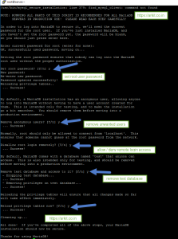

We are going to see how to install MariaDB 10.2 RHEL 7 / Centos 7 Complete Beginners Guide. Why i said Beginners guide because this is a first step installation. Why we have to use MariaDB.

Few Features of Maria DB 
-------------------------

* Maria DB is an open-source relational database software.
* It is a great alternative or drop-in replacement for MySQL.
* It is free and easy to use.
* MariaDB is fast, Salable and robust, with a rich ecosystem of storage engines
* MariaDB New features include GIS and JSON support
* A non-blocking client API library
* The Aria and XtraDB storage engines with enhanced performance
* Better server status variables, and enhanced replication.
* API and ABI compatibility with MySQL

Server Profile:
---------------

1. Packages: MariaDB,MariaDB-server,MariaDB-libs
2. Daemon Name: MariaDB
3. Port Number: 3306
4. Configuration file path: /etc/my.cnf

Install MariaDB 10.2 RHEL 7 / Centos7
-------------------------------------

Let’s install maria DB packages using the local repository, along with installation media maria DB packages also included. So not required to add external repo packages for maria DB installation. If you want the latest version then use yum repo from maria DB

MariaDB Repo for RHEL 7 64bit

    [mariadb]
    name = MariaDB
    baseurl = http://yum.mariadb.org/10.2/rhel7-amd64
    gpgkey=https://yum.mariadb.org/RPM-GPG-KEY-MariaDB
    gpgcheck=1

MariaDB repo for Centos 7 64bit

    [mariadb]
    name = MariaDB
    baseurl = http://yum.mariadb.org/10.2/centos7-amd64
    gpgkey=https://yum.mariadb.org/RPM-GPG-KEY-MariaDB
    gpgcheck=1

**Note:** We have to enable yum group option to install mariaDB packages

    [root@TechTutorials ~]# yum groupinstall mariadb*
    Installed:
    MySQL-python.x86_64 0:1.2.3-11.el7                mariadb.x86_64 1:5.5.41-2.el7_0         mariadb-server.x86_64 1:5.5.41-2.el7_0
    mysql-connector-odbc.x86_64 0:5.2.5-6.el7

    Dependency Installed:
    perl-Compress-Raw-Bzip2.x86_64 0:2.061-3.el7     perl-Compress-Raw-Zlib.x86_64 1:2.061-4.el7     perl-DBD-MySQL.x86_64 0:4.023-5.el7
    perl-DBI.x86_64 0:1.627-4.el7                    perl-Data-Dumper.x86_64 0:2.145-3.el7           perl-IO-Compress.noarch 0:2.061-2.el7
    perl-Net-Daemon.noarch 0:0.48-5.el7              perl-PlRPC.noarch 0:0.2020-14.el7               unixODBC.x86_64 0:2.3.1-10.el7

    Complete!

Enable and Start Maria DB Service
---------------------------------

After Completion of MariaDB package installation, we have to enable, Start the service and verify whether itis listing on port number and status

    [root@server ~]# systemctl enable mariadb.service
    ln -s '/usr/lib/systemd/system/mariadb.service' '/etc/systemd/system/multi-user.target.wants/mariadb.service'

    [root@server ~]# systemctl start mariadb.service 

    [root@server ~]# ss -tunlp |grep mysqld
    tcp    LISTEN     0      50                     *:3306                  *:*      users:(("mysqld",4188,13))

    [root@server ~]# systemctl status mariadb.service

Allow MariaDB port from the firewall to communicate from clients

    [root@server ~]# firewall-cmd --permanent --add-service=mysql
    success
    [root@server ~]# firewall-cmd --reload
    success

How you would like to configure the MariaDB instance, Networking without Networking.

Networking = Enable instance networking so that we can connect to instance from remote machine

Without Networking = We can’t connect instance from the remote machine just we can use within the server

    [root@server ~]# vim /etc/my.cnf
    skip-networking=1

    :wq

Now restart maria.DB service to reflect the changes

Now to secure MariaDB, we have to set root user password for MariaDB, remove an anonymous user, disallow login remotely, remove the test database and etc.
installing the MariaDB server using below command. Hardening MariaDB.

    [root@server ~]# mysql_secure_installation

    Enter current password for root (enter for none):
    OK, successfully used password, moving on...
    Set root password? [Y/n] y
    New password:
    Re-enter new password:
    Password updated successfully!
    Reloading privilege tables..
    ... Success!

    Remove anonymous users? [Y/n] y
    ... Success!

    Disallow root login remotely? [Y/n] y
    ... Success!

    Remove test database and access to it? [Y/n] y
    - Dropping test database...
    ... Success!
    - Removing privileges on test database...
    ... Success!

    Reload privilege tables now? [Y/n] y
    ... Success!

    Cleaning up...

    All done!  If you've completed all of the above steps, your MariaDB
    installation should now be secure.

    Thanks for using MariaDB!

Hardening MariaDB Database by creating a password

After installation of MariaDB server, database root user password is blank. So for security to reset the root password.
**Note:** Without database root password we can able to login

Now connect to Maria DB server with root password first time

    [root@server ~]# mysql -u root -p
    Enter password:
    MariaDB [(none)]>

That’s it about Install MariaDB 10.2 in RHEL 7 / Centos 7 Complete Beginners Guide.

Conclusion
----------

Install of MariaDB 10.2 RHEL 7 / Centos 7 is completed. MariaDB is the replacement of Mysql in a newer version like RHEL 6 / RHEL 7 / Centos 7.

Please do comment your feedback. Stay tuned for upcoming article Database creation, Creating Tables, user creation, granting privileges, Inserting, Updating and deleting records.

**Thanks for your wonderful Support and Encouragement **

* [Get Email](https://feedburner.google.com/fb/a/mailverify?uri=arkit) | [Download E-Books](https://arkit-in.tradepub.com/)
* [Facebook Page](https://www.facebook.com/Linuxarkit)
* [Youtube Channel](https://www.youtube.com/Techarkit?sub_confirmation=1)
* [Twitter](https://twitter.com/aravikumar48)
* [Exclusive Telegram Group](https://t.me/Linuxarkit)
* [Discuss On WhatsApp Group](https://github.com/techarkit/TechArkit-YouTube/blob/master/whatsapp_group.md)

More than 40000 Techies in our community do you want part of it Join Now