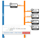
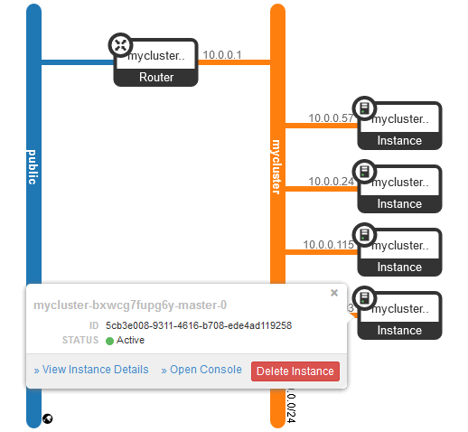

# Kubernetes on Devstack part 4: Using OpenStack Magnum to create a Kubernetes cluster

[Bernd Bausch](https://berndbausch.medium.com/?source=post_page-----af8ec3cfbda5--------------------------------)

Follow

[Dec 30, 2020](https://itnext.io/using-openstack-magnum-to-create-a-kubernetes-cluster-af8ec3cfbda5?source=post_page-----af8ec3cfbda5--------------------------------) · 7 min read

This is part 4 of an [article series](https://berndbausch.medium.com/running-a-kubernetes-cluster-on-devstack-533d579bb2f9) about running Kubernetes on OpenStack.

<https://itnext.io/using-openstack-magnum-to-create-a-kubernetes-cluster-af8ec3cfbda5>

The local.conf file from [the first part](https://itnext.io/a-single-server-devstack-cloud-as-a-kubernetes-platform-cd30e28e405a#ad9b) of this series contains these three lines to set up Magnum:

    enable\_plugin heat <https://github.com/openstack/heat> stable/ussuri enable\_plugin magnum <https://github.com/openstack/magnum> stable/ussuri 
    enable\_plugin magnum-ui <https://github.com/openstack/magnum-ui> stable/ussuri

If you followed the instructions, you already have the environment required to create a Kubernetes cluster. Use a non-admin Keystone user; I created a user and a project, both named kube, for this purpose, but you can also use user demo, project demo, which are set up by Devstack’s stack.sh.

It’s possible to operate the Magnum cluster next to the handmade cluster you created in part 2, but you may not have enough resources (mostly disk space and RAM) for both. Consider tearing down the existing cluster or creating a new Devstack before proceeding.

You start with a so-called cluster template, which describes most cluster properties. Magnum uses the template concept to allow setting up clusters with similar characteristics. Most of your work goes into this step.

Next, you create a cluster based on a cluster template. This is a simple step for you, but Magnum will spend several minutes launching complex Heat stacks to set up the cluster’s resources.

The third step is installing kubectl and obtaining the necessary kubeconfig.

# Step one: The cluster template

A Magnum cluster template defines the essential properties of a cluster, including cluster server details, networking parameters, volume parameters, and last but not least the cluster management environment (in addition to Kubernetes clusters, Magnum can also manage Docker Swarm and Mesos clusters).

The following command creates a template named mytemplate:

    $ source /home/stack/devstack/openrc kube kube
    $ openstack coe cluster template create mytemplate 
     --image Fedora-AtomicHost-29-20190820.0.x86\_64 
     --master-flavor m1.small --flavor m1.small 
     --external-network public --dns-nameserver 192.168.1.16 
     --network-driver flannel --coe kubernetes 
     --volume-driver cinder --docker-volume-size 5
     --master-lb-enabled --keypair kubekey

Let’s have a closer look at the parameters. For more information, see the [documentation](https://docs.openstack.org/magnum/ussuri/user/index.html#clustertemplate).

## Server parameters

     --image Fedora-AtomicHost-29-20190820.0.x86\_64 
     --master-flavor m1.small --flavor m1.small

All cluster servers use a Fedora-AtomicHost image that stack.sh has automatically added to the image catalog. In case you want to use a different image, be aware that the choice of ready-made images is very limited, and there are conditions for creating your own. See [Magnum’s documentation](https://docs.openstack.org/magnum/ussuri/user/index.html#image-management).

The flavor parameters define the sizes of cluster controllers (“masters”) and nodes, respectively. The small flavor used in the example is the bare minimum for running Kubernetes. It’s also the default — the two flavor parameters could have been left out.

Note that the number of controllers and nodes is not defined in a cluster template.

## Network parameters

     --external-network public --dns-nameserver 192.168.1.16 
     --network-driver flannel 

Magnum attaches cluster nodes to their own OpenStack network. This network must be routed to an external network in order to download Kubernetes software. This is why you have to tell Magnum the name of a suitable external network, here public.

Cluster nodes need DNS to access software repositories. By default, Magnum uses 8.8.8.8 as DNS server.

The network driver determines the overlay technology used to connect pods. For Kubernetes clusters, flannel or calico can be selected. Since flannel is the default, this parameter could have been left out.

## Storage parameters

     --volume-driver cinder --docker-volume-size 5

The only possible volume driver for Kubernetes is Cinder. If you leave this parameter out, clusters that are based on this template don’t have volumes.

The docker volume size parameter has nothing to do with the volume driver. It determines the size of a Cinder volume that is attached to each cluster node and that contains container images. If this parameter is left out, images are stored on nodes’ ephemeral storage.

## Other parameters

     --master-lb-enabled --keypair kubekey
     --coe kubernetes

If more than one cluster controller is deployed, Magnum sets up load balancing. The parameter in this example is redundant, because Neutron’s standard load balancer is used by default. If your OpenStack cluster does not include a Neutron load balancer, you can set `--master-lb-enabled=false`, in which case Magnum creates a load balancer on one of the controllers.

The keypair provides SSH access to the cluster controllers and nodes. It must exist prior to setting up the template. If this parameter is left out, a keypair must be provided when creating the cluster. The SSH user depends on the image used to provision the servers; in the case of Fedora-AtomicHost, it’s fedora.

COE stands for container orchestration engine. Magnum supports Kubernetes, Docker Swarm and Mesos.

When relying on default values and not using Cinder volumes, the shortest possible template creation command would be

    $ openstack coe cluster template create mytemplate 
     --image Fedora-AtomicHost-29-20190820.0.x86\_64 
     --external-network public --coe kubernetes 

# Step two: The cluster

Once the template has been defined, you can launch a cluster, for example

    $ openstack coe cluster create mycluster 
     --master-count 2 --node-count 2 
     --cluster-template mytemplate

Apart from the name of the cluster template, you need to specify the number of controllers (“masters”) and nodes in the cluster.

Magnum will create the cluster network and route it to the external network specified in the cluster template. It will then launch the requested number of controllers and nodes and provision them with Kubernetes software according to the cluster template parameters. The result:

Horizon network topology screen

It is OpenStack’s orchestration service Heat that performs most of the work. Magnum uses Heat templates for creating and provisioning the resources and launches a nested Heat stack. When cluster creation is complete, take a moment to view the resources that were created. Here, I use the YAML output format for ease of reading:

    $ openstack stack list --nested -f yaml

About 16 deeply nested stacks are displayed. Their names indicate what they are for; among them, you will find stacks for creating minions (obsolete name for cluster nodes) and masters (controllers), as well as setting up the network and the load balancer.

In case cluster creation fails, the first troubleshooting step should be an analysis of stacks with a failed completion status.

To list the Heat stack resources:

    $ openstack stack resource list $(openstack stack list -f value -c ID) -n 5 -c resource\_name -c resource\_type

This prints all resources down to a stack nesting level of 5\. Be prepared for a long list.

# Step three: kubectl and kubeconfig

In case you still need to install kubectl, you have the option of copying it from one of the Kubernetes cluster servers:

    $ openstack server list -c Name -c Networks
    +--------------------------+-------------------------------------+
    | Name | Networks |
    +--------------------------+-------------------------------------+
    | mycluster-(...)-node-0 | mycluster=10.0.0.57, 192.168.1.221 |
    | mycluster-(...)-node-1 | mycluster=10.0.0.24, 192.168.1.215 |
    | mycluster-(...)-master-1 | mycluster=10.0.0.115, 192.168.1.239 |
    | mycluster-(...)-master-0 | mycluster=10.0.0.193, 192.168.1.236 |
    +--------------------------+-------------------------------------+
    $ scp -i kubekey fedora@192.168.1.239:/srv/magnum/bin/kubectl .
    $ chmod +x kubectl
    $ sudo mv kubectl /usr/local/bin

Or just install it [from the internet](https://kubernetes.io/docs/tasks/tools/install-kubectl/#install-kubectl-binary-with-curl-on-linux).

kubectl needs a kubeconfig file to access the cluster. Generate it with this command:

    $ openstack coe cluster config mycluster
    export KUBECONFIG=/home/stack/config

The kubeconfig file is`/`home/stack/config`. Before running kubectl commands, add the above KUBECONFIG variable to the shell environment. You can do this in one go: `eval $(openstack coe cluster config mycluster)`.

Check if this works:

    $ kubectl get nodes
    NAME STATUS ROLES AGE VERSION
    mycluster-bxwcg7fupg6y-master-0 Ready master 17h v1.15.7
    mycluster-bxwcg7fupg6y-master-1 Ready master 17h v1.15.7
    mycluster-bxwcg7fupg6y-node-0 Ready \<none\> 16h v1.15.7
    mycluster-bxwcg7fupg6y-node-1 Ready \<none\> 16h v1.15.7

Have a look at the config file:

    apiVersion: v1
    clusters:
    - cluster:
     certificate-authority-data: (...)
     server: [https://192.168.1.212:6443](https://192.168.1.212:6443/)
     name: mycluster
    contexts:
    - context:
     cluster: mycluster
     user: admin
     name: default
    current-context: default
    kind: Config
    preferences: {}
    users:
    - name: admin
     user:
     client-certificate-data: (...) 
     client-key-data: (...)

In this example, the only configured user is admin. [192.168.1.212](https://192.168.1.212:6443/) is the IP address for accessing the cluster. In fact, it’s the address of a load balancer that fronts the two controllers. Explore this.

    $ openstack floating ip show 192.168.1.212 -c port\_details --fit-width
    +--------------+--------------------------------------------------+
    | Field | Value |
    +--------------+--------------------------------------------------+
    | port\_details | admin\_state\_up='False', device\_id='lb-f3173216-6 |
    | | 70c-4ab9-a409-870faefbe79b', |
    | | device\_owner='Octavia', |
    | | mac\_address='fa:16:3e:2e:e7:97', name='octavia- |
    | | lb-f3173216-670c-4ab9-a409-870faefbe79b', networ |
    | | k\_id='b5f78071-4687-4b6d-afda-94af9b087c2b', |
    | | status='DOWN' |
    +--------------+--------------------------------------------------+

The floating IP belongs to a port, whose detailed information reveals that it is owned by an Octavia load balancer. The device\_id contains the load balancer’s UUID.

    $ openstack loadbalancer show f3173216-670c-4ab9-a409-870faefbe79b --fit-width
    +---------------------+-------------------------------------------+
    | Field | Value |
    +---------------------+-------------------------------------------+
    | admin\_state\_up | True |
    | availability\_zone | None |
    | created\_at | 2020-12-29T10:21:28 |
    | description | |
    | flavor\_id | None |
    | id | f3173216-670c-4ab9-a409-870faefbe79b |
    | listeners | 1369821a-3135-4530-a9a9-500800b2968a |
    | name | mycluster- |
    | | bxwcg7fupg6y-api\_lb-6rnh26aei5az- |
    | | loadbalancer-rdpliqadtpqk |
    | operating\_status | OFFLINE |
    | pools | ee0ec855-894a-4c1b-b649-5c5484f00554 |
    | project\_id | 7a099eff1fb1479b89fa721da3e1a018 |
    | provider | amphora |
    | provisioning\_status | ACTIVE |
    | updated\_at | 2020-12-29T10:22:52 |
    | vip\_address | 10.0.0.189 |
    | vip\_network\_id | b5f78071-4687-4b6d-afda-94af9b087c2b |
    | vip\_port\_id | 41645143-e588-4c33-b24b-899e3af16fb7 |
    | vip\_qos\_policy\_id | None |
    | vip\_subnet\_id | 6ff8f4a6-d8c0-4ac3-bbc2-7a749b589e53 |
    +---------------------+-------------------------------------------+

Confirm that this loadbalancer fronts the controllers. You need to list the pools, then the pool members, then compare pool members’ addresses to your servers:

    $ openstack loadbalancer pool list --loadbalancer f3173216-670c-4ab9-a409-870faefbe79b -f yaml
    - admin\_state\_up: true
     id: ee0ec855-894a-4c1b-b649-5c5484f00554
     lb\_algorithm: ROUND\_ROBIN
     name: mycluster-bxwcg7fupg6y-api\_lb-6rnh26aei5az-pool-it3fiw7obbhi
     project\_id: 7a099eff1fb1479b89fa721da3e1a018
     protocol: TCP
     provisioning\_status: ACTIVE$ openstack loadbalancer member list ee0ec855-894a-4c1b-b649-5c5484f00554 -c address
    +------------+
    | address |
    +------------+
    | 10.0.0.193 |
    | 10.0.0.115 |
    +------------+
    $ openstack server list -c Name -c Networks
    +--------------------------+-------------------------------------+
    | Name | Networks |--------------------------+-------------------------------------+
    | mycluster-(...)-node-0 | mycluster=10.0.0.57, 192.168.1.221 |
    | mycluster-(...)-node-1 | mycluster=10.0.0.24, 192.168.1.215 |
    | mycluster-(...)-master-1 | mycluster=10.0.0.115, 192.168.1.239 |
    | mycluster-(...)-master-0 | mycluster=10.0.0.193, 192.168.1.236 |
    +--------------------------+-------------------------------------+

The load balancer pool member addresses do indeed correspond to the two master instances.