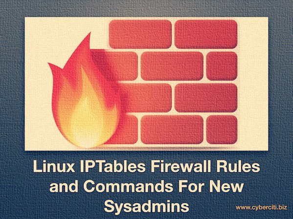

Linux comes with a host based firewall called Netfilter. The netfilter is a set of hooks inside the Linux kernel that allows kernel modules to register callback functions with the network stack. A registered callback function is then called back for every packet that traverses the respective hook within the network stack. This Linux based firewall is controlled by the program called iptables to handles filtering for IPv4, and ip6tables handles filtering for IPv6\. I strongly recommend that you first read our [quick tutorial that explains how to configure a host-based firewall called Netfilter](https://www.cyberciti.biz/faq/rhel-fedorta-linux-iptables-firewall-configuration-tutorial/) (iptables) under CentOS / RHEL / Fedora / Redhat Enterprise Linux. If you are [using Ubuntu/Debian Linux, see how to setup UFW for](https://www.cyberciti.biz/faq/howto-configure-setup-firewall-with-ufw-on-ubuntu-linux/) more info. This post lists most simple iptables solutions required by a new Linux user to secure his or her Linux operating system from intruders.

[](https://www.cyberciti.biz/tips/wp-content/uploads/2011/12/iptables-Essentials-Firewall-Rules-and-Commands-for-Linux-sysadmin-1.jpg)
 This guide shows essential iptables command to control your daily life firewall rules and [security of Linux server](https://www.cyberciti.biz/tips/linux-security.html) running on the bare metal server, router, or cloud server.

Linux Iptables Netfilter Firewall Examples For New SysAdmins
------------------------------------------------------------

* Most of the actions listed in this post written with the assumption that they will be executed by the root user running the bash or any other modern shell. Do not type commands on the remote system as it will disconnect your access.
* For demonstration purpose, I’ve used RHEL 6.x, but the following command should work with any modern Linux distro that use the netfliter.
* It is NOT a tutorial on how to set iptables. See [tutorial here](https://www.cyberciti.biz/faq/rhel-fedorta-linux-iptables-firewall-configuration-tutorial/). It is a quick cheat sheet to common iptables commands.

1\. Displaying the Status of Your Firewall
------------------------------------------

Type the following command as root:
`# iptables -L -n -v`
 Sample outputs:

    Chain INPUT (policy ACCEPT 0 packets, 0 bytes)
     pkts bytes target     prot opt in     out     source               destination

    Chain FORWARD (policy ACCEPT 0 packets, 0 bytes)
     pkts bytes target     prot opt in     out     source               destination

    Chain OUTPUT (policy ACCEPT 0 packets, 0 bytes)
     pkts bytes target     prot opt in     out     source               destination

Above output indicates that the firewall is not active. The following sample shows an active firewall:
`# iptables -L -n -v`
 Sample outputs:

    Chain INPUT (policy DROP 0 packets, 0 bytes)
     pkts bytes target     prot opt in     out     source               destination
        0     0 DROP       all  --  *      *       0.0.0.0/0            0.0.0.0/0           state INVALID
      394 43586 ACCEPT     all  --  *      *       0.0.0.0/0            0.0.0.0/0           state RELATED,ESTABLISHED
       93 17292 ACCEPT     all  --  br0    *       0.0.0.0/0            0.0.0.0/0
        1   142 ACCEPT     all  --  lo     *       0.0.0.0/0            0.0.0.0/0

    Chain FORWARD (policy DROP 0 packets, 0 bytes)
     pkts bytes target     prot opt in     out     source               destination
        0     0 ACCEPT     all  --  br0    br0     0.0.0.0/0            0.0.0.0/0
        0     0 DROP       all  --  *      *       0.0.0.0/0            0.0.0.0/0           state INVALID
        0     0 TCPMSS     tcp  --  *      *       0.0.0.0/0            0.0.0.0/0           tcp flags:0x06/0x02 TCPMSS clamp to PMTU
        0     0 ACCEPT     all  --  *      *       0.0.0.0/0            0.0.0.0/0           state RELATED,ESTABLISHED
        0     0 wanin      all  --  vlan2  *       0.0.0.0/0            0.0.0.0/0
        0     0 wanout     all  --  *      vlan2   0.0.0.0/0            0.0.0.0/0
        0     0 ACCEPT     all  --  br0    *       0.0.0.0/0            0.0.0.0/0

    Chain OUTPUT (policy ACCEPT 425 packets, 113K bytes)
     pkts bytes target     prot opt in     out     source               destination

    Chain wanin (1 references)
     pkts bytes target     prot opt in     out     source               destination

    Chain wanout (1 references)
     pkts bytes target     prot opt in     out     source               destination

Where,

* **-L** : List rules.
* **-v** : Display detailed information. This option makes the list command show the interface name, the rule options, and the TOS masks. The packet and byte counters are also listed, with the suffix ‘K’, ‘M’ or ‘G’ for 1000, 1,000,000 and 1,000,000,000 multipliers respectively.
* **-n** : Display IP address and port in numeric format. Do not use DNS to resolve names. This will speed up listing.

### 1.1\. To inspect firewall with line numbers, enter:

`# iptables -n -L -v --line-numbers`
 Sample outputs:

    Chain INPUT (policy DROP)
    num  target     prot opt source               destination
    1    DROP       all  --  0.0.0.0/0            0.0.0.0/0           state INVALID
    2    ACCEPT     all  --  0.0.0.0/0            0.0.0.0/0           state RELATED,ESTABLISHED
    3    ACCEPT     all  --  0.0.0.0/0            0.0.0.0/0
    4    ACCEPT     all  --  0.0.0.0/0            0.0.0.0/0

    Chain FORWARD (policy DROP)
    num  target     prot opt source               destination
    1    ACCEPT     all  --  0.0.0.0/0            0.0.0.0/0
    2    DROP       all  --  0.0.0.0/0            0.0.0.0/0           state INVALID
    3    TCPMSS     tcp  --  0.0.0.0/0            0.0.0.0/0           tcp flags:0x06/0x02 TCPMSS clamp to PMTU
    4    ACCEPT     all  --  0.0.0.0/0            0.0.0.0/0           state RELATED,ESTABLISHED
    5    wanin      all  --  0.0.0.0/0            0.0.0.0/0
    6    wanout     all  --  0.0.0.0/0            0.0.0.0/0
    7    ACCEPT     all  --  0.0.0.0/0            0.0.0.0/0

    Chain OUTPUT (policy ACCEPT)
    num  target     prot opt source               destination

    Chain wanin (1 references)
    num  target     prot opt source               destination

    Chain wanout (1 references)
    num  target     prot opt source               destination

You can use line numbers to delete or insert new rules into the firewall.

### 1.2\. To display INPUT or OUTPUT chain rules, enter:

```
# iptables -L INPUT -n -v
# iptables -L OUTPUT -n -v --line-numbers
```

2\. Stop / Start / Restart the Firewall
---------------------------------------

If you are using CentOS / RHEL / Fedora Linux, enter:

```
# service iptables stop
# service iptables start
# service iptables restart
```

 You can use the iptables command itself to stop the firewall and delete all rules:

```
# iptables -F
# iptables -X
# iptables -t nat -F
# iptables -t nat -X
# iptables -t mangle -F
# iptables -t mangle -X
# iptables -P INPUT ACCEPT
# iptables -P OUTPUT ACCEPT
# iptables -P FORWARD ACCEPT
```

 Where,

* **-F** : Deleting (flushing) all the rules.
* **-X** : Delete chain.
* **-t table\_name** : Select table (called nat or mangle) and delete/flush rules.
* **-P** : Set the default policy (such as DROP, REJECT, or ACCEPT).

3\. Delete Firewall Rules
-------------------------

To display line number along with other information for existing rules, enter:

```
# iptables -L INPUT -n --line-numbers
# iptables -L OUTPUT -n --line-numbers
# iptables -L OUTPUT -n --line-numbers | less
# iptables -L OUTPUT -n --line-numbers | grep 202.54.1.1
```

 You will get the list of IP. Look at [the number on the left, then use number to delete it](https://www.cyberciti.biz/faq/how-to-iptables-delete-postrouting-rule/). For example delete line number 4, enter:
`# iptables -D INPUT 4`
 OR find source IP 202.54.1.1 and delete from rule:
`# iptables -D INPUT -s 202.54.1.1 -j DROP`
 Where,

* **-D **: Delete one or more rules from the selected chain

4\. Insert Firewall Rules
-------------------------

To insert one or more rules in the selected chain as the given rule number use the following syntax. First find out line numbers, enter:
 \# iptables -L INPUT -n –line-numbers
 Sample outputs:

    Chain INPUT (policy DROP)
    num  target     prot opt source               destination
    1    DROP       all  --  202.54.1.1           0.0.0.0/0
    2    ACCEPT     all  --  0.0.0.0/0            0.0.0.0/0           state NEW,ESTABLISHED 

To insert rule between 1 and 2, enter:
`# iptables -I INPUT 2 -s 202.54.1.2 -j DROP`
 To view updated rules, enter:
`# iptables -L INPUT -n --line-numbers`
 Sample outputs:

    Chain INPUT (policy DROP)
    num  target     prot opt source               destination
    1    DROP       all  --  202.54.1.1           0.0.0.0/0
    2    DROP       all  --  202.54.1.2           0.0.0.0/0
    3    ACCEPT     all  --  0.0.0.0/0            0.0.0.0/0           state NEW,ESTABLISHED

5\. Save Firewall Rules
-----------------------

To save firewall rules under CentOS / RHEL / Fedora Linux, enter:
`# service iptables save`
 In this example, drop an IP and save firewall rules:

```
# iptables -A INPUT -s 202.5.4.1 -j DROP
# service iptables save
```

 For all other distros use the iptables-save command:

```
# iptables-save > /root/my.active.firewall.rules
# cat /root/my.active.firewall.rules
```

6\. Restore Firewall Rules
--------------------------

To restore firewall rules form a file called /root/my.active.firewall.rules, enter:

```
# iptables-restore 
To restore firewall rules under CentOS / RHEL / Fedora Linux, enter:
# service iptables restart
```

7\. Set the Default Firewall Policies
-------------------------------------

To drop all traffic:

```
# iptables -P INPUT DROP
# iptables -P OUTPUT DROP
# iptables -P FORWARD DROP
# iptables -L -v -n
#### you will not able to connect anywhere as all traffic is dropped ###
# ping cyberciti.biz
# wget http://www.kernel.org/pub/linux/kernel/v3.0/testing/linux-3.2-rc5.tar.bz2
```

### 7.1\. Only Block Incoming Traffic

To drop all incoming / forwarded packets, but allow outgoing traffic, enter:

```
# iptables -P INPUT DROP
# iptables -P FORWARD DROP
# iptables -P OUTPUT ACCEPT
# iptables -A INPUT -m state --state NEW,ESTABLISHED -j ACCEPT
# iptables -L -v -n
### *** now ping and wget should work *** ###
# ping cyberciti.biz
# wget http://www.kernel.org/pub/linux/kernel/v3.0/testing/linux-3.2-rc5.tar.bz2
```

8\. Drop Private Network Address On Public Interface
----------------------------------------------------

IP spoofing is nothing but to stop the following IPv4 address ranges for private networks on your public interfaces. Packets with non-routable source addresses should be rejected using the following syntax:

```
# iptables -A INPUT -i eth1 -s 192.168.0.0/24 -j DROP
# iptables -A INPUT -i eth1 -s 10.0.0.0/8 -j DROP
```

### 8.1\. IPv4 Address Ranges For Private Networks (make sure you block them on public interface)

* 10.0.0.0/8 -j (A)
* 172.16.0.0/12 (B)
* 192.168.0.0/16 (C)
* 224.0.0.0/4 (MULTICAST D)
* 240.0.0.0/5 (E)
* 127.0.0.0/8 (LOOPBACK)

9\. Blocking an IP Address (BLOCK IP)
-------------------------------------

To block an attackers ip address called 1.2.3.4, enter:

```
# iptables -A INPUT -s 1.2.3.4 -j DROP
# iptables -A INPUT -s 192.168.0.0/24 -j DROP
```

10\. Block Incoming Port Requests (BLOCK PORT)
----------------------------------------------

To block all service requests on port 80, enter:

```
# iptables -A INPUT -p tcp --dport 80 -j DROP
# iptables -A INPUT -i eth1 -p tcp --dport 80 -j DROP
```

To block port 80 only for an ip address 1.2.3.4, enter:

```
# iptables -A INPUT -p tcp -s 1.2.3.4 --dport 80 -j DROP
# iptables -A INPUT -i eth1 -p tcp -s 192.168.1.0/24 --dport 80 -j DROP
```

11\. Block Outgoing IP Address 
-------------------------------

To block outgoing traffic to a particular host or domain such as cyberciti.biz, enter:
`# host -t a cyberciti.biz`
 Sample outputs:

    cyberciti.biz has address 75.126.153.206

Note down its ip address and type the following to block all outgoing traffic to 75.126.153.206:
`# iptables -A OUTPUT -d 75.126.153.206 -j DROP`
 You can use a subnet as follows:

```
# iptables -A OUTPUT -d 192.168.1.0/24 -j DROP
# iptables -A OUTPUT -o eth1 -d 192.168.1.0/24 -j DROP
```

### 11.1\. Example - Block Facebook.com Domain

First, find out all ip address of facebook.com, enter:
`# host -t a www.facebook.com`
 Sample outputs:

    www.facebook.com has address 69.171.228.40

Find CIDR for 69.171.228.40, enter:
`# whois 69.171.228.40 | grep CIDR`
 Sample outputs:

    CIDR:           69.171.224.0/19

To prevent outgoing access to www.facebook.com, enter:
`# iptables -A OUTPUT -p tcp -d 69.171.224.0/19 -j DROP`
 You can also use domain name, enter:

```
# iptables -A OUTPUT -p tcp -d www.facebook.com -j DROP
# iptables -A OUTPUT -p tcp -d facebook.com -j DROP
```

From the iptables man page:

> ... specifying any name to be resolved with a remote query such as DNS (e.g., facebook.com is a really bad idea), a network IP address (with /mask), or a plain IP address ...

12\. Log and Drop Packets
-------------------------

Type the following to log and block IP spoofing on public interface called eth1

```
# iptables -A INPUT -i eth1 -s 10.0.0.0/8 -j LOG --log-prefix "IP_SPOOF A: "
# iptables -A INPUT -i eth1 -s 10.0.0.0/8 -j DROP
```

 By default everything is logged to /var/log/messages file.

```
# tail -f /var/log/messages
# grep --color 'IP SPOOF' /var/log/messages
```

13\. Log and Drop Packets with Limited Number of Log Entries
------------------------------------------------------------

The -m limit module can limit the number of log entries created per time. This is used to prevent flooding your log file. To log and drop spoofing per 5 minutes, in bursts of at most 7 entries .

```
# iptables -A INPUT -i eth1 -s 10.0.0.0/8 -m limit --limit 5/m --limit-burst 7 -j LOG --log-prefix "IP_SPOOF A: "
# iptables -A INPUT -i eth1 -s 10.0.0.0/8 -j DROP
```

14\. Drop or Accept Traffic From Mac Address
--------------------------------------------

Use the following syntax:

```
# iptables -A INPUT -m mac --mac-source 00:0F:EA:91:04:08 -j DROP
## *only accept traffic for TCP port # 8080 from mac 00:0F:EA:91:04:07 * ##
# iptables -A INPUT -p tcp --destination-port 22 -m mac --mac-source 00:0F:EA:91:04:07 -j ACCEPT
```

15\. Block or Allow ICMP Ping Request
-------------------------------------

Type the following command to block ICMP ping requests:

```
# iptables -A INPUT -p icmp --icmp-type echo-request -j DROP
# iptables -A INPUT -i eth1 -p icmp --icmp-type echo-request -j DROP
```

 Ping responses can also be limited to certain networks or hosts:
`# iptables -A INPUT -s 192.168.1.0/24 -p icmp --icmp-type echo-request -j ACCEPT`
 The following only accepts limited type of ICMP requests:

```
### ** assumed that default INPUT policy set to DROP ** #############
iptables -A INPUT -p icmp --icmp-type echo-reply -j ACCEPT
iptables -A INPUT -p icmp --icmp-type destination-unreachable -j ACCEPT
iptables -A INPUT -p icmp --icmp-type time-exceeded -j ACCEPT
## ** all our server to respond to pings ** ##
iptables -A INPUT -p icmp --icmp-type echo-request -j ACCEPT
```

16\. Open Range of Ports
------------------------

Use the following syntax to open a range of ports:
`iptables -A INPUT -m state --state NEW -m tcp -p tcp --dport 7000:7010 -j ACCEPT`

17\. Open Range of IP Addresses 
--------------------------------

Use the following syntax to open a range of IP address:

```
## only accept connection to tcp port 80 (Apache) if ip is between 192.168.1.100 and 192.168.1.200 ##
iptables -A INPUT -p tcp --destination-port 80 -m iprange --src-range 192.168.1.100-192.168.1.200 -j ACCEPT
```

\#\# nat example \#\#
 iptables -t nat -A POSTROUTING -j SNAT --to-source 192.168.1.20-192.168.1.25

18\. Established Connections and Restarting The Firewall
--------------------------------------------------------

When you restart the iptables service it will drop established connections as it unload modules from the system under RHEL / Fedora / CentOS Linux. Edit, /etc/sysconfig/iptables-config and set IPTABLES\_MODULES\_UNLOAD as follows:

    IPTABLES_MODULES_UNLOAD = no

19\. Help Iptables Flooding My Server Screen
--------------------------------------------

Use the crit log level to send messages to a log file instead of console:
`iptables -A INPUT -s 1.2.3.4 -p tcp --destination-port 80 -j LOG --log-level crit`

20\. Block or Open Common Ports
-------------------------------

The following shows syntax for opening and closing common TCP and UDP ports:

    Replace ACCEPT with DROP to block port:
    ## open port ssh tcp port 22 ##
    iptables -A INPUT -m state --state NEW -m tcp -p tcp --dport 22 -j ACCEPT
    iptables -A INPUT -s 192.168.1.0/24 -m state --state NEW -p tcp --dport 22 -j ACCEPT

    ## open cups (printing service) udp/tcp port 631 for LAN users ##
    iptables -A INPUT -s 192.168.1.0/24 -p udp -m udp --dport 631 -j ACCEPT
    iptables -A INPUT -s 192.168.1.0/24 -p tcp -m tcp --dport 631 -j ACCEPT

    ## allow time sync via NTP for lan users (open udp port 123) ##
    iptables -A INPUT -s 192.168.1.0/24 -m state --state NEW -p udp --dport 123 -j ACCEPT

    ## open tcp port 25 (smtp) for all ##
    iptables -A INPUT -m state --state NEW -p tcp --dport 25 -j ACCEPT

    # open dns server ports for all ##
    iptables -A INPUT -m state --state NEW -p udp --dport 53 -j ACCEPT
    iptables -A INPUT -m state --state NEW -p tcp --dport 53 -j ACCEPT

    ## open http/https (Apache) server port to all ##
    iptables -A INPUT -m state --state NEW -p tcp --dport 80 -j ACCEPT
    iptables -A INPUT -m state --state NEW -p tcp --dport 443 -j ACCEPT

    ## open tcp port 110 (pop3) for all ##
    iptables -A INPUT -m state --state NEW -p tcp --dport 110 -j ACCEPT

    ## open tcp port 143 (imap) for all ##
    iptables -A INPUT -m state --state NEW -p tcp --dport 143 -j ACCEPT

    ## open access to Samba file server for lan users only ##
    iptables -A INPUT -s 192.168.1.0/24 -m state --state NEW -p tcp --dport 137 -j ACCEPT
    iptables -A INPUT -s 192.168.1.0/24 -m state --state NEW -p tcp --dport 138 -j ACCEPT
    iptables -A INPUT -s 192.168.1.0/24 -m state --state NEW -p tcp --dport 139 -j ACCEPT
    iptables -A INPUT -s 192.168.1.0/24 -m state --state NEW -p tcp --dport 445 -j ACCEPT

    ## open access to proxy server for lan users only ##
    iptables -A INPUT -s 192.168.1.0/24 -m state --state NEW -p tcp --dport 3128 -j ACCEPT

    ## open access to mysql server for lan users only ##
    iptables -I INPUT -p tcp --dport 3306 -j ACCEPT

21\. Restrict the Number of Parallel Connections To a Server Per Client IP
--------------------------------------------------------------------------

You can use connlimit module to put such restrictions. To allow 3 ssh connections per client host, enter:
`# iptables -A INPUT -p tcp --syn --dport 22 -m connlimit --connlimit-above 3 -j REJECT`

Set HTTP requests to 20:
`# iptables -p tcp --syn --dport 80 -m connlimit --connlimit-above 20 --connlimit-mask 24 -j DROP`
 Where,

1. **--connlimit-above 3** : Match if the number of existing connections is above 3.
2. **--connlimit-mask 24** : Group hosts using the prefix length. For IPv4, this must be a number between (including) 0 and 32.

22\. List NAT rules
-------------------

The syntax is
`# iptables -t nat -L -n -v`
 Sample outputs:

    Chain PREROUTING (policy ACCEPT 496K packets, 29M bytes)
     pkts bytes target     prot opt in     out     source               destination         
    43557 2613K DNAT       tcp  --  *      *       0.0.0.0/0            192.168.184.8        tcp dpt:443 to:10.105.28.42:443
    68700 4122K DNAT       tcp  --  *      *       0.0.0.0/0            192.168.184.8        tcp dpt:80 to:10.105.28.42:80
    15855  951K DNAT       tcp  --  *      *       0.0.0.0/0            192.168.184.8        tcp dpt:444 to:10.105.28.45:444
    16009  961K DNAT       tcp  --  *      *       0.0.0.0/0            192.168.184.8        tcp dpt:81 to:10.105.28.45:81
    63495 3810K DNAT       tcp  --  *      *       0.0.0.0/0            192.168.184.8        tcp dpt:445 to:10.105.28.44:445
    19615 1177K DNAT       tcp  --  *      *       0.0.0.0/0            192.168.184.8        tcp dpt:82 to:10.105.28.44:82

    Chain INPUT (policy ACCEPT 488K packets, 29M bytes)
     pkts bytes target     prot opt in     out     source               destination         

    Chain OUTPUT (policy ACCEPT 3280 packets, 207K bytes)
     pkts bytes target     prot opt in     out     source               destination         

    Chain POSTROUTING (policy ACCEPT 231K packets, 14M bytes)
     pkts bytes target     prot opt in     out     source               destination         
     3832  230K MASQUERADE  all  --  *      *       10.105.28.0/24      !10.105.28.0/24       /* generated for LXD network lxdbr0 */

Another option:
`# iptables -t nat -v -L -n --line-number`

23\. Delete NAT rules
---------------------

The [syntax is as follows to list NAT rules on Linux](https://www.cyberciti.biz/faq/how-to-iptables-delete-postrouting-rule/iptables-list-postrouting-rules/):

```
# iptables -t nat -v -L -n --line-number
# iptables -t nat -v -L PREROUTING -n --line-number
# iptables -t nat -v -L POSTROUTING -n --line-number
```

 To delete PREROUTING rule, run:

```
# iptables -t nat -D PREROUTING {number-here}
# iptables -t nat -D PREROUTING 42
```

[To delete POSTROUTING rule](https://www.cyberciti.biz/faq/how-to-iptables-delete-postrouting-rule/), run:

```
# iptables -t nat -D POSTROUTING {number-here}
# iptables -t nat -D POSTROUTING 42
```

24\. How to redirect port AA to BB
----------------------------------

The [syntax is as follows](https://www.cyberciti.biz/faq/linux-port-redirection-with-iptables/):
`iptables -t nat -A PREROUTING -i $interfaceName -p tcp --dport $srcPortNumber -j REDIRECT --to-port $dstPortNumber`
 To redirect all incoming traffic on port 80 redirect to port 8080
`# iptables -t nat -I PREROUTING --src 0/0 --dst 192.168.1.5 -p tcp --dport 80 -j REDIRECT --to-ports 8080`

* [How to configure ufw to forward port 80/443 to internal server hosted on LAN](https://www.cyberciti.biz/faq/how-to-configure-ufw-to-forward-port-80443-to-internal-server-hosted-on-lan/)

25\. How to reset packet counters
---------------------------------

To see iptables counters run:
`# iptables -L -n -v`
 To clear/reset the counters for all rules:

```
# iptables -Z
# iptables -L -n -v
```

 To reset the counters for INPUT chain only:
`# iptables -Z INPUT`
 To reset the counters for rule \# 13 in the INPUT chain only:
`# iptables -Z INPUT 13`

* [Linux Network IP Accounting](https://www.cyberciti.biz/faq/linux-configuring-ip-traffic-accounting/)

26\. HowTO: Use iptables Like a Pro
-----------------------------------

For more information about iptables, please see the manual page by typing man iptables from the command line:
`$ man iptables`
 You can see the help using the following syntax too:
`# iptables -h`
 To see help with specific commands and targets, enter:
`# iptables -j DROP -h`

27\. Testing Your Firewall
--------------------------

Find out if ports are open or not, enter:
`# netstat -tulpn`
 Find out if tcp port 80 open or not, enter:
`# netstat -tulpn | grep :80`
 If port 80 is not open, start the Apache, enter:
`# service httpd start`
 Make sure iptables allowing access to the port 80:
`# iptables -L INPUT -v -n | grep 80`
 Otherwise open port 80 using the iptables for all users:

```
# iptables -A INPUT -m state --state NEW -p tcp --dport 80 -j ACCEPT
# service iptables save
```

 Use the telnet command to see if firewall allows to connect to port 80:
`$ telnet www.cyberciti.biz 80`
 Sample outputs:

    Trying 75.126.153.206...
    Connected to www.cyberciti.biz.
    Escape character is '^]'.
    ^]

    telnet> quit
    Connection closed.

You can use the [nmap command](https://www.cyberciti.biz/networking/nmap-command-examples-tutorials/) to probe your own server using the following syntax:
`$ nmap -sS -p 80 www.cyberciti.biz`
 Sample outputs:

    Starting Nmap 5.00 ( http://nmap.org ) at 2011-12-13 13:19 IST
    Interesting ports on www.cyberciti.biz (75.126.153.206):
    PORT   STATE SERVICE
    80/tcp open  http

    Nmap done: 1 IP address (1 host up) scanned in 1.00 seconds

I also recommend you install and use sniffer such as tcpdupm and ngrep to test your firewall settings.

#### Conclusion:

This post only list basic rules for new Linux users. You can create and build more complex rules. This requires good understanding of TCP/IP, Linux kernel tuning via sysctl.conf, and good knowledge of your own setup. Stay tuned for next topics:

* Stateful packet inspection.
* Using connection tracking helpers.
* Network address translation.
* Layer 2 filtering.
* Firewall testing tools.
* Dealing with VPNs, DNS, Web, Proxy, and other protocols.

 🐧 Get the latest tutorials on Linux, Open Source & DevOps via **[RSS feed](https://www.cyberciti.biz/atom/atom.xml)** or **[Weekly email newsletter.](https://newsletter.cyberciti.biz/subscription?f=1ojtmiv8892KQzyMsTF4YPr1pPSAhX2rq7Qfe5DiHMgXwKo892di4MTWyOdd976343rcNR6LhdG1f7k9H8929kMNMdWu3g)**

 🐧 83 comments so far... [add one](https://www.cyberciti.biz/tips/linux-iptables-examples.html#respond) **↓**

CategoryList of Unix and Linux commandsDisk space analyzers[df](https://www.cyberciti.biz/faq/df-command-examples-in-linux-unix/) • [ncdu](https://www.cyberciti.biz/open-source/install-ncdu-on-linux-unix-ncurses-disk-usage/) • [pydf](https://www.cyberciti.biz/tips/unix-linux-bsd-pydf-command-in-colours.html)File Management[cat](https://www.cyberciti.biz/faq/linux-unix-appleosx-bsd-cat-command-examples/) • [cp](https://www.cyberciti.biz/faq/cp-copy-command-in-unix-examples/) • [mkdir](https://www.cyberciti.biz/faq/linux-make-directory-command/) • [tree](https://www.cyberciti.biz/faq/linux-show-directory-structure-command-line/)Firewall[Alpine Awall](https://www.cyberciti.biz/faq/how-to-set-up-a-firewall-with-awall-on-alpine-linux/) • [CentOS 8](https://www.cyberciti.biz/faq/how-to-set-up-a-firewall-using-firewalld-on-centos-8/) • [OpenSUSE](https://www.cyberciti.biz/faq/set-up-a-firewall-using-firewalld-on-opensuse-linux/) • [RHEL 8 ](https://www.cyberciti.biz/faq/configure-set-up-a-firewall-using-firewalld-on-rhel-8/) • [Ubuntu 16.04](https://www.cyberciti.biz/faq/howto-configure-setup-firewall-with-ufw-on-ubuntu-linux/) • [Ubuntu 18.04](https://www.cyberciti.biz/faq/how-to-setup-a-ufw-firewall-on-ubuntu-18-04-lts-server/) • [Ubuntu 20.04](https://www.cyberciti.biz/faq/how-to-configure-firewall-with-ufw-on-ubuntu-20-04-lts/)Network Utilities[NetHogs](https://www.cyberciti.biz/faq/linux-find-out-what-process-is-using-bandwidth/) • [dig](https://www.cyberciti.biz/faq/linux-unix-dig-command-examples-usage-syntax/) • [host](https://www.cyberciti.biz/faq/linux-unix-host-command-examples-usage-syntax/) • [ip](https://www.cyberciti.biz/faq/linux-ip-command-examples-usage-syntax/) • [nmap](https://www.cyberciti.biz/security/nmap-command-examples-tutorials/)OpenVPN[CentOS 7](https://www.cyberciti.biz/faq/centos-7-0-set-up-openvpn-server-in-5-minutes/) • [CentOS 8](https://www.cyberciti.biz/faq/centos-8-set-up-openvpn-server-in-5-minutes/) • [Debian 10](https://www.cyberciti.biz/faq/debian-10-set-up-openvpn-server-in-5-minutes/) • [Debian 8/9](https://www.cyberciti.biz/faq/install-configure-openvpn-server-on-debian-9-linux/) • [Ubuntu 18.04](https://www.cyberciti.biz/faq/ubuntu-18-04-lts-set-up-openvpn-server-in-5-minutes/) • [Ubuntu 20.04](https://www.cyberciti.biz/faq/ubuntu-20-04-lts-set-up-openvpn-server-in-5-minutes/)Package Manager[apk](https://www.cyberciti.biz/faq/10-alpine-linux-apk-command-examples/) • [apt](https://www.cyberciti.biz/faq/ubuntu-lts-debian-linux-apt-command-examples/)Processes Management[bg](https://www.cyberciti.biz/faq/unix-linux-bg-command-examples-usage-syntax/) • [chroot](https://www.cyberciti.biz/faq/unix-linux-chroot-command-examples-usage-syntax/) • [cron](https://www.cyberciti.biz/faq/how-do-i-add-jobs-to-cron-under-linux-or-unix-oses/) • [disown](https://www.cyberciti.biz/faq/unix-linux-disown-command-examples-usage-syntax/) • [fg](https://www.cyberciti.biz/faq/unix-linux-fg-command-examples-usage-syntax/) • [jobs](https://www.cyberciti.biz/faq/unix-linux-jobs-command-examples-usage-syntax/) • [killall](https://www.cyberciti.biz/faq/unix-linux-killall-command-examples-usage-syntax/) • [kill](https://www.cyberciti.biz/faq/unix-kill-command-examples/) • [pidof](https://www.cyberciti.biz/faq/linux-pidof-command-examples-find-pid-of-program/) • [pstree](https://www.cyberciti.biz/faq/unix-linux-pstree-command-examples-shows-running-processestree/) • [pwdx](https://www.cyberciti.biz/faq/unix-linux-pwdx-command-examples-usage-syntax/) • [time](https://www.cyberciti.biz/faq/unix-linux-time-command-examples-usage-syntax/)Searching[grep](https://www.cyberciti.biz/faq/howto-use-grep-command-in-linux-unix/) • [whereis](https://www.cyberciti.biz/faq/unix-linux-whereis-command-examples-to-locate-binary/) • [which](https://www.cyberciti.biz/faq/unix-linux-which-command-examples-syntax-to-locate-programs/)User Information[groups](https://www.cyberciti.biz/faq/unix-linux-groups-command-examples-syntax-usage/) • [id](https://www.cyberciti.biz/faq/unix-linux-id-command-examples-usage-syntax/) • [lastcomm](https://www.cyberciti.biz/faq/linux-unix-lastcomm-command-examples-usage-syntax/) • [last](https://www.cyberciti.biz/faq/linux-unix-last-command-examples/) • [lid/libuser-lid](https://www.cyberciti.biz/faq/linux-lid-command-examples-syntax-usage/) • [logname](https://www.cyberciti.biz/faq/unix-linux-logname-command-examples-syntax-usage/) • [members](https://www.cyberciti.biz/faq/linux-members-command-examples-usage-syntax/) • [users](https://www.cyberciti.biz/faq/unix-linux-users-command-examples-syntax-usage/) • [whoami](https://www.cyberciti.biz/faq/unix-linux-whoami-command-examples-syntax-usage/) • [who](https://www.cyberciti.biz/faq/unix-linux-w-command-examples-syntax-usage-2/) • [w](https://www.cyberciti.biz/faq/unix-linux-w-command-examples-syntax-usage-2/)WireGuard VPN[Alpine](https://www.cyberciti.biz/faq/how-to-set-up-wireguard-vpn-server-on-alpine-linux/) • [CentOS 8](https://www.cyberciti.biz/faq/centos-8-set-up-wireguard-vpn-server/) • [Debian 10](https://www.cyberciti.biz/faq/debian-10-set-up-wireguard-vpn-server/) • [Firewall](https://www.cyberciti.biz/faq/how-to-set-up-wireguard-firewall-rules-in-linux/) • [Ubuntu 20.04](https://www.cyberciti.biz/faq/ubuntu-20-04-set-up-wireguard-vpn-server/)