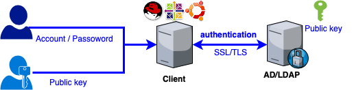
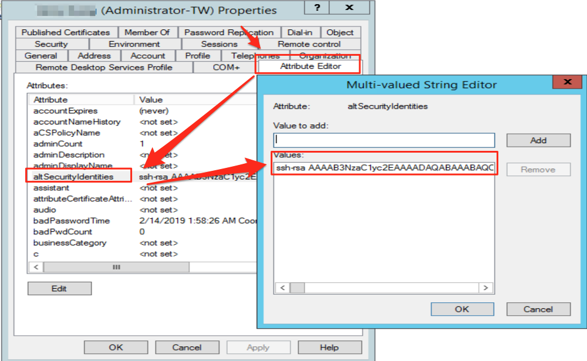

<https://medium.com/jerrynotes/linux-authentication-windows-ad-without-join-domain-7963c3fd44c5>

> Linux認證Windows AD，但不加入Domain，並且可以使用private key去認證

Pre-requisities
===============

**Pre-requisities **
1\. Enable LDAP over SSL in AD collector
2\. Create a readonly domain user account
*For authentication and listing users and groups SSSD needs to bind to the LDAP directory. It’s enough to have a read-only user with just enough privileges to read the directory.*
3\. Create user account and password into AD collector
4\. Add user’s ssh public key into AD user’s attribute

Pre-requisities — Install the required software:
================================================

**Centos**

$ yum install -y sssd sssd-tools sssd-ldap openldap-clients

**Ubuntu**

$ apt-get update 
$ apt-get install sssd sssd-tools sssd-ldap curl

Adjust /etc/sssd/sssd.conf with a content like the following:
=============================================================

Obviously update the ldap\_uri, ldap\_search\_base, ldap\_default\_bind\_dn and ldap\_tls\_cacertto match your setup.

cat /etc/sssd/sssd.conf

[domain/default] 
id\_provider = ldap 
cache\_credentials = True 
ldap\_uri = ldaps://xxxx
ldap\_search\_base = DC=sdi,DC=xxxx,DC=org 
ldap\_schema = AD 
ldap\_default\_bind\_dn = CN=ReadOnlyUser,CN=Users,DC=sdi,DC=xxxx,DC=org 
ldap\_default\_authtok\_type = obfuscated\_password
ldap\_default\_authtok = xxxxx
ldap\_tls\_cacert = /etc/pki/tls/cert.pem 
ldap\_tls\_reqcert = allow
ldap\_id\_mapping = True 
ldap\_referrals = false

ldap\_user\_extra\_attrs = altSecurityIdentities:altSecurityIdentities 
ldap\_user\_ssh\_public\_key = altSecurityIdentities 
ldap\_use\_tokengroups = True

enumerate = False 
fallback\_homedir = /home/%u 
default\_shell = /bin/bash

[sssd] 
config\_file\_version = 2 
services = nss, pam, ssh
domains = default 
full\_name\_format = %1$s

[nss] 
filter\_users =nobody,root,mdaops,rabbitmq,postfix,apache,redis,nagios,tcpdump 
filter\_groups =nobody,root,mdaops,rabbitmq,postfix,apache,redis,nagios,tcpdump

[pam] 
offline\_credentials\_expiration = 7

Lock down the permissions or sssd will refuse to start:
=======================================================

$ chmod 600 /etc/sssd/sssd.conf

Finally create an obfuscated password for the Bind DN account:
==============================================================

**Will use readonly domain user account and encryption password into ldap\_default\_authtok**

$ sss\_obfuscate — domain default 
Enter password: 
Re-enter password:

Enable use of SSS for authentication
====================================

$ authconfig — enablesssd — enablesssdauth — enablemkhomedir — updateall

Enable password authentication for SSH
======================================

$ grep PasswordAuthentication /etc/ssh/sshd\_config

PasswordAuthentication yes

Adjust /etc/ssh/sshd.conf with a content like the following:
============================================================

$ cat /etc/ssh/sshd\_config
AuthorizedKeysCommand /usr/bin/sss\_ssh\_authorizedkeys 
AuthorizedKeysCommandRunAs root

Restart service in client
=========================

$ systemctl restart sssd
$ systemctl restart sshd

Testing and verfication
=======================

$ /usr/bin/sss\_ssh\_authorizedkeys a-jerry\_kung 
ssh-rsa AAAxxxz jerry\_kung@TW-JERRYKUNG

/Users/jerry\_kung\# ssh [a-jerry\_kung@dcs-xxxx.sjc](mailto:a-jerry_kung@dcs-tps1-test1.sjc)1 
Warning: Permanently added the RSA host key for IP address ‘10.x.x.x’ to the list of known hosts. 
Enter passphrase for key ‘/Users/jerry\_kung/.ssh/id\_rsa’: 
Last login: Thu Feb 14 02:41:04 2019 from dcs-xxx.sjc1 
[a-jerry\_kung@dcs-tps1-test1 ~]$ id 
uid=1284823213(a-jerry\_kung) gid=1284800513(Domain Users) groups=1284800513(Domain Users)

[a-jerry\_kung@dcs-splunk3.sjc1 ~]$ ssh a-jerry\_kung@dcs-tps1-test1.sjc1
a-jerry\_kung@dcs-tps1-test1.sjc1’s password: