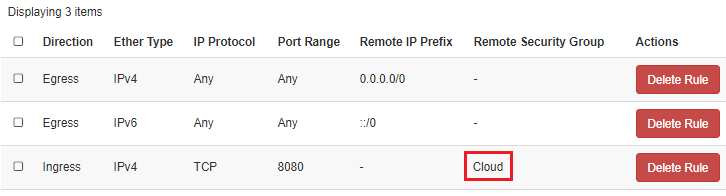

Managing Security Groups using the OpenStack CLI
================================================

Overview
--------

March 17, 2021 19:17

Creating and deleting Security Groups
-------------------------------------

After logging into your instance, run the following command to list Security Groups currently configured.

    [user@localhost]$ openstack security group list

### Creating a Security Group

Run the following command to create a Security Group with a specified name and description.

The backslash character \\ is used when entering a long command. When you enter the \\, the terminal command continues to the next line until you finish entering it.

You could also remove the \\ character and put every parameter into a single line.

    [user@localhost]$ openstack security group create \\ --description GROUP\_DESCRIPTION SECURITY\_GROUP\_NAME

If you run the openstack security group list command above, you'll see it now exists. You can also view it in your DreamCompute dashboard on the '[Network \> Security Groups](https://iad2.dreamcompute.com/project/security_groups/)' page.

### Deleting a Security Group

Run the following to delete a Security Group.

    [user@localhost]$ openstack security group delete SECURITY\_GROUP\_NAME

You cannot delete the 'default' Security Group from your project. It's also not possible to delete a Security Group that is assigned to an instance.

Create and manage Security Group rules
--------------------------------------

You can modify Security Group rules with the openstack security group rule command.

### List the rules for a Security Group

    [user@localhost]$ openstack security group rule list SECURITY\_GROUP\_NAME

### Allow requests to port 8080

To allow requests to port 8080 on all instances using this group, choose one of the following options:

### Create new rules for a group

Allow access from all IP addresses (specified as IP subnet `0.0.0.0/0` in CIDR notation).

    [user@localhost]$ openstack security group rule create \\ --proto tcp --dst-port 8080 SECURITY\_GROUP\_NAME
    +-------------------+------------------------+
    | Field             | Value                  |
    +-------------------+------------------------+
    | created_at        | 2018-02-08T20:33:38Z   |
    | description       |                        |
    | direction         | ingress                |
    | ether_type        | IPv4                   |
    | id                | fdd92e21-c474-4349-8...|
    | name              | None                   |
    | port_range_max    | 8080                   |
    | port_range_min    | 8080                   |
    | project_id        | e52cde3c560547cf950b...|
    | protocol          | tcp                    |
    | remote_group_id   | None                   |
    | remote_ip_prefix  | 0.0.0.0/0              |
    | revision_number   | 1                      |
    | security_group_id | 36f1dcb4-e2fb-3a03-9...|
    | updated_at        | 2018-02-08T20:33:38Z   |
    +-------------------+------------------------+

If you check the rules again, you'll see the new one has been added:

    [user@localhost]$ openstack security group rule list SECURITY\_GROUP\_NAME
    +---------------+-------------+-----------+------------+-----------------------+
    | ID            | IP Protocol | IP Range  | Port Range | Remote Security Group |
    +---------------+-------------+-----------+------------+-----------------------+
    | 7b106e0e-0... | None        | None      |            | None                  |
    | 87b0de27-1... | None        | None      |            | None                  |
    | fdd92e91-c... | tcp         | 0.0.0.0/0 | 8080:8080  | None                  |
    +---------------+-------------+-----------+------------+-----------------------+

### Add rules from an existing group

Allow access only from IP addresses from other Security Groups (source groups) to access the specified port.

Run the following to view the ID and Name of existing Security Groups:

    [user@localhost]$ openstack security group list
    +----------------+-------------+------------------------------+-------------+
    | ID             | Name        | Description                  | Project     |
    +----------------+-------------+------------------------------+-------------+
    | 26f1dfb4-e2... | NEW_group   | OSCLI_Desc                   | e52ede2a... |
    | 29abef85-b8... | default     | Default security group       | e52ede2a... |
    | 7b450512-d3... | Cloud       | Security Group for NextCloud | e52ede2a... |
    +----------------+-------------+------------------------------+-------------+

Once you've located the ID and Name of the group you'd like to import, run the following:

    [user@localhost]$ openstack security group rule create \\ --proto tcp --dst-port 8080 --remote-group SOURCE\_GROUP\_ID GROUP\_NAME\_TO\_ADD\_RULE\_TO

The SOURCE\_GROUP\_ID is the ID of the group you wish to add.

The GROUP\_NAME\_TO\_ADD\_RULE\_TO is the group you're adding the rule to.

View the 'Network \> Security Groups' page in your panel. To the right of the new Security Group, click the **Manage** button.

You'll see a new rule added and the name of the other Security Group is now under the Remote Security Group column. In the example above, the other Security Group is named 'Cloud'.

This allows source traffic from any other instance in that Security Group access to any other instance.

### Allow access through a UDP port

Adding rules for UDP are the same as TCP. You can use the same commands above, just make sure to swap out --proto tcp with --proto udp and change the port number to 53.

Delete a Security Group rule
----------------------------

First, run the following command to view all Security Group rules.

    [user@localhost]$ openstack security group rule list

This lists all rules with their corresponding ID. The ID is a long string of numbers and letters. For example:

* 55f3cf46d-2c57-4b05-8dab-e12ab585af33

To delete a rule, run the following command with the correct rule ID.

    [user@localhost]$ openstack security group rule delete SECURITY\_GROUP\_RULE\_ID