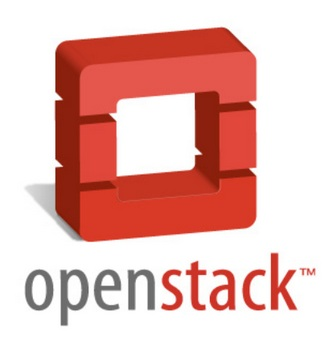
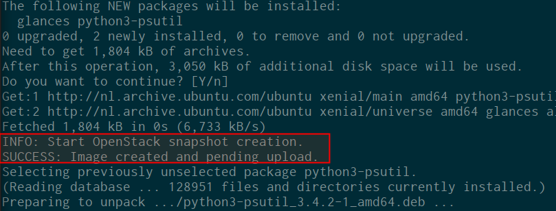
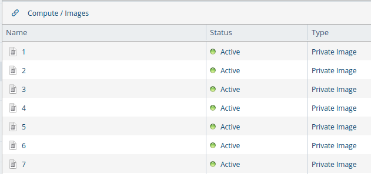
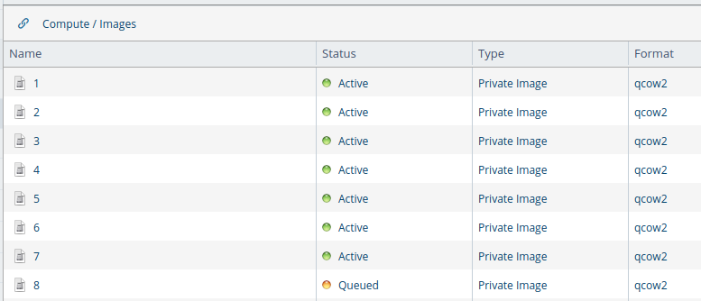
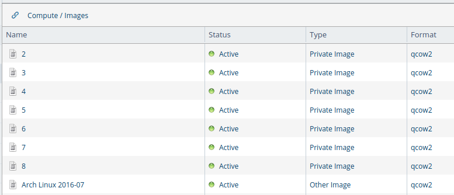
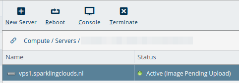
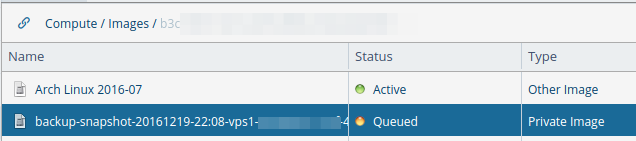

OpenStack: Quick and automatic instance snapshot backup and restore (and before an apt upgrade) with nova backup
================================================================================================================

**❗ This post is over four years old. It may no longer be up to date. Opinions may have changed.**



This is a guide that shows you how to create OpenStack instance snapshots automatically, quick and easy. This allows you to create a full backup of the entire instance. This guide has a script that makes creating snapshots from an OpenStack VM automatic via cron. The script uses the `nova backup` function, therefore it also has retention and rotation of the backups. It also features an option to create a snapshot before every apt action, upgrade/install/remove. This way, you can easily restore from the snapshot when something goes wrong after an upgrade. Snapshots are very usefull to restore the entire instance to an earlier state. Do note that this is not the same as a file based backup, you can't select a few files to restore, it's all or nothing.

OpenStack Compute (Nova) has a feature that allows you to create a snapshot of a (running) instance, namely `nova image-create`. This uses the underlying hypervisor to create an instant snapshot of the virtual machine. In the case of KVM/qemu this is a qemu-snapshot. This image is then stored in the Glance image store, allowing you to create a new VM based on the image, thus restoring the backup or creating a clone. If you use floating IP's, it's a matter of assigning the floating IP to the new VM and you're all set.

[Consider sponsoring me on Github. It means the world to me if you show your appreciation and you'll help pay the server costs.](https://github.com/sponsors/RaymiiOrg/)

[You can also sponsor me by getting a Digital Ocean VPS. With this referral link you'll get $100 credit for 60 days. ](https://www.digitalocean.com/?refcode=7435ae6b8212)



> Snapshot before an apt install/upgrade

Snapshots are a fast and easy way to clone or restore an instance to an earlier point. Let's say you're doing an upgrade of your application and it goes horribly wrong. Rollback fails and it's the middle of the night. Do you want to go and restore all the files and databases from the backup of 18 hours earlier, manually? Or do you want to revert the entire thing to a full snapshot from before the upgrade? If I could choose, I would know.

Do note that I still recommend you create regular backups. They allow for a more fine-grained way to restore files/folders/databases and have things like compression and incremental/differential support, thus backing up only the things that have changed since the last backup. This snapshot method is just a copy of the enitre disk, taking up more space.

### Nova Backup

The compute part of OpenStack, nova, has multiple options to create images (snapshots) of an instance. One is with the `nova image-create` command. This creates an instant snapshot and uploads that to Glance, the image storage component.

The second option is `nova backup`. This is almost the same as `image-create`, with the addition of rotation of the backup snapshots. There are two extra parameters, `backup_type` and `rotation`. The [documentation](http://docs.openstack.org/cli-reference/nova.html) is a bit sparse on this, but the [api](http://developer.openstack.org/api-ref/compute/?expanded=create-server-back-up-createbackup-action-detail) and the [source code](https://github.com/openstack/nova/blob/master/nova/api/openstack/compute/create_backup.py) provide more detail.

The backups are normal glance images. Based on the `backup_type` a set number of images is saved. Once there are more images of that type then specified in `rotation`, the oldest is deleted. If we create a backup every day with `backup_type` set to `daily` and `rotation` set to `7`, on the 8'th day, the oldest image will be automatically removed (on creation of the new backup).

There is no scheduling in OpenStack, you need to create these backups yourself, from `cron` for example. The script allows you to specify a `backup_type` and a `rotation`. The example sets up the following scheme:

* Daily snapshot, `backup_type` set to `daily`, `rotation` set to `7`.
* Weekly snapshot, `backup_type` set to `weekly`, `rotation` set to `4`.
* Monthly snapshot, `backup_type` set to `montly`, `rotation` set to `12`.
* Yearly snapshot, `backup_type` set to `yearly`, `rotation` set to `2`.

The snapshots after an apt upgrade, if configured, have `backup_type` set to`apt` and `rotation` set to `7`. If no options are provided, the `backup_type` is set to `manual` and the rotation to `7`. If just a `backup_type` is provided, the `rotation` defaults to `7`.

We do need to schedule this in `cron` on the VM itself. You could also adapt the script to run on a management VM to backup all the VM's in an account.

Below is a screenshot of an example daily snapshot setup. We see 7 snapshots created with rotation set to 7:



The 8'th snapshot is created:



Only after the 8'th snapshot has succeeded, the 1st snapshot is removed automatically:



If for whatever reason the new snapshot fails, the old one isn't deleted.

In OpenStack the operator can configure where the Glance images are stored. In the case of my prefered OpenStack provider ([CloudVPS](http://cloudvps.com/), non-affiliate link) this is their object store (swift). I happen to know that that object store is replicated over three data centers, making the snapshot storage extremely redundant.

The script works on both CentOS and Ubuntu, the apt-upgrade snapshot part only on Ubuntu. Yum has no such pre-hooks as far as I know of. On CentOS you're better of just executing it manually before a `yum update`.

### OpenStack command line tools and dependencies

The script runs on the server you want to snapshot itself. It's required to have the command line tools installed and to have a credentials file. First install the dependencies:

```
# Ubuntu
apt-get install dmidecode wget python-pip
# CentOS
yum install dmidecode wget python-pip

```

Recent Ubuntu releases have the OpenStack command line tools packaged:

```
apt-get install python-keystoneclient python-glanceclient python-novaclient

```

On older versions and CentOS you can use `pip`, the Python Pypi package tool:

```
pip install python-keystoneclient python-glanceclient python-novaclient

```

You also need a credentials file (`computerc`). Below you'll find an example file, fill it in with the credentials your OpenStack provider sent you.

```
nano /root/.openstack_snapshotrc

export OS_AUTH_URL="https://identity.stack.cloudvps.com/v2.0"
export OS_TENANT_NAME="PROJECT_UUID"
export OS_TENANT_ID="PROJECT_UUID"
export OS_USERNAME="USERNAME"
export OS_PASSWORD="PASSWORD"

```

Test if the file is correct by sourcing it in the shell and issueing a command:

```
source /root/.openstack_snapshotrc
nova credentials

```

Example output:

```
+------------------+-------------------------+
| User Credentials | Value                   |
+------------------+-------------------------+
| id               | f3[...]11               |
| name             | image-test-1            |
| roles            | [{"name": "compute"}]   |
| roles_links      | []                      |
| username         | image-test-1            |
+------------------+-------------------------+

```

### Install the script

The script is on my Github and can be downloaded with `wget`:

```
wget -O "/usr/local/bin/create-snapshot.sh" "https://github.com/RaymiiOrg/openstack-nova-snapshot/blob/master/create_snapshot.sh"

```

Set the executable permission on the file:

```
chmod +x /usr/local/bin/create-snapshot.sh

```

The script is simple and accepts two parameters, namely the `backup_type`and `rotation`. They are not required, by default it will give the `manual` backup type and a rotation of `7`. For your daily backup with 7 snapshots saved you can use the following:

```
/usr/local/bin/create-snapshot.sh daily 7

```

For your apt snapshots you should give another type:

```
 /usr/local/bin/create-snapshot.sh apt 7

```

The auto-removal is based on the `backup_type` field, so make sure you give the correct one. Otherwise you might just delete other backups.

If the credentials file is set up you should now be able to create a snapshot:

```
/usr/local/bin/create-snapshot.sh 

```

Output:

```
INFO: Start OpenStack snapshot creation.
SUCCESS: Backup image created and pending upload.

```

The state of the server will change:



Do note that while the image is being uploaded you cannot create a new snapshot or do other management actions like reboot or shut down, unless you do that via the VM itself (console).

The image will be queued first and then start uploading:



### Backup snapshot schedule

Now that the snapshots are working we can use cron to schedule them As discussed earlier, we have a schedule for a daily, weekly, monthly and yearly backup. You could just limit it to a daily schedule if you want to save space. Or for an important machine, create a snapshot every two hours during office hours, change it to suit your requirement.

Place the following in a file in `/etc/cron.d/`

```
# Daily snapshot
1 1 * * * root /bin/bash /usr/local/bin/create-snapshot.sh daily 7
# Weekly snapshot
1 1 * * 0 root /bin/bash /usr/local/bin/create-snapshot.sh weekly 4
# Montlhy snapshot
1 1 1 * * root /bin/bash /usr/local/bin/create-snapshot.sh monthly 12
# Yearly snapshots
1 1 1 1 * root /bin/bash /usr/local/bin/create-snapshot.sh yearly 2

```

This enables the schedule as described above. If you for example want to have a snapshot every two hours between office hours you can use the following cron syntax:

```
# Snapshot past every 2nd hour from 6 through 18
1 6-18/2 * * * root /bin/bash /usr/local/bin/create-snapshot.sh officehours 12

```

### Apt hook

`apt`, the package manager, has a hook named `pre-invoke` (and `post-invoke`). This hook is called before before (or after) `apt` calls `dpkg`. [via](https://wiki.debian.org/AptConf).

We can use this hook to create the snapshot before an `apt` action, say an `apt- get upgrade`, `apt-get install` or `apt-get remove`. Create the following file:

```
nano /etc/apt/apt.conf.d/00openstacksnapshot

```

Insert the following:

```
DPkg::Pre-Invoke {"/bin/bash /usr/local/bin/create-snapshot.sh apt 5";};

```

This will create a snapshot before the actual action is done, allowing you to revert to a snapshot after a (failed) upgrade. For example when the kernel is not working or other issues.


> Snapshot before an apt install/upgrade

Try it out by installing a package. You should now see the output as in the above screenshot added to the `apt` command output.

### Restore

The most important thing of a backup is of course that you can restore it when needed. We can do this via the command line client with the `nova boot`command. This creates a new instance based on the snapshot. Do note that you need to source the credentials file in your shell:

```
source .computerc
nova boot --image "SNAPSHOT_NAME" --poll --flavor "FLAVOR_NAME" --availability-zone NL1 --nic net-id=NETWORK_ID --key "SSH_KEY" "VM_NAME"

```

The syntax is specific to CloudVPS but you get the gist. If you have a floating IP you can deassign it from the old server and assign it to the new one and you're all set.

If you don't have a floating IP or other reasons to keep the same VM, you can use the `nova rebuild` command. This will reinstall the VM with the snapshot image, *OVERWRITING ALL DATA ON THE INSTANCE*!:

```
nova rebuild --poll "INSTANCE_UUID" "SNAPSHOT_IMAGE_UUID"

```

Afterwards your snapshot image should be deployed on the instance.

Remember to test this often. I test my backups and restores at least once a month.

Tags: [backup](safari-reader://raymii.org/s/tags/backup.html) , [cloud](safari-reader://raymii.org/s/tags/cloud.html) , [debian](safari-reader://raymii.org/s/tags/debian.html) , [glance](safari-reader://raymii.org/s/tags/glance.html) , [keystone](safari-reader://raymii.org/s/tags/keystone.html) , [objectstore](safari-reader://raymii.org/s/tags/objectstore.html) , [openstack](safari-reader://raymii.org/s/tags/openstack.html) , [python](safari-reader://raymii.org/s/tags/python.html) , [swift](safari-reader://raymii.org/s/tags/swift.html) , [tutorials](safari-reader://raymii.org/s/tags/tutorials.html) , [ubuntu](safari-reader://raymii.org/s/tags/ubuntu.html)