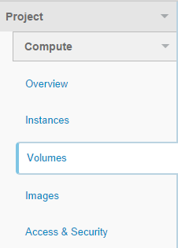
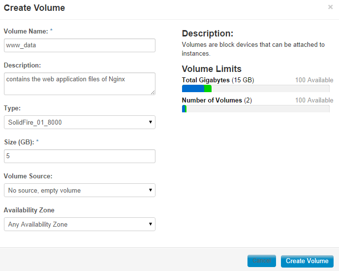
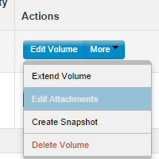
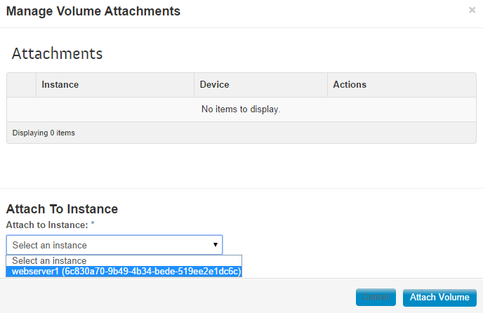
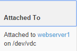

OpenStack - Creating and Attaching a Volume into an Instance
============================================================

In physical servers, whenever you need to add additional storage capacity in a server, what you usually do is physically put a faster and better hard drive in the the physical server itself, then you will setup some RAID configuration and etc to make sure the storage device is secure and provides data redundancy to prevent loss of data.

Gone are those days, because unlike attaching a physical hard disk, OpenStack allows you to create a virtual storage device (volumes) that you can attach in to your virtual machines (Instance).

Now let's get started on creating the first Volume.

In the OpenStack dashboard, click the Volumes menu under Project.

Click the "Create Volume" button on the top right side.
the dialog opens and asks for the volume information you want to create. Let's say we wanted to create a volume to store the files that are going to serve by Nginx.

Note: The type and Availability Zone parameters may vary depending on your Cloud Provider.

Once you had filled up the information, click the "Create Volume" button.
It should be now listed in the Volumes table.

> If you get an error when creating a Volume, try lowering the size

Now that you had a Volume created, how do you actually use this to a VM instance to create files?

First, you need to have a working Instance and you should be able to connect to it via SSH. If you haven't configured a VM instance yet, please read my article about [How to SSH to the VM instance in OpenStack](http://www.darwinbiler.com/how-to-ssh-to-the-vm-instance-in-openstack/ "How to SSH to the VM instance in OpenStack").

To attach the Volume into an instance, click the More dropdown button in the Actions column of your Volume:

Click "Edit Attachments", you will see a dialog like this

In my example, I have a Debian instance called "webserver1", so I just selected it and hit the "Attach Volume" button.

You will see now in the "Attached To" column that the volume is attached into "webserver1" instance, in a device called "/dev/vdc1"

Now let's login to webserver1 instance as root.

To verify if the volume was attached properly, execute:

    fdisk -l

Somewhere on the output, you should see some message like this:

    Disk /dev/vdc: 10.7 GB, 10737418240 bytes
    16 heads, 63 sectors/track, 20805 cylinders, total 20971520 sectors
    Units = sectors of 1 * 512 = 512 bytes
    Sector size (logical/physical): 512 bytes / 512 bytes
    I/O size (minimum/optimal): 512 bytes / 512 bytes
    Disk identifier: 0x00000000

    Disk /dev/vdc doesn't contain a valid partition table

If you didn't see the /dev/vdc getting detected, try rebooting the instance and check it again.

Now that the Volume is detected by the instance, you need to format it in able for you to use it.

> **Copy-Paste habit Warning!** /dev/vdc is just an example in here and it could vary, please replace it with proper name of the device in your case, to prevent accidentally formatting your other volumes!

To format your device, execute

    fdisk /dev/vdc

it will output something like this:

    root@webserver1:~# fdisk /dev/vdc
    Device contains neither a valid DOS partition table, nor Sun, SGI or OSF disklabel
    Building a new DOS disklabel with disk identifier 0x7fd6e1b3.
    Changes will remain in memory only, until you decide to write them.
    After that, of course, the previous content won't be recoverable.

    Warning: invalid flag 0x0000 of partition table 4 will be corrected by w(rite)

    Command (m for help):

* Press n to create a new disk partition.
* Press p to create a primary disk partition.
* Press 1 to denote it as 1st disk partition.
* Press ENTER twice to accept the default of 1st and last cylinder – to convert the remainder of hard disk to a single disk partition

it should now look like this:

    root@webserver1:~# fdisk /dev/vdc
    Device contains neither a valid DOS partition table, nor Sun, SGI or OSF disklabel
    Building a new DOS disklabel with disk identifier 0x7fd6e1b3.
    Changes will remain in memory only, until you decide to write them.
    After that, of course, the previous content won't be recoverable.

    Warning: invalid flag 0x0000 of partition table 4 will be corrected by w(rite)

    Command (m for help): n
    Partition type:
       p   primary (0 primary, 0 extended, 4 free)
       e   extended
    Select (default p): p
    Partition number (1-4, default 1): 1
    First sector (2048-20971519, default 2048):
    Using default value 2048
    Last sector, +sectors or +size{K,M,G} (2048-20971519, default 20971519):
    Using default value 20971519

    Command (m for help):

Now, the next thing to do is enter these commands:

* Press t, then select the new partition you made.
* Press 83 change your new partition to 83, i.e. Linux partition type.

It will take you back to this prompt:

    Command (m for help): t
    Selected partition 1
    Hex code (type L to list codes): 83
    Command (m for help):

Enter these commands:

* Press p to display the hard disk partition setup. Please take note that the first partition is denoted as /dev/vdc1 in your instance.
* 
* Press w to write the partition table and exit fdisk upon completion.

  It should look like this:

      Command (m for help): p

    Disk /dev/vdc: 10.7 GB, 10737418240 bytes
    16 heads, 63 sectors/track, 20805 cylinders, total 20971520 sectors
    Units = sectors of 1 * 512 = 512 bytes
    Sector size (logical/physical): 512 bytes / 512 bytes
    I/O size (minimum/optimal): 512 bytes / 512 bytes
    Disk identifier: 0x7fd6e1b3

       Device Boot      Start         End      Blocks   Id  System
    /dev/vdc1            2048    20971519    10484736   83  Linux

    Command (m for help): w
    The partition table has been altered!

    Calling ioctl() to re-read partition table.
    Syncing disks.

  Logout in the SSH and reboot the instance by going to Projects \> Instances, select the checkbox next to your instance and click the "Soft Reboot Instances".

  Now, login to SSH again as root. Check if the system had mounted the filesystem by executing this command:

      mount

  if you see some sort of "/dev/vdc on" etc in the output, unmount it by 

      umount -l /dev/vdc

  Now, create the filesystem in the /dev/vdc1 partition by

       mkfs.ext4 /dev/vdc1

  it should output something like

      root@webserver1:~# mkfs.ext4 /dev/vdc1
    mke2fs 1.42.5 (29-Jul-2012)
    Filesystem label=
    OS type: Linux
    Block size=4096 (log=2)
    Fragment size=4096 (log=2)
    Stride=0 blocks, Stripe width=0 blocks
    655360 inodes, 2621184 blocks
    131059 blocks (5.00%) reserved for the super user
    First data block=0
    Maximum filesystem blocks=2684354560
    80 block groups
    32768 blocks per group, 32768 fragments per group
    8192 inodes per group
    Superblock backups stored on blocks:
            32768, 98304, 163840, 229376, 294912, 819200, 884736, 1605632

    Allocating group tables: done
    Writing inode tables: done
    Creating journal (32768 blocks): done
    Writing superblocks and filesystem accounting information: done

  Next is, you need to mount the volume to a directory. 

  Check the UUID of the volume by executing:

      blkid

  it should multiple lines of output something like 

  /dev/vdc1: UUID="46218071-3b2f-4d9d-8eb3-61e313fa1325" TYPE="ext4"

  the line with /dev/vdc1 is what we are interested with.

  in this example, the 46218071-3b2f-4d9d-8eb3-61e313fa1325 is the UUID.

  Now lets, say I want to mount the Volume in /data/www folder
so that scripts and users can store/retrieve data in that path, i will need to create first that folder.

      mkdir /data
    mkdir /data/www

  Mount the volume to that directory using the volume UUID and the directory you just created

      mount /dev/disk/by-uuid/46218071-3b2f-4d9d-8eb3-61e313fa1325 /data/www

  If you want your volume mount to persist after a reboot then you'll need to edit your fstab file to add the mount command:

  edit the fstab file by

      nano /etc/fstab

  Add the following line to the bottom of the file:

  /dev/disk/by-uuid/46218071-3b2f-4d9d-8eb3-61e313fa1325 /data/www auto defaults,nofail 0 3

  Save the file and Exit.

  Verify if the Volume was attached properly by executing:

      df -h

  you should see some sort of 

      Filesystem                                              Size  Used Avail Use% Mounted on
    --------------- other lines in here ---------------
    /dev/vdc1                                               9.9G  151M  9.2G   2% /data/www

  if you see that, Congratulations! you had now attached a Volume in an instance!

  You can now start saving and storing data in the /data/www folder, and whatever you store there will be stored in the Volume you just had created.

  the main benefit of this is, even if your instance config gets messed up or something. You can just re-built a new instance and re-attach the volume.

---

### Did you find this useful?

I'm always happy to help! You can show your support and appreciation by[Buying me a coffee](https://www.buymeacoffee.com/kt7vrlS6F) (I love coffee!).

* [← Previous Post](safari-reader://www.darwinbiler.com/copying-files-between-2-linux-servers-without-downloading-it-first-in-your-pc/)
* [Next Post →](safari-reader://www.darwinbiler.com/how-does-the-replace-property-work-in-composer/)