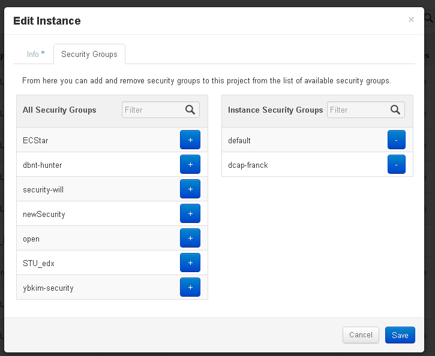

> It's possible to change the security groups on the fly using Horizon, if you're using the latest release Grizzly. Click on the "More" button for the instance you want to update and you should see an "Edit Security Groups" option.
> 
> In the CLI, use nova help [add-secgroup](http://docs.openstack.org/user-guide/content/novaclient_commands.html)
> 
> The code for this was added a year ago so I believe this should be available in Folsom.
> 
> Now you can:
> 
> In the Horizon web interface provided that you have a pretty recent version of Horizon, i.e. \>= Grizzly: [Change security group](https://ask.openstack.org/en/question/2295/change-security-group/):
> 
> > It's possible to change the security groups on the fly using Horizon, if you're using the latest release Grizzly. Click on the "More" button for the instance you want to update and you should see an "Edit Security Groups" option.
> > 
> > In the CLI, use nova help [add-secgroup](http://docs.openstack.org/user-guide/content/novaclient_commands.html)
> > 
> > The code for this was added a year ago so I believe this should be available in Folsom.
> 
> 
> 
> Create a new security group called new.
> 
> Get the id of your image (`<image-id>`)
> 
> ```
> select id from security_groups where name = 'new' ;
> update security_group_instance_association set security_group_id=<security-group-id> where instance_id=<image-id> ;
> 
> ```
> 
> [Share](https://serverfault.com/a/486761 "Short permalink to this answer")
> 
> [Improve this answer](https://serverfault.com/posts/486761/edit)
> 
> Follow