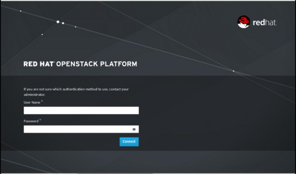
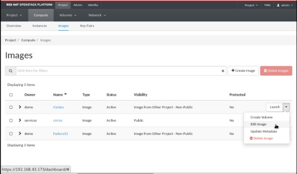

There are two ways to delete an image. Let's discuss one by one

* From CLI

    $ openstack image delete <image>

* From Web UI

 Deletion of images is permanent and cannot be reversed. Only users with the appropriate permissions can delete images.

* Log in to the dashboard.

* Select the appropriate project from the drop down menu at the top left.
* On the Project tab, open the Compute tab and click Images category.
* Select the images that you want to delete.
* Click Delete Images.

* In the Confirm Delete Images dialog box, click Delete Images to confirm the deletion.

Hope this will help you.