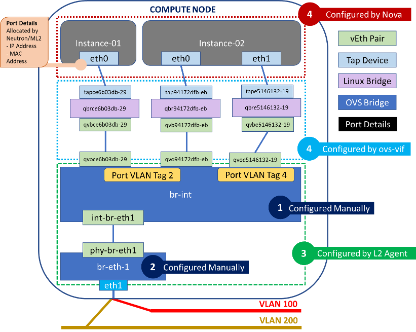
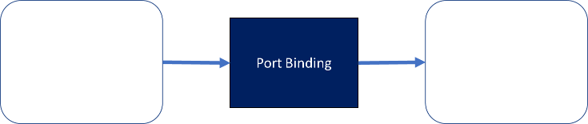

Openstack Neutron: L2 Networking In Depth
=========================================

<https://www.techblog.moebius.space/posts/2018-02-17-openstack-neutron-understanding-l2-networking-and-port-binding/>

----------------------------------------------------------------------------------------------------------------------

Table of Contents
-----------------

* [1\. Openstack Networks](https://www.techblog.moebius.space/posts/2018-02-17-openstack-neutron-understanding-l2-networking-and-port-binding/#1-openstack-networks)
  * [1.1 A Brief History](https://www.techblog.moebius.space/posts/2018-02-17-openstack-neutron-understanding-l2-networking-and-port-binding/#1-1-a-brief-history)
  * [1.2 Types of Networks](https://www.techblog.moebius.space/posts/2018-02-17-openstack-neutron-understanding-l2-networking-and-port-binding/#1-2-types-of-networks)
* [2\. L2 Networking and the ML2 Plugin](https://www.techblog.moebius.space/posts/2018-02-17-openstack-neutron-understanding-l2-networking-and-port-binding/#2-l2-networking-and-the-ml2-plugin)
  * [2.1 ML2 Configuration](https://www.techblog.moebius.space/posts/2018-02-17-openstack-neutron-understanding-l2-networking-and-port-binding/#2-1-ml2-configuration)
  * [2.2 L2 Networking on the Compute Node](https://www.techblog.moebius.space/posts/2018-02-17-openstack-neutron-understanding-l2-networking-and-port-binding/#2-2-l2-networking-on-the-compute-node)
  * [2.3 Neutron L2 Agent (Using OVS)](https://www.techblog.moebius.space/posts/2018-02-17-openstack-neutron-understanding-l2-networking-and-port-binding/#2-3-neutron-l2-agent-using-ovs)
    * [2.3.1 Open vSwitch Flows](https://www.techblog.moebius.space/posts/2018-02-17-openstack-neutron-understanding-l2-networking-and-port-binding/#2-3-1-open-vswitch-flows)
    * [2.3.2 L2 Agent Startup Actions](https://www.techblog.moebius.space/posts/2018-02-17-openstack-neutron-understanding-l2-networking-and-port-binding/#2-3-2-l2-agent-startup-actions)
  * [3\. Port Binding](https://www.techblog.moebius.space/posts/2018-02-17-openstack-neutron-understanding-l2-networking-and-port-binding/#3-port-binding)
    * [3.1 What Actually Happens When you Create an Instance?](https://www.techblog.moebius.space/posts/2018-02-17-openstack-neutron-understanding-l2-networking-and-port-binding/#3-1-what-actually-happens-when-you-create-an-instance)
  * [4\. VIF Plugging: Connecting an instance to the network](https://www.techblog.moebius.space/posts/2018-02-17-openstack-neutron-understanding-l2-networking-and-port-binding/#4-vif-plugging-connecting-an-instance-to-the-network)
    * [4.1 VIF Plugging Using Libvirt](https://www.techblog.moebius.space/posts/2018-02-17-openstack-neutron-understanding-l2-networking-and-port-binding/#4-1-vif-plugging-using-libvirt)
    * [4.2 What is`os-vif`?](https://www.techblog.moebius.space/posts/2018-02-17-openstack-neutron-understanding-l2-networking-and-port-binding/#4-2-what-is-os-vif)
  * [5\. Security Groups and Firewalls](https://www.techblog.moebius.space/posts/2018-02-17-openstack-neutron-understanding-l2-networking-and-port-binding/#5-security-groups-and-firewalls)

Openstack networking is often a wondrous, complex and perplexing beast to the uninitiated. This post is my attempt to dissect a portion of the Openstack networking stack to figure out how it works. There will be a bit of history, code, and theory - something for everyone.

When you start to explore Openstack, you quickly realise that it is extremely flexible in the range of technologies and vendor specific physical equipment it supports - especially when it comes to networking.

For networking, this is owed in large part to the introduction of the ML2 plugin from Havana (Openstack Platform Version 8) onwards. Because of this, there are many different configuration options for deploying neutron. This post will only cover a very specific type of deployment.

I will be using the `vlan` and `flat` type drivers and the `Open vSwitch` mechanism driver (if you don’t know what these are - don’t worry too much, but just be aware that there are other ways that L2 networking can work that are not covered here).

**Please note**: This post arose out of a learning exercise, so if you notice any missing or incorrect details, please feel free to call it out. You can contact me at [moebius@moebius.space.com](mailto:moebius@moebius.space)

1\. Openstack Networks
======================

1.1 A Brief History
-------------------

When Openstack first started out (Austin), the networking functionality was bundled into the compute service (nova). This obviously presented a problem, as compute and networking services could not be updated independently. In the 2012 release (Folsom), Quantum was created as a separate networking service. The name was changed to Neutron in a future release.

Due to this legacy, nova still retains some functionality to build networks - in a subservice called nova-network. This has been deprecated for many versions now, and is not reccomended for use, and the code and documentation is littered with requests imploring users and developers to remove and no longer use the functionality. As of Pike though, this could still technically be used at your own risk via the `use_neutron=false` option in nova.conf.

For more detailed historical context and a great intro to Neutron, I would recommend watching this excellent and accurately titled video: [Neutron Networking - Demystified for Beginners](https://www.openstack.org/videos/sydney-2017/neutron-networking-demystified-for-beginners)

1.2 Types of Networks
---------------------

Before we talk about L2 networking, it pays to have a bit of [background knowledge](https://access.redhat.com/documentation/en-us/red_hat_openstack_platform/9/html/networking_guide/openstack_networking_concepts) about Openstack Networking in general. Openstack provides the ability to create two different types of networks:

> **Tenant networks** are created by users for connectivity within projects. They are fully isolated by default and are not shared with other projects.
> 
> **Provider networks** are created by the OpenStack administrator and map directly to an existing physical network in the data center. Openstack uses a number of networking services to enable instances within the tenant network to communicate between each other, and between tenant networks. Very generally speaking, the L2 agent is primarily responsible for ensuring that new instances can communicate within the same project/tenant, and enforcing security group rules.

2\. L2 Networking and the ML2 Plugin
====================================

L2 networking in Openstack is managed by the neutron L2 agent. L2 networking can be customised and configured in a number of different ways if used with the ml2 plugin. [The Openstack documentation](https://docs.openstack.org/newton/networking-guide/config-ml2.html) says:

> The Modular Layer 2 (ML2) neutron plug-in is a framework allowing OpenStack Networking to simultaneously use the variety of layer 2 networking technologies found in complex real-world data centers

Before the ML2 Plugin, each type of network device needed to have it’s own plugin to be able to be used with neutron server. This meant that it was not possible to simultaneously support multiple devices. ML2 as its name suggests, made L2 networking more modular and reusable. It also reduced the effort required to create a new plugin or support a new device.

It uses a “single plugin/multiple driver” architecture model, which makes network types and network devices pluggable using drivers. - to plugin a driver, ml2 provides an api - vendors can use these APIs to develop their own drivers.

There are two types of drivers:

* **Type Driver**: which tells it what type of L2 technology to use when implementing the networking. For example, there is an option of using VLANs, VXLAN, or GRE Tunneling.
* **Mechanism Driver**: which specifies what driver to use to implement the technology. You can use the default Open vSwitch driver (which is what we will cover).

2.1 ML2 Configuration
---------------------

These options can be specified in the [ml2] section of the ml2 config file as shown below:

```
[admin@controller ~]$ sudo cat /etc/neutron/plugins/ml2/ml2_conf.ini
[ml2]
\# (ListOpt) List of network type driver entrypoints to be loaded from
\# the neutron.ml2.type\_drivers namespace.
\#
type_drivers = local,flat,vlan,gre,vxlan
\# Example: type\_drivers = flat,vlan,gre,vxlan
\# (ListOpt) Ordered list of network\_types to allocate as tenant
\# networks. The default value 'local' is useful for single-box testing
\# but provides no connectivity between hosts.
\#
tenant_network_types = vlan
\# Example: tenant\_network\_types = vlan,gre,vxlan
\# (ListOpt) Ordered list of networking mechanism driver entrypoints
\# to be loaded from the neutron.ml2.mechanism\_drivers namespace.
\#mechanism\_drivers = openvswitch,linuxbridge,l2population
mechanism_drivers = openvswitch,cisco_apic
\# Example: mechanism drivers = openvswitch,mlnx
\# Example: mechanism\_drivers = arista
\# Example: mechanism\_drivers = cisco,logger
\# Example: mechanism\_drivers = openvswitch,brocade
\# Example: mechanism\_drivers = linuxbridge,brocade

```

The config shows that:

* We will be using the Open vSwitch mechanism driver, as well as the Cisco ACI plugin to configure L2 networking via the `mechanism_drivers` option.
* A number of type drivers have also been specified, which means they are all available to be implemented using the `type drivers` option.
* The config also specifies that the `vlan` type will be used when creating tenant networks with the `tenant_network_types` option.

While we are taking a peek at the ml2 plugin config, there are a few other important options to specify,

* **physical network**: A “physical network” is essentially a piece of metadata associated with an openstack network (tenant or provider) which allows it to interact with an actual physical network.You can create any number of physical networks by specifying the metadata when creating an openstack network:

```
neutron net-create external-net \
--provider:network_type flat \
--provider:physical_network physnet1 \
--router:external=True \
--shared

```

  The physical network name(s) which can be used by the `vlan` and `flat` types can be restricted, but in the example below it has been set to unrestricted using `flat_networks = *`
* **network\_vlan\_ranges**: with the `vlan` type driver, you can specify the range of vlan id’s to use for each private network to isolate network traffic. In our case, this will be used when creating our tenant networks. You can also specify the physical network name(s) that the vlan type can use.
* **bridge\_mappings**: this maps an openvswitch bridge to a physical network name, meaning this bridge will be used to switch all traffic from networks using that physical network.

Pay attention to the bridge name in this option (br-eth1), as we will encounter it later.

an example config is shown below:

```
[ml2_type_flat]
\# (ListOpt) List of physical\_network names with which flat networks
\# can be created. Use \* to allow flat networks with arbitrary
\# physical\_network names.
\#
flat_networks = *
\# Example:flat\_networks = physnet1,physnet2
\# Example:flat\_networks = \*
[ml2_type_vlan]
\# (ListOpt) List of \<physical\_network\>[:\<vlan\_min\>:\<vlan\_max\>] tuples
\# specifying physical\_network names usable for VLAN provider and
\# tenant networks, as well as ranges of VLAN tags on each
\# physical\_network available for allocation as tenant networks.
\#
network_vlan_ranges = physnet1:3000:3499
\# Example: network\_vlan\_ranges = physnet1:1000:2999,physnet2
[ovs]
\# this tells Openstack
\# \# \* to use the openvswitch bridge br-eth1
\# \# \* that br-eth1 is mapped the internal name "physnet1" - the allowed vlan range is taken from the section ml2\_type\_vlan
bridge_mappings = physnet1:br-eth1
\# \#
\# \# "physnet1" is referenced by the neutron command line, when creating neutron provider networks
\# \# or the tenant network type is vlan

```

2.2 L2 Networking on the Compute Node
-------------------------------------

To understand how neutron and nova work together to enable networking, we need to zoom in on how the compute node is set up.

The diagram below is my blatant modification of this [excellent diagram](https://docs.openstack.org/neutron/pike/contributor/internals/openvswitch_agent.html), which aims to show the different networking components on the compute node and which service is responsible for configuring them.



This particular type of setup is also known as an OVS Hybrid Setup, and we will see how and why the ml2 plugin chooses this in the Port Binding section.

We can also confirm the bridges and interfaces in this setup, which should line up with the diagram above:

```
\# Show bridges and ports (interfaces) associated with them
[admin@compute-node ~]$ sudo ovs-vsctl show
a746802c-0dbd-4ef2-9568-2486fe43cff1
    Bridge br-int
        fail_mode: secure
        Port "qvoce6b03db-29"
            tag: 2
            Interface "qvoce6b03db-29"
        Port "qvo94172dfb-eb"
            tag: 2
            Interface "qvo94172dfb-eb"
        Port "qvoe5146132-19"
            tag: 4
            Interface "qvoe5146132-19"
        Port "qvo641486fa-c9"
            tag: 2
            Interface "qvo641486fa-c9"
        Port "qvoe4c5b932-d6"
            tag: 2
            Interface "qvoe4c5b932-d6"
        Port "qvo7da6ac84-13"
            tag: 4095
            Interface "qvo7da6ac84-13"
        Port br-int
            Interface br-int
                type: internal
        Port "qvobf30c4ab-40"
            tag: 2
            Interface "qvobf30c4ab-40"
        Port "int-br-eth1"
            Interface "int-br-eth1"
                type: patch
                options: {peer="phy-br-eth1"}
    Bridge "br-eth1"
        Port "bond0"
            Interface "bond0"
        Port "br-eth1"
            Interface "br-eth1"
                type: internal
        Port "phy-br-eth1"
            Interface "phy-br-eth1"
                type: patch
                options: {peer="int-br-eth1"}
    ovs_version: "2.1.3"

\# Show all the software bridges (including tap devices)
[admin@compute-node ~]$ sudo brctl show
bridge name     bridge id               STP enabled     interfaces
qbr641486fa-c9          8000.42374194f881       no              qvb641486fa-c9
                                                        tap641486fa-c9
qbr7da6ac84-13          8000.f28a05774bb1       no              qvb7da6ac84-13
qbr94172dfb-eb          8000.4a2c809c6235       no              qvb94172dfb-eb
                                                        tap94172dfb-eb
qbrbf30c4ab-40          8000.e6c5eb808651       no              qvbbf30c4ab-40
                                                        tapbf30c4ab-40
qbrce6b03db-29          8000.6a6807dc6a7e       no              qvbce6b03db-29
                                                        tapce6b03db-29
qbre4c5b932-d6          8000.d241ad987315       no              qvbe4c5b932-d6
                                                        tape4c5b932-d6
qbre5146132-19          8000.be169e779e99       no              qvbe5146132-19

```

2.3 Neutron L2 Agent (Using OVS)
--------------------------------

Now that we know how networking components on the compute node are setup, we can start to look at how these are setup. In the diagram above we have segregated the networking components that are created and setup by different actors in different colors.

We can see that there are 3 (some may argue 2 since ovs-vif is really called by Nova) actors: `Nova`, `Neutron L2 Agent` and `ovs-vif`, which is an integration library between the two.

Additionally we see that there are two bridges which are setup by the “Administrator” or whomever is configuring the compute node. Note that this is optional, and the L2 agent will create them if they are not present.

If the administrator chooses to manually set up the integration and vlan (br-eth-1) bridge (1 and 2 in the diagram above), this can be done using using Open vSwitch:

```
\#\# 1\. Ensure that Open vSwitch is installed
\#\#\# Check doco for your distro: http://docs.openvswitch.org/en/latest/intro/install/
sudo yum install openvswitch
\#\# 2\. Ensure OpenvSwitch is running
sudo systemctl start openvswitch
\#\# 3\. Create br-int (integration bridge)
sudo ovs-vsctl add-br br-int
\#\# 4\. Create the vlan bridge
sudo ovs-vsctl add-br br-eth1
\# Add the physical nic (port) to the bridge
sudo ovs-vsctl add-port br-eth1 eth1

```

Now let’s look at how the Neutron L2 Agent sets up and creates the networking components it is responsible for.

### 2.3.1 Open vSwitch Flows

Before we delve into how the L2 Agent works, remember that we will be concentrating on the Open vSwitch (ovs) mechanism driver for the ml2 plugin. There will be other agents which function in wildly different ways when used with different drivers, but we will be focusing on ovs.

Because of this, it makes sense to understand what ovs is and what ovs flows are. According to it’s website:

> Open vSwitch is a production quality, multilayer virtual switch licensed under the open source Apache 2.0 license. [source](http://www.openvswitch.org/)

You can read this [excellent post](https://assafmuller.com/2013/10/13/open-vswitch-basics/) on OpenvSwitch basics, but i’ll condense the main points here:

* An Open vSwitch bridge can operate in two modes - `normal` and `flow`.
* In `normal` mode, the device operates like a regular L2 switch, which maintains a mac address table to switch frames. When the device receives incoming frames, it checks if the source mac is in the table. If it is not, it is associated with the incoming port and added to the table.

This is a process called `mac learning` - a feature enabled on most physical switches. The device then consults the destination mac address - if it is in the mac address table it forwards the frame, if not - it is dropped.

* In `flow` mode, a flow table is used instead of a mac address table. A flow is an entry in a flow table defined by two parts - match and action. The match defines what part of a frame, packet or segment to match on, and the action determines what to do with the packet - which generally turns out to be drop or forward.
* You can also mix and match the two types. For example you can define a flow which matches on a specific frame, and then performs a `normal` action. Which means it will consult a mac address table to forward the packet from then on. This is the type of table constructed the by the L2 agent - which means the bridge essentially maintains a separate mac address table for each flow.

Now that you (hopefully) know what a flow is, let’s get back to the L2 agent.

### 2.3.2 L2 Agent Startup Actions

When the OVS L2 Agent is started, it performs a number of actions.

* It checks if the configured integration and physical bridges are present. If this has not been done manually by the administrators, the agent creates them. This can be seen in the agent constructor:

```
def \_\_init\_\_(self, bridge\_classes, ext\_manager, conf=None):
...
self.setup_integration_br()
...
def setup\_integration\_br(self):
\# Ensure the integration bridge is created.
\# ovs\_lib.OVSBridge.create() will run
\# ovs-vsctl -- --may-exist add-br BRIDGE\_NAME
\# which does nothing if bridge already exists.
self.int_br.create()
self.int_br.set_secure_mode()

```

[source](https://github.com/openstack/neutron/blob/d7b5699b675c26b4b52698b698236a80d94e9503/neutron/plugins/ml2/drivers/openvswitch/agent/ovs_neutron_agent.py)

* The agent detects the vlan bridge (`br-eth-1`) and integration bridge (`br-int`), and configures the vEth pair (`int-br-eth-1` and `phy-br-eth-1`) between them.

> A vEth device is a linux networking concept, which are always created in pairs. It is a virtual device which acts like a patch cable - essentially anything which is sent to on component comes out of the other. Each component of the pair may be attached to different virtual devices, which makes it ideal for connecting disparate network components such as virtual bridges and switches.

* It detects any new vif’s (virtual interfaces) plugged into the integration bridge, and queries neutron API to determine port details associated with the vif. In our example above it would detect the vEth pair(s) (`qvbce6b03db-29`, `qvoce6b03db-29`), (`qvb94172dfb-eb`, `qvo94172dfb-eb`) and (`qvbe5146132-19`,`qvoe5146132-19`)
* The Neutron API returns the port details associated with each vif, vif (vEth pair) recorded in the database. If the port is not associated with any network or instance, nothing is done.

  * If the port is associated with a new network - then the L2 agent picks a new vlan id. This vlan id is used to configure a new flow entry in both the integration and vlan bridge.
  * If the port is associated with an existing network - a new flow entry is added by the L2 agent using the existing vlan id associated to the network returned by Neutron.
* The agent also sets up flow entries on `br-eth-1` based on all the tenant networks that are present on this compute node. Each instance will have a separate entry in the flow table and will be tagged and untagged with a vlan id associated to the tenant network they belong to. Instances belonging to multiple networks will have multiple flow entries. The flow table for a bridge can be examined as follows:

```
[admin@compute-node ~]$ sudo ovs-ofctl dump-flows br-eth1 | cut -d',' -f7-
NXST_FLOW reply (xid=0x4):
priority=4,in_port=3,dl_vlan=2 actions=mod_vlan_vid:3029,NORMAL
priority=2,in_port=3 actions=drop
priority=1 actions=NORMAL

```
* When an incoming frame is received by the bridge, the flow table is consulted, from the first entry to the last in that order. The order of the entries is determined by their priority. If a match is found, then the action is taken and the next entries will not be consulted. If no match is found then the packet is dropped.

In the example above, we are looking at flows configured by the L2 agent on the integration bridge. This is responsible for converting internal vlan id’s to external vlan id’s. We can see that:

* The highest priority entry matches on frames with a vlan id of 2 (the internal vlan id associated to a tenant network) received on port 3.
* The action on these frames is to modify the vlan id to the external vlan id associated to a tenant network. This is the vlan id configured on the physical network and selected for each tenant network from the `network_vlan_ranges` option specified in the ml2 config. This may either be done manually or by a network appliance such as Cisco ACI (which has its own ml2 plugin).
* The agent also configures the reverse flow(s) on the integration bridge (br-int), to convert the physical vlan id’s to the internal tenant network vlan id’s.

```
[admin@compute-node ~]$ sudo ovs-ofctl dump-flows br-int | cut -d',' -f7-
NXST_FLOW reply (xid=0x4)
priority=3,in_port=2,dl_vlan=3029 actions=mod_vlan_vid:2,NORMAL
priority=2,in_port=2 actions=drop
priority=1 actions=NORMAL
priority=0 actions=drop

```

3\. Port Binding
----------------

Once you have setup the compute node, you are now ready to deploy instances onto it! You can do this via the Horizon dashboard, or with a single CLI command:

```
nova boot \
  --image test-image \
  --flavor test-flavor \
  --availability-zone nova:compute-host-01 \
  --nic net-id=test-network \
  --security-groups default,ssh-local \
  --poll

```

This looks simple enough, but there’s actually a lot of going on in the background when you create an instance - including networking.

For example, booting an instance triggers the creation of a port (if an existing one was not specified in `nova boot`). A port in Openstack is a networking abstraction, which the doco describes as:

> … a connection point for attaching a single device, such as the NIC of a server, to a network. The port also describes the associated network configuration, such as the MAC and IP addresses to be used on that port.

Neutron is in charge of creating the port - and also a process known as Port Binding. This is where the ml2 plugin selects the mechanism driver and network segment to be utilised for a specific neutron port. This must succeed in order for the port to provide network connectivity - and the outcome notifies Nova on how to connect the instance to the network.

Let’s have a look at a port associated to an instance and see what details it possesses. The `vif_type` and `vif_details` are populated as a result of a successful port bind.

```
[admin@controller ~(rhel)]$ neutron port-show 0b91dbc5-223a-4232-b3e0-2c2bc77302e4
+-----------------------+-----------------------------------------------------------------------------------+
| Field                 | Value                                                                             |
+-----------------------+-----------------------------------------------------------------------------------+
| admin_state_up        | True                                                                              |
| allowed_address_pairs |                                                                                   |
| binding:host_id       | compute-node.mycorp.com                                                  |
| binding:profile       | {}                                                                                |
| binding:vif_details   | {"port\_filter": true, "ovs\_hybrid\_plug": true}                                    |
| binding:vif_type      | ovs                                                                               |
| binding:vnic_type     | normal                                                                            |
| device_id             | f211241d-06f6-44a3-88d5-094903600957                                              |
| device_owner          | compute:nova                                                                      |
| extra_dhcp_opts       |                                                                                   |
| fixed_ips             | {"subnet\_id": "e51784c4-3f2c-4b0f-8ccb-29a5b1c9eca7", "ip\_address": "10.1.3.116"} |
| id                    | 0b91dbc5-223a-4232-b3e0-2c2bc77302e4                                              |
| mac_address           | fa:16:3e:67:3a:5d                                                                 |
| name                  |                                                                                   |
| network_id            | 96eb472d-438b-4545-a7a7-00ffede4b08c                                              |
| security_groups       | d2ceabba-8fc4-4d56-9e84-52da01413959                                              |
|                       | d63c72e3-840a-4ea9-a4a7-3913f5ecc1e3                                              |
| status                | BUILD                                                                             |
| tenant_id             | 0ec689dd410c4b7780117e8601717e47                                                  |
+-----------------------+-----------------------------------------------------------------------------------+

```

The diagram below treats port binding as a black box, and shows the inputs and outputs to the process. I’ve stolen it from an excellent talk by the creator of the ml2 plugin titled [Understanding ML2 Port Binding](https://www.openstack.org/videos/video/understanding-ml2-port-binding):



### 3.1 What Actually Happens When you Create an Instance?

1. The very first thing that happens is that a call is made to the Nova API. Nova API then performs a number of steps which we will gloss over (such as authentication, scheduling, retrieving the image and flavor details) to skip to the networking.
2. The Nova Compute service then calls the Neutron API to pass on the request to allocate network resources. It sends the host id to bind to, as well as the requested networks the instance is to be connected to.

```
def \_allocate\_network\_async(self, context, instance, requested\_networks, macs, security\_groups, is\_vpn):
"""Method used to allocate networks in the background. Broken out for testing. """
...
        nwinfo = self.network_api.allocate_for_instance(
                context, instance, vpn=is_vpn,
                requested_networks=requested_networks,
                macs=macs,
                security_groups=security_groups,
                bind_host_id=bind_host_id)

```
3. When Neutron receives the request, it validates the requested parameters to determine if the requested configuration is feasible:

```
def allocate\_for\_instance(self, context, instance, vpn, requested\_networks, macs=None, security\_groups=None, bind\_host\_id=None):
    """Allocate network resources for the instance. """
...
    requested_ports_dict, ordered_networks = (
        self._validate_requested_port_ids(
            context, instance, neutron, requested_networks))
...
    nets = self._validate_requested_network_ids(
        context, instance, neutron, requested_networks, ordered_networks)
...
    \# Validate requested security groups
    security_groups = self._clean_security_groups(security_groups)
    security_group_ids = self._process_security_groups(
                                instance, neutron, security_groups)
...

```

  [source](https://github.com/openstack/nova/blob/master/nova/network/neutronv2/api.py)
4. If the requested parameters such as networks and security groups look good, Neutron creates the port:

```
    requests_and_created_ports = self._create_ports_for_instance(
        context, instance, ordered_networks, nets, neutron,
        security_group_ids)
...

def \_create\_ports\_for\_instance(self, context, instance, ordered\_networks, nets, neutron, security\_group\_ids):
    """Create port for network\_requests that don't have a port\_id """
...
            if not request.port_id:
                \# create minimal port, if port not already created by user
                created_port = self._create_port_minimal(
                        neutron, instance, request.network_id,
                        request.address, security_group_ids)
...
def \_create\_port\_minimal(self, port\_client, instance, network\_id, fixed\_ip=None, security\_group\_ids=None):
    """Attempts to create a port for the instance on the given network. """
...
        port_response = port_client.create_port(port_req_body)

```

  You can see that the request to create a port gets continually passed onto different methods until it is delegated to the `port_client`. This is in fact just the Neutron client, which delegates this responsibility to the ml2 plugin. [source](https://github.com/openstack/nova/blob/master/nova/network/neutronv2/api.py)
5. The ml2 plugin uses the mechanism driver configured in the ml2 configuration file to create the port:

```
 def create\_port(self, context, port):
     self._before_create_port(context, port)
     result, mech_context = self._create_port_db(context, port)
     return self._after_create_port(context, result, mech_context)

```
6. It then checks to see if the port needs to be bound - i.e if it has been associated to an instance in the request. This is because a port can be created without being associated to an instance - in which case it remains “unbound”. If it does need to be bound, port binding is attempted using the mechanism driver configured in the ml2 config.

```
 def \_after\_create\_port(self, context, result, mech\_context):
     \# notify any plugin that is interested in port create events
 ...
     try:
         bound_context = self._bind_port_if_needed(mech_context)
 ...
 def \_bind\_port\_if\_needed(self, context, allow\_notify=False, need\_notify=False):
 ...
         bind_context, need_notify, try_again = self._attempt_binding(
             context, need_notify)
 ...
 def \_attempt\_binding(self, context, need\_notify):
     try_again = False

     if self._should_bind_port(context):
         bind_context = self._bind_port(context)
...
def \_bind\_port(self, orig\_context):
...
     self._update_port_dict_binding(port, new_binding)
     new_context = driver_context.PortContext(
         self, orig_context._plugin_context, port,
         orig_context.network.current, new_binding, None,
         original_port=orig_context.original)

     \# Attempt to bind the port and return the context with the
     \# result.
     self.mechanism_manager.bind_port(new_context)

```
7. The ml2 mechanism driver we have specified is Open vSwitch, so lets see how this works under the hood to perform port binding. Remember - port binding is just the process of selecting the network segment and driver by ml2.

```
class OpenvswitchMechanismDriver(mech\_agent.SimpleAgentMechanismDriverBase):
		   """Attach to networks using openvswitch L2 agent. The OpenvswitchMechanismDriver integrates the ml2 plugin with the openvswitch L2 agent. Port binding with this driver requires the openvswitch agent to be running on the port's host, and that agent to have connectivity to at least one segment of the port's network. """
		   ...
		   def \_\_init\_\_(self):
			   sg_enabled = securitygroups_rpc.is_firewall_enabled()
			   hybrid_plug_required = (not cfg.CONF.SECURITYGROUP.firewall_driver or
				 cfg.CONF.SECURITYGROUP.firewall_driver in (
				   IPTABLES_FW_DRIVER_FULL, 'iptables\_hybrid')) and sg_enabled
			   vif_details = {portbindings.CAP_PORT_FILTER: sg_enabled,
				 portbindings.OVS_HYBRID_PLUG: hybrid_plug_required}
		   ...
		   super(OpenvswitchMechanismDriver, self).__init__(
			 constants.AGENT_TYPE_OVS,
			 portbindings.VIF_TYPE_OVS,
			 vif_details, supported_vnic_types= [portbindings.VNIC_NORMAL,
			 portbindings.VNIC_DIRECT])

```

  [source](https://github.com/openstack/neutron/blob/d7b5699b675c26b4b52698b698236a80d94e9503/neutron/plugins/ml2/drivers/openvswitch/mech_driver/mech_openvswitch.py)

We can see from this, that Open vSwitch mech driver selects the OVS Hybrid option when:

* the `firewall_driver` option is specified in the ml2 config
* and, the `security_groups` option is enabled

We can also see that two of the port attributes are populated here: `vif_type` and `vif_details`. If we insert the portbindings constants with their values, it becomes more apparent:

```
        vif_details = {port_filter: sg_enabled,
                       ovs_hybrid_plug: hybrid_plug_required

```

And,

```
            portbindings.VIF\_TYPE\_OVS,

```

becomes `ovs`, based on the constant definitions [here](https://github.com/openstack/neutron-lib/blob/master/neutron_lib/api/definitions/portbindings.py).

This also now lines up with the port details we saw before when we issued `port-show`:

```
| binding:vif_details   | {"port\_filter": true, "ovs\_hybrid\_plug": true}                                    |
| binding:vif_type      | ovs  

```

With this, port binding is now complete, and if successful, should return a `vif_type` that is not `unbound` as shown above. The port details are then passed back up the chain to Nova to start provisioning the instance on the compute node.

If port binding had failed, you will receive the following annoying and highly unspecific error:

> PortBindingFailed: Binding failed for port fbe2d7c4-4465-4149-b235-23c213b245d0

Now that you know how the process works - you may find it easier to debug.

4\. VIF Plugging: Connecting an instance to the network
-------------------------------------------------------

Once nova receives the good news that port binding has succeeded, and retrieves the port details including `vif_type` and `vif_details`, it can try to plug the VM into the port, in a process known as vif (virtual interface) plugging, as shown below:

```
        net_info = instance.get_network_info()
        try:
            self.driver.plug_vifs(instance, net_info)

```

(source)[<https://github.com/openstack/nova/blob/9319a0adb037f3f1aea63e3b1ed7bf2f0ca1e214/nova/compute/manager.py>]

You can see that Nova essentially delegates responsibility for plugging to the virtualisation driver configured for Nova. In our case, the configured virtualisation driver is libvirt, so we will be investigating how it performs vif plugging.

### 4.1 VIF Plugging Using Libvirt

The libvirt driver receives the request to plug in from Nova Compute, and delegates the request to a vif driver.

```
     def plug\_vifs(self, instance, network\_info):
         """Plug VIFs into networks."""
         for vif in network_info:
             self.vif_driver.plug(instance, vif)

```

[source](https://github.com/openstack/nova/blob/master/nova/virt/libvirt/driver.py)

This `vif_driver` is specified earlier on in the driver code as:

```
self.vif_driver = libvirt_vif.LibvirtGenericVIFDriver()

```

The implementation of this class is compartmentalised into its own file called `vif.py`, which contains the plug method:

```
@profiler.trace\_cls("vif\_driver")
class LibvirtGenericVIFDriver(object):
    """Generic VIF driver for libvirt networking."""
...
    def plug(self, instance, vif):
        vif_type = vif['type']
...
        if vif_type is None:
            raise exception.VirtualInterfacePlugException(
                _("vif\_type parameter must be present "
                  "for this vif\_driver implementation"))

        \# Try os-vif codepath first
        vif_obj = os_vif_util.nova_to_osvif_vif(vif)
        if vif_obj is not None:
            self._plug_os_vif(instance, vif_obj)
            return

```

[source](https://github.com/openstack/nova/blob/master/nova/virt/libvirt/vif.py)

You should notice two things in the code above:

1. That network connectivity cannot be achieved without a valid `vif_type` - the result of portbinding.
2. The driver converts the nova `vif` object to an `osvif` object. This conversion uses a package called `os_vif_util`([source](https://github.com/openstack/nova/blob/cab83d9d64ea9d65ee2e18210bb1738186569ac2/nova/network/os_vif_util.py)) hosted in nova-network:

```
def nova\_to\_osvif\_vif(vif):
   """Convert a Nova VIF model to an os-vif object """
   funcname = "\_nova\_to\_osvif\_vif\_" + vif['type'].replace(".", "\_")
   func = getattr(sys.modules[__name__], funcname, None)

```

  This delegates responsibility to a function associated to the vif\_type. Since our `vif_type=ovs`, the following function will be called, and actions taken based on the specific network driver settings. We will only show the code relevant to us, but feel free to peruse the [full code](https://github.com/openstack/nova/blob/cab83d9d64ea9d65ee2e18210bb1738186569ac2/nova/network/os_vif_util.py) at your leisure:

```
\# VIF\_TYPE\_OVS = 'ovs'
def \_nova\_to\_osvif\_vif\_ovs(vif):
...
   elif _is_firewall_required(vif) or    vif.is_hybrid_plug_enabled():
       obj = _get_vif_instance(
           vif,
           objects.vif.VIFBridge,
           port_profile=profile,
           plugin="ovs",
           vif_name=_get_vif_name(vif),
           bridge_name=_get_hybrid_bridge_name(vif))

```

  We can see that if the firewall is required and the `vif_details` show that an `ovs_hybrid_plug` is required, then the ovs-vif type `objects.vif.VIFBridge` will be used.
3. Vif plugging is delegated to a new package called os\_vif, to which the converted vif object is provided.

### 4.2 What is `os-vif`?

os-vif is a separate Openstack code repository, which according to the [documentation](https://docs.openstack.org/os-vif/latest/):

> is a library for plugging and unplugging virtual interfaces (VIFs) in OpenStack. It provides:
> 
> * Versioned objects that represent various types of virtual interfaces and their components
> * Base VIF plugin class that supplies a **plug()** and **unplug()** interface
> * Plugins for two networking backends - Open vSwitch and Linux Bridge

It was created in order to reduce the dependency between neutron ml2 drivers and implementations of vif plugging to support them. os-vif creates an interface between the two which can be bridged by writing a plugin. These plugins are present for both linux bridge and ovs within ovs-vif.

Let’s see how ovs-vif handles the `plug()` method for the `objects.vif.VIFBridge` type (selected by `ovs_vif_util` previously):

```
    def plug(self, vif, instance\_info):
...
        elif isinstance(vif, objects.vif.VIFBridge):
            if sys.platform != constants.PLATFORM_WIN32:
                self._plug_bridge(vif, instance_info)

```

[source](https://github.com/openstack/os-vif/blob/84688a22db22039f5566c1439c3983db23672a45/vif_plug_ovs/ovs.py)

The `_plug_bridge` method which is subsequently called is shown below:

```
    def \_plug\_bridge(self, vif, instance\_info):
        """Plug using hybrid strategy Create a per-VIF linux bridge, then link that bridge to the OVS integration bridge via a veth device, setting up the other end of the veth device just like a normal OVS port. Then boot the VIF on the linux bridge using standard libvirt mechanisms. """

        v1_name, v2_name = self.get_veth_pair_names(vif)

        linux_net.ensure_bridge(vif.bridge_name)

        mtu = self._get_mtu(vif)
        if not linux_net.device_exists(v2_name):
            linux_net.create_veth_pair(v1_name, v2_name, mtu)
            linux_net.add_bridge_port(vif.bridge_name, v1_name)
            linux_net.ensure_ovs_bridge(vif.network.bridge,
                                        self._get_vif_datapath_type(vif))
            self._create_vif_port(vif, v2_name, instance_info)
        else:
            linux_net.update_veth_pair(v1_name, v2_name, mtu)
            self._update_vif_port(vif, v2_name)

```

[source](https://github.com/openstack/os-vif/blob/84688a22db22039f5566c1439c3983db23672a45/vif_plug_ovs/ovs.py)

We finally arrive at the code which completes our picture in 2.2, with the networking components being provisioned by os-vif:

* A linux bridge per network vif per instance
* A veth pair connecting the integration bridge to the linux bridge
* A tap device connecting the instance to the linux bridge.

5\. Security Groups and Firewalls
---------------------------------

We saw through our code travels, both the port binding and vif plugging chose the OVS Hybrid strategy when firewalls and security groups were enabled. Historically, only iptables could be used to control and limit traffic, and it could not be deployed on the ovs switch.

This is why a separate bridge which hosts a veth pair and a tap device were setup. The tap device was setup per network/instance combination in order to configure iptables rules to filter traffic to specific instances through a network.

If you’re using ovs, you can configure the firewall driver to use in the ovs\_neutron\_plugin.ini conf file:

```
[admin@controller ~]$ cat /etc/neutron/plugins/openvswitch/ovs_neutron_plugin.ini
[securitygroup]
\# Firewall driver for realizing neutron security group function.
\# firewall\_driver = neutron.agent.firewall.NoopFirewallDriver
\# Example: firewall\_driver = neutron.agent.linux.iptables\_firewall.OVSHybridIptablesFirewallDriver
firewall_driver = neutron.agent.linux.iptables_firewall.OVSHybridIptablesFirewallDriver

\# Controls if neutron security group is enabled or not.
\# It should be false when you use nova security group.
enable_security_group = True

```

This is a relatively old way of doing things, and the OVS Hybrid Strategy has a the distinct disadvantage of not being scalable. Every new network that an instance is to be connected to required 3 extra devices to be created.

These days, there are a number of newer drivers. For example, an improvement might be to use a [native Open vSwitch firewall driver](https://docs.openstack.org/ocata/networking-guide/config-ovsfwdriver.html). The documentation says:

> Historically, Open vSwitch (OVS) could not interact directly with iptables to implement security groups. Thus, the OVS agent and Compute service use a Linux bridge between each instance (VM) and the OVS integration bridge br-int to implement security groups.
> 
> …the OVS agent includes an optional firewall driver that natively implements security groups as flows in OVS rather than Linux bridge and iptables, thus increasing scalability and performance.

The docs do say this is an experimental feature, but then again you’re not restricted to using ovs or libvirt. There are a lot of other options out there. Go nuts.