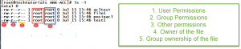

**POSIX Access Control List ACL :** To manage file security using **POSIX **(Portable Operating System Interface) access control list ( ACL ).

ACLs allows to assign different permissions for different users and groups. ACL allows fine-grained permissions to be allocated to a file. Users or groups as well as users and groups identified by a UID or GUID can be granted permissions. 

The same permissions we can use below flags apply on files and directories.

**Alpha Symbols** r: Read, w: Write, x: Execute

**Numeric symbols** 4 – Read, 2 – Write, 1 – Execute

* Permissions restricting access to a file to the file owner, membership of a single group or everyone.
* The file owner can set ACLs on individual files or directories.
* XFS file systems have built in ACL support.
* EXT4 file systems created on RHEL7 have ACL enabled by default.

### POSIX Access Control List two types:

1. **Access ACLs:** we can use access ACLs to grant permissions for a particular file or directory.
2. **Default ACLs:** We can use default ACLs only on a directory but if a file inside that directory does not have an ACL, it inherits the permissions of the default ACLs of the directory.

When ACL’s are required..?

---------------------------

We are going to see about ACL usage in detailed in below explanation, In this example we are going to use four users and three groups. 

* **User Names :** ravi, kumar, acl and root
* **Groups :** finance, engineering and root

To create user and assign password use below command. Repeat the same command to create multiple users.

    [root@Techtutorials ARK-ACL]# useradd ravi
    [root@Techtutorials ARK-ACL]# passwd ravi
    Changing password for user ravi.
    New password:
    BAD PASSWORD: The password is shorter than 8 characters
    Retype new password:
    passwd: all authentication tokens updated successfully.

To create group and add users to group, repeat the same steps create and add multiple groups

    [root@Techtutorials ARK-ACL]# groupadd finance

    [root@Techtutorials ARK-ACL]# usermod -G finance ravi
    [root@Techtutorials ARK-ACL]# cat /etc/group |grep finance
    finance:x:1005:ravi

File Permissions

As per above screenshot permission of the file / directory can only given to User, Group and Others. User ownership and Group ownership.

* How to restrict particular user, group has full permissions to file / directory
* How to provide an file / directory permissions to user / group without chaning existing ownership

All the above conditions will be possible by using POSIX Access Control List – ACL

Let’s see how can we acheive above conditions practically

Check ACL permission of file / directory
----------------------------------------

    [root@Techtutorials ARK-ACL]# getfacl test1
    # file: test1
    # owner: root
    # group: root
    user::rw-
    group::r--
    other::r--

    [root@Techtutorials ARK-ACL]# getfacl /root/ARK-ACL/
    getfacl: Removing leading '/' from absolute path names
    # file: root/ARK-ACL/
    # owner: root
    # group: root
    user::rwx
    group::r-x
    other::r-x

**Assign POSIX Access Control List to perticular user**

Before assigning ACL permissions example is below

    [root@Techtutorials ARK-ACL]# chmod 770 test1
    [root@Techtutorials ARK-ACL]# ls -l test1
    -rwxrwx--- 1 root root 0 Jul 15 15:46 test1
    [root@Techtutorials ARK-ACL]# su - ravi
    Last login: Fri Jul 15 17:05:16 IST 2016 on pts/1
    [ravi@Techtutorials ~]$ cd /ARK-ACL/
    [ravi@Techtutorials ARK-ACL]$ vi test1
    [ravi@Techtutorials ARK-ACL]$ cat test1
    cat: test1: Permission denied

As we see above output we have add full permissions to test1 file for user (owner) and group. We have restricted all others with no access. I have logged in as ravi user and trying to access the test1 file but it is giving an error saying **permission denied**

Let’s assing ACL permission to particular user and see how it works

Assigned Read permissions using ACL

    [root@Techtutorials ARK-ACL]# setfacl -m u:ravi:r test1

Verify ACL is working as excepcted

    [root@Techtutorials ARK-ACL]# su - ravi
    Last login: Fri Jul 15 17:06:27 IST 2016 on pts/1
    [ravi@Techtutorials ~]$ cd /ARK-ACL/
    [ravi@Techtutorials ARK-ACL]$ cat test1
    [ravi@Techtutorials ARK-ACL]$ cat > test1
    -bash: test1: Permission denied

As per above output we are able to read test1 file but we are not able to write test1 file

Let’s provide write access and see

    [root@Techtutorials ARK-ACL]# setfacl -m u:ravi:rw test1
    [root@Techtutorials ARK-ACL]# getfacl test1
    # file: test1
    # owner: root
    # group: root
    user::rwx
    user:ravi:rw-
    group::rwx
    mask::rwx
    other::---

    [root@Techtutorials ARK-ACL]# su - ravi
    Last login: Fri Jul 15 17:11:44 IST 2016 on pts/1
    [ravi@Techtutorials ~]$ cat > /ARK-ACL/test1
    Test
    ^C
    [ravi@Techtutorials ~]$ cat /ARK-ACL/test1
    Test

Assign ACL to Group
-------------------

    [root@Techtutorials ARK-ACL]# setfacl -m g:finance:rwx acltest
    [root@Techtutorials ARK-ACL]# getfacl acltest
    # file: acltest
    # owner: root
    # group: root
    user::rw-
    group::r--
    group:finance:rwx
    mask::rwx
    other::r--

    [root@Techtutorials ARK-ACL]# cat /etc/group |grep finance
    finance:x:1005:ravi

    [root@Techtutorials ARK-ACL]# su - ravi
    Last login: Fri Jul 15 17:32:09 IST 2016 on pts/1
    [ravi@Techtutorials ~]$ cat > /ARK-ACL/acltest
    Test
    ^C
    [ravi@Techtutorials ~]$ cat /ARK-ACL/acltest
    Test

ravi user part of finance group so when we provide permission to finance group automatically user ravi will get an access

**Restrict particular user from group has full permissions**

In this scenario restrict particular user from group. Group finance has full access but member of finance group kumar user restricted. See below example

    [root@Techtutorials ARK-ACL]# usermod -G finance kumar
    [root@Techtutorials ARK-ACL]# cat /etc/group |grep finance
    finance:x:1005:ravi,kumar
    [root@Techtutorials ARK-ACL]# setfacl -m u:kumar:--- acltest
    [root@Techtutorials ARK-ACL]# getfacl acltest
    # file: acltest
    # owner: root
    # group: root
    user::rwx
    user:kumar:---
    group::r--
    group:finance:rwx
    mask::rwx
    other::---

    [root@Techtutorials ARK-ACL]# su - kumar
    [kumar@Techtutorials ~]$ cat /ARK-ACL/acltest
    cat: /ARK-ACL/acltest: Permission denied

Revoke POSIX Access Control List permissions from user / group
--------------------------------------------------------------

    [root@Techtutorials ARK-ACL]# getfacl acltest
    # file: acltest
    # owner: root
    # group: root
    user::rwx
    user:kumar:---
    group::r--
    group:finance:rwx
    mask::rwx
    other::---

    [root@Techtutorials ARK-ACL]# setfacl -x g:finance acltest
    [root@Techtutorials ARK-ACL]# getfacl acltest
    # file: acltest
    # owner: root
    # group: root
    user::rwx
    user:kumar:---
    group::r--
    mask::r--
    other::---

removing acl from particular file we have to use -x flag along with **setfacl** command

**Replicate file ACL permissions to another file**

To replicate one of the file ACL permissions to another file. In this example we are going to replicate test1 file ACL to acltest file.

    [root@Techtutorials ARK-ACL]# getfacl test1
    # file: test1
    # owner: root
    # group: root
    user::rwx
    user:ravi:rw-
    group::rwx
    mask::rwx
    other::---

    [root@Techtutorials ARK-ACL]# getfacl acltest
    # file: acltest
    # owner: root
    # group: root
    user::rwx
    user:kumar:---
    group::r--
    mask::r--
    other::---

    [root@Techtutorials ARK-ACL]# getfacl test1 | setfacl --set-file=- acltest
    [root@Techtutorials ARK-ACL]# getfacl acltest
    # file: acltest
    # owner: root
    # group: root
    user::rwx
    user:ravi:rw-
    group::rwx
    mask::rwx
    other::---

**Copying the access ACL into the Default ACL**

    [root@TechTutorials ~]getfacl --access /ARK-ACL/ | setfacl -d -M- /root/ARK-ACL/

**Conclusion**

POSIX Access Control List is extended permissions which are used provide access to more users / groups, who are not owners of user:group.

Thanks for the read, Please provide your valuable feedback on the same.

**Related Articles**

[Setup your own Linux Lab using VMWare workstation](https://arkit.co.in/linux/setting-up-linux-lab-installing-vmware-workstation-software/)

[Setup Your Own Linux Lab Customize your home network settings](https://arkit.co.in/linux/setting-up-linux-lab-creating-and-modifying-vm-network/)

[RHEL 7 Installation Step by Step Guide](https://arkit.co.in/linux/setting-up-linux-lab-red-hat-enterprise-linux-7-installation/)

[Setup Linux Lab Server Step by Step Guide](https://arkit.co.in/linux/setup-linux-lab-yet-home-installing-configuring-ipa-server/)

**Thanks for your wonderful Support and Encouragement **

* [Get Email](https://feedburner.google.com/fb/a/mailverify?uri=arkit) | [Download E-Books](https://arkit-in.tradepub.com/)
* [Facebook Page](https://www.facebook.com/Linuxarkit)
* [Youtube Channel](https://www.youtube.com/Techarkit?sub_confirmation=1)
* [Twitter](https://twitter.com/aravikumar48)
* [Exclusive Telegram Group](https://t.me/Linuxarkit)
* [Discuss On WhatsApp Group](https://github.com/techarkit/TechArkit-YouTube/blob/master/whatsapp_group.md)

More than 40000 Techies in our community do you want part of it Join Now