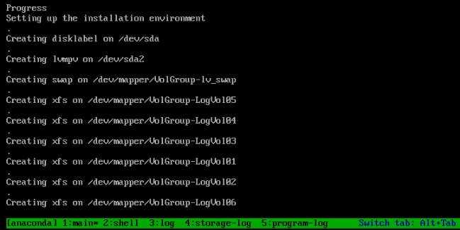

In this article, we will be walking through the building of Redhat Enterprise Linux 7/CentOS 7 VM using ISO on VMware vSphere environment. [Packer](https://www.packer.io/) is very useful to build your base images on the cloud and on-premise. Packer is an opensource tool and developed by [HashiCorp](https://www.hashicorp.com/). HashiCorp owns very famous tools like Vagrant, Consul, and Terraform. Today, Cloning and deploying is the most convenient way of building VM’s. In some cases, the required version of OS template might not exist, You might need to build VM’s in Adhoc. That’s where Packer is very handy. [Refer to this article if you want to automate the template creation](https://www.unixarena.com/2019/04/vmware-template-automation-using-packer-redhat-centos.html/).

Let’s start coding the new Infrastructure.

### **Download the following components:**

* [JetBrains-infra vSphere-iso (File Name: packer-builder-vsphere-iso.exe)](https://github.com/jetbrains-infra/packer-builder-vsphere/releases)
* [Packer](https://www.packer.io/downloads.html) (Download according to your laptop OS )
* Redhat Enterprise Linux 7.x or CentOS 7.x ISO.

On Your Laptop/Desktop,

1\. Create a new directory and copy all the downloaded components. RHEL/ CentOS ISO should be kept 0n VMware vSphere datastore.

UnixArena – Packer Directory snapshot

2\. Open a notepad and paste the following contents to it. Edit all the required values according to your infrastructure. Save this file as CentOS7\_build.json on the same directory.

    {
      "builders": [
        {
          "type": "vsphere-iso",

          "vcenter_server":      "192.168.2.212",
          "username":            "administrator@vsphere.local",
          "password":            "test@123",
          "insecure_connection": "true",
          "vm_name": "RHEL-Packer1",
          "notes": "Build via Packer",
          "datacenter": "STACK-BLR",
          "cluster": "UA-CLS",
          "host": "192.168.2.211",
          "datastore": "DATASTORE-BLR",
          "network": "VM Network",
          "resource_pool": "UA-ResPool",

          "guest_os_type": "centos7_64Guest",

          "ssh_username": "root",
          "ssh_password": "server",

          "CPUs":             1,
          "RAM":              1024,
          "RAM_reserve_all": false,

          "convert_to_template": false,

          "disk_controller_type":  "pvscsi",
          "disk_size":        25000,
          "disk_thin_provisioned": true,

          "network_card": "vmxnet3",

          "iso_paths": [
            "[DATASTORE-BLR] ISO/centos7_64.iso"
          ],
          "iso_checksum": "5b61d5b378502e9cba8ba26b6696c92a",
          "iso_checksum_type": "md5",
          "floppy_files": [
            "{{template_dir}}/ks.cfg"
          ],
          "boot_command": " inst.text inst.ks=hd:fd0:/ks.cfg "
              }
      ]
    }

You might need to update the value for almost all the fields except the boot\_command, networ\_card, disk\_controller\_type, and provision type.

3\. You need to prepare traditional kickstart file to define the package selection and other configuration. [Download this kickstart file for RHEL 7 / ](https://www.unixarena.com/wp-content/uploads/2019/03/ks.txt)CentOS 7\. Please feel free to modify and update the kickstart file according to our need.

* *Root Credentials – root/server*
* *User – admin/admin123*

4\. Here is the snapshot of the directory contents.

Packer – RHEL – vSphere VM build

5\. Open command prompt – Start – \> cmd – \> Enter. Navigate to the directory which we have created for this VM build.

Packer VM build – RHEL – CentOS

6\. Trigger the packer build job using the following command. At this stage, the VM job is waiting for VM to boot with IP.

    C:\Users\lingeswaran.rangasam\Desktop\Redhat-Packer-Test>packer.exe build CentOS7_build.json
    vsphere-iso output will be in this color.

    ==> vsphere-iso: Creating VM...
    ==> vsphere-iso: Customizing hardware...
    ==> vsphere-iso: Mount ISO images...
    ==> vsphere-iso: Creating floppy disk...
        vsphere-iso: Copying files flatly from floppy_files
        vsphere-iso: Copying file: C:\Users\lingeswaran.rangasam\Desktop\Redhat-Packer-Test/ks.cfg
        vsphere-iso: Done copying files from floppy_files
        vsphere-iso: Collecting paths from floppy_dirs
        vsphere-iso: Resulting paths from floppy_dirs : []
        vsphere-iso: Done copying paths from floppy_dirs
    ==> vsphere-iso: Uploading created floppy image
    ==> vsphere-iso: Adding generated Floppy...
    ==> vsphere-iso: Set boot order temporary...
    ==> vsphere-iso: Power on VM...
    ==> vsphere-iso: Waiting 10s for boot...
    ==> vsphere-iso: Typing boot command...
    ==> vsphere-iso: Waiting for IP...

7\. If you navigate to the vCenter console, you could see that VM might be created and powered on.

VMware VM – Created – Powered On

8\. Launch VM console and observe the automatic build.

VM booting – Packer – VMware vSphere

9\. VM is starting the automated install using the kickstart file.

Automated install – Packer Build – RHEL

10\. VM is automatically provisioning the required filesystem layout using LVM.

Automatically Provisioning LVM – Packer – RHEL

11\. Here is the packer build job result after the successfully VM build completion.

    C:\Users\lingeswaran.rangasam\Desktop\Redhat-Packer-Test>packer.exe build CentOS7_build.json
    vsphere-iso output will be in this color.

    ==> vsphere-iso: Creating VM...
    ==> vsphere-iso: Customizing hardware...
    ==> vsphere-iso: Mount ISO images...
    ==> vsphere-iso: Creating floppy disk...
        vsphere-iso: Copying files flatly from floppy_files
        vsphere-iso: Copying file: C:\Users\lingeswaran.rangasam\Desktop\Redhat-Packer-Test/ks.cfg
        vsphere-iso: Done copying files from floppy_files
        vsphere-iso: Collecting paths from floppy_dirs
        vsphere-iso: Resulting paths from floppy_dirs : []
        vsphere-iso: Done copying paths from floppy_dirs
    ==> vsphere-iso: Uploading created floppy image
    ==> vsphere-iso: Adding generated Floppy...
    ==> vsphere-iso: Set boot order temporary...
    ==> vsphere-iso: Power on VM...
    ==> vsphere-iso: Waiting 10s for boot...
    ==> vsphere-iso: Typing boot command...
    ==> vsphere-iso: Waiting for IP...
    ==> vsphere-iso: IP address: 192.168.2.7
    ==> vsphere-iso: Using ssh communicator to connect: 192.168.2.7
    ==> vsphere-iso: Waiting for SSH to become available...
    ==> vsphere-iso: Connected to SSH!
    ==> vsphere-iso: Shut down VM...
    ==> vsphere-iso: Deleting Floppy drives...
    ==> vsphere-iso: Deleting Floppy image...
    ==> vsphere-iso: Eject CD-ROM drives...
    ==> vsphere-iso: Clear boot order...
    Build 'vsphere-iso' finished.

    ==> Builds finished. The artifacts of successful builds are:
    --> vsphere-iso: RHEL-Packer1

    C:\Users\lingeswaran.rangasam\Desktop\Redhat-Packer-Test>

12\. Log in to the VM instance and check the status.

    login as: root
    root@192.168.2.7's password:
    [root@UnixArena ~]#
    [root@UnixArena ~]#
    [root@UnixArena ~]# df -h
    Filesystem                     Size  Used Avail Use% Mounted on
    /dev/mapper/VolGroup-LogVol06   17G  1.3G   16G   8% /
    devtmpfs                       484M     0  484M   0% /dev
    tmpfs                          496M     0  496M   0% /dev/shm
    tmpfs                          496M  7.1M  489M   2% /run
    tmpfs                          496M     0  496M   0% /sys/fs/cgroup
    /dev/mapper/VolGroup-LogVol02 1014M   33M  982M   4% /home
    /dev/mapper/VolGroup-LogVol01 1014M   33M  982M   4% /tmp
    /dev/mapper/VolGroup-LogVol03  2.0G  101M  1.9G   5% /var
    /dev/mapper/VolGroup-LogVol04 1014M   36M  979M   4% /var/log
    /dev/mapper/VolGroup-LogVol05  509M   26M  483M   6% /var/log/audit
    /dev/sda1                      509M  129M  381M  26% /boot
    tmpfs                          100M     0  100M   0% /run/user/0
    [root@UnixArena ~]# vgs
      VG       #PV #LV #SN Attr   VSize  VFree
      VolGroup   1   7   0 wz--n- 23.91g    0
    [root@UnixArena ~]# pvs
      PV         VG       Fmt  Attr PSize  PFree
      /dev/sda2  VolGroup lvm2 a--  23.91g    0
    [root@UnixArena ~]# lvs
      LV       VG       Attr       LSize   Pool Origin Data%  Meta%  Move Log Cpy%Sy                                                                                        nc Convert
      LogVol01 VolGroup -wi-ao----   1.00g                                                                                                                                  
      LogVol02 VolGroup -wi-ao----   1.00g                                                                                                                                  
      LogVol03 VolGroup -wi-ao----   2.00g                                                                                                                                  
      LogVol04 VolGroup -wi-ao----   1.00g                                                                                                                                  
      LogVol05 VolGroup -wi-ao---- 512.00m                                                                                                                                  
      LogVol06 VolGroup -wi-ao----  16.44g                                                                                                                                  
      lv_swap  VolGroup -wi-ao----  <1.97g                                                                                                                                  
    [root@UnixArena ~]# which lsof
    /usr/sbin/lsof
    [root@UnixArena ~]#

We have successfully created VM and build RHEL7/CentOS7 using ISO with a legacy kickstart file. In the upcoming article, we will see how to make the VM template using a packer.

Share it! Comment it!! Be Sociable!!!

Advertisements